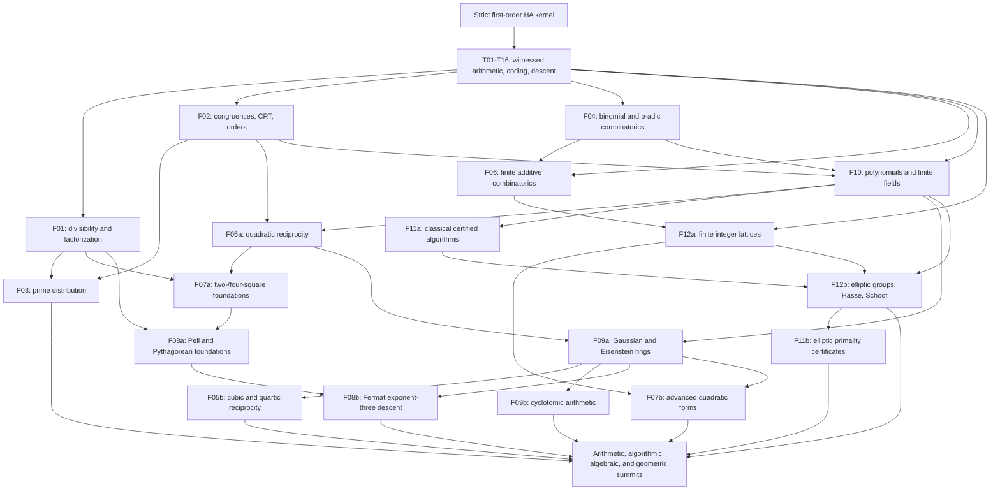

# The Grand Constructive Number-Theory Campaign

Planning baseline: 2026-08-26; updated 2026-08-27; current immutable evidence
baseline: Alpha v27. The first execution wave in §7.1 and the seven named
second-wave targets in §7.2 are complete. The broader research directions
listed after those targets remain separate, unfinished work.

> **Mission.** Build a broad, spectacular, mathematically coherent library of
> recognizable number-theoretic theorems whose final trusted artifacts are
> actual derivations in first-order Heyting arithmetic. Every advertised
> existential theorem must produce its mathematical witness; every
> obstruction must expose its certificate; every proof must preserve the
> unchanged intuitionistic kernel and the distinction between candidate,
> closed, Alpha, and Stable evidence.

This document succeeds
[`13_constructive_number_theory_frontier.md`](13_constructive_number_theory_frontier.md)
and extends, rather than replaces, the frozen foundational dossier
[`ha-number-theory-formalization-campaign-blueprint.md`](../research/arithmetic-library/ha-number-theory-formalization-campaign-blueprint.md).
Its executable theorem inventory and complete dependency graph are in
[`campaign.json`](../book/_static/constructive-grand-campaign/campaign.json);
its browsable interactive graph is
[`index.html`](../book/_static/constructive-grand-campaign/index.html).

The proposed inventory has **120 major theorem milestones**, grouped into
**12 families of 10**, supported by **16 reusable proof-engineering tools**
and **8 existing proof anchors**. Thus its machine-readable research graph
contains **144 named vertices** and **308 explicit prerequisite edges**
(303 at the historical v26 boundary). At that v26 boundary the 120 milestones
split into **92 genuinely open research objectives** and **28 existing/revisited constructive foundations or proof
anchors**. The six newly closed numbered goals reduce the open goal count to
**86**; T13 is additionally closed as a reusable tool. Some milestones deliberately revisit existing
mathematical roots to require genuine independent closure, stronger variants,
or correct release promotion; they must not be advertised as 120 previously
unknown or presently unproved mathematical statements. A goal in this
blueprint is a significant
mathematical outcome, not a tactic line, transport lemma, or renamed
corollary. Its eventual implementation will generally require an entire
dependency-closed tranche of smaller HA theorem bodies.

The aspiration is a uniquely broad public library of strict object-level HA
number-theory derivations. A claim such as "largest in history" must await a
dated, reproducible comparative audit; it is an ambition, not a fact
established merely by writing a plan.

## 1. Current position: substantial mathematics, honest evidence boundaries

The current local release baseline is **Alpha v27**: **2,560** checked-use
theorems, comprising the unchanged **432** Stable entries and **2,128**
Alpha-only entries, with **8,196** actual theorem-dependency edges. It adds
**422** independently checked theorem bodies closing the seven named targets
**T13, G011, G095, G035, G027, G051, and G107**. The self-contained second-wave
artifact contains **1,224** nodes (1,223 actual theorem bodies and one packaging
root), **3,999** dependency edges and **103,215** body-proof nodes. Both the
ordinary intuitionistic HA kernel and the compiled independent Lean verifier
accept those exact bytes. The definition atlas now has **290 blueprint**
terms and **198 hygienically** reviewed conservative definitions, with
**388 reviewed** prerequisite edges and **201 compatible** blueprint links.
The [second-wave receipt](../research/arithmetic-library/alpha-v27-second-wave-receipt.md)
records the precise theorem boundaries and reproducible checks. These are
local artifacts; remote publication is a separate operation.

The immutable historical first-wave baseline is **Alpha v26**. It preserves every
sealed v25 theorem specification, enrollment position, dependency, and Stable
entry, then appends **58** independently checked constructive theorems:
**9** coprime square-factor results, **23** positive primitive Pythagorean
inverse/classification results, and **26** actual Fermat-four descent and
zero-boundary results. This completes **G077 and G078** and the remaining
mathematical obligations of the first execution wave. The same wave repairs
the readable display of giant tactic-local propositions with exact,
bounded conservative expansion checks. Historical Alpha v23 still completely
closes **G101, G102, and G025**. At that historical v26 boundary, the stronger
**T13, G095, and G011** targets were still open; v27 now closes the exact
second-wave contracts described below. The historical **2,138-theorem** v26
ledger and the current additive v27 ledger have actual checked-use authority:

| Evidence or edition | Count | Meaning |
|---|---:|---|
| Stable | 432 | Independently checked official Stable theorems. |
| Historical Alpha v19 ancestor | 1,737 | All 1,673 historical v18 entries plus 64 independently checked constructive-frontier entries. |
| Historical Alpha v20 ancestor | 1,776 | All 1,737 historical v19 entries plus 39 exact independently checked next-layer entries. |
| Historical v20 Alpha-only partition | 1,344 | Exactly `432 + 1,344 = 1,776` independently checked historical v20 theorems. |
| Historical Alpha v21 ancestor | 1,830 | All 1,776 historical v20 entries plus 54 exact independently checked advanced-layer entries. |
| Historical v21 Alpha-only partition | 1,398 | Exactly `432 + 1,398 = 1,830` independently checked historical v21 theorems. |
| Historical Alpha v22 ancestor | 1,890 | All 1,830 historical v21 entries plus 60 exact independently checked transport-layer entries. |
| Historical Alpha v23 ancestor | 1,949 | All 1,890 historical v22 entries plus 59 exact independently checked complete-milestone entries. |
| Historical Alpha v24 ancestor | 2,008 | All 1,949 historical v23 entries plus 59 exact independently checked matrix-minor, formal-derivative, and finite-CRT entries. |
| Historical Alpha v25 parent | 2,080 | All 2,008 historical v24 entries plus 72 exact independently checked cofactor-fold, Taylor/Hensel, and noncoprime-CRT entries. |
| Historical Alpha v26 parent | 2,138 | All 2,080 immutable v25 entries plus 58 exact independently checked square-factor, primitive-inverse, and Fermat-four entries. |
| Current Alpha v27 total | 2,560 | All 2,138 immutable v26 entries plus 422 exact independently checked second-wave entries. |
| `stable_closed` in Alpha | 432 | Stable entries mirrored into Alpha. |
| Historical v22 Alpha-only partition | 1,458 | Exactly `432 + 1,458 = 1,890` independently checked historical v22 theorems. |
| Historical v23 Alpha-only partition | 1,517 | Exactly `432 + 1,517 = 1,949` independently checked historical v23 theorems. |
| Historical v24 Alpha-only partition | 1,576 | Exactly `432 + 1,576 = 2,008` independently checked historical v24 theorems. |
| Historical v25 Alpha-only partition | 1,648 | Exactly `432 + 1,648 = 2,080` independently checked historical v25 theorems. |
| Historical v26 Alpha-only partition | 1,706 | Independently closed Alpha-only entries through the complete positive primitive classification and unconditional Fermat-four theorem. |
| `alpha_closed` | 2,128 | Independently closed Alpha-only entries, including all seven named second-wave targets. |
| `body_checked` | 0 | Every enrolled theorem is independently closed; no merely dependency-curried body is advertised as checked use. |
| `pending_layered_closure` | 0 | All admitted roots have complete reviewed constructive evidence. |
| Checked-use authority | 2,560 | Exactly `432 + 2,128`; every enrolled theorem is genuinely available. |
| Historical v19 body promotions | 84 | Every previously body-only v18 row, including both prime-specific valuation wrappers. |
| Historical v19 new entries | 64 | Pythagorean forward construction 44, prime two-square iff 1, complete linear congruences 9, and infinitely many `1 mod 4` primes 10. |
| Historical v20 new entries | 39 | Natural Horner evaluation 7, finite matrix components 10, strict Bertrand-prime extensions 13, and finite continued fractions 9. |
| Historical v21 new entries | 54 | Arbitrary coded natural/signed matrix products 23, Euclidean execution/halving 15, and binary modular-exponentiation foundations 16. |
| Historical v22 new entries | 60 | Total unique binary length 21, genuine Euclidean gcd-invariant/terminal-state transport 20, and complete supplied-digit binary modular execution 19. |
| Historical v23 new entries | 59 | Exact logarithmic Euclidean execution 17, canonical arbitrary-exponent binary digits and execution 24, and constructively unbounded `3 mod 4` primes 18. |
| Historical v24 new entries | 59 | Arbitrary signed cofactor minors and 4×4 determinants 17, exact simultaneous formal derivatives 15, and finite CRT/arbitrary-list LCM 27. |
| Historical v25 new entries | 72 | Signed cofactor/alternating-fold results 29, exact Taylor/formal-derivative and qualified one-step Hensel results 19, and noncoprime CRT compatibility/gcd-LCM results 24. |
| Historical v26 new entries | 58 | Coprime square-factor extraction 9, positive primitive inverse/classification 23, and unconditional Fermat-four descent and zero-boundary classification 26. |
| Current v27 new entries | 422 | Integer linear algebra 182, signed Hensel lifting 40, generalized CRT 24, multinomial Kummer 19, Chebyshev bounds 55, Cornacchia 30, and Cauchy–Davenport 72. |
| Historical v23 checked dependency graph | 6,285 edges | All 1,949 immutable historical v23 theorem proofs remain checked. |
| Historical v24 checked dependency graph | 6,423 edges | All 2,008 immutable historical v24 theorem proofs remain checked. |
| Historical v25 checked dependency graph | 6,633 edges | All 2,080 immutable historical v25 theorem proofs remain checked. |
| Current checked dependency graph | 6,851 edges | All 2,138 theorem proofs are checked; the graph retains 53 dependency-first layers. |

The historical sealed **Alpha v19** parent remains immutable and auditable:
its 1,737 entries contain 432 `stable_closed`, 1,305 `alpha_closed`, and no
unchecked rows. The historical sealed **Alpha v18** ancestor also remains
immutable and auditable:
its 1,673 entries contain 432 `stable_closed`, 1,157 `alpha_closed`, and
84 `body_checked`, giving exactly **1,589** checked-use entries. Its exact
five-flagship promotion independently closed **673** rows: Lucas 74, Kummer
73, Bertrand 241, four squares 196, and two squares 89. Its historical
edition identity is
`f694881096fd09b1002d0d49bb7be2d68d9894457749ef04128deebd92a64f66`,
its frozen catalog has SHA-256
`cfbaeaf5d89be609d09aa2b84c9d102297a45b7b6aeeea6efcd32b1b328e62b2`,
and its historical evidence root is
`def31d268c4fef3a3e598fa2447b9be92e9c54aae7ec9f227e6948c752ecb6f9`.

The historical sealed **Alpha v17** snapshot remains immutable and auditable:
its same 1,673 entries contain 432 `stable_closed`, 484 `alpha_closed`, and
757 `body_checked`, giving exactly **916** checked-use entries. Its preceding
31-row supplementary-law-only promotion converted precisely 28 supplementary
campaign bodies and three necessary earlier Eisenstein-prefix bodies. Its
separately sealed historical edition identity is
`db2e6e5796169600d17cc54313e9306bac46fb680f914cb2a5a91d247bb746c4`,
and its unchanged historical evidence root is
`e631e3a9bfc680c3b84630db71903f817cb740c2cc830958b5dc7bcedaed19a1`.

The historical sealed **Alpha v16** snapshot remains immutable and auditable:
its same 1,673 entries contain 432 `stable_closed`, 453 `alpha_closed`, and
788 `body_checked`, giving exactly **885** checked-use entries. Its preceding
315-row quadratic-reciprocity-only promotion converted 314 formerly
`body_checked` rows and the formerly pending root. The separately sealed v16
edition identity is
`3a683daf384e1712222012e4a4929732a9ec73c87fb5acb8a69446e2bcad5f10`,
and its unchanged historical evidence root is
`142d73d908bd86f52af9b6a1d39a5e11679d1db4f463d3e6f17d5c483f283ee4`.

The historical sealed **Alpha v15** snapshot likewise remains immutable: its
unchanged 1,673 entries were partitioned as 432 `stable_closed`, 138
`alpha_closed`, 1,102 `body_checked`, and one `pending_layered_closure`,
giving exactly **570** checked-use entries. Historical v15 through v18 all
retain the same 1,673-entry enrollment identity
`44be61cdff1a093a78684a9d001d61d2b3761e73bacf6e79fe1a456f4ce50175`;
the historical 1,737-entry v19 enrollment identity is deliberately different:
`1295d6fc3da84646cb6bc8d5070627d42a6df33d673c44a2adfcd433edc41795`.
The independently reviewed historical v19 edition identity is
`905189c32e13b3ec8b19ecad30fe51353eb0b66a9eb065ddae542c80746d3ea7`.
Its frozen complete catalog has SHA-256
`f1c3d3fba013ca3a5b62a4103dd00bd5b7e39b1f785ed9023099704ad033004b`.
Its separately sealed historical evidence root is
`627f651198360aa95b8efd085b98f694d88c883434309f6050a819bc249c90c4`.
Its exact 84-name historical-body promotion digest is
`0fd3159925c12b2e7249edb5d536f3be600e466e5a6695350a22c38e81d4f69e`,
and its exact 64-name additive-frontier digest is
`07b9c92ab3ef80dc609681a9b588d21b0faeb69e87448c1420b78272a54aaed1`.
The historical 1,776-entry v20 enrollment identity is
`947e12db1db93decddd87b833067acf774a37fcb7d89de117010d53baf00065c`;
its independently reviewed edition identity is
`ee0f596150d8609ab302303ade44c4413290675398a1d6999a47b3ba046ac38b`;
its frozen catalog has SHA-256
`8f86225cc560d7b59ff665e58594ac6249c12dbb5cdfe47ae2708a0e497c86ce`;
and its exact checked evidence root is
`fd76c648de26cd8a451244441fac8f423fb4fec8e7feac1c789404dafcda1563`.
Its exact 39-name additive-frontier digest is
`6a9564cc3e55245161d7c13b81e25005e287232dd44deb303133e3a8e3ae2eba`.
The historical 1,830-entry v21 enrollment identity is
`ad2616d7656438ee2084f5ea404df3dad2106a99c6819fd174fd8c3ed6bb4c98`;
its independently reviewed edition identity is
`aee42cc37e4a4073eb4892e81e4f26d957b3b4b42675c1ed4e67c90dc89602e6`;
its frozen catalog has SHA-256
`84bafa545c3c529eb4bcda9d9b501af8577a8e414f5cabf58a4c2a88da5129f1`;
and its exact checked evidence root is
`9d217af3e7f77f8beb436f627a44f1a29cda54bb08a4e666899803aa97ccb91b`.
Its exact 54-name additive-frontier digest is
`cbf76fb45efbae79a2b1cd2c7fc3cf806a6f8ebc593a5fceee6f5bea7cd734f5`.
The historical 1,890-entry v22 enrollment identity is
`431f7300f9190f6fdc35ef84212e93701f2bb565b7e32c1624b7ae0c89cfc5ea`;
its independently reviewed edition identity is
`2750384264856ad10910c1e9369746da886f4760d41e356bfc9e7f8f4563c7db`;
its frozen catalog has SHA-256
`fd0e385e3d0c2d614bfa2754a2c3b70939b9437076ec53501082ddfb5bf9ae22`;
and its exact checked evidence root is
`897ac1893550881538cf74274d0d48e15450125776f31be4edc10de0b1d05ef6`.
Its exact 60-name additive-frontier digest is
`c2d9a2840111e6b79a8716eb1a9a0c02345a771bcf60d42c96e6a7c3283e6713`.
The historical 1,949-entry v23 enrollment identity is
`f5d94af7a11c642d7076a195e2e795e7b84c61a6de1a6b074708669b2dac1648`;
its independently reviewed edition identity is
`02059eef420eb96abd48c41bf62049a3cc69f025b00bed9dc3466e7eb2294a85`;
its frozen catalog has SHA-256
`818da349674b1ef33c17fa85b2e9a0a6653370046d88e7814300297f7bc7f4d2`;
and its exact checked evidence root is
`e9c00544bdad559342da3ed5a0d1e26ef1576a0eecd9f580ec1fc98a2eb941cf`.
Its exact 59-name additive-frontier digest is
`7d24a436a735a83e20faf2a1378193560f9ea4fb4ae5c7f03e5fc812b39d69db`.
The historical 2,008-entry v24 enrollment identity is
`7463b938ffb87fe85eea6cd0e40c10ac73c799087ca1c408a070fcbe2687d4e1`;
its independently reviewed edition identity is
`1f4390b8ca5784ece54857fa666007f884b79e2670ef8bb32b2710c10f298a1b`;
its frozen catalog has SHA-256
`94ac4d193cbfe8c2ec04e54024221bc2c3a534c0ae014d381663b86174b3dcc1`;
and its exact checked evidence root is
`2516501a609a5bd46114a53e20bbdd7c9f79bc801f7d3148be38dcd48f4ce3e0`.
Its exact 59-name matrix/derivative/CRT additive-frontier digest is
`e88ec1f9a1242c339565305bd7a866a0ec1e95a069f537af1712abf364433947`.
Its independently original-kernel- and compiled-Lean-verified constructive
certificate contains **203 proof nodes**, **502 dependency edges**, **11,065
structural proof-body nodes**, and exactly **738,923 bytes**, with SHA-256
`627e39ed29b10db48bf37d5bef8750d48009a7524c822a7c5e7c83e96a8e9cf9`.
The historical 2,080-entry v25 enrollment identity is
`f724872707cdcf401f35cb69680e1bbec86d626c4bf56e6d41f01a3724e2be81`;
its independently reviewed edition identity is
`3516d4730428c79fc73aa6fbdbabc43d93921471941bb2f144ea3d29e0af5b28`;
its frozen catalog has SHA-256
`75fa146ac19bf6aa5f799265b6fc031b725c1e1b2e044854da91b31898d5876e`;
and its exact checked evidence root is
`193ee636570fa9f7b69344dbebc6c7e53de8bebda01bcb86687f01a50ec19674`.
Its independently original-kernel- and compiled-Lean-verified breakthrough
certificate contains **302 proof nodes**, **820 dependency edges**, **16,947
structural proof-body nodes**, and exactly **1,041,166 bytes**, with SHA-256
`d4532076049be869e4e397d0fcee81b668bd3fd5c7d9173028bb1bdb80b9793a`.
The historical **2,138-entry v26** enrollment identity is
`cdf2cd0adfef8f1becd6f1f62d4d1d5d7a1891838e16b52a4d1cdaca98c496f2`;
its independently reviewed edition identity is
`8573945e4bdfe0a8d9414b499828ced67eff3b886e5adde50a0fcff81cfbdc19`;
its frozen catalog has SHA-256
`969c261f924060552dda393427b4fbc51515b9d4e69daa17f5e9f1691b5ab534`;
and its exact checked evidence root is
`fa9773708ab4eacfc981707e2cecb615dd46714df7c242008a5946821b8e4c52`.
The unchanged original kernel and independently compiled Lean verifier accept
its **216-node**, **558-edge** first-wave certificate containing **10,397
structural proof-body nodes** in **364,186 bytes**, with SHA-256
`59afca707b33b68df907c941683e335492f7de12ee3888219339c5dfce8ec4fc`.
There are 215 actual theorem bodies and one unenrolled conjunction; historical
dependencies are not counted as new theorems. Exact sources and evidence are
linked from the
[v26 admission RFC](../research/arithmetic-library/alpha-v26-first-wave-rfc-v1.md)
and [full closure receipt](../research/arithmetic-library/alpha-v26-first-wave-receipt.md).
The Quadratic Reciprocity evidence source `api/corpus.json` remains frozen
at SHA-256 `ebc78a0c16fe6e9123a52363a69929590d8ca875380431776ef0de28b9b1193a`;
its historical Alpha-v25 presentation uses the separate
`api/current-corpus.json` sidecar. Publication, release construction, and
independent verification fail closed if immutable historical evidence bytes
are overwritten by an explorer regeneration.
The earlier v18 historical 673-name evidence-promotion digest remains
`5b6faad95b90a3b3f11e6aea929aefd3cdbf9b5a1f3563e57d8e48f15e9d59e6`.
Stable remains exactly 432 entries; promoting an Alpha-only theorem does not
make it Stable.

The following existing roots are campaign anchors rather than claims of
freshly established release authority:

| Anchor | Reusable result | Provenance through v26; every checked root remains checked in v27 |
|---|---|---|
| A01 | Quadratic reciprocity. | Complete unchanged-kernel empty-context proof and independent Lean-verified 557-node proof bundle; first closed in historical Alpha v16 and still `alpha_closed` with checked use in current v26; historical v15 remains immutably pending; not Stable. |
| A02 | Bertrand's postulate. | The exact strict all-natural root is independently kernel- and Lean-checked through a 544-node/1,917-edge proof bundle and remains `alpha_closed` with checked use in v26; its historical v17 root remains `body_checked`; not Stable. |
| A03 | Both quadratic supplementary laws. | Both exact endpoints are independently checked by the unchanged kernel and Lean; their 438-node/1,429-edge proof bundle justified the exact historical 31-row Alpha-v17 promotion; v26 preserves checked use; not Stable. |
| A04 | Both Kummer carry endpoints. | First enrolled in Alpha v14; both exact endpoints are independently kernel- and Lean-checked through 280 theorem nodes plus one synthetic conjunction, with 779 edges and checked use in v26; the historical v17 roots remain `body_checked`; not Stable. |
| A05 | Complete all-natural two-square classification. | First enrolled in Alpha v15; the exact universal supplied-valuation equivalence has an independently kernel- and Lean-checked 517-node/1,599-edge proof bundle and checked use in v26; not Stable. |
| A06 | Unconditional Lagrange four-square theorem. | First enrolled in Alpha v13; the exact all-natural root has an independently kernel- and Lean-checked 390-node/1,187-edge proof bundle and checked use in v26; not Stable. |
| A07 | Complete multidigit Lucas theorem. | First enrolled in Alpha v13; the exact supplied-coefficient multidigit root has an independently kernel- and Lean-checked 213-node/617-edge proof bundle and checked use in v26; not Stable. |
| A08 | Primitive Pythagorean forward constructor. | The exact 44-row forward construction and both primitive ordered/normal-form roots were first independently `alpha_closed` in v19 and remain checked in v26. The same 102-theorem family now includes 58 v26 additions closing inverse classification G077 and actual Fermat-four descent G078; not Stable. |

In particular:

- existing mathematical derivations are reusable proof blueprints;
- a browser node or Alpha enrollment is not itself empty-context closure;
- a genuine focused root certificate does not rewrite sealed Alpha evidence;
  the reviewed QR-only Alpha-v16, supplementary-only Alpha-v17,
  five-flagship Alpha-v18, complete-residual/additive-frontier Alpha-v19, and
  four-next-layer Alpha-v20, three-advanced-layer Alpha-v21, and
  three-transport-layer Alpha-v22 and three-full-milestone Alpha-v23
  promotions are separate immutable editions, not alterations of historical
  v15--v22;
- local experimental closure certificates do not confer checked-use or
  Stable membership;
- the completed quadratic-reciprocity root has 54,870 ordinary proof nodes,
  35,052 proof objects, depth 129, and a separate independently Lean-verified
  557-node/1,787-edge canonical artifact; its full receipt is
  `research/arithmetic-library/quadratic-reciprocity-closure-receipt.md`;
- the independently completed supplementary-law conjunction has 437 exact
  theorem nodes plus one synthetic constructive conjunction, 1,429 dependency
  edges, 33,173 body-proof occurrences, and SHA-256
  `79fc4717dbe570bf836cca5ec699492ff3995700ec25336a20d03cc57261054c`;
  its full receipt is
  `research/arithmetic-library/supplementary-laws-closure-receipt.md`;
- the five newly admitted flagship proof graphs have respectively 213, 280,
  544, 390, and 517 exact theorem nodes; Kummer alone adds one synthetic
  conjunction, and shared ancestors give a joint union of 1,113 theorems;
- the complete v19 historical-residual proof graph has **475** theorem nodes,
  **1,452** dependency edges, **38,688** body-proof occurrences, 4,176,537
  canonical bytes, and SHA-256
  `e69112c5e3b8c21bc452ad35838474f2af2e297152ff73fbdc62bfd935ffdebb`;
- the exact additive v19 constructive-frontier graph has **544** theorem
  nodes plus one synthetic conjunction, giving **545** total proof-bundle
  nodes, with **1,650** dependency edges,
  **34,020** body-proof occurrences, **17** maximal roots, 1,617,207
  canonical bytes, and SHA-256
  `cf7947a944d54e9eb956fb153702b29c953100ece6cf05743162759b0fba9b17`;
- the exact additive v20 next-layer graph has **589** theorem nodes plus one
  synthetic conjunction, giving **590** total proof-bundle nodes, **2,045**
  dependency edges, **190,533** body-proof occurrences, **12** maximal roots,
  14,775,673 canonical bytes, and SHA-256
  `1b623064f36e362c1a117daa193b1ee33ee7905ec804ee1ac164b42345b67069`;
  the unchanged kernel and independently compiled Lean verifier both accept
  every genuine dependency-curried proof body;
- the exact additive v21 advanced-layer graph has **208** theorem nodes plus
  one synthetic conjunction, giving **209** total proof-bundle nodes,
  **491** dependency edges, **10,304** body-proof occurrences, **27** maximal
  roots, **1,005,317** canonical bytes, and SHA-256
  `65ecae7cb6b3e102790efa281451db3da5ab83868afcf9d57e6656f7a3eafda0`;
  both the unchanged original kernel and separately compiled Lean verifier
  independently accept every genuine dependency-curried body;
- the exact additive v22 transport-layer graph has **239** theorem nodes plus
  one synthetic conjunction, giving **240** total proof-bundle nodes,
  **597** dependency edges, **11,848** body-proof occurrences, **17** maximal
  roots, **1,099,541** canonical bytes, and SHA-256
  `95e5f8a3baef113721d748f9d7071864b4bf9511737a27a1272d2695428fb938`;
  both the unchanged original kernel and independently compiled Lean verifier
  check every actual dependency-curried proof body;
- the exact additive v23 complete-milestone graph has **616** theorem nodes
  plus one synthetic conjunction, giving **617** total proof-bundle nodes,
  **1,871** dependency edges, **39,161** body-proof occurrences, **9** maximal
  roots, **2,518,315** canonical bytes, and SHA-256
  `cc0051da2cac31e382c79223999d448a1119f62aa448f1c7f68a6b9c3edf9d11`;
  the unchanged intuitionistic kernel checks all 617 proof objects and an
  independently compiled Lean verifier accepts the identical bundle;
- the independently checked strict Bertrand root has an actual ordinary
  empty-context certificate of **201,285** proof nodes, **45,254** distinct
  proof objects, depth **235**, and envelope depth **244**; conservative
  body sharing reduces its 187,725 body occurrences to 31,694 distinct proof
  objects without changing either the intuitionistic kernel or its limits;
- the complete two-endpoint Kummer proof bundle has SHA-256
  `49fd86708fe5b289d0159526285e73b2aea008c26e0eb41ae8a053c970d4210e`,
  19,062 body-proof occurrences, and separately kernel-checked ordinary
  endpoint certificates of 23,564 and 24,170 proof nodes;
- the complete positive primitive Pythagorean inverse/classification and
  actual Fermat-four strict descent are now independently kernel- and
  Lean-checked in Alpha v26. The exact G078 endpoint excludes a square sum
  of two positive fourth powers for every natural height, including zero;
  no inverse or descent premise remains assumed.

### 1.1 Historical v26 reconciliation and honest prerequisite arrows

Every milestone must match the actual statement, hypotheses, witnesses, and
release status of its claimed source. The historical Alpha-v26 catalog resolved
the following previously misleading classifications. The table preserves that
historical boundary; the new complete T13, G011, and G095 evidence is in §7.2,
and all older checked entries remain unchanged in v27.

| Milestone | Actual theorem or substrate | Independently usable at v26? |
|---|---|---|
| G013, coprime modular cancellation | `mod_eq_cancel_coprime` proves cancellation for every nonzero modulus. | **Stable-closed**; checked use is already available. |
| G041, Euler's criterion | `arbitrary_euler_criterion_complete` proves both residue and nonresidue equivalences, with its odd-prime, nondivisibility, and explicitly supplied power-trace hypotheses intact. | **Alpha-closed**; checked use is available, but the theorem is not Stable. |
| G042, Gauss's lemma | `arbitrary_gauss_lemma_complete` constructs the reflection count from a supplied beta-coded half-range and proves its even/residue and odd/nonresidue equivalences. | **Alpha-closed**; checked use is available, but the theorem is not Stable. |
| G044, both quadratic supplementary laws | `quadratic_supplement_minus_one_complete` and `quadratic_supplement_two_complete` have independently checked exact proofs and a shared 438-node proof bundle. | **Alpha-closed since v17**; both retain checked use in v26 but are not Stable. |
| G031, Pascal and binomial totality | `choose_exists`, `choose_functional`, and `beta_pascal_table_successor_cell_recurrence` are all independently checked inside the Lucas proof graph. | **Alpha-closed since v18**; all three retain checked use in v26. |
| G032, Legendre's factorial formula | `prime_factorial_valuation_eq_legendre_sum` compares an explicitly supplied factorial valuation and finite Legendre sum. | **Alpha-closed since v18** through the complete Kummer proof bundle and preserved in v26. |
| G033 and G034, Lucas and Kummer | `lucas_theorem` supplies digit/product witnesses for an explicitly given coefficient; `kummer_binomial_carry_bit_count` constructs the full carry witness for explicitly supplied coefficient and valuation. | **Alpha-closed since v18** and retained in v26; their original hypotheses are preserved, and the separate Kummer carry-free endpoint is independently checked too. |
| G062 and G064, two and four squares | The exact all-natural two-square supplied-valuation equivalence and unconditional all-natural four-square existence are independently proved by complete constructive bundles. | **Alpha-closed since v18** and retained in v26; both roots grant checked use but are not Stable. |
| G012, complete linear congruences | `linear_congruence_solvable_iff_gcd_divides` proves both directions and constructs a strictly bounded residue for every nonzero modulus. | **Alpha-closed in v19**, through nine exact newly checked theorem bodies. |
| G061, Fermat's prime two-square theorem | `prime_is_two_squares_iff_two_or_one_mod_four` is the exact individually packaged prime representation iff, not merely its checked directional ingredients. | **Alpha-closed in v19** as a genuinely new exact theorem. |
| G025, infinitely many `3 mod 4` primes | `infinitely_many_primes_three_mod_four` constructs a genuine prime above every supplied bound using decidable beta-coded divisor search, the two-square obstruction, and the subtraction-free Euclid number `4*(c-1)+3`. | **Alpha-closed in v23**, through 18 independently kernel- and Lean-checked theorem bodies; the separate `1 mod 4` infinitude theorem is not a prerequisite. |
| G026, infinitely many `1 mod 4` primes | `infinitely_many_primes_one_mod_four` constructs an explicit prime witness above every bound by applying prime extraction to `(2*c)^2+1` and excluding the `3 mod 4` case. | **Alpha-closed in v19**, through ten new exact bodies; the separately proved G025 is a conceptual connection, not a proof prerequisite. |
| A08, primitive Pythagorean forward construction | `pythagorean_primitive_euclidean_from_order` and `pythagorean_primitive_normal_form` produce the exact primitive forward constructor and normal form. | **Alpha-closed in v19** through 44 newly enrolled rows; preserved unchanged in v26, alongside the now-complete G077 and G078. |
| G077, complete positive primitive classification | `pythagorean_positive_primitive_classification` proves both directions with actual positive ordered coprime opposite-parity Euclidean parameters in either leg orientation. | **Alpha-closed in v26**, with 23 new inverse/classification results and nine square-factor foundations; positivity is explicit and the historical zero-permitting predicate is unchanged. |
| G078, actual strict Fermat-four descent | `fermat_four_strict_descent_proved` constructs the strictly smaller counterexample; `fermat_four_positive_sum_not_square` excludes `x^4+y^4=z*z` for positive x,y and every z; `fermat_four_complete_classification` proves all exponent-four solutions are trivial. | **Alpha-closed in v26**, through 26 new descent and zero-boundary results. There is no assumed descent premise or extra positive-height hypothesis in G078. |
| G011, generalized CRT over arbitrary finite lists | Twenty-seven historical Alpha-v24 theorems independently prove exact arbitrary-list LCM and pairwise-coprime finite-list CRT; 24 Alpha-v25 theorems additionally prove exact compatible noncoprime merges, gcd-LCM compatibility, and dominating-last canonical constructions. | **Open milestone with 53 checked components**: G011 remains open for arbitrary pairwise gcd-compatible, possibly noncoprime lists without an extra dominating-last or supplied compatible-prefix hypothesis. |
| T09, prime-power valuations | `prime_power_valuation_exists`, `prime_power_valuation_functional`, `power_valuation_exact_cofactor`, and `prime_power_valuation_mul` are all individually checked; the alternative general existence/functionality interface remains checked too. | **Fully Alpha-closed since v19**; historical v18 wrappers remain immutably body-only in their own release, but current v26 grants checked use to all four exact interface theorems. |
| T12, finite natural polynomials | Seven historical Alpha-v20 theorems prove natural Horner evaluation; 15 historical Alpha-v24 theorems prove exact formal derivatives, and 19 Alpha-v25 theorems prove exact Taylor correction and qualified one-step Hensel lifting. | **Alpha-closed in v20** for its exact natural-evaluation statement; exact formal differentiation, Taylor correction, and qualified one-step lifting are now checked, while arbitrary-ring operations, unrestricted prime-power Hensel lifting, and root bounds remain separate obligations. |
| T13, integer matrices and lattices | Seventy-nine exact theorems independently prove finite matrix cells, natural/signed matrix products, arbitrary-dimensional signed cofactor minors, genuine signed determinants through dimension four, and signed cofactor/alternating folds. | **Open milestone with 79 checked components**, including 29 new Alpha-v25 theorems; unrestricted-dimensional determinants, rank, and lattices remain unproved. |
| G101, Euclidean complexity | `euclidean_gcd_execution_logarithmic_bound` combines genuine two-step halving, induction over witnessed powers of two, the actual beta-coded division history, and independent terminal-state gcd identification. | **Alpha-closed in v23** through 17 independently kernel- and Lean-checked theorems; it proves the exact requested `steps <= 2*BitLen(b)+1` and even the stronger `steps <= 2*BitLen(b)`. |
| G102, repeated-squaring exponentiation | `binary_modular_execution_logarithmic_bound` constructs canonical beta-coded digits for every arbitrary exponent, proves their Horner value, performs the complete actual square-and-multiply history, and counts the genuine one-bit operations. | **Alpha-closed in v23** through 24 independently kernel- and Lean-checked theorems; its actual cost is `steps = 2 + 2*BitLen(e) + BitCount(digits) <= 3*BitLen(e)+2`. |
| G023, multiplicity-one Bertrand prime | `central_binom_prime_divisor_multiplicity_one_exists` constructs a strict Bertrand-window prime dividing the central binomial coefficient with valuation exactly one. | **Alpha-closed in v20**, through seven independently checked original-kernel theorems. |
| G024, arbitrary finite Bertrand chains | `iterated_bertrand_prime_chain_exists` constructs every finite strict Bertrand-window prime chain using ordinary induction and beta-prefix extension. | **Alpha-closed in v20**, through six independently checked original-kernel theorems. |
| G071, finite continued fractions | `continued_fraction_positive_exists` constructs the exact finite quotient list and its strictly descending Euclidean execution trace for every positive input. | **Alpha-closed in v20**, through nine independently checked original-kernel theorems. |

The graph's `deps` arrays are actual construction prerequisites, not a list of
everything mathematically related. Non-blocking thematic connections appear
separately in `conceptual_refs` and never become proof arrows. In particular,
the multidigit Lucas anchor first existed in Alpha v13 and therefore cannot
depend on the Kummer anchor first enrolled in v14; its real prerequisites are
coded digits, finite products, and Pascal arithmetic. Likewise, the
Alpha-v13 four-square construction does not depend on the Alpha-v15 all-natural
two-square classification or the unbuilt general matrix substrate. The
Pythagorean forward constructor does not require that substrate either. The
new square-factor extraction uses constructive gcd reduction and checked
Gauss cancellation, not prime-factorization uniqueness **G005** or the
all-natural two-square classification **G062**. Accordingly the actual G077
prerequisites are **A08 and T07**, while G078 uses **G077, T07, and T15**.
Those two thematic connections are not introduced as proof dependencies. The
already closed quadratic-reciprocity, Euler, Bertrand, Kummer, Legendre, and
two-square proofs do not retrospectively acquire new dependencies on the
prime-valuation wrappers merely because the full T09 interface is now closed.
Likewise, the `1 mod 4` prime-infinitude proof depends on prime extraction
and the existing two-square obstruction, not on the separately constructed
`3 mod 4` infinitude milestone G025; neither progression theorem is a proof
prerequisite of the other. In contrast, general Hensel lifting requires the
now-checked T12 natural polynomial evaluator and exact formal-derivative and
Taylor interfaces. Its qualified one-step lift is checked; unrestricted
input normalization, canonical lifted-root uniqueness, and the prime-power
iteration bridge remain separate open obligations.

## 2. Fixed object language and statement discipline

The sole trusted mathematical object language remains

```text
L_HA = { 0, S, +, *, = }
```

with first-order intuitionistic connectives and quantifiers, equality, the
existing arithmetic axioms, and genuine HA induction instances. There are no
new trusted symbols for integers, subtraction, division, exponentiation,
lists, polynomials, finite fields, valuations, matrices, real numbers,
complex numbers, elliptic curves, or asymptotic limits.

Every convenient expression in this document is a **conservative display
abbreviation**. Before it reaches the kernel, it must expand hygienically into
the fixed language, with independent proofs of totality and functionality
where those properties are used.

### 2.1 Canonical definitional vocabulary

Representative abbreviations and their intended constructive interfaces are:

```text
Positive(n)              := exists h. n = S h
Le(a,b)                  := exists h. h + a = b
Lt(a,b)                  := exists h. h + S a = b
Dvd(d,n)                 := exists q. n = d*q
Prime(p)                 := ~(p = 1) /\ forall a b. p = a*b -> a = 1 \/ b = 1
Even(n)                  := exists h. n = h+h
ModEq(m,a,b)             := exists u v. a+m*u = b+m*v
DivRem(n,d,q,r)          := n = d*q+r /\ Lt(r,d)
GCD(a,b,g)               := Dvd(g,a) /\ Dvd(g,b)
                              /\ forall d. Dvd(d,a) -> Dvd(d,b) -> Dvd(d,g)
Power(p,e,z)             := a beta-coded finite multiplicative history
PowTwo(e,p)              := Power(2,e,p)
BitLen(n,l)              := (n=0 /\ l=1) \/
                              exists e u v. n>0 /\ l=S e /\ PowTwo(e,u)
                                /\ PowTwo(l,v) /\ Le(u,n) /\ Lt(n,v)
PowerValuation(p,n,e)    := e <= n /\ p^e | n
                              /\ forall k <= n. p^k | n -> k <= e
Choose(n,k,c)            := the existing recurrence-coded binomial graph
Factorial(n,f)           := the existing beta-coded finite product graph
BetaAt(code,scale,i,x)   := the existing witnessed quotient/remainder relation
EuclideanStateAt(h,c,i,a,b,q)
                         := exact beta-decoded packed division-history state
EuclideanAnchoredExecution(a,b,g,k)
                         := actual k-step Euclidean history ending at (g,0)
                            together with the independently proved GCD(a,b,g)
BinaryDigitPrefix(code,scale,k)
                         := every decoded position below k is exactly zero or one
BinaryExecutionTrace(code,scale,a,m,k,h,s)
                         := the exact k-step witnessed square-and-multiply history
BinaryModularExecution(code,scale,a,m,k,r)
                         := an actual such history with decoded terminal value r
EuclideanBoundedTrace(a,b,B)
                         := an actual complete beta-coded division trace
                            whose witnessed transition count is at most B
EuclideanLogarithmicExecution(a,b,ell,g,k)
                         := BitLen(b,ell) /\ an actual gcd-anchored
                            k-transition history /\ k <= 2*ell+1
AllBits(b,c,l)           := every decoded position below l is zero or one
BitCount(b,c,l,z)        := the witnessed number of one bits in that prefix
BinaryExponentDigitCode(e,ell,b,c)
                         := a complete binary prefix whose Horner value is e
BinaryCanonicalExponentDigitCode(e,ell,b,c)
                         := BitLen(e,ell) /\ BinaryExponentDigitCode(e,ell,b,c)
BinaryCompleteModularExecution(e,a,m,ell,b,c,r)
                         := the actual complete canonical-digit execution
                            with its witnessed correct modular-power result
BinaryExecutionOperationCount(b,c,ell,k)
                         := exists z. BitCount(b,c,ell,z) /\ k=2+2*ell+z
Mod4Three(n)             := exists k. n=4*k+3
PrimeThreeModFourDivisor(n,p)
                         := Prime(p) /\ Mod4Three(p) /\ Dvd(p,n)
EuclidThreeNumber(c,n)   := exists d. c=S(d) /\ n=4*d+3 /\ Mod4Three(n)
Poly(code,d)             := a valid finite coefficient sequence of degree d
PolyEval(code,x,y)       := witnessed finite evaluation at x
FiniteField(p,x)         := Prime(p) /\ Lt(x,p)
SumTwoSquares(n)         := exists x y. n = x*x+y*y
FourSquares(n)           := exists a b c d. n = a*a+b*b+c*c+d*d
Pythagorean(a,b,c)       := a*a+b*b=c*c
PrimitivePythagorean(a,b,c)
                         := Pythagorean(a,b,c) /\ Coprime(a,b)
PrimitiveTriple(a,b,c)   := a!=0 /\ b!=0 /\ c!=0
                            /\ PrimitivePythagorean(a,b,c)
OppositeParity(m,n)      := (Even(m) /\ Odd(n)) \/ (Odd(m) /\ Even(n))
EuclidParameters(a,b,c,m,n)
                         := m>n>0 /\ Coprime(m,n) /\ OppositeParity(m,n)
                            /\ c=m*m+n*n /\ m*m=n*n+a /\ b=2*(m*n)
EuclidParametrization(a,b,c)
                         := exists m n. m>n>0 /\ Coprime(m,n)
                            /\ OppositeParity(m,n) /\ c=m*m+n*n
                            /\ ((m*m=n*n+a /\ b=2*(m*n))
                                \/ (m*m=n*n+b /\ a=2*(m*n)))
FermatFourCounterexample(a,b,h)
                         := a!=0 /\ b!=0 /\ h!=0 /\ a^4+b^4=h*h
PrimitiveFermatFourCounterexample(a,b,h)
                         := FermatFourCounterexample(a,b,h) /\ Coprime(a,b)
SmallerFermatFourCounterexample(a,b,h,H)
                         := FermatFourCounterexample(a,b,h) /\ Lt(h,H)
FermatFourStrictDescent  := forall a b h. FermatFourCounterexample(a,b,h)
                            -> exists A B H. SmallerFermatFourCounterexample(A,B,H,h)
TrivialFermatFourSolution(a,b,h)
                         := (a=0 /\ b=h) \/ (b=0 /\ a=h)
Signed(z)                := the already frozen canonical signed-natural code
Rational(q)              := reduced signed numerator and positive denominator
Matrix(code,r,c)         := a canonical bounded table of signed entries
ECPoint(p,a,b,P)         := a coded affine point or explicit infinity tag
                              on a nonsingular finite prime-field curve
```

The surface formula `PowerValuation(p,n,e)` is not an oracle. Its current
fully expanded template alone contains approximately 11,910 characters,
because exponentiation is expressed through beta-coded constant and product
histories. New work must preserve readable named definitions while retaining
exact, audited expansion to the trusted kernel.

At historical immutable Alpha v26, the exact shared research graph contained
**189 blueprint definition names**, **181 blueprint definition-dependency
edges**, and **404 milestone-to-notation references**. Its distinct genuine
registry contains **131 hygienically expansion-checked conservative
definitions**, **231 reviewed definition prerequisites**, and **99 compatible
blueprint/registry links**: **94 exact names** and five explicitly reviewed
aliases. Existing reviewed `Mod4Three`, `AllBits`, and `BitCount` identities
are reused rather than duplicated; the eight historical v23 definitions retain
stable reviewed IDs `ND0038` through `ND0045`, while twelve genuinely distinct
v24 matrix-minor, formal-derivative, and finite-CRT definitions retain stable
reviewed IDs `ND0046` through `ND0057`, and the eleven genuinely new v25
cofactor-fold, Taylor/Hensel, and compatibility definitions retain reviewed
IDs `ND0058` through `ND0068`. Alpha v26 preserves the exact five historical
Pythagorean identities `CF0011`, `CF0013`, `CF0014`, `CF0015`, and `CF0016`
and adds the six distinct identities `ND0069` through `ND0074`: positive
primitive triples, oriented Euclid parameters, primitive and smaller
counterexamples, trivial Fermat solutions, and the complete two-orientation
parametrization. The strict-descent definition retains its actual nullary
signature. This notation graph is distinct from the **6,851-edge theorem-proof
DAG** and never adds axioms or proof premises.

### 2.2 Mandatory constructive shapes

Prefer one of the following target forms:

```text
Witness production:
  forall x. Valid(x) -> exists y. Witness(x,y)

Certified obstruction:
  forall x. Hypotheses(x) -> ~(Forbidden(x))

Constructive decision:
  forall x. Valid(x) -> (exists y. Witness(x,y))
                             \/ (exists c. Obstruction(x,c))

Finite exact count:
  forall x k. FiniteObject(x) -> Count(x,k)
                              -> ArithmeticFormula(x,k)

Equivalence:
  forall x. Hypotheses(x)
         -> ((P(x) -> Q(x)) /\ (Q(x) -> P(x)))

Finite quantitative approximation:
  forall precision. Positive(precision)
    -> exists cutoff. forall n. cutoff <= n
    -> exists certified_numerators certified_denominators.
         ExplicitRationalBounds(precision,n,...)
```

Unrestricted excluded middle, double-negation elimination, Markov's
principle, countable choice, external CAS computations, a host prover's
native natural-number theorem, and an unverified asymptotic notation are not
substitutes for an object-level HA witness or derivation.

## 3. Sixteen shared proof-engineering and mathematics tools

| ID | Tool substrate | Current evidence | Minimum reusable deliverable |
|---|---|---|---|
| T01 | Full HA induction schema. | Available. | Checked induction instances with explicit induction predicate and eigenvariable discipline. |
| T02 | Decidable natural equality. | Available. | Witnessed equality case distinction without global excluded middle. |
| T03 | Witnessed constructive order. | Available. | Functional `Le`/`Lt`, monotonicity, boundedness, and strict-descent transport. |
| T04 | Reviewed Godel beta coding. | Available. | Explicit finite sequence access, uniqueness, extension, and bounded decoded histories. |
| T05 | Bounded search and least witness. | Available. | Finite constructive decision, least eligible index, and explicit failure certificate. |
| T06 | Euclidean division. | Available. | Positive-divisor quotient/remainder existence, uniqueness, and normalized arithmetic. |
| T07 | Bezout and canonical gcd. | Available. | Signed witnessed Bezout coefficients, canonical gcd functionality, coprimality. |
| T08 | Prime divisor extraction. | Available. | Every nonunit positive natural yields an explicit prime factor. |
| T09 | Bounded prime-power valuation. | **Fully Alpha-closed since v19 and preserved in v27; both exact prime-specific existence/functionality wrappers, exact cofactor, and multiplicativity have checked use.** | Preserve the complete independently checked prime-specific and general bounded-valuation interfaces, including their nonzero boundaries. |
| T10 | Constructive binary CRT. | The binary and finite-list substrates are checked; Alpha v27 also closes the unrestricted possibly-noncoprime pairwise-compatible finite-list G011, including zero moduli and normalized uniqueness. | Reuse the fully constructed arbitrary-list bridge; stronger arithmetic-function and residue algorithms remain separate goals. |
| T11 | Coded finite sums and products. | Available. | Explicit histories, concatenation, permutation invariance, and exact bounds. |
| T12 | Finite natural polynomial evaluation. | **Alpha-closed in v20; v24/v25 add exact derivatives, Taylor correction, and qualified lifting. Alpha v27 adds 40 natural/signed lifting theorems closing G095 at every positive prime power.** | Reuse the actual signed-polynomial evaluation, derivative, and canonical Hensel witnesses; arbitrary-ring operations, root bounds, and singular-root classification remain separate goals. |
| T13 | Integer matrices and lattices. | **Alpha-closed in v27: 182 new theorems give unrestricted-dimensional recursive determinants, unique rectangular rank, integer-representation invariance, column spans, and positive absolute-determinant/full-rank data.** | Reuse the complete finite determinant/rank/span substrate. Lattice index, basis independence, determinant multiplicativity, normal forms, and reduction remain additional theorems. |
| T14 | Constructive modular inverse. | Available. | Actual inverse witness for each verified coprime residue. |
| T15 | Strong induction and measured descent. | Available. | Ordinary HA induction compiled into explicit natural-measure decreases. |
| T16 | Finite witnessed choice. | Available. | Selection over a bounded domain using decidable predicates and explicit output. |

Representation invariants from the existing freeze continue to apply.
Specifically, foundational finite-list infrastructure cannot circularly use
CRT-derived beta coding to prove the CRT that was needed to justify that
coding. Every dependency slice must expose its real chronological construction
rather than replacing it with a convenient graph edge.

## 4. The twelve mathematical fronts

The JSON companion is the authoritative source for every individual goal's
formal statement, exact prerequisite IDs, integer layer, feasibility class,
and rationale. The catalog below is its human mathematical counterpart.

### F01. Divisibility, factorization, and arithmetic functions - G001-G010

This branch turns the already developed divisor infrastructure into a coherent
constructive arithmetic-function library. Existing division, gcd, and FTA
results must be marked as reused foundations or independently closed
strengthenings, never rediscovered as open theorems.

1. **G001 - Euclidean division existence and uniqueness.**
   `d > 0 -> exists! q r. n = d*q+r /\ r < d`.
2. **G002 - Canonical gcd with witnessed signed Bezout coefficients.**
   `exists g u v. GCD(a,b,g) /\ SignedLinearCombination(u,a,v,b,g)`.
3. **G003 - Euclid's coprime-product lemma.**
   `Coprime(a,b) -> Dvd(a,b*c) -> Dvd(a,c)`.
4. **G004 - Effective canonical prime-factorization existence.**
   `n > 0 -> exists F. CanonicalPrimeFactorization(n,F)`.
5. **G005 - Literal uniqueness of canonical prime factorization.**
   `CanonicalPF(n,F) /\ CanonicalPF(n,G) -> F = G`.
6. **G006 - Euler's totient product formula.**
   `n > 0 -> Phi(n)*ProductDistinctPrimes(n)
       = n*ProductDistinctPrimePredecessors(n)`.
7. **G007 - Constructive Mobius inversion.**
   `(forall m>0. g(m)=SumDivisors(m,f))
      -> forall n>0. f(n)=SumDivisors(n,mu(d)*g(n/d))`, with signed
   function values and witnessed finite divisor sums.
8. **G008 - Jordan totient and primitive finite tuples.**
   `n>0 /\ k>0 -> J_k(n)*Product(p^k : Prime(p) /\ p|n)
       = n^k*Product(p^k-1 : Prime(p) /\ p|n)`, where products run over
   each distinct prime divisor exactly once.
9. **G009 - Dirichlet convolution algebra and exact inversion.**
   `Multiplicative(f) /\ Multiplicative(g) -> Multiplicative(f*g)`;
   quantify only nonempty coded finite positive-index prefixes or specified
   HA-provably total integer-valued function codes, prove associativity and
   the identity, and
   prove `InvertibleForConvolution(f) <-> f(1)=1 \/ f(1)=-1` over signed
   integers. Never quantify over arbitrary second-order functions.
10. **G010 - Squarefree kernels and exact perfect-power detection.**
    `n > 0 -> exists! s t. Squarefree(s) /\ n=s*t*t`, together with
    `n>0 /\ k>0 -> (PerfectPower_k(n) <->
        forall p. Prime(p) /\ p|n -> k | v_p(n))`.

### F02. Congruences, CRT, multiplicative orders, and primitive roots - G011-G020

This family upgrades binary congruence solving into the full finite local
arithmetic needed for residue algorithms and later algebraic number theory.

1. **G011 - Generalized constructive Chinese remainder theorem.**
   `forall i,j. ModEq(gcd(m_i,m_j),a_i,a_j)
      -> exists x. forall i. ModEq(m_i,x,a_i)`.
   Fully `alpha_closed` in v27: the actual pairwise-gcd-compatible finite-list
   bridge and normalized uniqueness are constructed for arbitrary lists,
   including the empty list and zero moduli. The exact first-order root is
   `crt_pairwise_compatible_prefix_normalized_exists_unique`.
2. **G012 - Complete linear congruence criterion and constructor.**
   `(exists x. ModEq(m,a*x,b)) <-> Dvd(gcd(a,m),b)`.
   Independently `alpha_closed` in v19 as the exact
   `linear_congruence_solvable_iff_gcd_divides` root; its nine-row tranche
   also constructs a strictly bounded residue for each nonzero modulus.
3. **G013 - Coprime modular cancellation.**
   `Coprime(a,m) /\ ModEq(m,a*x,a*y) -> ModEq(m,x,y)`.
   Already Stable-closed as `mod_eq_cancel_coprime` for every nonzero modulus.
4. **G014 - Euler's theorem for every unit.**
   `n>0 /\ Coprime(a,n) -> ModEq(n,a^Phi(n),1)`.
5. **G015 - Minimal multiplicative orders.**
   `n>0 /\ Coprime(a,n) -> exists! d. OrderMod(n,a,d)`;
   additionally `OrderMod(n,a,d) -> Dvd(d,Phi(n))`.
6. **G016 - Carmichael's universal exponent.**
   `n>0 /\ Coprime(a,n) -> ModEq(n,a^Lambda(n),1)` with exact
   prime-power and lcm formulas for `Lambda`.
7. **G017 - Primitive roots of odd prime-power moduli.**
   `OddPrime(p) /\ k > 0 -> exists g. OrderMod(p^k,g,Phi(p^k))`.
8. **G018 - Complete classification of cyclic unit groups.**
   `n>1 -> (PrimitiveRootExists(n) <-> n=2 \/ n=4
       \/ OddPrimePower(n) \/ TwiceOddPrimePower(n))`. The degenerate
   modulus-one convention is outside the campaign's `Unit(n,a)` definition.
9. **G019 - Power equations in finite cyclic unit groups.**
   `CyclicUnits(n,N) /\ Unit(a,n)
      -> ((exists x. x^k=a mod n) <-> a^(N/gcd(k,N))=1 mod n)`.
10. **G020 - Simultaneous polynomial congruences.**
    For pairwise coprime positive moduli, prove
    `exists x. forall i. f_i(x)=a_i mod m_i`
    exactly when each individual congruence has a witnessed root.

### F03. Prime infinitude, prime windows, and effective distribution - G021-G030

The low end of this branch is elementary and already seeded by the prime and
Bertrand libraries. Full arithmetic-progressions infinitude is a distant,
explicitly constructive witness theorem, not an immediate corollary.

1. **G021 - Euclid's witnessed infinitude of primes.**
   `forall B. exists p. Prime(p) /\ B < p`.
2. **G022 - Effective upper bounds for the `k`-th prime.**
   `k > 0 -> exists p. NthPrime(k,p) /\ p <= ExplicitPrimeBound(k)`.
3. **G023 - Constructive binomial-window prime extraction.**
   `n > 1 -> exists p z. Prime(p) /\ n < p /\ p < n+n
      /\ Binom(n+n,n,z) /\ Val(p,z,1)`.
   Independently `alpha_closed` in v20 as
   `central_binom_prime_divisor_multiplicity_one_exists`, with seven genuine
   checked theorem bodies and an exact strict interval.
4. **G024 - Iterated Bertrand prime chains.**
   `n > 1 -> forall k. exists b c. BertrandChain(b,c,n,k)`.
   Independently `alpha_closed` in v20 as
   `iterated_bertrand_prime_chain_exists`; six checked proofs construct every
   finite beta-coded chain using ordinary induction.
5. **G025 - Infinitely many primes congruent to `3 mod 4`.**
   `forall B. exists p. Prime(p) /\ B < p /\ ModEq(4,p,3)`.
   Independently `alpha_closed` in v23 as
   `infinitely_many_primes_three_mod_four`: 18 checked constructive theorems
   decide and extract actual prime divisors in the required residue class,
   apply the existing two-square obstruction, and form the subtraction-free
   Euclid witness `4*(c-1)+3`. The distinct G026 proof is not a prerequisite.
6. **G026 - Infinitely many primes congruent to `1 mod 4`.**
   `forall B. exists p. Prime(p) /\ B < p /\ ModEq(4,p,1)`.
   Independently `alpha_closed` in v19 as
   `infinitely_many_primes_one_mod_four`: construct a bounded common multiple
   `c`, extract a prime divisor of `(2*c)^2+1`, exclude every prime at most
   the original bound, and rule out `3 mod 4` using the existing constructive
   two-square norm obstruction. The proof does **not** require G025.
7. **G027 - Effective Chebyshev-type prime-counting bounds.**
   `n >= N_0 -> c_1*n <= Pi(n)*RationalLogUpper(n)
                    /\ Pi(n)*RationalLogLower(n) <= c_2*n`.
8. **G028 - Bang-Zsigmondy primitive prime-divisor theorem.**
   For `Coprime(a,b) /\ a>b>0 /\ n>1`, construct a prime dividing
   `a^n-b^n` but no earlier `a^j-b^j`, except precisely when
   `(a,b,n)=(2,1,6)` or when `n=2` and `a+b` is a power of two.
9. **G029 - An arithmetized elementary prime number theorem.**
   Freeze the explicit first-order target
   `forall k>0. exists N. forall n>=N. exists l u s.
      s>0 /\ RationalLogBracket(n,l,u,s)
      /\ k*abs(Pi(n)*l-n*s)<=n*s
      /\ k*abs(Pi(n)*u-n*s)<=n*s`.
   Here `l/s <= log(n) <= u/s` is itself a finite conservative rational
   certificate. No analytic oracle, implicit real limit, or unsupported
   `Pi_2` conservation inference is permitted.
10. **G030 - Full effective Dirichlet progression witnesses.**
    `m > 0 /\ Coprime(a,m) -> forall B.
       exists p. Prime(p) /\ B < p /\ ModEq(m,p,a)`.

### F04. Binomial coefficients, digit carries, and p-adic congruences - G031-G040

Lucas, Kummer, and Legendre already provide unusually valuable seeds here.
Their corresponding milestones require honest closure or stronger extensions,
not a false claim that their mathematical bodies are missing.

1. **G031 - Total, functional Pascal/binomial arithmetic.**
   `exists! c. Choose(n,k,c)` with the exact Pascal recurrence and boundaries.
   Its exact existence, functionality, and recurrence theorems are all
   independently `alpha_closed` in v18 through the complete Lucas graph.
2. **G032 - Legendre's exact factorial valuation formula.**
   `Prime(p) /\ FactorialValuation(p,n,e) /\ LegendreSum(p,n,s) -> e=s`.
   The exact theorem `prime_factorial_valuation_eq_legendre_sum` is
   independently `alpha_closed` in v18; its supplied valuation and sum
   hypotheses must not be dropped.
3. **G033 - Full multidigit Lucas theorem.**
   `Prime(p) /\ Choose(n,k,c)
       -> c mod p = Product_i Choose(n_i,k_i) mod p`.
   The exact root `lucas_theorem` and all 213 bundled bodies are checked.
4. **G034 - Full Kummer binomial carry theorem.**
   `Prime(p) /\ Choose(a+b,a,C) /\ PowerValuation(p,C,v)
       -> CarryCount(p,a,b,v)`.
   Both this exact supplied-valuation endpoint and its carry-free
   divisibility equivalence are independently checked in Alpha v18.
5. **G035 - Multinomial Kummer theorem.**
   `Prime(p) -> v_p(Multinomial(n_1,...,n_r))
      = CarryCountMany(p,n_1,...,n_r)`.
6. **G036 - Odd-prime lifting-the-exponent formula.**
   `OddPrime(p) /\ a>b>0 /\ p|(a-b) /\ p∤a*b /\ n>0
       -> v_p(a^n-b^n)=v_p(a-b)+v_p(n)`.
7. **G037 - Wolstenholme's congruence.**
   `Prime(p) /\ p >= 5 -> Choose(2*p-1,p-1) = 1 mod p^3`.
8. **G038 - Jacobsthal's binomial congruence with an explicit valuation bound.**
   `Prime(p) /\ p>=5 /\ 0<b<a
      -> Choose(p*a,p*b) = Choose(a,b) mod p^(3+v_p(a*b*(a-b)))`.
9. **G039 - Prime-power Lucas unit decomposition.**
   Under `Prime(p) /\ r>0 /\ k<=n`, construct both the exact valuation and
   the invertible unit of `Choose(n,k)` modulo `p^r` from finite base-`p`
   data.
10. **G040 - Full p-adic multinomial congruence.**
    Under `Prime(p) /\ r>0`, construct a finite digit-and-carry algorithm
    computing every multinomial coefficient modulo `p^r`, including all zero
    and high-valuation branches.

### F05. Quadratic, cubic, quartic, and local reciprocity - G041-G050

The branch begins with the existing quadratic library but requires genuinely
new Gaussian, Eisenstein, local-symbol, and cyclotomic machinery for its
higher-power summits.

1. **G041 - Constructive Euler criterion.**
   `OddPrime(p) /\ p∤a /\ Power(a,(p-1)/2,A)
      -> ((QuadraticResidue(a,p) <-> ModEq(p,A,1))
          /\ (~QuadraticResidue(a,p) <-> ModEq(p,A,p-1)))`.
   Already Alpha-closed as `arbitrary_euler_criterion_complete`; retain its
   explicitly supplied witnessed power, rather than silently strengthening it.
2. **G042 - Gauss's finite permutation lemma.**
   `OddPrime(p) /\ p∤a /\ HalfRangeCode(b,c,(p-1)/2)
      -> exists e. GaussReflectionCount(a,p,b,c,e)
          /\ (QuadraticResidue(a,p) <-> Even(e))
          /\ (~QuadraticResidue(a,p) <-> Odd(e))`.
   Already Alpha-closed as `arbitrary_gauss_lemma_complete`; retain its
   supplied beta-coded half-range and constructed reflection witness.
3. **G043 - Independently closed quadratic reciprocity.**
   `OddPrime(p) /\ OddPrime(q) /\ p != q
      -> Legendre(p,q)*Legendre(q,p)=(-1)^(((p-1)/2)*((q-1)/2))`.
4. **G044 - Both supplementary laws with actual witnesses/obstructions.**
   `OddPrime(p) -> Legendre(-1,p)=(-1)^((p-1)/2)` and
   `OddPrime(p) -> Legendre(2,p)=(-1)^((p*p-1)/8)`.
5. **G045 - Jacobi reciprocity and verified Euclidean evaluation.**
   `OddPositive(m) /\ OddPositive(n) /\ Coprime(m,n)
      -> Jacobi(m,n)*Jacobi(n,m)=(-1)^(((m-1)/2)*((n-1)/2))`.
6. **G046 - Effective odd-prime Hilbert symbol.**
   Construct `HilbertSymbol_p(a,b)` from signed valuations and explicit unit
   residue data under `OddPrime(p)` and with both rational arguments nonzero.
7. **G047 - Cubic reciprocity in Eisenstein arithmetic.**
   For coprime normalized primary Eisenstein primes away from the ramified
   prime `3`, prove the exact cubic residue-symbol reciprocity relation.
8. **G048 - Quartic reciprocity in Gaussian arithmetic.**
   For coprime normalized primary Gaussian primes away from `1+i`, prove
   quartic reciprocity with its explicit unit/sign correction.
9. **G049 - Hilbert's finite product reciprocity law.**
   For nonzero signed rationals `a,b`, take the canonical duplicate-free
   finite place set consisting exactly once of infinity, `2`, and every
   prime dividing their reduced numerators or denominators; verify the actual
   local symbol at every place and prove
   `Product_{v in places(a,b)} HilbertSymbol_v(a,b)=1`.
10. **G050 - Prime-exponent cyclotomic power reciprocity.**
    For an odd prime exponent `ell`, primary coprime cyclotomic inputs, and
    explicitly excluded ramification, prove the correct `ell`-power
    reciprocity relation with all correction factors retained.

### F06. Finite additive combinatorics and zero-sum phenomena - G051-G060

All sets, multisets, subsets, and maps below are finite canonical natural
codes. Cardinalities, witnesses, and finite polynomial certificates are
explicit first-order relations.

1. **G051 - Cauchy-Davenport theorem.**
   `Prime(p) /\ A,B nonempty subsets of F_p
      -> |A+B| >= min(p,|A|+|B|-1)`.
2. **G052 - Erdos-Ginzburg-Ziv theorem.**
   `n>0 /\ Length(S)=2*n-1 -> exists index-subsequence T of S.
       Length(T)=n /\ Sum(T)=0 mod n`.
3. **G053 - Dias da Silva-Hamidoune restricted sumset theorem.**
   `Prime(p) /\ A subset F_p /\ |A|>=2
       -> |{a+b : a,b in A, a!=b}|
       >= min(p,2*|A|-3)`.
4. **G054 - Effective cyclic zero-sum bounds.**
   Given an explicit valid Olson-type threshold for the chosen finite cyclic
   regime, construct a nonempty zero-sum subsequence.
5. **G055 - Combinatorial Nullstellensatz.**
   For a polynomial over a coded field with total degree `Sum(t_i)`,
   nonzero coefficient of `Product(X_i^t_i)`, and finite coordinate sets
   `|S_i|>t_i`, construct a point in `Product(S_i)` at which the polynomial
   evaluates nonzero.
6. **G056 - Chevalley-Warning theorem.**
   `Prime(p) /\ SumDegrees(f_1,...,f_r)<n
       -> p divides CountCommonZeros_Fp(f_1,...,f_r)`.
7. **G057 - Davenport constants for valid finite-group classes.**
   For the canonical invariant-factor decomposition
   `G = C_(n_1) + ... + C_(n_r)` with `n_i | n_(i+1)`, prove the exact
   value `1+Sum(n_i-1)` for finite abelian `p`-groups and rank-at-most-two
   groups; use certified bounds, not that false universal formula, for
   unrestricted finite abelian groups or arbitrary non-invariant decompositions.
8. **G058 - Vosper's inverse sumset theorem.**
   For `Prime(p)`, `A,B subset F_p`, `|A|,|B|>=2`, and
   `|A+B|=|A|+|B|-1<=p-2`, construct the shared arithmetic progressions
   with their witnessed nonzero common difference modulo `p`.
9. **G059 - Freiman's `3k-4` theorem over integer sets.**
   `|A|=k>=3 /\ |A+A|<=3*k-4
       -> exists P. ArithmeticProgression(P) /\ A subset P
                    /\ |P| <= |A+A|-k+1`.
10. **G060 - Certified finite-field cap-set bound.**
    For a progression-free `A subset F_3^n`, prove an explicit rational
    constant `c<3` and a certified bound `|A| <= C*c^n` using finite
    polynomial-rank witnesses; the safe exact intermediate target is
    `|A| <= 3*Sum_{j<=floor(2*n/3)} coeff_j((1+x+x*x)^n)`. One entirely
    rational, cross-multiplied exponential consequence is
    `10000^n*|A| <= 3*27721^n`.

### F07. Sums of squares, representation counts, and quadratic forms - G061-G070

This branch extends the already constructed two-/four-square roots toward
representation-count formulas, ternary obstruction, and universal forms.

1. **G061 - Prime two-square representation.**
   `Prime(p) -> (SumTwoSquares(p) <-> p=2 \/ p=1 mod 4)`.
   Independently `alpha_closed` in v19 as the exact packaged theorem
   `prime_is_two_squares_iff_two_or_one_mod_four`; both constructive
   implications are now individually available together.
2. **G062 - Complete all-natural two-square criterion.**
   `SumTwoSquares(n) <-> n=0 \/
       (n!=0 /\ forall q e. Prime(q) /\ q=3 mod 4
         /\ PowerValuation(q,n,e) -> Even(e))`.
   The exact supplied-valuation equivalence first became `alpha_closed` in
   v18 and remains independently checked in current v27.
3. **G063 - Jacobi's exact two-square representation formula.**
   `n>0 -> r_2(n)=4*Sum_{d|n} chi_4(d)`, where `r_2` counts ordered
   signed integer coordinate pairs, including zero coordinates.
4. **G064 - Independently closed Lagrange four-square theorem.**
   `forall n. exists a b c d. n=a*a+b*b+c*c+d*d`.
   The exact unconditional root and all 390 bundled bodies are checked.
5. **G065 - Jacobi's exact four-square representation formula.**
   `n>0 -> r_4(n)=8*Sum_{d|n, 4∤d} d`, where `r_4` counts ordered
   signed integer quadruples, including zero coordinates.
6. **G066 - Legendre's complete three-square theorem.**
   `(exists x y z. n=x*x+y*y+z*z)
       <-> ~(exists a b. n=4^a*(8*b+7))`.
7. **G067 - Gauss's three-triangular-number theorem.**
   `forall n. exists a b c. n=T(a)+T(b)+T(c)`.
8. **G068 - Effective reduction of positive binary quadratic forms.**
   `PositiveDefiniteIntegralForm(Q)
       -> exists R,U. Reduced(R) /\ Unimodular(U) /\ R=Q[U]`.
9. **G069 - A valid restricted ternary local-global criterion.**
   For `n>0` and a primitive positive-definite nondegenerate integral
   ternary form equipped with a witnessed integral equivalence
   `Q=U^T*I_3*U`, prove that the real sign condition and all local integral
   conditions, including the dyadic prime, yield a witnessed global
   representation. This is the explicitly certified three-square subclass,
   not a theorem about every genus-one lattice or unrestricted ternary forms.
10. **G070 - Conway-Schneeberger fifteen theorem.**
    A positive definite **classically integral** quadratic form is universal
    exactly when it represents `1,2,3,5,6,7,10,14,15`.

### F08. Continued fractions, Pell equations, and Fermat descent - G071-G080

The arithmetic is performed on canonical signed integers and positive
denominators. Infinite continued fractions are replaced by finite states,
explicit period witnesses, and induction over the coded period.

1. **G071 - Total finite continued-fraction expansion.**
   `p>0 /\ q>0 -> exists C. RationalContinuedFraction(p,q,C)`; the
   selected first-order coding treats positive rationals, with signed and
   zero extensions deliberately left outside this milestone. Independently
   `alpha_closed` in v20 as `continued_fraction_positive_exists`, through
   nine exact proofs of the quotient list, coded history, and strict
   Euclidean termination.
2. **G072 - Convergents and best-approximation certificates.**
   Every canonical convergent comes with determinant, coprimality, and the
   appropriate bounded-denominator **best approximation of the second
   kind**, expressed by the signed numerator error `|q*alpha-p|`.
3. **G073 - Periodicity of nonsquare quadratic continued fractions.**
   `D>0 /\ ~Square(D) -> exists h t. QuadraticCFPeriod(D,h,t)`.
4. **G074 - Pell's positive solution theorem.**
   `D>0 /\ ~Square(D) -> exists x y. y>0 /\ x*x-D*y*y=1`.
5. **G075 - Exact solvability criterion for negative Pell.**
   `D>0 /\ ~Square(D)
      -> (NegativePellSolvable(D) <-> Odd(QuadraticCFPeriodLength(D)))`;
   never assert that negative Pell is universally solvable.
6. **G076 - Effective representatives for generalized Pell equations.**
   `D>0 /\ ~Square(D) /\ SignedNonzero(N) -> exists finite S.
       EverySolutionOf(x*x-D*y*y=N) is a norm-one-unit translate of some
       genuine solution s in S`, where the units belong to the explicit
   order `Z[sqrt(D)]` and `S` is empty exactly when no solution exists.
7. **G077 - Complete primitive Pythagorean parametrization.**
   **Completed in Alpha v26:**
   `PrimitiveTriple(a,b,c) <-> EuclidParametrization(a,b,c)`.
   Both orientations construct actual positive ordered coprime opposite-parity
   parameters. The square difference is witnessed by `m*m=n*n+a` or
   `m*m=n*n+b`; the proof introduces no subtraction operation. The complete
   inverse and positive forward direction have independent kernel and Lean
   evidence, and preserve the historical Alpha-v19 forward constructor A08.
8. **G078 - Genuine Fermat exponent-four strict descent.**
   **Completed in Alpha v26:**
   `forall x y z. x!=0 -> y!=0 -> ~(x^4+y^4=z*z)`.
   The exact all-z statement includes zero height. Gcd normalization and two
   actual primitive inversions construct a strictly smaller counterexample
   before the checked induction bridge is applied. The same tranche proves
   `x^4+y^4=z^4 <-> TrivialFermatFourSolution(x,y,z)` with every natural
   boundary case and no assumed descent premise.
9. **G079 - Fermat exponent-three theorem.**
   `x*y*z>0 -> ~(x*x*x+y*y*y=z*z*z)`, using audited Eisenstein
   factorization, the ramified prime over `3`, and explicit descent.
10. **G080 - Complete Ramanujan-Nagell classification.**
    `x*x+7=2^n -> n=3 \/ n=4 \/ n=5 \/ n=7 \/ n=15`, with the
    corresponding explicit witnesses `x=1,3,5,11,181`.

### F09. Gaussian, Eisenstein, and cyclotomic integer arithmetic - G081-G090

Every algebraic integer is a bounded canonical natural code. Ring operations,
units, associates, norms, primary representatives, ramification, and ideals
must be definitions with verified HA graphs.

1. **G081 - Gaussian Euclidean division.**
   `Gaussian(b)!=0 -> exists q r. a=b*q+r /\ Norm(r)<Norm(b)`.
2. **G082 - Gaussian unique factorization.**
   Every nonzero Gaussian integer has a canonical prime factorization unique
   up to the explicitly normalized units.
3. **G083 - Complete Gaussian prime classification.**
   Rational primes `2`, `1 mod 4`, and `3 mod 4` are respectively ramified,
   split, and inert, with witnessed factors in the split case.
4. **G084 - Eisenstein Euclidean division.**
   `Eisenstein(b)!=0 -> exists q r. a=b*q+r /\ Norm(r)<Norm(b)`.
5. **G085 - Eisenstein unique factorization.**
   Every nonzero Eisenstein integer has a canonical factorization up to its
   six normalized units.
6. **G086 - Complete Eisenstein prime classification.**
   Rational primes `3`, `1 mod 3`, and `2 mod 3` are respectively ramified,
   split, and inert, with witnessed split factors.
7. **G087 - Integral cyclotomic polynomial construction.**
   `n>0 -> x^n-1 = Product_{d|n} Phi_d(x)` with exact integer coefficients.
8. **G088 - Cyclotomic irreducibility over coded rationals.**
   `n>0 -> Irreducible_Q(Phi_n)`.
9. **G089 - Cyclotomic element norms and the unit criterion.**
   For `n>0`, prove `Norm(1-zeta_n)=Phi_n(1)`: the value is `0` for
   `n=1`, is `p` when `n=p^k` with `k>0`, and is `1` for non-prime-power
   `n>1`. Thus `1-zeta_n` is a unit only in the last case, while the
   prime-power case generates a ramified nonunit.
10. **G090 - Kummer's Fermat theorem for regular primes.**
    `OddPrime(p) /\ RegularPrime(p) /\ x*y*z>0
       -> ~(x^p+y^p=z^p)`; freeze a genuine finite regularity predicate,
    its ideal/class-group or Bernoulli-numerator bridge, and ramification.

### F10. Finite fields, polynomial factorization, and local lifting - G091-G100

The family treats prime-power fields and local finite precision as finite
encoded algebra, rather than adding quotient, field, or p-adic primitives to
the kernel.

1. **G091 - Constructive finite fields of every prime-power order.**
   `Prime(p) /\ k>0 -> exists F. FiniteFieldCode(F,p^k)`.
2. **G092 - Cyclicity of finite-field multiplicative groups.**
   `FiniteFieldCode(F,q) -> exists g. Order_F(g)=q-1`.
3. **G093 - Squarefree polynomial decomposition in positive characteristic.**
   For `Prime(p)` and `f!=0`, compute the canonical squarefree factors,
   explicitly recursing through the inseparable `f'=0` and p-th-root
   branches.
4. **G094 - Complete finite-field polynomial factorization.**
   `f!=0 -> exists factors. IrreducibleFactorization_F(f,factors)`.
5. **G095 - Simple-root Hensel lifting.**
   `Prime(p) /\ f(a)=0 mod p /\ f'(a)!=0 mod p
      -> forall k>0. exists! x mod p^k.
         x=a mod p /\ f(x)=0 mod p^k`.
   Its T12 beta-coded natural polynomial evaluation prerequisite is now
   independently checked; the compatible formal derivative and actual simple
   lifting argument remain genuinely unimplemented.
6. **G096 - Certified multiple-root lifting and obstruction.**
   For `Prime(p)`, an arbitrary root, and positive precision, return either
   all valid lifts or an explicit finite obstruction; no simple-root
   uniqueness is presumed.
7. **G097 - Eisenstein's irreducibility criterion.**
   `Prime(p) /\ deg(f)>=1 /\ p∤lead(f)
       /\ (forall i<deg(f). p|coeff_i(f))
       /\ p*p∤coeff_0(f) -> Irreducible_Q(f)`.
8. **G098 - Certified Newton-polygon valuation bounds.**
   Split off the exact zero-root multiplicity `X^v`, omit zero coefficients
   (equivalently assign them valuation `+infinity`), and construct the exact
   lower convex polygon using only the remaining nonzero coefficient
   valuations. Prove that nonzero-root valuations are the negatives of the
   lower-polygon slopes, with witnessed horizontal-length multiplicities,
   in the specified finite local extension.
9. **G099 - Finite-precision Teichmuller representatives.**
   `Prime(p) /\ k>0 /\ a<p
       -> exists! t mod p^k. t=a mod p /\ t^p=t mod p^k`.
10. **G100 - Finite-precision Weierstrass preparation.**
    Under `Prime(p) /\ k>0 /\ 0<d<M` and explicit distinguished-series
    coefficient hypotheses, construct a deterministic normalized finite
    factorization from sufficient **coupled finite** source precision or a
    specified HA-provably total coefficient-function code. Prove only the
    correctly normalized finite-output/projection-independence theorem in
    first-order HA; never quantify over arbitrary infinite series. A residue
    class modulo `(p^k,T^M)` alone does not determine either factor uniquely.

### F11. Verified algorithms, primality certificates, and cryptography - G101-G110

Mathematical correctness, termination, bit complexity, and release authority
are separate theorems. No host implementation or cryptographic folklore is a
trusted proof.

1. **G101 - Euclidean algorithm termination and complexity.**
   `GCDRun(a,b,trace) -> Length(trace)<=CertifiedBitBound(a,b)`.
   Alpha v21 independently proved the complete Euclidean division history,
   a separately certified relational gcd, `Length(trace)<=b`, and two-step
   halving. Historical Alpha v22 proves total unique first-order `BitLen`,
   transports the gcd invariant through every actual history step, and
   identifies the terminal state with that gcd. Historical Alpha v23 adds
   17 independently kernel- and Lean-checked theorems proving the exact
   requested bound `steps <= 2*BitLen(b)+1` and even the stronger
   `steps <= 2*BitLen(b)`; G101 is completely `alpha_closed`.
2. **G102 - Verified binary modular exponentiation.**
   `m>1 -> exists r,trace. ModExpTrace(a,e,m,r,trace) /\ r=a^e mod m
       /\ Length(trace)<=3*BitLen(e)+2`.
   Alpha v21 proved parity decomposition, doubled/odd powers, each functional
   square-and-multiply transition, and a unique bounded modular power.
   Historical Alpha v22 proves total unique `BitLen` and a complete actual
   object-level binary execution, its power invariant, and its unique terminal
   residue for every supplied valid digit prefix. Historical Alpha v23 adds
   24 independently kernel- and Lean-checked theorems constructing the
   canonical digits of every arbitrary exponent, running the actual complete
   trace, and proving its exact operation count is at most
   `3*BitLen(e)+2`; G102 is completely `alpha_closed`.
3. **G103 - Pratt primality-certificate correctness.**
   `ValidPrattTree(n,C) -> Prime(n)`.
4. **G104 - Pocklington certificate correctness.**
   Exact witnessed factorization and coprimality conditions with a
   sufficiently large known factor of `n-1` imply `Prime(n)`.
5. **G105 - AKS primality algorithm correctness.**
   `AksAccept(n) <-> Prime(n)`; polynomial bit complexity is a separately
   formulated theorem, not inferred from correctness.
6. **G106 - Tonelli-Shanks square-root construction.**
   `OddPrime(p) /\ Legendre(a,p)=1 -> exists r. r*r=a mod p` with an
   explicit decreasing finite-state trace.
7. **G107 - Cornacchia's representation algorithm.**
   For `Prime(p) /\ p=1 mod 4`, construct a witnessed square root of `-1`
   modulo `p` and a complete verified Cornacchia Euclidean trace producing
   `p=x*x+y*y`. This milestone is the rigorously supported prime/two-square
   specialization, not a claimed complete general-modulus algorithm; any
   future global nonrepresentation certificate additionally requires
   exhaustive verification of every relevant modular-root branch.
8. **G108 - RSA correctness under its genuine hypotheses.**
   `N=p*q /\ p!=q /\ Prime(p) /\ Prime(q)
      /\ e*d=1 mod Phi(N) /\ Coprime(m,N)
      -> (m^e)^d=m mod N`.
9. **G109 - Rabin roots and constructive CRT recombination.**
   For distinct Blum primes and a unit quadratic residue modulo `p*q`,
   construct exactly four distinct square roots and prove completeness.
10. **G110 - Elliptic-curve primality-certificate soundness.**
    `ValidECPPCertificate(n,C) -> Prime(n)` with all curve, order, point,
    and recursive subcertificate hypotheses checked.

### F12. Elliptic arithmetic, lattices, and constructive arithmetic geometry - G111-G120

This family is intentionally distant. Finite prime-field statements are
arithmetizable; that fact alone does not prove that a convenient high-level
algebraic-geometry proof conservatively eliminates to HA.

1. **G111 - Elliptic-curve group law over finite prime fields.**
   `Prime(p) /\ p>3 /\ Nonsingular(a,b,p)
      -> AbelianGroup(ECPoints(p,a,b),O,Add)`.
2. **G112 - Hasse's finite-field point-count bound.**
   `Prime(p) /\ p>3 /\ Nonsingular(E,p) /\ PointCount(E/F_p,N)
       /\ SignedDiff(p+1,N,t) -> t*t<=4*p`.
3. **G113 - Finite Weil pairing and nondegeneracy.**
   `Prime(p) /\ p>3 /\ Nonsingular(E,p) /\ Prime(ell) /\ ell!=p
       -> exists pairing.
       Bilinear /\ Alternating /\ Nondegenerate` on explicitly encoded
   `ell`-torsion in a finite extension containing all the required torsion
   points and `ell`-th roots of unity.
4. **G114 - Schoof point counting.**
   For `Prime(p) /\ p>3 /\ Nonsingular(E,p)`, construct a certified exact
   `N=#E(F_p)` through division polynomials, Frobenius traces, and CRT;
   prove any advertised polynomial bit bound separately.
5. **G115 - Constructive LLL lattice reduction.**
   For a full-rank integer basis and rational `1/4<delta<1`, produce a
   `delta`-LLL-reduced equivalent basis and a decreasing termination measure.
6. **G116 - Effective Minkowski theorem for rational polytopes.**
   A full-dimensional bounded convex **rational polytope centrally symmetric
   about the origin**, together with a full-rank lattice and certified volume
   `>2^d*abs(det(L))`, yields an actual nonzero lattice point.
7. **G117 - Explicit elliptic two-descent in an audited valid class.**
   For explicitly nonsingular curves satisfying the selected rational
   2-torsion hypotheses, compute the finite squareclass obstruction map.
8. **G118 - Effective finite 2-Selmer enumeration.**
   In the same audited rational-2-torsion curve class as G117, construct a
   finite list of valid Selmer squareclasses using explicit local tests at
   the real place, the dyadic prime, all discriminant primes, and all
   coefficient-denominator primes.
9. **G119 - Rational elliptic zeta function over finite fields.**
   For `Prime(p)`, `p>3`, a nonsingular short-Weierstrass curve, and signed
   `t=p+1-#E(F_p)`, prove
   the first-order-HA-expressible, second-order recurrence
   `s_0=2 /\ s_1=t /\ s_(r+2)=t*s_(r+1)-p*s_r`
   and, for every `r>=1`, `#E(F_(p^r))=p^r+1-s_r`, equivalent to the usual
   rational zeta form without inventing a field `F_(p^0)`.
10. **G120 - Weak Mordell-Weil via a computable finite Selmer bound.**
    Construct the finite computable 2-Selmer superset and prove an explicit
    injection `E(Q)/2E(Q) -> Sel_2(E)` under reviewed curve assumptions.
    Deduce finiteness without claiming to compute exact quotient cosets,
    the full rational-point group, its generators, or its rank.

## 5. Macro-DAG: how the entire mathematics fits together

The following graph is an explanatory **phase-split family reduction**. The
JSON companion contains all exact theorem/tool/anchor edges. Reciprocity,
algebraic arithmetic, Diophantine results, and elliptic algorithms are split
into earlier and later phases so their genuine cross-family prerequisites do
not disappear into an artificial cycle. An arrow means that at least one
flagship in the target phase uses a substantial source-phase outcome; it does
not claim every theorem in a family depends on every other theorem.



The graph is deliberately a DAG: apparent feedback between advanced themes
must be resolved into separately named, earlier foundational theorems rather
than a circular family-level inference.

## 6. Thirteen proof-engineering layers

### Layer 0 - trust, encoding, and finite decision

Freeze the unchanged HA object language, release evidence vocabulary,
induction certificates, canonical signed naturals, witnessed order, finite
choice, bounded search, and noncircular sequence representations.

**Exit gate:** every convenience predicate has a conservative expansion and
every finite decision returns an explicit witness or obstruction.

### Layer 1 - division, gcd, Bezout, primes, and descent

Consolidate Euclidean division, canonical gcd/lcm, extended Euclid, prime
extraction, divisor cancellation, strong induction, and decreasing natural
measures.

**Exit gate:** linear Diophantine witnesses, prime divisors, and all strict
decreases are available without classical least-counterexample reasoning.

### Layer 2 - finite residues, CRT, valuations, and exact products

Build canonical finite residue tables, modular inverses, generalized finite
CRT, valuation transport, exact finite products, factorials, and canonical
divisor/prime lists.

**Exit gate:** congruence problems and finite multiplicative data are
algorithmic, with no hidden quotient types or choice principles.

### Layer 3 - finite polynomial algebra and cyclic structures

Establish coefficient coding, polynomial evaluation, polynomial division
over a prime field, finite root bounds, multiplicative orders, and the cyclic
structure needed for primitive roots.

**Exit gate:** the project can reason about roots, orders, and field
operations using only bounded natural witnesses.

### Layer 4 - reusable arithmetic functions and digit arithmetic

Develop Euler's totient, Mobius-style finite sums, divisor functions,
convolution, base-`p` digit streams, valuation identities, multinomial
coefficients, and exact carry witnesses.

**Exit gate:** theorems about digits, products, coefficients, and divisor
sums share one audited finite-sum/product substrate.

### Layer 5 - classical local number theory

Complete primitive-root classifications, Hensel's simple-root lifting,
Jacobi symbols, Euler criteria, square roots modulo primes and prime powers,
and effective residue-symbol algorithms.

**Exit gate:** every positive residue assertion computes its root and every
negative assertion supplies a verified obstruction.

### Layer 6 - additive methods, prime-generation, and first form theorems

Develop finite sumsets, Cauchy-Davenport-style inequalities, zero-sum
arguments, elementary arithmetic-progressions prime-generation routes,
polygonal-number identities, and quantitative binomial estimates.

**Exit gate:** no infinitary compactness or analytic limit enters a theorem
advertised as elementary or immediately ready.

### Layer 7 - factor rings, finite extensions, and representation counts

Construct Gaussian and Eisenstein signed-pair arithmetic, exact norm
multiplication, constructive division, factor extraction, finite field
extensions, and counting formulas for represented integers.

**Exit gate:** algebraic objects are canonical natural codes with checked
operations and explicit divisibility witnesses.

### Layer 8 - continued fractions and deep Diophantine descent

Finite positive continued-fraction expansion is checked. Alpha v26 also
completes primitive Pythagorean inverse/classification and the actual
strictly-decreasing Fermat-four counterexample construction. Periodic
quadratic-state witnesses, Pell solutions, and their stronger Diophantine
extensions remain future work in this layer.

**Exit gate:** every remaining continued-fraction/Pell claim must have an
actual witness construction. G077 and G078 have already met this gate;
their completed inverse and descent proofs are reusable prerequisites.

### Layer 9 - higher reciprocity and arithmetic geometry substrate

Use finite residue-ring structure, Gaussian/Eisenstein arithmetic, power
residues, finite modules, matrices, and lattices to formulate constructive
cubic/quartic reciprocity and finite elliptic-curve group laws.

**Exit gate:** extensions remain conservative encodings; no ideal, quotient,
field, or point operation is added as a kernel primitive.

### Layer 10 - major representation, lattice, and certified-algorithm results

Attempt three-square classification only after choosing a genuinely
constructive elementary route; build lattice reduction, point counting,
high-quality primality certificates, and exact finite curve algorithms.

**Exit gate:** every computational procedure ships with proof-producing
correctness and a termination measure; every exceptional case is explicit.

### Layer 11 - difficult arithmetic and algebraic summits

Approach Jacobi's representation formulas, advanced reciprocity, primitive
divisor theorems, regular-prime Fermat implications, strong prime-generation
estimates, and finite elliptic bounds only after all named prerequisites
close.

**Exit gate:** each summit owns a feasibility RFC, a dependency-closed
statement freeze, positive/mutation tests, and a resource-bounded closure
plan.

### Layer 12 - spectacular synthesis, comparative audit, public atlas

Integrate the independent families into a searchable, proof-explorable,
witness-producing atlas of strict-HA number theory. Long-range analytic
summits, if selected, must first receive a complete conservative encoding of
the required rational approximation apparatus.

**Exit gate:** reproducible independent closure, immutable release promotion,
full prior-art audit, public human-readable proofs, and honest evidence
metadata across the atlas.

The actual dispatch order is the canonical graph's strictly increasing layer
order. The audited inventory below includes tools and existing anchors in the
vertex count, while the objective count tracks only the 120 theorem goals.

| Layer | Vertices | Theorem objectives | Representative earliest objectives |
|---|---:|---:|---|
| 0 | 3 | 0 | Core strict-HA foundations |
| 1 | 4 | 0 | Finite coding and decision infrastructure |
| 2 | 5 | 1 | G001 |
| 3 | 8 | 4 | G002, G021, G031, G071 |
| 4 | 8 | 6 | G003, G004, G012, G013, G101 |
| 5 | 13 | 9 | G005, G011, G022, G025, G032 |
| 6 | 11 | 9 | G006, G023, G024, G034, G042 |
| 7 | 17 | 16 | G007, G010, G014, G026, G033 |
| 8 | 21 | 21 | G008, G015, G027, G035, G045 |
| 9 | 16 | 16 | G009, G016, G037, G046, G057 |
| 10 | 18 | 18 | G017, G019, G028, G038, G039 |
| 11 | 11 | 11 | G018, G020, G029, G040, G049 |
| 12 | 9 | 9 | G030, G050, G060, G070, G080 |
| **Total** | **144** | **120** | Every prerequisite occurs in an earlier layer |

## 7. Immediate campaigns and long-range summits are different promises

### 7.1 First execution wave: completed in Alpha v26

All 24 items below are complete. This is the first **execution wave**, not a
claim that every later layer or all 120 research milestones have been proved.

1. **Completed:** independently close the layered QR root and admit its exact
   315-row dependency-closed checked-use promotion in immutable Alpha v16,
   without changing Stable or historical Alpha v15.
2. **Completed:** independently close the exact **31-theorem** dependency
   slice of both quadratic supplementary laws, verify their complete proof
   bundle in the unchanged kernel and Lean, and promote only those rows in
   immutable Alpha v17: **916** checked-use entries, Stable still fixed at 432.
3. **Completed:** close the exact **213-theorem Lucas** graph, including the
   previously missing obligations and all Pascal prerequisites, without a
   spurious dependency on Kummer or the unavailable valuation wrappers.
4. **Completed:** close exact Legendre and both Kummer endpoints through a
   **280-theorem** graph plus one synthetic constructive conjunction, with
   unchanged original-kernel resource limits.
5. **Completed:** close the exact **544-theorem strict Bertrand** graph,
   independently check its complete proof bundle, and grant reviewed
   dependency-closed Alpha use without changing Stable.
6. **Completed:** close the exact **390-theorem unconditional four-square**
   graph without imposing a spurious two-square or matrix dependency.
7. **Completed:** independently close the exact **517-theorem all-natural
   two-square** supplied-valuation graph. Admit all five flagship bundles
   together in immutable Alpha v18: **673** reviewed promotions,
   **1,589** checked-use entries, **84** body-only rows, Stable fixed at 432.
8. **Completed:** independently close all **84** remaining historical v18
   body-only entries, including both missing exact prime-valuation wrappers,
   through a **475-theorem**, **1,452-edge** residual proof graph.
9. **Completed:** add the exact **44-row primitive Pythagorean forward
   tranche**, the exact **prime two-square iff**, **nine complete linear
   congruence rows**, and **ten witnessed `1 mod 4` prime-infinitude rows**.
   Seal all **64** genuinely new theorems together with the residual closure
   in immutable Alpha v19: **1,737** fully checked-use entries, **zero**
   body-only entries, **5,779** checked dependency edges, Stable fixed at 432.
10. **Completed:** append **seven beta-coded polynomial Horner theorems**,
   **ten finite matrix/dot-product foundation theorems**, **thirteen strict
   Bertrand-prime theorems**, and **nine finite continued-fraction theorems**.
   Seal all **39** independently kernel- and Lean-checked new results in
   immutable Alpha v20: **1,776** fully checked-use entries, **5,882**
   checked dependency edges, Stable fixed at 432. Close exact milestones
   **T12, G023, G024, and G071**; keep the stronger **T13** milestone open
   while exposing its ten genuinely checked finite components.
11. **Completed:** integrate reviewed conservative definitions into a shared
   global/local notation DAG, with real AST expansion checks, canonical
   family deep links, explicit argument permutations, and fail-closed
   rejection of incompatible same-name signatures.
12. **Completed:** prove **23 arbitrary natural/signed coded matrix-product
   theorems**, **15 Euclidean execution/halving theorems**, and **16 binary
   modular-exponentiation prerequisites**. Seal all **54** independently
   original-kernel- and Lean-checked rows in immutable Alpha v21: **1,830**
   checked-use entries, **5,986** checked dependency edges, Stable fixed at
   432. Preserve the genuinely open stronger milestones **T13, G101, and
   G102**; distinguish proved matrix multiplication from unproved arbitrary
   determinants, proved Euclidean linear bounds from unproved logarithmic
   bounds, and verified host execution from missing object-level traces.
13. **Completed:** expand the shared audited graph to **132 blueprint
   definitions**, **79 hygienically reviewed conservative definitions**,
   **123 reviewed definition dependencies**, and **40 signature-compatible
   exact/alias bindings**, retaining all historical definition identities.
14. **Completed:** prove **21 total, functional, and unique binary-length
   theorems**, **20 Euclidean gcd-invariant and terminal-state transport
   theorems**, and **19 complete supplied-digit binary modular execution and
   power-invariant theorems**. Seal all **60** independently original-kernel-
   and Lean-checked rows in immutable Alpha v22: **1,890** checked-use
   entries, **6,128** checked dependency edges, Stable fixed at **432**.
   Prove `BitLen`, actual terminal-state gcd identification, and a complete
   supplied-digit execution without falsely closing G101 or G102.
15. **Completed:** expand the genuine shared audited graph to **141 blueprint
   definitions**, **88 blueprint definition dependencies**, **89 hygienically
   reviewed conservative definitions**, **142 reviewed dependency edges**,
   and **50 signature-compatible bindings**: **46 exact names** and **four
   explicit aliases**. Preserve every historical immutable identity.
16. **Completed:** prove **17 exact logarithmic Euclidean-complexity
   theorems**, **24 canonical arbitrary-exponent binary-digit/execution
   theorems**, and **18 constructive `3 mod 4` prime-infinitude theorems**.
   Seal all **59** independently original-kernel- and Lean-checked rows in
   immutable Alpha v23: **1,949** checked-use entries, **6,285** checked
   dependency edges, Stable fixed at **432**. Completely close milestones
   **G101, G102, and G025** while preserving the genuinely open T13
   arbitrary-dimensional determinant, rank, and lattice obligation.
17. **Completed:** expand the genuine shared audited graph to **152 blueprint
   definitions**, **108 blueprint definition dependencies**, **97 hygienically
   reviewed conservative definitions**, **159 reviewed definition
   dependencies**, and **61 compatible signature bindings**: **57 exact
   names** and **four explicit aliases**. Reuse reviewed definitions
   `Mod4Three`, `AllBits`, and `BitCount` without duplicate identities.
18. **Completed:** prove **17 arbitrary-dimensional natural/signed
   cofactor-minor and signed 4×4 determinant theorems**, **15 exact coupled
   polynomial/formal-derivative theorems**, and **27 finite pairwise-coprime
   CRT/arbitrary-list universal-LCM theorems**. Seal all **59** independently
   original-kernel- and Lean-checked rows in immutable Alpha v24: **2,008**
   checked-use entries, **6,423** checked dependency edges, Stable fixed at
   **432**, and a compact **203-node**, **502-edge**, **11,065-proof-node**
   certificate. Preserve the genuinely open stronger **T13, G095, and G011**
   obligations instead of silently promoting their checked partial components.
19. **Completed:** expand the genuine shared audited graph to **164 blueprint
   definitions**, **135 blueprint definition dependencies**, **109
   hygienically reviewed conservative definitions**, **186 reviewed definition
   dependencies**, and **73 compatible signature bindings**: **69 exact
   names** and **four explicit aliases**. Preserve all historical identities
   and add the twelve exact reviewed research definitions `ND0046`–`ND0057`.
20. **Completed:** prove **29 signed cofactor/alternating-fold theorems**,
   **19 exact Taylor/formal-derivative and qualified one-step Hensel
   theorems**, and **24 noncoprime CRT compatibility/gcd-LCM lattice
   theorems**. Seal all **72** independently original-kernel- and Lean-checked
   rows in immutable Alpha v25: **2,080** checked-use entries, **6,633**
   checked dependency edges, Stable fixed at **432**, and a compact
   **302-node**, **820-edge**, **16,947-proof-node** certificate. Preserve
   the genuinely open stronger **T13, G095, and G011** obligations.
21. **Completed:** expand the genuine shared audited graph to **179 blueprint
   definitions**, **165 blueprint definition dependencies**, **120
   hygienically reviewed conservative definitions**, **214 reviewed
   definition dependencies**, and **88 compatible signature bindings**:
   **83 exact names** and **five explicit aliases**. Preserve every historical
   identity and add eleven exact reviewed definitions `ND0058`–`ND0068`.
22. **Completed:** prove **nine coprime square-factor foundations** and **23
   positive primitive Pythagorean inverse/classification theorems**. The
   complete G077 equivalence constructs positive ordered coprime
   opposite-parity parameters in either leg orientation. Gcd reduction and
   Gauss cancellation supply the actual square-factor witnesses; neither
   G005 prime-factorization uniqueness nor G062 two-square classification
   is a proof prerequisite.
23. **Completed:** prove **26 actual Fermat-four descent and natural-boundary
   theorems**, including the exact historical strict-descent obligation, the
   unconditional all-z square obstruction G078, and the complete natural
   exponent-four solution classification. Seal all **58** new first-wave
   rows in immutable **Alpha v26**: **2,138** checked-use entries,
   **6,851** actual theorem-dependency edges, **53** layers, and exactly
   **432** unchanged Stable entries. The **216-node**, **558-edge** bundle
   has **10,397** structural proof-body nodes and SHA-256
   `59afca707b33b68df907c941683e335492f7de12ee3888219339c5dfce8ec4fc`;
   both the original kernel and independently compiled Lean verifier accept
   it. The existing Pythagorean family now displays **102** proved theorems:
   44 historical foundations plus 58 new first-wave results.
24. **Completed:** compact giant tactic-local propositions with hygienic
   conservative definitions and independent exact AST-equivalence receipts.
   In TS003F, both **21,622-character** local `have` commands now render in
   **231 characters**, while their exact **21,610-character** propositions
   have **219-character** defined readings. Source, count, and aggregate
   budgets remain explicit; repeated formulas share budget accounting, and
   over-budget formulas retain exact source without a false receipt. The
   shared DAG has **189 blueprint definitions / 181 edges**, **131 reviewed
   definitions / 231 edges**, and **99** compatible signature bindings
   (**94** exact names plus **five** aliases). Historical definitions and
   proof text remain unchanged.

The exact mathematical notes are
[square factors](../research/arithmetic-library/coprime-square-factor-rfc-v1.md),
[primitive inverse](../research/arithmetic-library/pythagorean-inverse-rfc-v1.md),
and [Fermat descent](../research/arithmetic-library/fermat-four-descent-rfc-v1.md).
The [v26 admission RFC](../research/arithmetic-library/alpha-v26-first-wave-rfc-v1.md)
and [closure receipt](../research/arithmetic-library/alpha-v26-first-wave-receipt.md)
bind the actual sources, tests, statements, dependencies, and certificates.
These completions do not promote the second-wave milestones below.

Reproduce the complete first-wave release checks from the repository root:

```sh
make peano-library-alpha-v26-check
```

The automatic Peano-to-Lean converter also compiles the exact G078 endpoint
as a 181-theorem, 451-edge package: 175 readable proofs and six independently
checked local certificate fallbacks. Reproduce it in a fresh directory with
explicit 64-KiB chunk, 1-GiB memory, and 180-second verification limits:

```sh
first_wave_lean_dir="$(mktemp -d /private/tmp/peano-first-wave-lean.XXXXXX)"
PYTHONMALLOC=malloc python3 scripts/export_peano_lean.py \
  fermat_four_positive_sum_not_square --edition alpha --format strand \
  --package-dir "$first_wave_lean_dir/g078" --verify \
  --max-chunk-kib 64 --max-memory-mib 1024 --max-verify-seconds 180
```

The observed Lean axiom audit contains `propext`, `Classical.choice`, and
`Quot.sound`, but neither `sorryAx` nor a compiler-trust axiom. This is not an
axiom-free Lean claim; the original accepted HA proof remains intuitionistic.
The generated manifest alone grants no compiler or publication authority.

### 7.2 Second execution wave: seven named targets complete in Alpha v27

The following exact seven-target implementation is complete locally. Each
row denotes actual empty-context HA proofs and independent Lean acceptance,
not just a checked dependency-curried body or a proposed future proof.

| Target | New theorems | Completed constructive statement and scope |
|---|---:|---|
| T13 | 182 | Arbitrary-dimensional signed recursive determinants; unique rectangular rank via actual minors; invariance under signed-integer representations; integer column-span operations and positive absolute-determinant/full-rank matrix data. No lattice-index, basis-independence, determinant-multiplicativity, Hermite/Smith, or LLL theorem is claimed. |
| G011 | 24 | An arbitrary finite pairwise-gcd-compatible list has a normalized unique CRT solution, including empty lists and zero moduli; predecessor-merge compatibility is proved rather than assumed. |
| G095 | 40 | Every simple root of an arbitrary signed-integer polynomial modulo a prime lifts uniquely to every positive prime power, with the derivative inverse and power witnesses constructed internally. |
| G035 | 19 | The actual finite multinomial coefficient has valuation equal to the total carries from sequential pairwise base-p additions, including empty lists and zero parts. This is not yet a simultaneous-grid permutation-invariance theorem. |
| G027 | 55 | Certified two-sided constant-8 Chebyshev bounds using the actual finite prime count and binary length, with only the stated `N>=2` and representation premises. |
| G107 | 30 | The prime `1 mod 4` Cornacchia two-square algorithm has an actual first-stop Euclidean trace and proves its output equation; not a generic `x²+d y²` solver. |
| G051 | 72 | The sharp prime-field Cauchy–Davenport bound for actual nonempty finite residue sets and their constructed sumset, by cardinality-preserving Dyson transformation and strict finite descent. |

The canonical [seven-family proof maps](../book/_static/constructive-second-wave-explorer/index.html)
and [combined campaign atlas](../book/_static/constructive-grand-campaign/index.html)
keep theorem-proof edges separate from conservative-definition prerequisites
and notation-use edges. Reproduce the local release and maps with
`make peano-library-alpha-v27-check`.

The following dispatch notes are the **historical v26 starting plan**, retained
to show how the seven implementations refine their original research targets.
In particular, the actual Chebyshev proof uses central-binomial and primorial
estimates, and Cauchy–Davenport uses finite-set descent; their final proof DAGs
do not falsely claim the initially suggested chains or polynomial method.

After the immutable Alpha-v26 promotion, exactly six still-open vertices
have only independently checked direct prerequisites. Their dependency-first
dispatch order is:

| Layer | Ready vertex | Exact next constructive obligation |
|---|---|---|
| 3 | T13 | Extend the 79 checked matrix components, arbitrary signed products/minors, signed 4×4 determinants, and exact alternating cofactor folds to genuine unrestricted-dimensional determinants, rank witnesses, and lattice data. |
| 6 | G051 | Prove the exact finite-field Cauchy–Davenport sumset inequality from actual constructive polynomial/finite-choice arguments. |
| 6 | G095 | Extend the 34 checked formal-derivative/Taylor components and qualified one-step Hensel lift to unrestricted simple-root lifting and prime-power iteration. |
| 8 | G027 | Derive certified effective Chebyshev prime-count bounds from the checked strict Bertrand prime-window and finite-chain theorems. |
| 8 | G035 | Extend the checked Kummer carry theorem to arbitrary finite multinomial coefficient lists. |
| 9 | G107 | Combine the checked prime two-square classification and finite continued-fraction history into a genuinely verified Cornacchia Euclidean trace. |

A ready vertex is a scheduling opportunity, never a claim that its own proof,
its additional internal lemmas, or its Alpha admission already exist. In
particular, existing-but-unverified foundations do not silently enter this
ready set. The now-complete G077 and G078 are already checked prerequisites,
not outstanding second-wave work.

The preceding dependency-first microbatch completed the first three scheduled
obligations and the separate prime progression:

1. **Completed Euclidean logarithmic iteration:** genuine first-order
   induction, actual gcd-anchored beta traces, two-step halving, and the
   stronger formal bound `steps <= 2*BitLen(b)`.
2. **Completed canonical arbitrary-exponent digit encoding:** actual
   beta-coded digits for every exponent, their exact Horner value, and their
   unique canonical `BitLen`.
3. **Completed binary execution complexity:** an actual complete canonical
   square-and-multiply history, witnessed one-bit count, and exact bound
   `steps <= 3*BitLen(e)+2`.
4. **Completed witnessed `3 mod 4` prime infinitude:** decidable bounded
   divisor extraction and a genuine prime above every supplied bound.

The historical dependency-first microbatch order was:

1. **General determinant recursion:** reuse the already checked arbitrary
   signed cofactor minors, signed four-dimensional determinants, and parity-
   correct alternating cofactor folds to prove unrestricted-dimensional
   determinant evaluation; only afterward develop rank witnesses and finite
   lattice bases.
2. **Unrestricted constructive Hensel lifting:** reuse the already checked
   formal derivatives, exact Taylor correction, and qualified one-step lift;
   prove the missing unrestricted simple-root and iterated prime-power
   bridges at G095 without silently assuming ring or choice oracles.
3. **Complete noncoprime finite-list CRT:** extend the checked exact
   compatible merge and dominating-last constructions to an arbitrary
   pairwise-gcd-compatible finite list before claiming the full G011 theorem.
4. **Finite sumset substrate:** build the finite-field polynomial and
   cardinality machinery needed for a genuine Cauchy–Davenport G051 proof.
5. **Prime-counting and multinomial extensions:** target G027 and G035 using
   the already checked Bertrand-chain and Kummer-carry proof families.
6. **Cross-family Cornacchia milestone:** route the prime two-square and
   actual finite continued-fraction constructions into G107; more generally
   route those substrates into G051, G095,
   G027, G035, and G107 with explicit statement/hypothesis audits; close a
   milestone only when its exact full formula has an unchanged-kernel
   dependency certificate and a separately reviewed immutable Alpha release.

The broader directions below were exploratory roadmap bullets, not the seven
named completion contracts. They **remain open except for the precise
subresults listed above**; this release does not silently close them:

- finite CRT and arithmetic-function strengthening beyond G011;
- Jacobi-symbol definition, multiplicativity, reciprocity algorithm;
- Tonelli-Shanks and Cornacchia correctness;
- finite polynomial root bound and primitive roots for prime fields;
- simple Hensel lifting and roots modulo prime powers;
- valuation lifting with correctly stated exceptional `p=2` conditions;
- Lucas/Kummer multinomial and carry extensions;
- periodic continued fractions and Pell infrastructure, reusing the completed
  primitive Pythagorean and Fermat-four campaigns where relevant;
- Gaussian integer Euclidean division and norm factorization;
- constructive prime-generation families with genuinely elementary proofs.

### 7.3 Third execution wave: breadth with shared finite machinery

- Cauchy-Davenport, zero-sum, and finite additive combinatorics;
- Jacobi two-/four-square counting formulas;
- Eisenstein arithmetic and representation by `x*x + 3*y*y`;
- finite fields of prime-power order and polynomial irreducibility witnesses;
- deterministic certificate-based primality and factor extraction;
- finite quadratic forms, reduced-form enumeration, and continued fractions;
- explicit point addition and scalar arithmetic on nonsingular prime-field
  elliptic curves.

### 7.4 Summit wave: feasible only after additional audited infrastructure

- constructive cubic and quartic reciprocity;
- Legendre's complete three-square classification;
- Bang-Zsigmondy with every exceptional pair stated explicitly;
- regular-prime Fermat criteria and finite cyclotomic arithmetic;
- fully certified AKS correctness;
- Hasse's elliptic-curve point-count bound;
- Schoof-style exact polynomial-time point counting;
- genuinely effective full Dirichlet progression results;
- arithmetized elementary prime-number-theorem bounds.

The last two are **not** promised as quick consequences of the current
library. Standard existing formalizations use sophisticated analytic
infrastructure. To remain in strict HA they need either a different
fully constructive elementary argument with computable bounds, or a major
separately reviewed conservative arithmetization of the required analysis.

### 7.5 Explicit mathematical and constructive no-go checks

Every implementation review must reject the following tempting but false or
unsupported shortcuts:

- `Jacobi(a,n)=1` does **not** imply that `a` is a square modulo composite
  `n`; the negative Jacobi value supplies only a one-direction obstruction.
- Negative Pell is not universally soluble; its exact criterion is the odd
  period of the continued fraction for a positive nonsquare.
- The formula `D(G)=1+Sum(n_i-1)` is not a valid theorem for arbitrary
  finite abelian groups; retain the stated `p`-group/rank-two hypotheses.
- Primitive roots occur only for the explicitly classified moduli; units
  modulo an arbitrary composite do not form a cyclic group.
- Three-square sufficiency is not an immediate consequence of the existing
  four-square theorem.
- Prime valuations always quantify over genuine prime divisors; replacing a
  prime by an arbitrary composite divisor invalidates the parity criteria.
- Exponent valuations are undefined on zero, so lifting-the-exponent,
  Lucas-unit, and square-extraction statements need their nonzero boundaries.
- `1-zeta_(p^k)` has norm `p` and is **not** a cyclotomic unit.
- Finite independent `(p,T)` truncation does not determine a Weierstrass
  factorization uniquely; sufficient coupled precision must be explicit.
- Weak Mordell-Weil finiteness and a computable finite Selmer overgroup do
  not supply an algorithm for rational-point rank, exact quotient
  representatives, or full Mordell-Weil generators.
- Hasse and Schoof need nonsingularity, finite extension/division-polynomial
  infrastructure, and, for complexity claims, a separately proved bit-cost
  model.
- Goldbach, twin primes, unrestricted prime-gap conjectures, BSD, and
  unrestricted Fermat/Wiles are **not** presented as available campaign
  theorems or consequences of finite arithmetizability.

Arithmetizing a statement is not the same as proving it in HA. Even when a
result is known to admit a weak-arithmetic proof, the campaign still needs a
concrete, independently checkable object-level derivation.

### 7.6 Flagship priority tranches and dependency-safe dispatch

The following tranches express scientific priority, not a literal execution
sequence: a listed flagship may depend on goals named in a later-priority
row. Actual dispatch always recursively closes every predecessor in the
canonical JSON DAG first, processes strictly increasing layers `0,...,12`,
and uses tranche preference only to order independent objectives within the
same layer. Every one of the 120 goals is scheduled by this topological rule;
the rows highlight priorities and are not an exhaustive coverage index.

| Priority | Concrete objectives | Mathematical reason |
|---|---|---|
| 01 | A01-A07 closure/release slices; G043, G062, G064, G033-G034. | Stop conflating existing complete bodies with independent checked-use authority. |
| 02 | **Completed in Alpha v26:** G077 followed by G078. | Actual coprime square-factor witnesses, both primitive-triple orientations, strict descent, and all natural Fermat-four boundary cases are now independently checked; reuse their 58 new theorem bodies. |
| 03 | G045, G106, G107. | Quadratic reciprocity plus supplementary laws immediately support Jacobi, modular roots, and binary-form algorithms. |
| 04 | G001-G005 and G011-G016. | Reuse canonical gcd, factorization, CRT, and orders after recursively closing their exact package prerequisites. |
| 05 | G095-G096 and the quadratic portions of G020. | Local roots and finite CRT become a reusable prime-power decision surface. |
| 06 | G031-G040, prioritizing G035-G038. | Existing Lucas/Kummer/factorial infrastructure makes multinomial, LTE, and Wolstenholme unusually attractive. |
| 07 | G006-G010. | Totient, Mobius, convolution, and valuation kernels power both prime-distribution and finite-group tracks. |
| 08 | G091-G094, then G017-G019. | Finite polynomial root bounds and field-unit cyclicity precede honest primitive-root classifications. |
| 09 | G071-G075. | Finite continued fractions yield periodic quadratic states and genuinely constructive Pell solutions. |
| 10 | G081-G083, then G063. | Gaussian division and prime splitting explain two-square representation counts. |
| 11 | G084-G086, then G079. | Eisenstein Euclidean arithmetic and the prime above three are prerequisites for exponent-three descent. |
| 12 | G051-G057. | A shared finite-set/polynomial substrate opens broad additive-combinatorics visibility. |
| 13 | G061-G065. | Complete form roots and representation formulas create an exceptionally recognizable public atlas. |
| 14 | G066-G070. | Ternary sufficiency precedes its three-triangular corollary; advanced local/global forms require a separately reviewed constructive route. |
| 15 | G041-G048. | Cubic/quartic reciprocity becomes legitimate only after primary Gaussian/Eisenstein arithmetic exists. |
| 16 | G087-G089 and G050. | Cyclotomic values, irreducibility, ramification, and higher reciprocity form a deep coherent algebraic prerequisite. |
| 17 | G101-G110, splitting correctness from bit complexity. | Proof-producing computational number theory supplies executable public examples and certificate benchmarks. |
| 18 | G027, G028, G029, G030. | Quantitative prime bounds and primitive divisors precede the audited analytic-estimate infrastructure; arithmetized PNT precedes the chosen Dirichlet implementation, without claiming ordinary PNT alone implies progression-wise infinitude. |
| 19 | G111, G113, G115-G116, then G112/G114. | Verified elliptic groups, finite extensions, pairings, and lattices precede Hasse/Schoof. |
| 20 | G090 and G117-G120. | Attempt regular-prime Fermat only after cyclotomic/class machinery; keep arithmetic geometry within finite descent/Selmer bounds and never promise unsupported rank computation. |

Independent tranches may proceed concurrently only when their exact
transitive dependencies and memory budgets are disjoint or their shared
premises are independently closed and explicitly charged to the resource
envelope.

## 8. Mandatory theorem-package contract

Every major goal `Gnnn` eventually ships as the following package:

1. **Statement freeze:** a named human theorem, conservative defined formula,
   exact expanded first-order AST, alpha-normal form, and SHA-256 identity.
2. **Hypothesis audit:** positivity, primality, coprimality, nonsingularity,
   exceptional parameters, finite bounds, and all zero boundaries explicitly
   present.
3. **Dependency manifest:** exact direct predecessors and independently
   verified acyclic transitive closure.
4. **Mathematical note:** a human-readable proof with definitions, diagrams,
   and a transparent account of any classical-looking reasoning.
5. **Constructive content:** actual witnesses, obstruction certificates,
   finite decisions, and executable examples when the theorem provides them.
6. **Candidate receipt:** a genuinely kernel-checked dependency-curried proof
   body, never represented as a closed theorem.
7. **Closure receipt:** an unchanged-kernel empty-context certificate with
   explicit structural-node, object, depth, memory, and replay measurements.
8. **Mutation suite:** false conclusion, changed hypothesis, swapped
   dependency, malformed witness, and proof-body mutations rejected.
9. **Presentation receipts:** definition-aware statement and every local
   proposition proven AST-equivalent to the trusted expanded formula.
10. **Release evidence:** immutable versioned Alpha enrollment, later checked
    use, and eventual Stable promotion only when the corresponding gates have
    actually been completed.
11. **Prior-art note:** named existing formalizations, their foundations, the
    strict-HA comparison, search date, and nonexaggerated novelty wording.
12. **Public explorer:** full theorem map, definitions, exact/canonical proof
    editions, dependency graph, witness examples, and evidence labels.

## 9. Formula sharing, proof sharing, and memory-safe scaling

The existing TS003F two-square theorem illustrates both the scaling issue and
the completed first-wave remedy. Its compact statement has **260 characters**
and its exact kernel statement has **21,670 characters**. The two local
`have` commands formerly displayed **21,622 characters each**, because the
old presentation skipped propositions larger than 2,400 characters. Alpha
v26's bounded display compactor now renders each command in **231 characters**
and each proposition in **219**, with exact free-variable and AST-equivalence
receipts. The original **21,610-character** proposition sources remain
available unchanged.

The current compaction limits are **65,536 characters per proposition**, **32
distinct propositions / 131,072 source characters per ordinary theorem**,
and **64 / 262,144 per selected root**. Repeated sources share the count and
source budget but keep separate line receipts. A failed or over-budget
compaction keeps the exact formula and receives no equivalence claim. These
presentation limits do not alter any proof-kernel resource limit.

The campaign preserves and extends the following scaling components:

1. **Completed:** hygienic conservative definition registration and exact
   expansion, now 131 reviewed identities;
2. **Completed:** bounded definition-aware compaction of large local tactic
   propositions, including the two giant TS003F lemmas;
3. content-addressed formula DAGs rather than repeated source inlining;
4. layered retained `Cut` certificates rather than naive recursive expansion;
5. explicit sharing of closed Stable premises in mixed closure packages;
6. bounded dependency-ready microbatches and deterministic proof envelopes;
7. exact peak-memory/structural-node/object-depth accounting;
8. separate human mathematical statements, canonical defined formulas, and
   trusted expanded kernel receipts;
9. fail-closed status propagation through the entire theorem dependency DAG;
10. local proof exploration without launching an unbounded root replay.

The existing workstation limits remain binding until a specifically reviewed
RFC changes them:

```text
maximum closure microbatch: 16 proof bodies
maximum structural nodes:   125,000
maximum proof objects:       25,000
```

No automation may claim a theorem closed merely because a renderer,
certificate hash, graph transitive reduction, or host-level computation
looks plausible.

## 10. Comparative positioning and source discipline

The comparison target is not "larger than all theorem libraries." Mature
systems such as Lean/mathlib, Isabelle/AFP, Rocq/MathComp, Mizar, and
Metamath contain extensive and often much more mature number theory.

The scientifically meaningful differentiation is narrower:

> A broad public corpus of individually inspectable, dependency-tracked,
> constructively witnessed **strict first-order HA object-theory proofs**,
> replayed by an unchanged intuitionistic arithmetic kernel and accompanied
> by human/executable proof exploration.

A theorem already available in a classical higher-order logic, in dependent
type theory, or constructively over a host prover's native naturals is not
thereby available as a strict object-level HA derivation. Conversely, the
absence of a readily located HA artifact is not a proof of historical
priority.

The following primary-source baseline was checked while preparing this
campaign:

1. [Lean/mathlib's quadratic reciprocity documentation](https://leanprover-community.github.io/mathlib4_docs/Mathlib/NumberTheory/LegendreSymbol/QuadraticReciprocity.html)
   already contains extensive Legendre-symbol and quadratic reciprocity
   mathematics. The new claim, if earned, concerns object-level strict HA
   evidence, not the first formal proof of quadratic reciprocity.
2. [Lean/mathlib's Fermat exponent-four development](https://leanprover-community.github.io/mathlib4_docs/Mathlib/NumberTheory/FLT/Four.html)
   and its [Fermat exponent-three cyclotomic development](https://leanprover-community.github.io/mathlib4_docs/Mathlib/NumberTheory/FLT/Three.html)
   make the real dependency difference visible: exponent three uses
   cyclotomic/Eisenstein and ramification machinery, not merely elementary
   residue arithmetic.
3. [Lean/mathlib's primes-in-arithmetic-progressions development](https://leanprover-community.github.io/mathlib4_docs/Mathlib/NumberTheory/LSeries/PrimesInAP.html)
   develops full Dirichlet results using sophisticated L-series and analytic
   tools. The desired strict-HA theorem needs its own constructive,
   conservatively arithmetized route.
4. [The Isabelle Archive of Formal Proofs three-square theorem](https://isa-afp.org/entries/Three_Squares.html)
   explicitly depends on Dirichlet-style analytic infrastructure. Four
   squares alone does not supply its missing constructive sufficiency.
5. [The Isabelle AFP prime-number theorem](https://isa-afp.org/entries/Prime_Number_Theorem.html)
   exhibits the substantial analytic apparatus of an existing mature proof;
   a future HA campaign must first freeze exact rational asymptotic
   statements and separate every conservative-analysis obligation. The
   separate [formal elementary Selberg proof](https://arxiv.org/abs/cs/0509025)
   and [Metamath formalizations of the prime number theorem and Dirichlet's
   theorem](https://arxiv.org/abs/1608.02029) are direct prior art for
   G029-G030. The goal is not the first formal elementary PNT.
6. [Rocq/MathComp's finite-field library](https://math-comp.github.io/htmldoc_2_2_0/mathcomp.field.finfield.html)
   already constructs finite fields of prime-power order constructively.
   A strict first-order HA certificate would be a different proof target,
   not the first constructive finite-field formalization.
7. [Metamath's intuitionistic four-square theorem](https://us.metamath.org/ileuni/4sq.html)
   and its [intuitionistic Pythagorean-triple theorem](https://us.metamath.org/ileuni/pythagtrip.html)
   demonstrate existing constructive formal prior art. Their displayed
   supporting intuitionistic set-theory infrastructure is not the same as
   an unchanged first-order HA-only checker.
8. [The formalized Fermat theorem for regular primes](https://arxiv.org/abs/2410.01466)
   already establishes the regular-prime result in Lean, using substantial
   algebraic-number-theory infrastructure. The [official full Fermat's Last
   Theorem project](https://github.com/ImperialCollegeLondon/FLT) documents
   the much larger ongoing unrestricted formalization program.
9. [The Isabelle AFP elliptic-curve group-law development](https://isa-afp.org/entries/Elliptic_Curves_Group_Law.html)
   is direct prior art for the finite elliptic-group track, while still not
   constituting a strict object-level HA arithmetic certificate.
10. [Jeremy Avigad's analysis of number theory and elementary arithmetic](https://www.andrew.cmu.edu/user/avigad/Papers/elementary.pdf)
    discusses how major analytic-number-theoretic statements can be treated
    arithmetically. It also explains why a naive appeal to
    `Pi_2` conservativity does not justify the natural `Pi_3` formulation of
    the prime number theorem. Arithmetizability, weak-theory provability,
    and possession of an independently checked HA certificate are different
    claims.
11. [Bjorn Poonen's weak Mordell-Weil notes](https://math.mit.edu/~poonen/f01/weakmw.pdf)
    distinguish the computable finite Selmer group from the finite but not
    necessarily computable quotient `E(Q)/mE(Q)`. This is why G120 promises
    a certified Selmer upper bound and injection, never uniformly computed
    Mordell-Weil generators or rank.

Every novelty statement requires the repository's existing audit protocol:
exact theorem and foundation query, inspection of likely formal libraries,
classification by logical target, archive of search date and commit, and an
explicit correction channel.

## 11. Definition of a successful final atlas

The final public research artifact should make all of the following visible:

- at least 120 named major number-theoretic goals, each linked to its true
  proof layer and implementation status;
- exact first-order HA statements with reversible human-readable notation;
- all existing and future theorem dependencies as an independently checked
  acyclic graph;
- mathematical proof families spanning elementary arithmetic, prime
  distribution, residues, reciprocity, additive combinatorics, quadratic
  forms, Diophantine equations, finite fields, algebraic arithmetic,
  certified algorithms, lattices, and finite elliptic curves;
- explicit constructive algorithms and obstruction witnesses;
- authentic candidate, closed, Alpha, checked-use, and Stable evidence;
- per-theorem prior-art comparisons and cautious novelty claims;
- reproducible offline builds and bounded independent replay;
- detailed source receipts, mutation tests, and human mathematical PDFs;
- public interactive proof exploration with the original definition-aware
  proof-library design language.

Spectacle comes from breadth, mathematical quality, reusable constructive
ideas, transparent foundations, and proof authenticity - never from
counting unchecked statements or presenting a plan as an accomplished
formalization.
