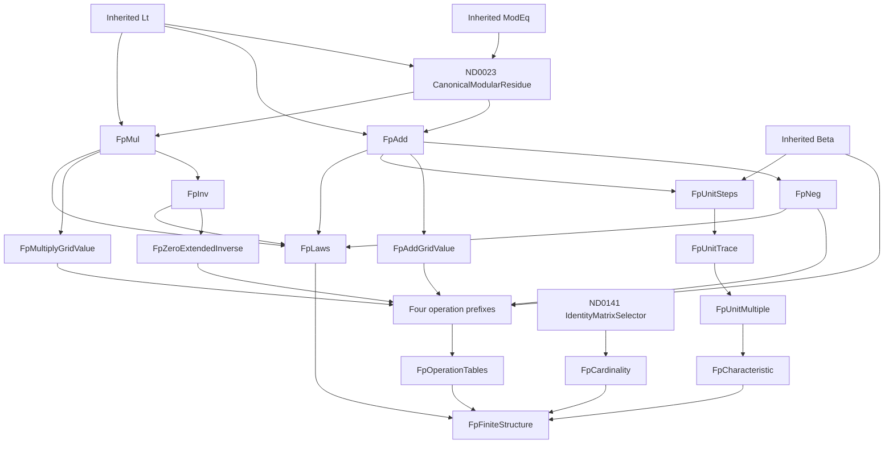

# Canonical prime fields: arithmetic, finite tables, cardinality and characteristic

## Status and exact boundary

This additive candidate tranche proves the **prime-order case** of finite-field
construction. For every prime natural `p`, it constructs canonical arithmetic on
`0 <= a < p`, four actual finite beta-coded operation tables, an actual
`p`-element bijection, and characteristic exactly `p`.

It does **not** complete G091, whose full target is a finite field of every
prime-power order `p^k` for every positive `k`. There is no polynomial Euclidean
division, existence theorem for irreducibles of every degree, or extension-field
quotient construction in this tranche. The old natural Horner-evaluation T12
interface is not silently promoted to polynomial Euclidean algebra.

The parent is immutable Alpha v30: 3,222 checked rows, Stable 432, catalogue
SHA-256 `ac7111ec14ff07bf899238ed465de337e6d76e9343384947022360dc7e65d9f7`.
These are checked, non-admitting candidates. No existing Alpha/Stable catalogue,
kernel, proof engine, resource policy, worker, public page or historical evidence
file is changed by the mathematical files below.

## Exact conservative operations

All displayed names abbreviate ordinary first-order HA formulae over
`0, S, +, *, =`. There is no remainder function, set primitive, field axiom,
choice axiom or new kernel rule.

```text
Lt(a,p)       := exists h. h + S a = p
ModEq(p,n,r)  := exists u v. n + p*u = r + p*v
R(p,n,r)      := Lt(r,p) /\ ModEq(p,n,r)
Carrier(p,a)  := Prime(p) /\ Lt(a,p)

Add(p,a,b,c)  := Lt(a,p) /\ Lt(b,p) /\ R(p,a+b,c)
Mul(p,a,b,c)  := Lt(a,p) /\ Lt(b,p) /\ R(p,a*b,c)
Neg(p,a,b)    := Add(p,a,b,0)
Inv(p,a,b)    := ~(a=0) /\ Mul(p,a,b,1)

ZeroInv(p,a,b) := Lt(a,p) /\ Lt(b,p) /\
                  ((a=0 /\ b=0) \/ Inv(p,a,b))
```

`R` is exactly inherited ND0023 `CanonicalModularResidue`; it is not a new
definition with a new mathematical identity. Likewise the identity enumeration
below reuses inherited ND0141 `IdentityMatrixSelector(b,c,p)`. The new
term-safe wrappers preserve these ASTs. Exact historical theorems
`hensel_canonical_residue_exists`, `binary_canonical_residue_functional`,
`prime_two_le`, and `matrix_lattice_identity_selector_exists` are reused, rather
than counted again under new names.

The inverse convention at zero is restricted to the **total table**. The genuine
inverse graph excludes zero, and
`prime_field_zero_has_no_multiplicative_inverse` separately proves that no actual
`Mul(p,0,b,1)` exists at a prime modulus. This latter result does not merely
unfold the inverse graph's nonzero guard. Prime two is included throughout.

## Actual finite tables

`Beta(B,C,i,v)` is the inherited arithmetic beta-decoding relation. Binary tables
use the literal row-major index `a*p+b`, not an abstract or supplied index map.

```text
AddGrid(p,i,v) := exists a b. i=a*p+b /\ Add(p,a,b,v)
MulGrid(p,i,v) := exists a b. i=a*p+b /\ Mul(p,a,b,v)

Prefix_Q(p,B,C,l) :=
  forall i. Lt(i,l) -> exists v. Beta(B,C,i,v) /\ Q(p,i,v)

Tables(p,ab,ac,mb,mc,nb,nc,ib,ic) :=
  Prefix_AddGrid(p,ab,ac,p*p) /\
  Prefix_MulGrid(p,mb,mc,p*p) /\
  Prefix_Neg(p,nb,nc,p) /\
  Prefix_ZeroInv(p,ib,ic,p)
```

The finite-choice rows are actual induction proofs from pointwise arithmetic
witnesses to a beta prefix. Each successor uses checked `beta_prefix_extend`.
The unconditional table constructors discharge pointwise existence from
primality, division, and the proved arithmetic operations. They do not assume
that a field table, quotient oracle or collection of field laws already exists.

Checked quotient/remainder uniqueness identifies both decoded grid coordinates.
Lookup and reflection theorems prove both directions between actual beta entries
and canonical arithmetic. Additional roots express commutativity, associativity
and **both distributive laws directly on beta-table lookups**, deriving the
necessary bounds for intermediate values. The inverse-table zero and nonzero
rows separately establish its intended boundary behavior.

## Actual cardinality and characteristic

The cardinality witness is a beta-coded enumeration whose value at each `i<p`
is exactly `i`. The `FpCardinality` relation also includes independently proved
boundedness, injectivity on the `p` indices, and surjectivity onto every `a<p`.
Thus the number `p` is the cardinality of the actual canonical carrier, not a
Python count or metadata annotation. Its combinatorial construction also handles
the empty prefix at `p=0`; only the field theorem requires primality.

Characteristic is established through genuine repeated addition:

```text
UnitSteps(p,B,C,n) :=
  forall i. Lt(i,n) -> exists u v.
    Beta(B,C,i,u) /\ Beta(B,C,S i,v) /\ Add(p,u,1,v)

UnitTrace(p,B,C,n,r) :=
  Beta(B,C,0,0) /\ Beta(B,C,n,r) /\ UnitSteps(p,B,C,n)

UnitMultiple(p,n,r) := exists B C. UnitTrace(p,B,C,n,r)

Characteristic(p) :=
  UnitMultiple(p,p,0) /\
  forall n. Lt(n,p) -> ~(n=0) -> ~UnitMultiple(p,n,0)
```

The trace definition does **not** assume `R(p,n,r)`. The independent induction
`prime_field_unit_trace_residue` proves that invariant from actual consecutive
`Add(u,1,v)` steps. Its proof does not depend on trace existence. Subsequently
trace existence is proved by a separate induction, using the invariant only to
obtain a bounded endpoint before computing and appending the next sum. This
dependency order is acyclic. Empty histories, terminal histories at `n=p`, and
arbitrary later lengths are included.

## Principal checked statements

The `FieldLaws(p)` conclusion explicitly contains 20 clauses: the bounds on
actual zero/one, their inequality, total unique addition and multiplication,
both commutative and associative laws, both distributive laws, zero and one
identities on both sides, absorption by zero, unique additive inverses, unique
nonzero multiplicative inverses, and no zero divisors. No operation constructor
or component law assumes `FieldLaws` as a premise.

```text
prime_field_arithmetic_laws:
  forall p. Prime(p) -> FieldLaws(p)

prime_field_operation_tables_exists:
  forall p. Prime(p) ->
    exists ab ac mb mc nb nc ib ic.
      Tables(p,ab,ac,mb,mc,nb,nc,ib,ic)

prime_field_characteristic_exact:
  forall p. Prime(p) -> Characteristic(p)

prime_field_of_prime_order_exists:
  forall p. Prime(p) ->
    exists ab ac mb mc nb nc ib ic eb ec.
      Tables(p,ab,ac,mb,mc,nb,nc,ib,ic) /\
      FpCardinality(p,eb,ec) /\
      FieldLaws(p) /\ Characteristic(p)
```

The last statement is the fully checked prime-order infrastructure endpoint. It
is not an alias for the planning-only `FiniteFieldCode(F,p^k)` signature, and it
does not change G091's open status.

## Conservative definition DAG



This is a compact view of definition-dependency edges. It is not substituted for the actual
theorem dependency DAG, and they do not assign proof authority to a definition.
Every public builder accepts parsed compound Peano terms in an explicit,
nonempty variable context and rejects capture by **any** generated or inherited
beta binder, including an unused context variable. Large-numeral regressions use
the existing double-and-add representation without changing parser limits.

## Frozen mathematical inventory and validation

| Additive module | Rows | Dependency edges | Commands | Body occurrences | Body objects |
|---|---:|---:|---:|---:|---:|
| `prime_field_arithmetic_candidate.py` | 42 | 120 | 1,209 | 2,267 | 2,265 |
| `prime_field_tables_candidate.py` | 31 | 93 | 1,389 | 2,437 | 2,437 |
| `prime_field_finiteness_candidate.py` | 14 | 41 | 562 | 1,002 | 1,002 |
| Total | 87 | 254 | 3,160 | 5,706 | 5,704 |

All 87 dependency-curried candidate bodies pass the unchanged original HA
checker. A final fresh-process repetition checked all 87 in 12.119 seconds,
with peak RSS 360,579,072 bytes, largest body 197 occurrences and greatest proof
depth 72. The authoring process retained the existing 170/175-second CPU and
180-second wall bounds; no proof, formula, depth or checker limit was raised.
There are no unused declared dependency edges and no forward dependency cycles.
An independent AST audit of 2,942 size-eligible inherited statements identified
the identity-enumeration duplicate, which was removed and replaced with the
actual inherited theorem before this inventory was frozen.

The non-admitting, self-contained
[prime-field proof bundle](artifacts/bottom-layer-prime-fields-proof-bundle-v1.json)
also passed the original HA checker and the existing independently compiled Lean
checker: 228 nodes, 611 edges, 12,012 body occurrences, 594,304 bytes; SHA-256
`688e7141106c19adec6fa52a0ae77af3d389b77df512622adc93bd3b0c7ba04e`.
Its hypotheses are closed by actual inherited proof bodies, not catalogue hashes.
The full export took 30.503 seconds with peak RSS 734,822,400 bytes. Independently,
the single `prime_field_of_prime_order_exists` root was materialized as an
ordinary 15,167-node proof and checked again in the empty context by the original
HA checker: accepted in 2.793 seconds including imports, peak RSS 360,906,752
bytes. This is not merely acceptance of the dependency-curried candidate body.
The pinned catalogue in focused candidate tests is only the source of exact
dependency hypotheses for those expressly non-admitting body tests.

All **1,806 focused regressions pass**: arithmetic 621, tables 474, finiteness
711. They cover independent AST reconstruction of every public definition and
the full principal statements, 782 hostile generated-binder contexts, compound
and 96-bit numeral inputs, malformed contexts/terms/tags, fresh ordinary-kernel
positive checks, truncated/false-body and forged/missing-dependency rejection,
and seven explicit domain/trace/characteristic forgeries. Independent small
numeric examples include actual CRT-encoded beta tables and unit histories,
prime two, zero, empty histories, complete wraparound and corrupted table cells.
These finite examples are tests of meaning and boundaries, **not** formal proofs.

Reproduce the focused suites in fresh processes from the repository root:

```sh
PYTHONPATH=peano-lab/py python3 -m pytest -q peano-lab/py/tests/test_prime_field_arithmetic_candidate.py
PYTHONPATH=peano-lab/py python3 -m pytest -q peano-lab/py/tests/test_prime_field_tables_candidate.py
PYTHONPATH=peano-lab/py python3 -m pytest -q peano-lab/py/tests/test_prime_field_finiteness_candidate.py
```

The public graph builders and all mathematical source bytes are frozen at:

```text
arithmetic  d4c26bad017d8f9fee173935e93d394ff5b14697b20d1f460c8a8c2fd3091d90
tables      2b24ad88c784eb558e36fba39bc181007986a9449194975d4f763723c0580400
finiteness  a86bc0d8913ebfc1ea84c8dad691db5f90e21029c612ee87ad804657b1971b28
```

Principal statement SHA-256 pins:

```text
prime_field_arithmetic_laws
  d6c324daa2e1d8a11b13e15710ddcd43e3b3623790e0ad247ce18eae318f3f29
prime_field_operation_tables_exists
  8f17f00aa07c9b5c8371ed89a747163c853b687a2b4dc3d74af2ef67f87e3e6e
prime_field_characteristic_exact
  119e9da82eb4dfcd882fcefc8bde1880e04409ef085417c7a1c6c121e47bfd16
prime_field_of_prime_order_exists
  f0a61089155f5bb6cd5e6fa79774756a296253a412e2b131bf8f491e8099b8a7
```

## What remains before full G091

The next genuine layers are canonical finite polynomials over these proved
prime-field operations; degree and leading-coefficient normalization; polynomial
division and gcd/Bezout; constructive irreducibility and existence of an
irreducible of every positive degree; and actual quotient-field arithmetic with
cardinality `p^k`. None is supplied by a renamed natural Horner evaluator or by
the prime-order field laws above. They remain separate, open proof obligations.
