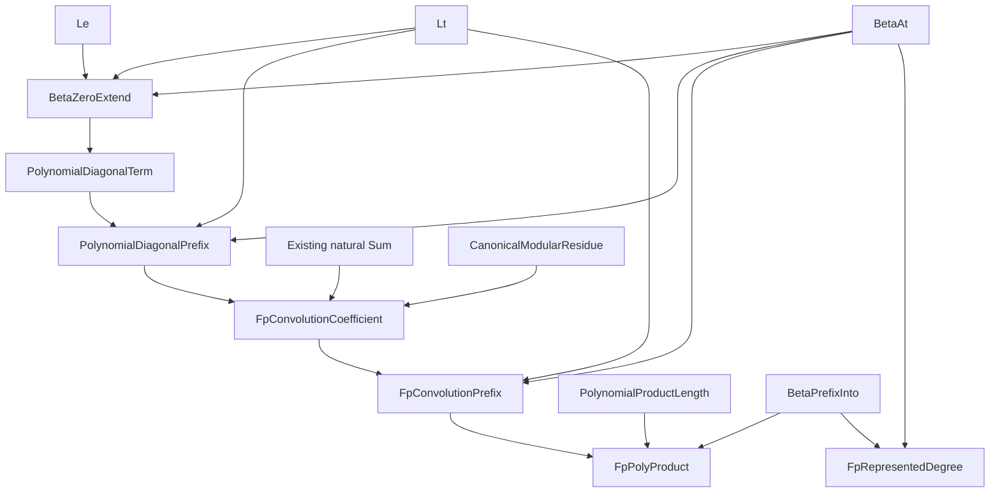

# Actual polynomial convolution and represented degree over prime fields

## Status and precise boundary

This additive, non-admitting checkpoint proves 53 new ordinary HA statements:
45 about actual finite convolution and eight about nonzero leading coefficients
and represented degree. It constructs a canonical coefficient prefix for every
pair of canonical finite input prefixes, proves uniqueness of its length and
decoded values, and proves invariance under reencoding. It then constructs the
product of two nonzero-leading representations over a prime field and proves
that its represented degree is the sum of their represented degrees.

This is progress toward G091, not its completion. No polynomial division,
polynomial gcd, irreducibility test, irreducible polynomial in every degree,
or field extension of arbitrary order `p^k` is asserted. This checkpoint also
does not yet prove the Horner evaluation/product identity, convolution
associativity or distributivity, trimming of leading zeros, or a canonical
degree for arbitrary representations. The zero polynomial is not assigned a
natural-number degree.

The unchanged admitted parent is Alpha v30: 3,222 checked statements and
Stable 432, catalogue SHA-256
`ac7111ec14ff07bf899238ed465de337e6d76e9343384947022360dc7e65d9f7`.
The 170 first bottom-layer statements and the subsequent 126 statements are
reused as authenticated, non-admitted research support, not counted again.
All old mathematical files, artifacts, evidence pins, kernel rules, proof
limits, catalogues, and published checkpoint files remain unchanged.

## Coefficient convention and genuine construction

The inherited T12 convention is highest-degree-first:

```text
[a0,...,a(L-1)] represents a0*X^(L-1) + ... + a(L-1).
```

Length belongs to the representation. A beta code pair has no end marker:
the same pair decoding `[1,0,...]` can represent the constant `1` at length
one and `X` at length two. Consequently the degree graph has five arguments,
including the length. Leading zeros are permitted by the general coefficient
and convolution graphs, but excluded by the represented-degree graph.

Write `Coeff(p,b,c,L)` below only as a typographical abbreviation for the
existing `BetaPrefixInto(b,c,L,p)`. `EqPrefix` is the existing one-way beta
prefix preservation graph, already proved to be extensional equality through
beta totality, uniqueness, and symmetry. Neither asserts equality of raw code
numbers. `R(p,n,r)` is exactly `CanonicalModularResidue(p,n,r)`; `Sum` is the
existing natural finite-sum graph with an actual beta-coded partial-sum trace.
No array, sum, function, or new logical rule is added to HA.

The eight new public graphs expand conservatively as follows:

```text
BetaZeroExtend(b,c,L,i,a) :=
  (Lt(i,L) /\ Beta(b,c,i,a)) \/ (Le(L,i) /\ a=0)

PolynomialDiagonalTerm(ab,ac,L,bb,bc,M,i,j,t) :=
  exists k a b.
    j+k=i /\ BetaZeroExtend(ab,ac,L,j,a) /\
    BetaZeroExtend(bb,bc,M,k,b) /\ t=a*b

PolynomialDiagonalPrefix(ab,ac,L,bb,bc,M,i,db,dc,N) :=
  forall j. Lt(j,N) -> exists t.
    Beta(db,dc,j,t) /\ PolynomialDiagonalTerm(ab,ac,L,bb,bc,M,i,j,t)

FpConvolutionCoefficient(p,ab,ac,L,bb,bc,M,i,r) :=
  exists db dc n.
    PolynomialDiagonalPrefix(ab,ac,L,bb,bc,M,i,db,dc,S i) /\
    Sum(db,dc,S i,n) /\ R(p,n,r)

FpConvolutionPrefix(p,ab,ac,L,bb,bc,M,cb,cc,N) :=
  forall i. Lt(i,N) -> exists r.
    Beta(cb,cc,i,r) /\ FpConvolutionCoefficient(p,ab,ac,L,bb,bc,M,i,r)

PolynomialProductLength(L,M,N) :=
  ((L=0 \/ M=0) /\ N=0) \/
  (~(L=0) /\ ~(M=0) /\ L+M=S N)

FpPolyProduct(p,ab,ac,L,bb,bc,M,cb,cc,N) :=
  Coeff(p,ab,ac,L) /\ Coeff(p,bb,bc,M) /\
  PolynomialProductLength(L,M,N) /\
  FpConvolutionPrefix(p,ab,ac,L,bb,bc,M,cb,cc,N)

FpRepresentedDegree(p,b,c,L,d) :=
  L=S d /\ Coeff(p,b,c,L) /\ exists a. Beta(b,c,0,a) /\ ~(a=0)
```

Thus coefficient `i` is the canonical residue of the actual sum
`sum(j=0..i, padded_a[j]*padded_b[i-j])`. Its definition does not assume an
evaluation identity, a degree property, or any other desired convolution law.
The two finite-choice constructions use ordinary induction and the already
proved beta-prefix extension theorem; their unconditional endpoints discharge
the intermediate pointwise-existence premises.

The length convention returns an empty product if either input is empty.
Otherwise `N=L+M-1`, expressed without adding subtraction to the language.
An all-zero nonempty product can still have a positive representation length;
no degree-normalization assertion is hidden in this convention.

## Principal checked contracts

Existence and extensional uniqueness require only a nonzero modulus. This
generality does not assert that composite moduli are fields:

```text
prime_field_polynomial_convolution_exists_unique:
  forall p ab ac L bb bc M.
    p!=0 -> Coeff(p,ab,ac,L) -> Coeff(p,bb,bc,M) -> exists N cb cc.
      FpPolyProduct(p,ab,ac,L,bb,bc,M,cb,cc,N) /\
      forall db dc K. FpPolyProduct(p,ab,ac,L,bb,bc,M,db,dc,K) ->
        N=K /\ EqPrefix(cb,cc,db,dc,N)
```

Separate theorems prove canonical output bounds, simultaneous reencoding of
both inputs and the output, empty products, both zero-factor cases, and every
coefficient past the genuine support being zero. The last statement concerns
`FpConvolutionCoefficient`, **not** arbitrary raw beta values beyond the
declared output prefix. Such unused raw entries need not be zero.

The first coefficient of every nonempty actual product is an actual field
multiplication value:

```text
prime_field_polynomial_convolution_leading_coefficient:
  forall p ab ac d bb bc e cb cc N a b r.
    FpPolyProduct(p,ab,ac,S d,bb,bc,S e,cb,cc,N) ->
    Beta(ab,ac,0,a) -> Beta(bb,bc,0,b) -> Beta(cb,cc,0,r) ->
      FpMul(p,a,b,r)
```

Here the graph of `FpMul` is the previously proved canonical-residue operation,
not a new operation whose laws are supplied as assumptions. The prime-field
no-zero-divisors theorem then gives:

```text
prime_field_polynomial_convolution_represented_degree:
  forall p ab ac L d bb bc M e cb cc N.
    Prime(p) -> FpRepresentedDegree(p,ab,ac,L,d) ->
    FpRepresentedDegree(p,bb,bc,M,e) ->
    FpPolyProduct(p,ab,ac,L,bb,bc,M,cb,cc,N) ->
      FpRepresentedDegree(p,cb,cc,N,d+e)

prime_field_polynomial_convolution_represented_degree_exists:
  forall p ab ac L d bb bc M e.
    Prime(p) -> FpRepresentedDegree(p,ab,ac,L,d) ->
    FpRepresentedDegree(p,bb,bc,M,e) -> exists cb cc.
      FpPolyProduct(p,ab,ac,L,bb,bc,M,cb,cc,S(d+e)) /\
      FpRepresentedDegree(p,cb,cc,S(d+e),d+e)
```

The second endpoint constructs its product, rather than requiring one as an
unproved premise. Reencoding preserves represented degree. A separate
nonvacuity theorem constructs an all-one, hence monic, coefficient prefix of
every length `S d` for every prime modulus, including two. Empty and all-zero
prefixes have no represented degree. Over modulus four the nonzero constants
two and two multiply to zero; the prime hypothesis is essential.

## Proof decomposition and definition DAG

1. Decidable natural order and beta totality construct zero-extended values.
   Disjoint inside/outside cases and beta uniqueness prove functionality.
2. For `j<S i`, natural arithmetic constructs the unique complement `k` with
   `j+k=i`. Actual multiplication forms each antidiagonal term. Ordinary
   finite induction constructs its beta prefix.
3. Existing finite-sum totality and canonical-remainder existence construct
   each output coefficient. Prefix transport, sum functionality, and residue
   functionality prove its uniqueness and invariance under reencoding.
4. A second finite induction constructs all required coefficients, yielding
   the genuine full product. Order arithmetic proves that no nonzero terms
   are discarded past the declared support: if both indices were in range,
   their sum would contradict the support bound.
5. The sum at output index zero has length one. The old zero/successor sum
   equations identify it with the actual leading-coefficient product. The
   existing prime-field no-zero-divisors theorem and the positive-length
   equation prove degree addition; the actual convolution constructor supplies
   the final existential endpoint.

The notation follows the established conservative proof-explorer discipline.
Every diagram edge is an actual graph dependency, not a conjectured theorem:



The separate theorem connecting the leading coefficient to `FpMul` is not a
definition edge. All public builders accept validated ordinary Peano terms
with an explicit context, and reject capture by every generated binder,
including inherited beta and sum binders and unused declared context names.

## Evidence, reproducibility, and resource boundary

Factory order is convolution first, represented degree second.

| New family | Rows | Direct dependency edges | Tactic commands | Body nodes | Distinct body objects | Largest body / depth |
| --- | ---: | ---: | ---: | ---: | ---: | ---: |
| Actual convolution | 45 | 101 | 2,098 | 3,717 | 3,713 | 264 / 95 |
| Represented degree | 8 | 22 | 398 | 677 | 677 | 160 / 51 |
| Total | 53 | 123 | 2,496 | 4,394 | 4,390 | 264 / 95 |

All 53 ordinary theorem bodies have passed the original HA checker. Fresh
positive family batches measured 17.83 seconds / 383,107,072 bytes and 6.93
seconds / 386,039,808 bytes respectively. These body checks treat declared
dependencies as ordinary hypotheses; they are not, by themselves, complete
dependency-closure or admission receipts.

The focused suites pass **740 tests in 139.61 seconds**, including all 53
positive ordinary bodies, 202 actual body/dependency corruption probes, and
13 changed-domain, length, degree, or encoding probes. They independently
assemble the mathematical ASTs, exercise every
public argument with compound terms and 96-bit numerals, test every generated
binder for capture, and reject malformed contexts, terms, and tags. Actual
CRT beta codes and partial-sum traces provide numerical diagnostics including
characteristic two, zero and empty products, all-one nonzero examples, arbitrary
reencoding, wrong raw tails, and the composite-modulus counterexample. These
diagnostics are not substitutes for the universally quantified HA proofs.

The hostile proof tests retain the same scripts while corrupting conclusions,
truncating bodies, removing declared dependencies, or forging a dependency's
statement. Additional contract mutations target zero modulus, wrong support
and length bounds, uncanonical inputs, raw-code uniqueness, invalid raw-tail
claims, composite moduli, zero leading coefficients, missing length
annotations, and an incorrect degree formula.

Every fresh proof subprocess retains the 170/175-second CPU limits, the
180-second wall alarm, the inherited 256 proof-depth limit, and the 1,536 MiB
measured peak-RSS ceiling. No oracle, trusted source grant, skipped body, or
raised proof limit is used. A parsed-AST novelty audit against all 3,518 prior
statements (3,222 admitted plus 170 and 126 research statements), and among all
53 new rows, found no duplicates in 23.16 seconds with 358,662,144-byte peak
RSS. Renamed binders and textual spelling differences do not count as new
propositions.

Run the complete focused gate from the repository root:

```sh
PYTHONPATH=peano-lab/py:scripts PYTHONMALLOC=malloc python3 -m pytest -q \
  peano-lab/py/tests/test_prime_field_polynomial_convolution_candidate.py \
  peano-lab/py/tests/test_prime_field_polynomial_degree_candidate.py
```

The separate integration check accepted the complete dependency-closed bundle
`artifacts/lower-continuation-polynomial-products-proof-bundle-v1.json`:

- 210 nodes: 53 new, 10 inherited bottom-layer research prerequisites,
  two inherited lower-tier research prerequisites, 144 Alpha prerequisites,
  and one packaging node; there is no new cross-track support in this cone;
- 503 dependency edges including packaging, and 11,604 body-node occurrences;
- 745,307 bytes, SHA-256
  `55f12903e1b1d3b4832f6c728cb366c20868c4e88810a736316b30cddf01dde3`;
- the unchanged original HA checker accepted every exact body and ordered
  dependency, and the independently compiled Lean checker accepted a private
  copy of the same authenticated bundle bytes;
- separate empty-context ordinary HA replays, followed by an additional exact
  original-kernel check, accepted `prime_field_polynomial_convolution_exists_unique`
  (bundle node 196; 10,055 ordinary certificate-node occurrences),
  `prime_field_polynomial_convolution_outside_zero` (node 200; 2,887), and
  `prime_field_polynomial_convolution_represented_degree_exists`
  (node 208; 12,260).

The native verification process, including those three ordinary roots,
measured 381,911,040-byte peak RSS. The compiled checker is identified by its
actual bytes rather than an inferred toolchain version: 106,787,344 bytes,
SHA-256 `22a49645acdee1a90bdf09861729d62b7a9c5bc20bc1f799ad05adc54ee0b033`.
All original proof and authoring limits were retained. These are complete
proof checks, but they confer no Alpha or Stable admission.

## Frozen mathematical identities

```text
prime_field_polynomial_convolution_candidate.py
  SHA256 20502be0d2beaee44ba4bbdb3f7c376db142dbc9c19a5a472c073b0228367c24
  names  42bc93136e5cf710eb616ad0879bb2141c1adfb4c77e6664891c21a95853345e
  specs  fc4d51ed6f083a53de42cd3e003fd83357635740b2cee90e2a79044588fdd5dc

prime_field_polynomial_degree_candidate.py
  SHA256 3419cefca1f8e4b130a7c8935218815153eaf9865fe1eeed89118ced8bf339e5
  names  66383eab05b0a8d6a0903a69bf19bc7d4183cb4428a3c1900e49af0babdecf8c
  specs  b00f5d4acff6477bef55226cb27c949d5fddc569a2152c028ae3a4c9bdbf09a8

combined ordered 53 specifications
  SHA256 4ee9ff43d58fac794947ac67349efd966b78472b2f9777c16fe222e5ca194eaa

test_prime_field_polynomial_convolution_candidate.py
  SHA256 0864eb740363bfc3b659d9baf1e4e21d0901740b612a592599be3f0c45f1ae54
test_prime_field_polynomial_degree_candidate.py
  SHA256 0a6007a88281379b54fff7d90493000eae144e637c76a199b963db1b02d3f276

prime_field_polynomial_convolution_exists_unique
  statement SHA256 68befd01e16fc6522f2c848ddaac2bef81ead256b41bf6b03fbff132b7693410
prime_field_polynomial_convolution_represented_degree_exists
  statement SHA256 8ff4406ec7462fc8e97a47932550abde9c428392cda01a1c86fe2dfd082fc51a
prime_field_polynomial_convolution_outside_zero
  statement SHA256 724cc30193c104f03c1777ace6bec5f40681be6436e7da9f165d44d10cb97501
```

Hashes identify exact bytes and ordered specifications; proof authority comes
from checking the actual ordinary proof objects, not from these hashes.
