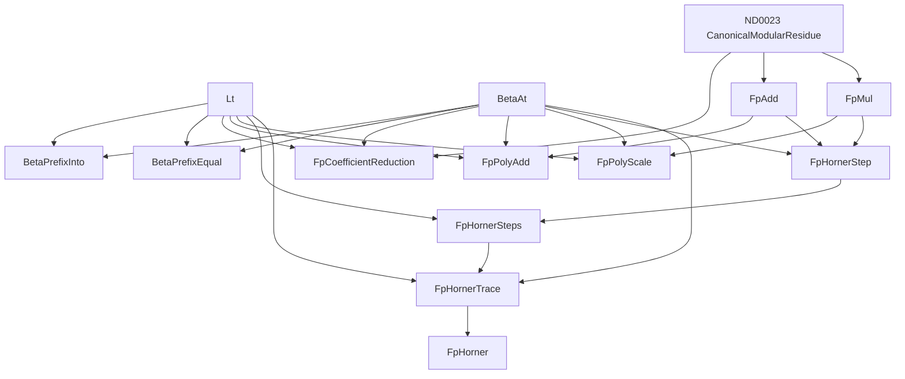

# Canonical coefficient tables and actual prime-field Horner executions

## Status and exact boundary

This additive, non-admitting checkpoint supplies the next polynomial substrate
for G091. Its 49 new theorems construct canonical finite coefficient tables,
coefficientwise addition and scalar multiplication, and actual modular Horner
executions. They prove extensional operation laws, execution uniqueness, and
agreement with the existing natural-number T12 Horner evaluation.

This does **not** complete G091. There is no new theorem about polynomial
convolution, canonical degree, polynomial Euclidean division, polynomial gcds,
irreducibles of every degree, or extension fields of arbitrary order `p^k`.
Those remain subsequent layers. The previously proved prime-order field
construction is reused as non-admitted research support, not counted again.

The unchanged parent is Alpha v30: 3,222 checked rows, Stable 432, catalogue
SHA-256 `ac7111ec14ff07bf899238ed465de337e6d76e9343384947022360dc7e65d9f7`.
No old mathematical source, kernel, proof engine, proof limit, Alpha/Stable
catalogue, worker, or published checkpoint is modified by this tranche.

## Representation and conservative definitions

All abbreviations expand to ordinary first-order HA over `0, S, +, *, =`.
`Beta(b,c,i,a)` is the inherited arithmetic beta-decoding graph; it is not a
new array primitive. `R(p,n,r)` is exactly the inherited
`CanonicalModularResidue(p,n,r)` (ND0023), and `Horner(b,c,x,l,n)` is exactly
the existing natural evaluation (ND0002).

Coefficient order is **highest-degree-first**, as in T12:

```text
h[0]   = 0
h[i+1] = h[i]*x + a[i]

[a0,...,a(l-1)] represents a0*x^(l-1) + ... + a(l-1).
```

Length is a representation length, not a proved degree. Empty prefixes
represent zero; leading zeros are permitted. The prefix-equality relation
compares decoded coefficients at a fixed common length, not raw code numbers,
different-length representations, or polynomial functions on the finite field.
For example, `X^2+X` and zero induce the same function on `F2` but have distinct
coefficient vectors. No converse from equality of evaluations to equality of
coefficients is claimed.

The two generic prefix graphs reuse existing finite-coding ASTs exactly. Their
new reviewed names do not count as additional theorem rows:

```text
BetaPrefixInto(b,c,l,B) :=
  forall i. Lt(i,l) -> exists a. Beta(b,c,i,a) /\ Lt(a,B)

BetaPrefixEqual(b,c,d,e,l) :=
  forall i a. Lt(i,l) -> Beta(b,c,i,a) -> Beta(d,e,i,a)
```

Existing beta totality and the previously proved prefix-symmetry theorem make
the latter genuine extensional equality. It does not assert `b=d` or `c=e`.
The coefficient wrapper takes `(p,b,c,l)` and expands to
`BetaPrefixInto(b,c,l,p)`; there is no competing `FpCoefficients` definition.

```text
FpCoefficientReduction(p,b,c,d,e,l) :=
  forall i. Lt(i,l) -> exists a r.
    Beta(b,c,i,a) /\ Beta(d,e,i,r) /\ R(p,a,r)

FpPolyAdd(p,ab,ac,bb,bc,cb,cc,l) :=
  forall i. Lt(i,l) -> exists a b r.
    Beta(ab,ac,i,a) /\ Beta(bb,bc,i,b) /\ Beta(cb,cc,i,r) /\
    FpAdd(p,a,b,r)

FpPolyScale(p,k,ab,ac,bb,bc,l) :=
  Lt(k,p) /\ forall i. Lt(i,l) -> exists a r.
    Beta(ab,ac,i,a) /\ Beta(bb,bc,i,r) /\ FpMul(p,k,a,r)
```

The scalar's global `k<p` guard remains present at length zero. Reduction and
coefficient-operation constructors require only `p!=0`, where that suffices;
this does not claim that a composite modulus defines a field. Prime-dependent
identity and evaluation results state their prime hypothesis explicitly.

The modular execution graphs contain actual arithmetic operations, **not** the
desired natural-Horner/residue invariant:

```text
FpHornerStep(p,b,c,x,u,v,i) :=
  exists a h j k.
    Beta(b,c,i,a) /\ Beta(u,v,i,h) /\ Beta(u,v,S i,j) /\
    FpMul(p,h,x,k) /\ FpAdd(p,k,a,j)

FpHornerSteps(p,b,c,x,l,u,v) :=
  forall i. Lt(i,l) -> FpHornerStep(p,b,c,x,u,v,i)

FpHornerTrace(p,b,c,x,l,r,u,v) :=
  Lt(x,p) /\ Beta(u,v,0,0) /\ Beta(u,v,l,r) /\
  FpHornerSteps(p,b,c,x,l,u,v)

FpHorner(p,b,c,x,l,r) := exists u v.
  FpHornerTrace(p,b,c,x,l,r,u,v)
```

The canonical base guard `x<p` also survives the empty execution. Bounds on
every coefficient and on the final result are proved from this graph and the
stated hypotheses. All public builders accept validated Peano terms and an
explicit variable context; they reject capture by every generated binder,
including legacy beta binders and context variables not used in an argument.

## Principal constructive statements

With `Coeff(p,b,c,l)` used below only as a typographical abbreviation for
`BetaPrefixInto(b,c,l,p)`, the coefficient constructors are:

```text
prime_field_polynomial_normalization_exists:
  forall p b c l. p!=0 -> exists d e.
    FpCoefficientReduction(p,b,c,d,e,l)

prime_field_polynomial_add_exists:
  forall p ab ac bb bc l.
    p!=0 -> Coeff(p,ab,ac,l) -> Coeff(p,bb,bc,l) -> exists cb cc.
      FpPolyAdd(p,ab,ac,bb,bc,cb,cc,l)

prime_field_polynomial_scale_exists:
  forall p k ab ac l.
    p!=0 -> Lt(k,p) -> Coeff(p,ab,ac,l) -> exists bb bc.
      FpPolyScale(p,k,ab,ac,bb,bc,l)
```

Separate proved roots give extensional functionality and arbitrary prefix
recoding of each operation. Normalization is reflexive on canonical tables and
idempotent up to coefficient equality. Actual zero tables are constructed at
every length. Coefficient addition is commutative and associative and has a
zero-table identity. Scalar one and zero act as expected; scalar composition
and both scalar distributive laws hold on actual beta tables. These are proved
operation laws, not premises concealed inside a table definition.

The evaluation endpoint includes a real execution witness and actual result
uniqueness:

```text
prime_field_polynomial_horner_exists_unique:
  forall p b c x l.
    Prime(p) -> Coeff(p,b,c,l) -> Lt(x,p) -> exists r.
      FpHorner(p,b,c,x,l,r) /\
      forall s. FpHorner(p,b,c,x,l,s) -> s=r
```

The strongest correctness bridge allows arbitrary natural source coefficients:

```text
prime_field_polynomial_normalized_horner_iff:
  forall p b c d e x l n r.
    Prime(p) -> FpCoefficientReduction(p,b,c,d,e,l) -> Lt(x,p) ->
    Horner(b,c,x,l,n) ->
      (FpHorner(p,d,e,x,l,r) -> R(p,n,r)) /\
      (R(p,n,r) -> FpHorner(p,d,e,x,l,r))

prime_field_polynomial_reduce_and_evaluate_exists:
  forall p b c x l. Prime(p) -> Lt(x,p) -> exists d e r.
    FpCoefficientReduction(p,b,c,d,e,l) /\
    FpHorner(p,d,e,x,l,r) /\
    forall n. Horner(b,c,x,l,n) -> R(p,n,r)
```

Both recurrence directions are proved, as are empty evaluation, actual empty
execution construction, constants, all-zero prefixes, canonical result bounds,
and reencoding of the coefficient prefix. All include the characteristic-two
case where applicable. No finite-model computation is substituted for these
universally quantified HA proofs.

## Proof decomposition and definition DAG

1. Existing finite quotient/remainder coding constructs coefficient reduction.
   Existing residue functionality identifies all decoded outputs. Existing
   natural pointwise addition, multiplication, and repeated-value coding supply
   finite raw operation tables; reduction produces the actual field operations.
2. Beta lookup functionality lifts the already proved scalar field laws to
   extensional coefficient-table laws. No uniqueness of beta code numbers is
   used or asserted.
3. The existing natural T12 theorem constructs a genuine Horner trace. Reducing
   **all `l+1` states**, including its initial zero state, yields real `FpMul`
   then `FpAdd` witnesses at every step. The unconditional modular existence
   theorem discharges the intermediate normalization premise constructively.
4. A separate ordinary induction proves the natural-residue invariant for
   arbitrary natural coefficients and their actual reductions. Canonical
   residue functionality then proves evaluation uniqueness. The converse
   correctness and recurrence constructions use actual totality and uniqueness,
   not an assumed result invariant.

The reviewed notation follows the established conservative proof-explorer
discipline: the old graphs are reused exactly, mathematical statements expand
fully, and the new definitions form an acyclic dependency graph.



There is deliberately no direct dependency on the proposed result invariant
`Horner(b,c,x,l,n) /\ R(p,n,r)` in `FpHorner`: that relationship is a proved
theorem, not an execution assumption. The constituent `FpAdd` and `FpMul`
graphs do retain their existing ordinary canonical-residue arithmetic
definitions, as the diagram shows.

## Exact evidence and unchanged resource limits

The two new factories are ordered coefficient tables first, evaluation second.

| New family | Rows | Direct dependency edges | Tactic commands | Body nodes | Largest body / depth |
| --- | ---: | ---: | ---: | ---: | ---: |
| Coefficient tables | 31 | 53 | 1,680 | 2,669 | 301 / 62 |
| Modular Horner | 18 | 78 | 1,149 | 1,966 | 349 / 55 |
| Total | 49 | 131 | 2,829 | 4,635 | 349 / 62 |

There are 4,633 distinct body objects in aggregate; the two reused occurrences
are in the state-normalization construction. Body tests leave dependencies as
ordinary hypotheses and are explicitly **not** admission or complete-closure
receipts. The focused suites pass **703 tests in 110.71 seconds**. Their fresh
subprocesses check every positive body, 178 missing/forged-dependency or
false/incomplete-body variants, and 12 changed-domain/encoding/order variants.
They retain 170/175-second CPU limits, a 180-second wall alarm, the existing
256 proof-depth limit, and a 1,536 MiB measured peak-RSS ceiling. The two complete
positive family batches measured 372,736,000 and 377,012,224 bytes respectively.

The independent definition tests check all nine public builders against
separately assembled HA graphs, every argument position with compound and
96-bit numeral terms, every generated-binder capture case, and malformed
contexts/terms/tags. Concrete diagnostic tests build actual CRT beta codes,
reencode them independently, and check the literal modular steps. They include
empty/zero/constant cases, zero-modulus and noncanonical-scalar boundaries, and
an order-sensitive `[2,3,4]` example at `x=5` in `F7`.

An exhaustive parsed-AST comparison against all **3,392 earlier statements**
(3,222 Alpha plus 170 earlier non-admitted checkpoint statements), and among the
49 new statements, found **no duplicates**. The audit does not mistake source
text differences or renamed binders for new propositions.

The separate integration closure freshly checked all dependency bodies:

- 202 bundle nodes: 49 new, 23 inherited non-admitted research prerequisites,
  129 Alpha prerequisites, and one packaging node;
- 519 dependency edges and 11,889 body-node occurrences;
- 688,987 bytes, SHA-256
  `6e3a08c73b8a45de127e6d50a771f95b52fd54894b1c2e43468751421488a01a`;
- original HA accepted every body; the independently compiled Lean checker
  accepted the same authenticated proof bytes;
- separate ordinary empty-context original-HA replays accepted
  `prime_field_polynomial_horner_exists_unique` (10,310 proof nodes),
  `prime_field_polynomial_normalized_horner_iff` (10,228), and
  `prime_field_polynomial_reduce_and_evaluate_exists` (10,192).

The compiled checker is identified by its actual bytes, not an inferred
toolchain version: 106,787,344 bytes, SHA-256
`22a49645acdee1a90bdf09861729d62b7a9c5bc20bc1f799ad05adc54ee0b033`.
It receives a private copy of the same authenticated payload checked by HA.
The combined three-family lower-tier audit, including all nine principal-root
replays and statement novelty, measured 398,262,272 peak-RSS bytes.

The exact artifacts are:

- [Complete polynomial dependency bundle](artifacts/lower-tier-prime-field-polynomials-proof-bundle-v1.json).
- [Combined fresh lower-tier audit](artifacts/lower-tier-checkpoints-v1.json),
  SHA-256 `c97cb8503e40a0eee2c667a1ab625b71542e2537818c9b73f9cc49fa2bca42ec`.

Neither a stored receipt nor any hash is proof authority: the check command
re-authenticates sources and exact ordered specifications, rechecks the full HA
bundle, invokes the pinned independent checker, and reconstructs the exact
ordinary principal proofs. No Alpha admission or Stable promotion follows from
these local checks.

## Immutable mathematical identities and reproduction

```text
prime_field_polynomial_candidate.py
  SHA256 644c11d8838a94716aaec3ef2e88645c32fb837e78ed70aa7ae346e3deb79f72
  ordered names db3dadceb07584ff6be8f664663a6ac09b14c12223c0b8b86df9f3810b2517c3

prime_field_polynomial_evaluation_candidate.py
  SHA256 9638337f69bdc1f5491255b767dc90042244402e34ceab84902b0481c2eab802
  ordered names 9f2dfee5e428f6f573839e8f3a0801716379f8b73e736b483256091ca46b0961

all 49 ordered theorem specifications
  SHA256 0ff662d165003510ed2cd20d724762d9d4166e62cd67e361073e7e15bc5fcd8b

principal exact statement SHA256
  horner_exists_unique
    b4e5a2cd91b33b7366aa11d591d5da743acdb244348f438797daf1be243c3941
  normalized_horner_iff
    fbed602c60a29f5b4474d678ccd397c2ff5d50e7fb52f06480c26e1938a762e5
  reduce_and_evaluate_exists
    2f0d67795bf12542c6c9fb48cb4d63d26213e8e090bbca1a7a89257a49dd0e2c
```

From the repository root:

```sh
PYTHONPATH=peano-lab/py:scripts PYTHONMALLOC=malloc python3 -m pytest -q \
  peano-lab/py/tests/test_prime_field_polynomial_candidate.py \
  peano-lab/py/tests/test_prime_field_polynomial_evaluation_candidate.py

PYTHONPATH=peano-lab/py:scripts PYTHONMALLOC=malloc \
  python3 scripts/check_constructive_lower_tier.py --check
```

Next genuinely missing polynomial work includes coefficient zero-trimming and
degree, convolution and its algebra, leading-coefficient inversion and long
division, then polynomial gcd/irreducibility and extension-field construction.
This checkpoint does not relabel those unfinished obligations as proved.
