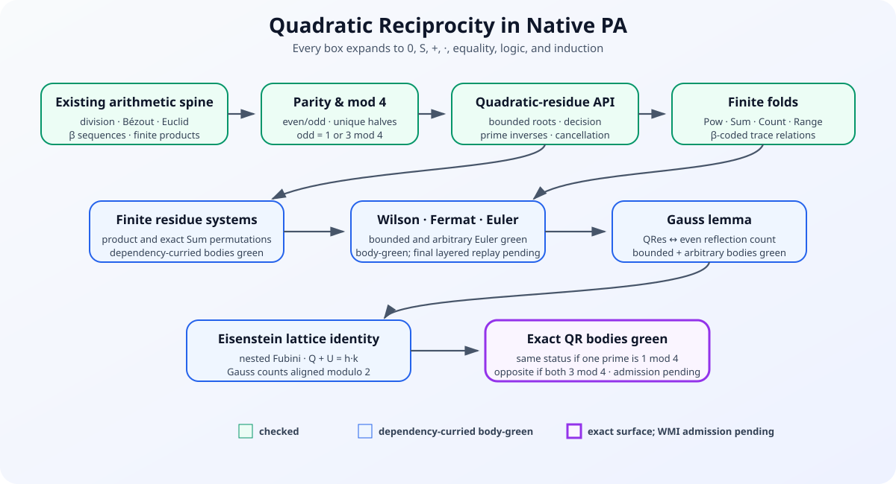
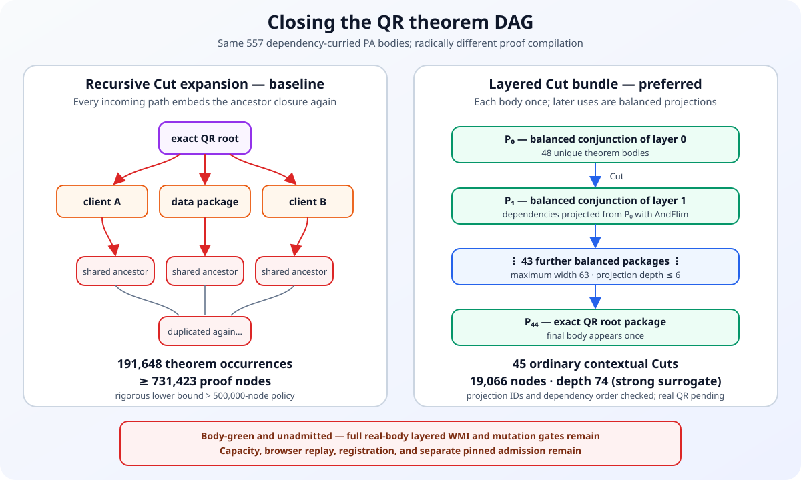

# The quadratic-reciprocity campaign

Quadratic reciprocity is the next flagship theorem for the native arithmetic
library. It is not being imported from Lean, assumed as an axiom, or encoded as
a trusted Legendre-symbol function. The endpoint, all intermediate finite
constructions, and the final certificate remain ordinary first-order PA.



## The exact native theorem

Balanced congruence lets us express “$a$ is a square modulo $p$” without
subtraction:

$$
\operatorname{QRes}(p,a)\;:\!\Longleftrightarrow\;
\exists x,u,v.\;x^2+pu=a+pv.
$$

For distinct odd primes $p,q$, write
$Q_{pq}=\operatorname{QRes}(p,q)$ and
$Q_{qp}=\operatorname{QRes}(q,p)$. The exact constructive capstone surface is:

$$
\begin{aligned}
(p\equiv1\pmod4\lor q\equiv1\pmod4)
&\Longrightarrow
  \bigl((Q_{pq}\land Q_{qp})\lor
        (\neg Q_{pq}\land\neg Q_{qp})\bigr),\\
(p\equiv3\pmod4\land q\equiv3\pmod4)
&\Longrightarrow
  \bigl((Q_{pq}\land\neg Q_{qp})\lor
        (\neg Q_{pq}\land Q_{qp})\bigr).
\end{aligned}
$$

The checked surface prototype expands the combined statement completely. It
uses 1,520 source characters—well below the 8,192-character input limit—and
contains no primitive occurrence of `Prime`, `Odd`, `QRes`, `%`, an integer
sign, or exponentiation.

The same, opposite, and combined candidate bodies now kernel-check with their
declared dependencies as hypotheses. They remain unregistered and unadmitted:
the selected next gate is a WMI-built layered `Cut` certificate, followed by
mutation testing, capacity profiling, browser replay, and a separate
receipt-pinned admission. The former recursively expanded closure is now a
measured baseline rather than the intended release artifact. Throughout this
chapter, “body-green” names exactly that intermediate evidence level.

<a href="../_static/pa-proof-explorer/tag/PA00FW.html">Open permanent tag
<strong>PA00FW</strong> for <code>quadratic_reciprocity_combined</code></a>.
From there, every numbered tactic line and linked dependency opens its own
stable theorem page; the candidate/public status remains visible throughout.

```{admonition} Constructive meaning
:class: important
Peano Lab is intuitionistic by default. The final same/opposite disjunctions
therefore depend on an explicit bounded decision theorem for quadratic
residues. A bare use of double-negation elimination would not be an acceptable
substitute.
```

## The mathematical route

The selected proof is the Gauss–Eisenstein lattice-count proof. For
$m=(p-1)/2$ and $n=(q-1)/2$, its combinatorial center is

$$
\sum_{i=1}^{m}\left\lfloor\frac{iq}{p}\right\rfloor+
\sum_{j=1}^{n}\left\lfloor\frac{jp}{q}\right\rfloor=mn.
$$

The two sums count the lattice points on opposite sides of the line
$qi=pj$ in an $m\times n$ rectangle. Equality cannot occur for distinct
primes. Taking parity and applying Gauss's lemma gives the reciprocity sign.

This route matches the native language well: floors become quotient/remainder
witnesses, finite sums and counts become β-coded traces, and signs become
even/odd bits. A Gauss-sum proof would require finite fields, characters and
roots of unity, none of which are needed here.

The route is also cross-checked against existing formal developments. The
[Isabelle/HOL quadratic-reciprocity theory](https://isabelle.in.tum.de/library/HOL/HOL-Number_Theory/Quadratic_Reciprocity.html)
builds on its checked Gauss theory and records Gauss's fifth proof as its
mathematical source. An earlier
[Mathlib Gauss–Eisenstein development](https://cs.brown.edu/courses/cs1951x/docs/number_theory/quadratic_reciprocity.html)
exposes Euler's criterion, Gauss's lemma and Eisenstein's lemma as separate
interfaces. These are design references only: no certificate or theorem from
either system is trusted by Peano Lab.

## Checked entrance layer

The first QR-0 tranche supplies fully expanded theorems for:

- constructive even-or-odd decomposition and exclusivity;
- successor, addition and multiplication parity;
- existence and uniqueness of the half of an odd number;
- the exhaustive $1$ or $3\pmod4$ classification of odd naturals;
- incompatibility of the two modulo-$4$ cases;
- oddness of every prime other than $2$;
- constructive congruence decision at nonzero modulus;
- bounded root search and a constructive decision of quadratic-residue status.

The QR-0 examples are complete rather than illustrative: checked canonical
equivalences classify the square residues as $\{0,1\}$ modulo $3$,
$\{0,1,4\}$ modulo $5$, and $\{0,1,2,4\}$ modulo $7$. Nine positive entries
carry explicit balanced-congruence witnesses, and six complementary entries
are constructively proved nonresidues by bounded-root enumeration. The
largest of these 24 certificates has 6,761 structural occurrences, 4,333
distinct objects, and depth 95.

Open {doc}`the theorem atlas <theorem-atlas>` at
[`parity_cases`](theorem-atlas.html#theorem-parity_cases),
[`odd_mod4_cases`](theorem-atlas.html#theorem-odd_mod4_cases), or
[`mod_eq_decidable_nonzero`](theorem-atlas.html#theorem-mod_eq_decidable_nonzero)
to inspect the exact expanded statement, every dependency, the complete tactic
recipe, and certificate metrics.

### Body-green parity transport

Four isolated tranches now package parity in the exact shapes consumed by the
Gauss--Eisenstein endpoint:

| Tranche | Readable endpoint | Body nodes/depth |
|---|---|---|
| sum classification | an even sum has equal summand parity; an odd sum has opposite parity, in both directions | `61/18`, `61/18`, `63/19`, `63/19` |
| modulo two | even is congruence to zero, odd is congruence to one, and congruence preserves both | `14/9`, `20/13`, `42/18`, `50/16`, `86/20` |
| odd multiplication/division | for odd `p` and `n=p*q+r`, parity of `n` is exactly parity of `q+r` | `36/18`, `36/17`, `28/12`, `93/22`, `93/22`, `51/20` |
| odd half versus modulo four | from `p=2*h+1`, `Even(h)` iff `p=1 mod 4` and `Odd(h)` iff `p=3 mod 4` | `20/13`, `78/27`, `42/18`, `100/30` |

All four focused modules pass together at `16/16` in 1.24 seconds under the
60-second cap. Their predicates are fully expanded existential equations in
native PA; the candidates are dependency-curried, unregistered, and
unadmitted. The linked Obsidian concept
[`parity transport`](../../vault/concepts/parity-transport.md) records the
exact client ladder and source links.

## Checked prime-unit bridge

The prime-field entrance is no longer merely planned. Eight checked
certificates now prove:

- a prime is constructively coprime to a natural or divides it;
- nondivisibility by a prime implies coprimality;
- distinct primes are coprime;
- balanced Bézout coefficients produce a subtraction-free modular inverse;
- a nonzero modulus converts that balanced inverse into an ordinary natural
  inverse witness; and
- multiplication by a coprime value cancels in balanced congruence.

At the readable level, the inverse endpoint is

$$
m\ne0\land\operatorname{Coprime}(a,m)
\Longrightarrow
\exists z,u,v.\;az+mu=1+mv.
$$

The exact expanded cards are
[`distinct_primes_coprime`](theorem-atlas.html#theorem-distinct_primes_coprime),
[`coprime_mod_inverse`](theorem-atlas.html#theorem-coprime_mod_inverse), and
[`prime_mod_cancel`](theorem-atlas.html#theorem-prime_mod_cancel).
They use the existing relational gcd, balanced Bézout, and congruence API; no
field or inverse function was added to the PA language.

## Finite objects without new language primitives

The next layer uses relational folds rather than adding functions:

| Expository relation | Native representation |
|---|---|
| `Pow(a,e,z)` | a β-coded constant factor prefix plus its checked `Product` trace |
| `Sum(b,c,l,s)` | a second β-code whose successive values satisfy $s_{i+1}=s_i+a_i$ |
| `BitCount(b,c,l,k)` | a `Sum` trace over a β-prefix containing only $0$ and $1$ |
| `Range(s,l,b,c)` | decoded entry $i$ is $s+i$ for every $i<l$ |

These names are documentation abbreviations. The
{doc}`language-and-trust <language-and-trust>` contract requires complete
expansion before parsing and kernel checking.

This checkpoint checks `beta_range_exists`,
`beta_range_transport_entry`, `beta_sum_exists_unique`, and
`beta_sum_succ_decompose`. It also closes the bit-count and congruence gates:
`bit_count_exists`, `bit_count_functional`, `bit_count_bounded`,
`beta_product_pointwise_mod_congruent`, and
`beta_sum_pointwise_mod_congruent` are independently kernel checked. Thus a
later Gauss argument may count a coded $0/1$ indicator prefix, while Wilson
and Fermat may replace pointwise-congruent factor prefixes without adding a
finite-set primitive. Their atlas cards expose the complete native scripts
and certificate metrics.

The outer-sum algebra needed by the Eisenstein route is now explicit too.
`beta_sum_pointwise_add` combines three exact equal-length `Sum` traces: if
the third decoded entry is the sum of the first two at every bounded index,
then their endpoints satisfy `n+m=q`. Its constructive 127-command body is
`195/57` nodes/depth, with no object reuse. Constant right-hand sides are
handled by `beta_repeat_sum_exact` and `beta_repeat_sum_exists_exact`, which
evaluate and construct the exact sum `l*a` of a length-$l$ `Repeat(a)` prefix
at `85/32` and `33/21`. The focused audits pass `3/3` and `4/4`; all remain
unregistered and unadmitted.

[`pointwise-add source`](../../peano-lab/py/peano_lab/library/finite_sum_pointwise_add_candidate.py)
· [`pointwise-add test`](../../peano-lab/py/tests/test_finite_sum_pointwise_add_candidate.py)
· [`constant-sum source`](../../peano-lab/py/peano_lab/library/finite_repeat_sum_candidate.py)
· [`constant-sum test`](../../peano-lab/py/tests/test_finite_repeat_sum_candidate.py)

The isolated finite-fold laboratory now has an exact complement identity as
well. `complementary_bit_counts_add_length` takes two length-$l$ native
`BitCount` prefixes whose decoded entries are pointwise exactly $(0,1)$ or
$(1,0)$ and concludes

$$
n+m=l.
$$

It depends only on `bit_count_zero`, `bit_count_succ_decompose`, `le_succ`,
`le_refl`, and `add_succ_left`. Its 112-command dependency-curried body has
`220` nodes at depth `46`, `211` objects, `219` edges, and `9` reused objects;
the focused no-`DNE` audit passes `3/3` in 1.47 seconds. See the
[`source`](../../peano-lab/py/peano_lab/library/finite_bitcount_complement_candidate.py)
and [`test`](../../peano-lab/py/tests/test_finite_bitcount_complement_candidate.py).
The theorem is unregistered and unadmitted. It is a one-dimensional
same-index count identity, not a theorem exchanging the two folds of a nested
rectangle.

## Checked QR-2 bridges

The first residue-system bridges are also native now. `Factorial(n,z)` is an
authoring abbreviation for the checked product of a β-coded range
$1,2,\ldots,n$; the library proves its existence, functionality, zero value,
and successor decomposition. Separately, the power layer proves the first
power law, a predecessor/successor multiplication bridge, and

$$
a\equiv b\pmod m\quad\Longrightarrow\quad
a^e\equiv b^e\pmod m
$$

for relational powers. In the exact theorem this display contains neither a
power function nor a congruence predicate: both sides expand to β-coded
products and balanced natural equations. The largest new power-congruence
certificate has 10,671 structural occurrences, 1,748 distinct objects, and
depth 68. `factorial_exists` has 59,841 occurrences but only 4,907 objects,
comfortably inside the dual resource policy.

The power algebra now also includes checked square, exponent-addition and
exponent-multiplication laws. In readable notation the largest says

$$
(a^e)^f=a^{ef},
$$

but its public contract is a 7,127-character composition of three expanded
relational `Pow` graphs. Its certificate has 70,463 structural occurrences,
only 5,786 distinct objects, and depth 91. This is direct evidence that the
larger occurrence budget is admitting shared mathematics rather than an
unbounded object graph.

The first Gauss-sign bridge is checked as well. If $p=S r$, then balanced
congruence proves $r^2\equiv1\pmod p$ with uniform natural witnesses. One
conjunction induction then proves that every relational power of $r$ is
congruent to $1$ for an even exponent and to $r$ for an odd exponent. This is
the subtraction-free native replacement for $(-1)^k$. The capstone
`pow_predecessor_parity_mod` uses 9,249 occurrences, 1,758 objects, and depth
67, with no classical step.

The positive half-system has a checked native foundation too. For
$p=2h+1$, entries of the β-coded range $1,\ldots,h$ are nonzero and strictly
below $p$; equality of decoded values forces equality of indices; and balanced
congruence modulo $p$ forces equality both at the value and index levels.
`beta_half_range_mod_injective` is the strongest current endpoint at 4,001
occurrences, 1,052 objects, and depth 63. The remaining Gauss step must still
construct signed representatives of multiplied half-range entries.

Finite permutation completeness is now checked constructively. The library
first recodes a β prefix while replacing one entry, then swaps an arbitrary
interior entry with the final entry and proves forward and reverse pointwise
transport. Those contracts preserve boundedness, injectivity and
surjectivity. Ordinary induction then proves

$$
  (f:\{0,\ldots,n-1\}\to\{0,\ldots,n-1\}\text{ injective})
  \Longrightarrow f\text{ surjective},
$$

with both finite sets represented only by expanded bounds and `BetaAt`
relations. The exact endpoint `finite_bounded_injective_surjective` has 42,463
structural occurrences, 6,399 distinct objects and depth 89. It cold-replays
deterministically, checks from the empty context, and contains no `DNE`.

The first product-transport layer is checked too. For one β-coded replacement,
`beta_product_replace_balance` proves the cancellation-free balance law

$$
q x = p y,
$$

where the old length-$k$ product is $p$, the new product is $q$, and the
factor at the selected position changes from $x$ to $y$. Specializing this to
an interior/final transposition gives
`beta_product_swap_last_invariant`: exchanging those two decoded factors
preserves the exact product, $p=q$. The proof uses ordinary induction,
successor-product decomposition, pointwise prefix transport, product
functionality, and semiring associativity/commutativity. Its exact certificate
has 7,439 structural occurrences, 1,685 distinct objects and depth 67; both
cold replays pass with no `DNE`.

This is deliberately not yet labeled invariance under an arbitrary finite
permutation. The next checked gate must induct from bounded injective
reindexings to a sequence of last-position reductions, using the swap theorem
at each successor step. The detailed
[`fixed-last and simultaneous-swap design`](https://github.com/nasqret/vietnam2026/blob/agent/general-arithmetic-library/research/arithmetic-library/product-permutation-invariance.md)
records the exact conservative statement, sublemmas, and admission gates.

## The active proof laboratory

The campaign uses three deliberately different labels. **Checked** means that
the exact expanded target has a closed certificate accepted by the independent
kernel from the empty context. **Isolated candidate** means that source and an
adversarial audit exist, but the theorem is absent from the public registry.
**Planned** means that only its contract and dependency route are fixed. A
Slurm job, a source hash, or a plausible tactic script never upgrades one
status into another.

The immediate route to Fermat is now explicit:

| order | native theorem | present status | purpose |
|---:|---|---|---|
| prerequisite | `beta_product_reindex_fixed_last` | isolated candidate | remove the final factor under a fixed-last reindexing |
| prerequisite | `beta_product_permutation_invariant` | isolated candidate | exact products are invariant under a bounded injective reindexing |
| 1 | `beta_range_one_entry_eq_succ` | isolated candidate | identify range entry $i$ with $S i$ |
| 2 | `beta_product_pointwise_coprime` | isolated candidate | fold pointwise coprimality through an exact product |
| 3 | `prime_range_product_coprime` | isolated candidate | make the nonzero-residue product cancellable modulo a prime |
| 4 | `beta_successor_lift_exists` | isolated candidate | recode every decoded map value by successor |
| 5 | `prime_mul_index_map_exists_up_to` | isolated candidate | construct canonical nonzero multiplication remainders |
| 6 | `prime_mul_residue_reindex_exists` | isolated candidate | package the residue permutation and both alignments |
| 7 | `beta_product_pointwise_scale_mod` | isolated candidate | extract the common scale from a finite product modulo $p$ |
| 8 | `prime_mul_residue_product_balance` | isolated candidate | prove $a^{p-1}F\equiv F\pmod p$ before cancellation |
| endpoint A | `fermat_predecessor_exponent_mod_one` | isolated candidate | cancel the coprime residue product and obtain $a^{p-1}\equiv1\pmod p$ |
| endpoint B | `fermat_little_all_inputs` | isolated candidate | constructively cover coprime and divisible inputs and obtain $a^p\equiv a\pmod p$ |

The full contracts, hygienic expansions, Wilson branch, and the later
Euler--Gauss--Eisenstein spine are recorded in the
[`Fermat/Wilson tranche`](https://github.com/nasqret/vietnam2026/blob/agent/general-arithmetic-library/research/arithmetic-library/fermat-wilson-next-tranche.md).

The cheap finite-product plus Fermat preflight now succeeds for all 21
candidate bodies. It caught a missing second rewrite in
`beta_successor_range_reindex_aligned` and an invalid locally repackaged
`hprojection` in `prime_mul_residue_product_balance`; both are fixed.

| candidate | body nodes/depth |
|---|---:|
| `beta_successor_range_reindex_aligned` | `86/34` |
| `beta_successor_range_scale_mod` | `62/32` |
| `prime_mul_residue_reindex_exists` | `106/40` |
| `prime_mul_residue_product_balance` | `93/39` |
| `fermat_predecessor_exponent_mod_one` | `93/34` |
| `fermat_little_all_inputs` | `104/30` |

Nine bounded structural gates pass across the reindex, balance, and endpoint
suites. Original zero-CPU jobs `172769`, `172770`, and `172837` were cancelled
stale. Corrected snapshot
`73d2863a0138c8dce1f8a7f2793bcd96f543e389c0c4af6cce75cc13005ac3d9`
backs jobs `172988` (`fermat-reindex`, 16 GiB/2 hours), `172989`
(`fermat-balance`, 16 GiB/2 hours), and `172990` (`fermat-endpoints`,
32 GiB/4 hours); all were pending at submission.

These numbers come from
`peano_lab.library.candidate_validation.replay_candidate_bodies`. The reusable
helper kernel-checks dependency-curried scripts without replaying or closing
their dependencies and returns structural/identity metrics; its three unit
tests pass. It is a defect-finding preflight, never an admission receipt. WMI
replay and a later receipt-pinned admission are still required.

```{admonition} Why the first proof is shown before admission
:class: note
The following is the exact authored tactic recipe currently under audit, not
a theorem claim. It is useful as a readable proof object and as an LLM
training example; the WMI discovery replay may still expose a parser, witness,
or dependency mismatch that requires changing it.
```

<details class="pa-proof-dropdown">
<summary>Candidate proof: a decoded entry of <code>1,...,l</code> is <code>S i</code></summary>

```text
intro b
intro c
intro l
intro i
intro x
intro hrange
intro hi
intro hx
have hraw : x = 1 + i
specialize beta_range_entry_eq b
specialize beta_range_entry_eq c
specialize beta_range_entry_eq 1
specialize beta_range_entry_eq l
specialize beta_range_entry_eq i
specialize beta_range_entry_eq x
apply beta_range_entry_eq
exact hrange
exact hi
exact hx
have hone : 1 + i = S i
trans S (0 + i)
specialize add_succ_left 0
specialize add_succ_left i
exact add_succ_left
congr
specialize zero_add i
exact zero_add
trans 1 + i
exact hraw
exact hone
```

</details>

The candidate scripts and every expanded formula are split across the
[`range/product`](https://github.com/nasqret/vietnam2026/blob/agent/general-arithmetic-library/peano-lab/py/peano_lab/library/fermat_residue_product_candidate.py),
[`residue-map`](https://github.com/nasqret/vietnam2026/blob/agent/general-arithmetic-library/peano-lab/py/peano_lab/library/fermat_residue_map_candidate.py),
[`residue-reindex`](https://github.com/nasqret/vietnam2026/blob/agent/general-arithmetic-library/peano-lab/py/peano_lab/library/fermat_residue_reindex_candidate.py),
[`scale-product`](https://github.com/nasqret/vietnam2026/blob/agent/general-arithmetic-library/peano-lab/py/peano_lab/library/fermat_scale_product_candidate.py),
[`product-balance`](https://github.com/nasqret/vietnam2026/blob/agent/general-arithmetic-library/peano-lab/py/peano_lab/library/fermat_product_balance_candidate.py),
and [`endpoints`](https://github.com/nasqret/vietnam2026/blob/agent/general-arithmetic-library/peano-lab/py/peano_lab/library/fermat_endpoints_candidate.py)
modules. They remain deliberately unimported.

The predecessor endpoint depends directly on exact factorial existence, rung
8, coprimality of the prime residue product, prime nonzeroness, and checked
coprime modular cancellation, plus multiplication normalization. The
all-input wrapper then uses prime nonzeroness, successor-power decomposition,
the constructive prime coprime-or-divides alternative, congruence scaling,
and explicit divisibility transport. Neither source candidate is a checked
Fermat theorem yet.

The first Wilson-specific arithmetic gate is now also an **isolated
candidate**. `prime_bounded_square_one_cases` states constructively that, for
`p = S n` prime and `0 < x < p`, a balanced witness for
$x^2\equiv1\pmod p$ implies `x = 1 \/ x = n`. It introduces no subtraction:
write `x = S t`, normalize

\[
x\,x = 1+t(t+2),
\]

use the congruence witnesses and additive cancellation to extract
$p\mid t(t+2)$, then apply native Euclid. In the first branch, $p\mid t$ and
$t<p$ force $t=0$. In the second, $p\mid(t+2)$ and the two bounds force
$p=t+2$, hence `x = n`. This is the PA replacement for factoring
$(x-1)(x+1)$, and it uses neither classical case analysis nor an integer type.

The candidate no longer invokes the UI-only `ring` tactic. The normalization
above is now an explicit native equality/rewrite proof, and its exact ordered
direct-dependency tuple has 16 entries:

```text
ne_zero_of_one_le, nonzero_is_succ, mul_succ_left, add_assoc, add_comm,
add_left_cancel, factor_difference, euclid_prime_dvd_product,
le_succ_self, lt_of_le_of_lt, zero_or_succ, divisor_le_nonzero,
lt_not_le, succ_ne_zero, le_antisymm, succ_injective
```

The source is the unimported
[`Wilson square-one candidate`](https://github.com/nasqret/vietnam2026/blob/agent/general-arithmetic-library/peano-lab/py/peano_lab/library/wilson_square_one_candidate.py).
Its five-gate `wilson-square-one` WMI suite was submitted as discovery job
`172855` from snapshot
`396af02c5aa4fdf62d4c3484f8a2c711b03c489cad498c121d0402ce3ee79981`
on `cpu_idle` with 1 CPU, 16384 MiB, and `02:00:00`; that stale job was later
cancelled after consuming zero CPU. A body-only laptop replay of the corrected
candidate measured 182 nodes/depth 48, and its three bounded structural gates
passed. Replacement job `172966`, from exact snapshot
`9a59e7a590223d4852f02dde19633b21bfcc4fb92491705d4aade022a116265a`,
is `PENDING (Priority)` with zero CPU. The body receipt and structural checks
are not closed-certificate admission: there is no WMI pass or new theorem.

#### The inverse map is zero-based

The next seven Wilson candidates remain isolated source artifacts under queued
WMI discovery. For `p = S n`, index `i<n` represents residue `S i`, while a
decoded value `j<n` represents its inverse residue `S j`. Their exact
documentation surface is

\[
\operatorname{InvIdx}(p,n,i,j)\;\Longleftrightarrow\;
i<n\land j<n\land
\exists u,v.\;(S i)(S j)+pu=1+pv,
\]

where each strict inequality expands to a gap witness, for example
$i<n\Longleftrightarrow\exists g.\;g+S i=n$. The β-prefix is

\[
\operatorname{InvPrefix}(p,n,b,c,\ell)\;\Longleftrightarrow\;
\forall i<\ell.\;\exists j.\;
\operatorname{At}(b,c,i,j)\land\operatorname{InvIdx}(p,n,i,j),
\]

and `At` itself expands to

\[
(\exists h.\;h+S j=S((S i)c))\land
(\exists q.\;b=q\,S((S i)c)+j).
\]

Nothing here is a new kernel symbol: `InvIdx`, `InvPrefix`, `<`, and `At` are
all expanded before the native PA parser sees the statement.

| layer | isolated candidate | exact direct dependencies |
|---|---|---|
| point | `prime_inverse_index_exists` | `succ_ne_zero`, `succ_le_succ`, `prime_bounded_nonzero_mod_inverse`, `nonzero_is_succ`, `le_of_succ_le_succ` |
| point | `bounded_mod_inverse_unique` | `mod_eq_symm`, `mod_eq_mul_left`, `mod_eq_mul_right`, `mul_assoc`, `mul_comm`, `mul_one`, `one_mul`, `mod_eq_trans`, `mod_eq_bounded_unique` |
| point | `bounded_inverse_index_unique` | `succ_le_succ`, `bounded_mod_inverse_unique`, `succ_injective` |
| point | `inverse_index_symmetric` | `mul_comm` |
| prefix | `prime_inverse_prefix_extend` | `prime_inverse_index_exists`, `beta_prefix_extend`, `finite_lt_succ_eq_or_lt` |
| prefix | `prime_inverse_prefix_exists_bounded` | `add_eq_zero_right`, `succ_ne_zero`, `lt_to_le`, `prime_inverse_prefix_extend` |
| prefix | `prime_inverse_prefix_exists` | `le_refl`, `prime_inverse_prefix_exists_bounded` |

The pointwise candidates establish mate existence, raw bounded uniqueness,
index uniqueness, and symmetry. Prefix extension appends the new mate with
`beta_prefix_extend` and splits `i<S l` into the new position or an old one;
induction then constructs every `l≤n`, including the full `n`-entry map.
See the unimported
[`pointwise source`](https://github.com/nasqret/vietnam2026/blob/agent/general-arithmetic-library/peano-lab/py/peano_lab/library/wilson_inverse_point_candidate.py)
and
[`prefix source`](https://github.com/nasqret/vietnam2026/blob/agent/general-arithmetic-library/peano-lab/py/peano_lab/library/wilson_inverse_prefix_candidate.py).

Their five-gate `wilson-inverse-prefix` suite closes the seven-candidate stack
recursively. Discovery job `172899`, snapshot
`1a11442b18dd6c40b49975e16f0b2062be57fade347acca20d87dba27e6adffc`,
was cancelled after zero CPU when cheap body replay caught two existential-
binder errors. Both are fixed in exact snapshot
`6d32a5ba65b2268dc3fd6c027726a86c5054788bbeb5edacd6d6cbec3373403e`;
replacement job `172975` is pending at submission. There is no replay result,
pinned metric set, pass, or admission. A second isolated layer now composes
β-value functionality, inverse-index uniqueness, and symmetry; its own WMI
discovery remains pending.

#### From inverse data to an involution

Six isolated candidates expose the full extensional API:

| candidate | mathematical role | exact direct dependencies |
|---|---|---|
| `inverse_prefix_entry_sound` | every decoded covered entry satisfies `InvIdx` | `beta_at_unique` |
| `inverse_prefix_extensional` | every valid mate is the decoded entry | `bounded_inverse_index_unique` |
| `inverse_prefix_involutive` | decoding the mate again returns the source | `inverse_prefix_entry_sound`, `inverse_index_symmetric`, `inverse_prefix_extensional` |
| `inverse_prefix_injective` | equal decoded mates have equal source indices | `inverse_prefix_involutive`, `beta_at_unique` |
| `inverse_prefix_surjective` | every bounded value is decoded somewhere | `inverse_prefix_involutive` |
| `prime_inverse_prefix_fixed_cases` | a fixed index is an endpoint | `inverse_prefix_entry_sound`, `succ_le_succ`, `prime_bounded_square_one_cases`, `succ_injective` |

The generalization boundary is intentional. The first five statements do not
assume primality. Entry soundness is valid for arbitrary parameters; the next
four use only `p = S n`, which makes bounded modular representatives unique.
Only the sixth theorem assumes `Prime(p)`, and its exact zero-based conclusion
is

\[
i=0\;\lor\;S i=n.
\]

The proof first recovers `InvIdx` from β uniqueness, obtains extensionality
from bounded inverse-index uniqueness, and combines symmetry with
extensionality to decode back from `j` to `i`. Injectivity and surjectivity are
then constructive consequences of that involution. A fixed entry gives
$(S i)^2\equiv1\pmod p$, so the isolated square-one classifier yields the two
displayed cases.

The unimported source is
[`wilson_inverse_involution_candidate.py`](https://github.com/nasqret/vietnam2026/blob/agent/general-arithmetic-library/peano-lab/py/peano_lab/library/wilson_inverse_involution_candidate.py).
Its five-gate `wilson-inverse-involution` suite recursively closes 14 specs.
Discovery job `172920`, snapshot
`cfa4eea18d4a746a49a2d7579f217dbd65a27a79df61c76e8dba49079ba1aaa4`,
was cancelled after consuming zero CPU. First replacement job `172967`, from
snapshot `9a59e7a590223d4852f02dde19633b21bfcc4fb92491705d4aade022a116265a`,
was also cancelled after zero CPU when the prefix source changed. Corrected
job `172976`, from snapshot
`6d32a5ba65b2268dc3fd6c027726a86c5054788bbeb5edacd6d6cbec3373403e`,
is pending at submission. No report, pinned metrics, pass, or admission is
claimed.

#### The fixed entries are now explicit candidates

The next isolated layer turns the fixed-point classification into actual
decoded endpoint entries:

| candidate | exact role | exact direct dependencies |
|---|---|---|
| `inverse_prefix_zero_fixed` | from `p=S n`, `n=S k`, and a full inverse prefix, decode `At(b,c,0,0)` | `mod_eq_refl`, `one_mul`, `inverse_prefix_extensional` |
| `inverse_prefix_last_fixed` | under the same shape, decode `At(b,c,k,k)` | `zero_add`, `predecessor_square_mod_one`, `inverse_prefix_extensional` |
| `prime_inverse_prefix_exact_endpoints` | package `n=S k`, both endpoint entries, and `i<n -> At(b,c,i,i) -> i=0 \/ i=k` | `prime_is_succ_succ`, `succ_injective`, the two endpoint candidates, `prime_inverse_prefix_fixed_cases` |

The contract deliberately does not say that `0` and `k` are distinct. For
prime `2`, `k=0` and the two entry facts coincide; for prime `3`, `k=1` and
they are distinct. The source remains unimported:
[`wilson_inverse_endpoints_candidate.py`](https://github.com/nasqret/vietnam2026/blob/agent/general-arithmetic-library/peano-lab/py/peano_lab/library/wilson_inverse_endpoints_candidate.py).

Its focused five-gate `wilson-inverse-endpoints` suite recursively closes all
17 Wilson square-one, point, prefix, involution, and endpoint specs. Discovery
job `172927`, exact snapshot
`7083e3876cc54daa782153aa6e1a2554aa75fa5a40cce3d6cf6b5971979dc35d`,
was cancelled after consuming zero CPU. First replacement job `172968`, exact
snapshot `9a59e7a590223d4852f02dde19633b21bfcc4fb92491705d4aade022a116265a`,
was also cancelled after zero CPU when the prefix source changed. Corrected
job `172977`, snapshot
`6d32a5ba65b2268dc3fd6c027726a86c5054788bbeb5edacd6d6cbec3373403e`,
is pending at submission.
Only syntax and the first three bounded cheap gates were run locally, and they
passed. The two cold recursive replays, proof/RSS profiling, no-DNE/capacity
checks, and adversarial mutations remain WMI-only. This is discovery only:
there is no report, pass, pinned metric receipt, or theorem admission.

#### Nonendpoint inverse orbits are now explicit candidates

The next isolated layer begins the pairing argument without pretending that
the fixed endpoints are distinct:

| candidate | exact role | exact direct dependencies |
|---|---|---|
| `prime_inverse_prefix_nonendpoint_not_fixed` | from `At(b,c,i,j)` and `~(i=0) /\ ~(S i=n)`, prove `~(i=j)` | `prime_inverse_prefix_fixed_cases` |
| `prime_inverse_prefix_nonendpoint_mate` | prove `~(j=0) /\ ~(S j=n)` for the decoded mate | the preceding nonfixed theorem, `inverse_prefix_involutive`, `prime_is_succ_succ`, `succ_injective`, both endpoint-entry theorems, `beta_at_unique` |

The second proof decodes back by involution. If the mate were either endpoint,
β uniqueness against that endpoint's fixed entry would force `i=j`,
contradicting the first theorem. The argument is constructive. At prime `2`
the two endpoint descriptions still coincide and no nonendpoint bounded index
is asserted to exist, so the theorem is scoped without a hidden `p>=3`
assumption.

The unimported source is
[`wilson_inverse_orbit_candidate.py`](https://github.com/nasqret/vietnam2026/blob/agent/general-arithmetic-library/peano-lab/py/peano_lab/library/wilson_inverse_orbit_candidate.py).
Its focused five-gate `wilson-inverse-orbit` suite recursively closes all 19
square-one, point, prefix, involution, endpoint, and orbit specs. Local syntax
and the first three cheap gates passed. The two cold recursive replays,
proof/RSS profiling, no-DNE/capacity checks, and adversarial mutations remain
WMI-only. Cheap body replay caught and fixed an apply-to-negation error in the
orbit source. Discovery job `172932`, exact snapshot
`5463565294da6d757356985a0e8d353ad2e0e16ca1b21b99d2aa5cfa6bb5c6f6`,
was cancelled after consuming zero CPU. First replacement job `172970`, exact
snapshot `9a59e7a590223d4852f02dde19633b21bfcc4fb92491705d4aade022a116265a`,
was also cancelled after zero CPU. Corrected job `172978`, snapshot
`6d32a5ba65b2268dc3fd6c027726a86c5054788bbeb5edacd6d6cbec3373403e`,
is pending at submission.
There is no report, pass, pinned metric receipt, or theorem admission.

#### The complete Wilson body stack now replays cheaply

The bounded body replay succeeds for all 19 isolated Wilson candidates. It is
also where the two prefix binder defects and the orbit apply-to-negation defect
were found before expensive cluster work began.

| layer | body nodes/depth in source order |
|---|---|
| square one | `182/48` |
| pointwise inverse | `55/22`, `70/28`, `50/21`, `20/12` |
| inverse prefix | `76/29`, `64/25`, `29/16` |
| inverse involution | `44/23`, `49/25`, `80/29`, `55/29`, `31/22`, `83/31` |
| inverse endpoints | `76/23`, `54/23`, `104/32` |
| inverse orbit | `45/26`, `206/40` |

The prefix, involution, endpoint, and orbit suites also pass twelve bounded
structural gates—contract/dependency, hygiene/native/witness, and
graph/core/source isolation for each suite. These measurements check theorem
bodies and bounded structure only; they do not recursively close the Cut
graph, do not constitute closed-certificate admission, and admit no theorem.

#### Adjacent inverse pairs now have a generic product fold

Two isolated candidates cover the arithmetic once the inverse factors have
been laid out in adjacent pairs:

| candidate | exact role | exact direct dependencies |
|---|---|---|
| `beta_product_double_succ_decompose` | split a product of length `S(S k)` into its exact `k`-prefix and final two decoded factors | `beta_product_succ_decompose` |
| `beta_adjacent_unit_pairs_product_one` | from `m` adjacent pairs whose products are each congruent to one modulo `p`, prove the exact product of the first `m+m` factors is congruent to one | the preceding decomposition, `beta_product_zero`, `le_succ`, `le_refl`, `mod_eq_refl`, `mod_eq_mul`, `add_succ_left`, `mul_assoc`, `one_mul` |

The proof is constructive induction on `m`: decompose the final two factors,
apply the induction hypothesis to the prefix, multiply the two congruences,
and reassociate. It is intentionally generic; a later certificate must still
reindex the nonendpoint Wilson orbits into this adjacent layout and restore
the fixed endpoint factors.

Bounded replay caught two separate missing third-occurrence length rewrites in
successive snapshots. Jobs `172936` and `172943` were cancelled before start
as superseded known-broken jobs and supply no evidence. After both corrections,
all five focused gates passed locally in 5.4 seconds, including two cold passes:

| candidate | nodes | depth | distinct objects |
|---|---:|---:|---:|
| `beta_product_double_succ_decompose` | 1,317 | 63 | 844 |
| `beta_adjacent_unit_pairs_product_one` | 4,372 | 64 | 1,290 |

The graph hash is
`622496753bd474f9f64d5d3001424d3c4513d43d6a5256022cd5a172167959ec`;
the source hash is
`193fe015b32ffde4d93e00720c9fef510a804228e24f19f5cc6c97e8ad5fa724`.
The corrected unimported source is
[`wilson_pair_product_candidate.py`](https://github.com/nasqret/vietnam2026/blob/agent/general-arithmetic-library/peano-lab/py/peano_lab/library/wilson_pair_product_candidate.py).

Authoritative WMI job `172946`, exact snapshot
`9d890542b964d40580ad2f8f77fa83455de3b9af0f8ca905a37f6a6ee278e296`,
is queued/pending on `cpu_idle` with 1 CPU, 16384 MiB, and `02:00:00`.
Its independent five-gate replay remains the required admission receipt; the
local pass alone does not admit either theorem, and no WMI pass is claimed.

At this historical checkpoint Wilson still needed a beta-coded adjacent
ordering and removal of its explicit endpoints. The later PairOrder tranche
below now discharges iteration, adjacency, terminal coverage and canonical
nonendpoint product transport. The current gap is endpoint restoration, the
prime-two branch and the final factorial-product bridge.

#### PairOrder can append one fresh inverse orbit

The isolated Wilson PairOrder layer now constructs one honest extension step.
Its generic core appends two decoded entries and reflects the resulting
prefix, while the Wilson specialization uses finite omission to choose a fresh
nonendpoint inverse orbit. It preserves orbit closure, the nonendpoint range
invariant and—through a separate reusable theorem—decoded-prefix injectivity.

| candidate | exact role | body nodes/depth |
|---|---|---:|
| `beta_prefix_append_two_exists` | append two entries and preserve the old prefix | `63/27` |
| `beta_prefix_append_two_reflect` | classify every entry of the extended prefix | `115/32` |
| `finite_prefix_choose_unused_nonendpoint` | choose an omitted bounded value distinct from both endpoints | `113/30` |
| `prime_choose_unused_nonendpoint_orbit` | extract the fresh inverse mate and its two directed edges | `138/43` |
| `orbit_closed_unused_mate` | prove the mate is omitted from an orbit-closed old prefix | `34/20` |
| `beta_prefix_append_two_orbit_closed` | preserve orbit closure | `167/38` |
| `beta_prefix_append_two_nonendpoint` | preserve the nonendpoint range | `63/31` |
| `beta_prefix_append_two_injective` | preserve decoded injectivity | `202/36` |
| `prime_pair_order_choose_append` | package one Wilson choose-and-append step | `191/53` |

These are hard-60-second dependency-curried body receipts, not recursively
closed certificates. Later isolated modules now discharge full iteration,
terminal coverage, successor-lifting and canonical nonendpoint product
transport, as summarized below. The complete encoding and its generic reuse
for Euler are in the
[`PairOrder design`](https://github.com/nasqret/vietnam2026/blob/agent/general-arithmetic-library/research/arithmetic-library/pair-order-encoding.md).
Focused job `173017`, from exact snapshot
`8c9c4ae067b0dc202684e410bee563cd592a67080cb7c9939440ae8b44d4bccd`,
is pending with zero CPU; no replay result or admission is claimed.

#### The scaled inverse supplies Euler's pointwise involution

For a prime modulus, a nonzero bounded target `a`, and a nonzero bounded
residue `x`, the Euler entrance layer constructs the unique bounded `y` with
`x*y == a (mod p)`. Symmetry and uniqueness make this relation involutive;
its fixed points are exactly the square roots of `a`, so `~QRes(p,a)` makes it
fixed-point-free constructively.

| candidate | body nodes/depth |
|---|---:|
| `scaled_inverse_from_unit_inverse` | `36/17` |
| `scaled_inverse_transport_right` | `30/19` |
| `prime_scaled_inverse_target_nonzero` | `59/26` |
| `prime_scaled_inverse_exists` | `126/34` |
| `prime_scaled_inverse_unique` | `74/24` |
| `scaled_inverse_symmetric` | `31/12` |
| `prime_scaled_inverse_involutive` | `28/19` |
| `scaled_inverse_fixed_point_iff` | `38/15` |
| `scaled_inverse_no_fixed_of_not_qres` | `17/15` |
| `scaled_inverse_qres_or_fixed_free` | `24/15` |

The expanded contracts and finite-prefix boundary are documented in the
[`Euler scaled-inverse ladder`](https://github.com/nasqret/vietnam2026/blob/agent/general-arithmetic-library/research/arithmetic-library/euler-scaled-inverse.md).
The scripts remain isolated. Focused job `173015`, from the same exact
snapshot, is pending with zero CPU and is not a theorem-admission receipt.

The finite map now exists as well. The isolated prefix layer stores, at
zero-based position `i`, an actual residue `y` satisfying
`(S i)*y == a (mod p)`. Its extension, bounded-existence, and full-predecessor
existence bodies measure `105/36`, `81/33`, and `40/23`; the focused capped
audit passes `4/4`. At that map-existence checkpoint, decoded extensionality
and a fixed-point-free two-cycle order were the next boundaries.

Decoded extensionality is now body-green too. Five follow-on theorems prove
entry soundness, uniqueness-based extensionality, nonresidue fixed-point
freedom, bounded predecessor extraction for every positive mate, and decoded
involution at `58/25`, `54/26`, `36/27`, `67/36`, and `91/39`. Their focused
audit passes `4/4`. At that checkpoint, the finite two-cycle order and its
product comparison were both still open.

The algebraic half of that product comparison is now generic and body-green.
`beta_adjacent_target_pairs_product_power` turns `m` adjacent pairs whose
products are each congruent to `a` into an exact `2m`-factor product congruent
to relational `a^m`. Its 118-command body measures `171/47`, contains no DNE,
and passes a `4/4` focused audit in 1.71 seconds. At this algebraic checkpoint,
the remaining Euler gap was the fixed-point-free scaled-prefix reordering into
adjacent orbits. This receipt is dependency-curried only; recursive closure
and admission remain on WMI.

The quadratic-residue half of Euler's criterion can bypass that ordering. A
new reusable body proves that congruence to zero modulo a nonzero natural
produces an explicit divisibility witness (`48/18`). From a square root
`r^2 == a`, the candidate constructs relational powers, identifies
`(r^2)^h=r^(2h)`, invokes Fermat at `p-1=2h`, and transports congruence to
derive

\[
QRes(p,a)\quad\Longrightarrow\quad a^h\equiv1\pmod p
\]

under `p=2h+1`, primality and `p` not dividing `a`. The main 136-command body
measures `148/39`; the two-spec no-DNE audit passes `4/4` in 2.11 seconds.
The later orbit-order and endpoint tranches now prove the bounded nonresidue
implication through Wilson. The bounded package and arbitrary-representative
transport below now expose the final equivalence. These are dependency-curried
results, not admitted library theorems.

That orbit order now has a sound one-step entrance. A scaled-prefix entry is
an actual mate `S j`, whereas Wilson's generic closure expected the
zero-based `j`; the new Euler relation records this shift explicitly. Four
constructive bodies transfer omission across an involutive back edge, preserve
shifted closure under a two-entry append, choose an omitted distinct orbit
under `~QRes`, and append it while preserving closure and injectivity. Their
nodes/depth are `34/20`, `184/40`, `107/38`, and `190/52`; the no-DNE audit
passes `3/3` in 2.78 seconds. No endpoints are excluded.

Balanced iteration through all `n=2h` sources is now body-green as well. The
state retains shifted closure, boundedness and decoded injectivity, while its
history records each adjacent pair together with the raw edge
`At(scaled,i,S j)` needed for later factor lifting.

| isolated candidate | exact role | body nodes/depth |
|---|---|---:|
| `scaled_orbit_closed_prefix_zero` | empty shifted closure | `23/19` |
| `adjacent_scaled_orbit_history_zero` | empty adjacent history | `19/15` |
| `adjacent_scaled_orbit_history_append` | preserve history across a two-entry append | `114/31` |
| `scaled_pair_order_state_zero` | empty iterable state | `49/18` |
| `scaled_inverse_pair_order_paired_state_step` | append one orbit and preserve state plus history | `125/40` |
| `euler_pair_iteration_previous_balance` | rebalance stored and remaining pairs | `80/24` |
| `euler_pair_iteration_step_short` | derive the strict-prefix witness | `40/15` |
| `scaled_inverse_pair_order_paired_iteration` | iterate one orbit per stored pair | `155/39` |
| `scaled_inverse_pair_order_terminal_package` | specialize to `n=h+h` | `41/25` |
| `scaled_inverse_pair_order_terminal_coverage` | derive full zero-based source coverage | `64/26` |

The exact focused audit passes `4/4` in 4.72 seconds with a separate
60-second CPU cap per body. All certificates are constructive and contain no
`DNE`. This remains dependency-curried, unregistered body evidence: recursive
closure and admission are still open; the endpoint tranche below now closes
successor-lift/product alignment and the bounded nonresidue implication. See the
[`iteration source`](../../peano-lab/py/peano_lab/library/euler_scaled_pair_order_iteration_candidate.py)
and
[`focused test`](../../peano-lab/py/tests/test_euler_scaled_pair_order_iteration_candidate.py).

#### Euler's bounded nonresidue endpoint

The terminal product/sign branch is now body-green. Five isolated candidates
successor-lift the terminal scaled history, connect it to the generic
adjacent-target fold, identify its exact product with the predecessor
factorial, and invoke Wilson:

| isolated candidate | exact role | deps | body nodes/depth | commands |
|---|---|---:|---:|---:|
| `scaled_pair_order_successor_lift_adjacent_targets` | every lifted adjacent pair has product congruent to `a` | `3` | `132/39` | `115` |
| `scaled_pair_order_successor_lift_product_is_factorial` | lifted terminal product equals the predecessor factorial | `5` | `144/45` | `82` |
| `scaled_pair_order_terminal_power_mod_predecessor` | adjacent power comparison plus Wilson gives `A == p-1` | `9` | `136/52` | `114` |
| `scaled_inverse_nonresidue_half_power_mod_predecessor` | package a full nonresidue scaled-prefix terminal endpoint | `2` | `61/34` | `46` |
| `quadratic_nonresidue_half_power_mod_predecessor` | construct the prefix and expose the bounded public endpoint | `2` | `49/30` | `37` |

In readable notation, the strongest theorem is

\[
p=S n,\quad \operatorname{Prime}(p),\quad n=h+h,\quad 0<a<p,
\quad \neg QRes(p,a),\quad Pow(a,h,A)
\Longrightarrow A\equiv n=p-1\pmod p.
\]

The exact focused audit passes `4/4` in 4.39 seconds; the endpoint plus its
related prerequisite stack passes `16/16` in 12.19 seconds. Every contract is
fully expanded constructive first-order PA, every certificate is free of
`DNE`, and all five candidates remain unregistered and unadmitted. See the
[`source`](../../peano-lab/py/peano_lab/library/euler_nonresidue_endpoint_candidate.py)
and [`test`](../../peano-lab/py/tests/test_euler_nonresidue_endpoint_candidate.py).

The bounded equivalence is now packaged as well:

| isolated candidate | role | body nodes/depth |
|---|---|---:|
| `bounded_nonzero_not_divides` | derive the unit premise from `0<a<p` | `20/13` |
| `double_predecessor_ne_one` | exclude a doubled predecessor equal to one | `65/19` |
| `odd_prime_one_not_mod_predecessor` | separate the canonical residues `1` and `p-1` | `56/25` |
| `bounded_euler_criterion_dichotomy` | construct the matching endpoint | `120/39` |
| `bounded_euler_criterion_residue_iff` | `QRes` iff the half-power is `1` | `92/30` |
| `bounded_euler_criterion_nonresidue_iff` | `~QRes` iff the half-power is `p-1` | `91/37` |
| `bounded_euler_criterion_complete` | expose both iff statements together | `80/31` |

For prime `p=S n`, `n=h+h`, reduced `0<a<p`, and `Pow(a,h,A)`, the final
package proves

\[
QRes(p,a)\Longleftrightarrow A\equiv1\pmod p,
\qquad
\neg QRes(p,a)\Longleftrightarrow A\equiv n=p-1\pmod p.
\]

The focused audit passes `4/4` in 1.67 seconds and the combined bounded Euler
run passes `12/12` in 7.62 seconds. All seven bodies are constructive,
unregistered, and unadmitted. See the
[`source`](../../peano-lab/py/peano_lab/library/euler_criterion_bounded_candidate.py)
and [`test`](../../peano-lab/py/tests/test_euler_criterion_bounded_candidate.py).

#### Euler's criterion for arbitrary representatives

The bounded theorem is now transported to every representative `a` for which
`p` does not divide `a`. The isolated implementation does not add `%`, `/`, a
power function, or a quotient function to PA. It uses division with remainder
to choose a canonical nonzero `r<p`, proves that `QRes` is invariant under
balanced congruence, and combines `pow_exists` with the already checked
`pow_mod_congruent` bridge.

| isolated candidate | exact contract or role | deps | commands | body nodes/depth | objects/edges/reuse |
|---|---|---:|---:|---:|---:|
| `nondivisor_canonical_remainder_exists` | `p!=0` and `p` not dividing `a` give `r!=0`, `r<p`, and `a==r (mod p)` | `3` | `39` | `49/20` | `49/48/0` |
| `quadratic_residue_mod_equiv` | `a==r (mod p)` gives `QRes(p,a) <-> QRes(p,r)` | `2` | `31` | `38/17` | `38/37/0` |
| `pow_congruent_base_witness` | congruent bases and `Pow(a,h,A)` give `Pow(r,h,R)` and `A==R (mod p)` for some `R` | `2` | `25` | `29/22` | `29/28/0` |
| `arbitrary_euler_criterion_residue_iff` | transport the residue iff to `a` | `7` | `92` | `140/36` | `140/139/0` |
| `arbitrary_euler_criterion_nonresidue_iff` | transport the nonresidue iff to `a` | `7` | `98` | `146/37` | `146/145/0` |
| `arbitrary_euler_criterion_complete` | expose both transported equivalences together | `2` | `33` | `75/29` | `75/74/0` |

The first three contracts are reusable outside Euler. In readable notation,
the final theorem is

\[
\begin{gathered}
p=S n,\quad \operatorname{Prime}(p),\quad p\nmid a,\quad n=h+h,
\quad Pow(a,h,A)\\
\Longrightarrow
\bigl(QRes(p,a)\Longleftrightarrow A\equiv1\pmod p\bigr)
\land
\bigl(\neg QRes(p,a)\Longleftrightarrow A\equiv n=p-1\pmod p\bigr).
\end{gathered}
\]

The focused audit pins all six expanded statement hashes, exact dependencies,
native syntax, registry isolation, and the receipts above. It passes `4/4` in
2.04 seconds under the 60-second CPU cap. The combined residue, nonresidue,
bounded, and arbitrary Euler selection passes `16/16` in 9.96 seconds. No
script uses `DNE`, classical reasoning, `sorry`, `auto`, or `ring`; none of
the six candidates is registered, recursively closed, or admitted. See the
[`source`](../../peano-lab/py/peano_lab/library/euler_criterion_arbitrary_candidate.py)
and
[`test`](../../peano-lab/py/tests/test_euler_criterion_arbitrary_candidate.py).

```{mermaid}
flowchart LR
  T[terminal scaled PairOrder coverage] --> L[successor-lift adjacent targets]
  L --> F[lifted product equals predecessor factorial]
  L --> P[adjacent product equals half-power A]
  F --> W[Wilson factorial congruence]
  P --> N[bounded nonresidue endpoint A equals p-1]
  W --> N
  R[bounded residue endpoint A equals 1] --> E[complete bounded Euler equivalence]
  N --> E
  D[division with remainder under p not dividing a] --> K[nonzero canonical remainder r]
  K --> Q[QRes congruence-class transport]
  K --> PT[Pow base and result transport]
  E --> U[complete arbitrary-representative Euler criterion]
  Q --> U
  PT --> U
  U --> C[WMI closure mutations and admission]
```

Thus the terminal product/sign, bounded-equivalence, and arbitrary-
representative gaps are body-green. The remaining Euler work is recursive WMI
closure, mutation testing, and a separate admission replay.

#### The second frozen checkpoint reaches finite coverage

The eleven-spec
[`magnitude-permutation endpoint`](https://github.com/nasqret/vietnam2026/blob/agent/general-arithmetic-library/research/arithmetic-library/gauss-magnitude-permutation.md)
now proves range, collision control, magnitude injectivity, predecessor
recoding and finite surjectivity. Body nodes/depth are `39/25`, `48/24`,
`96/34`, `169/50`, `626/70`, `157/45`, `31/25`, `87/30`, `48/20`,
`60/31`, and `39/21`. Focused job `173021`, exact snapshot
`fd129d34bf4a31a131a28d55bc6a16153984e0d37ac24dcefe7c2735cfb058d1`,
is pending with zero CPU.

The corrected PairOrder state adds a bounded-into-domain invariant. Fifteen
follow-on candidates preserve that four-part state, construct its empty case,
manage pair-count arithmetic and prove terminal coverage of every bounded
nonendpoint. Their body nodes/depth are `95/40`, `19/12`, `69/27`, `90/42`,
`23/19`, `18/14`, `20/16`, `22/18`, `64/19`, `8/8`, `12/9`, `266/44`,
`33/20`, `72/37`, and `51/36`; see the
[`PairOrder design`](https://github.com/nasqret/vietnam2026/blob/agent/general-arithmetic-library/research/arithmetic-library/pair-order-encoding.md).
Focused job `173022`, from the same exact snapshot, is pending with zero CPU.

Three magnitude product-alignment bodies pass at `51/28`, `127/39`, and
`72/34`; two sign-product/power bodies pass at `35/24` and `259/46`.
The next laptop-safe authoring pass also completed sign-factor recoding,
generic pointwise-product recoding, the signed pointwise congruence, and the
constructive prime-product cancellation boundary. The composed endpoint now
has a dependency-curried kernel receipt for

\[
 a^h P\equiv P(p-1)^e\pmod p
 \quad\Longrightarrow\quad
 a^h\equiv(p-1)^e\pmod p.
\]

Its balance and cancellation bodies measure `148/70` and `156/87`
nodes/depth. The cancellation uses positivity of `1,...,h`, finite-product
coprimality, and balanced Bézout; it does not assume a field or classical
inverse. A follow-on existential endpoint now constructs every signed code,
product, count and power witness and exposes only `e,A,R` with

\[
 A=a^h,\qquad R=(2h)^e,\qquad A\equiv R\pmod p.
\]

That body has 193 commands, 258 nodes and depth 83, with no DNE. The next
composition now reaches actual quadratic-residue status. For `p=2*h+1`, a
prime `p`, `0<a<p`, and the canonical half range,
`bounded_gauss_lemma_complete` retains the signed-prefix and `BitCount(e)`
provenance and proves

\[
 \operatorname{QRes}(p,a)\leftrightarrow\operatorname{Even}(e),\qquad
 \neg\operatorname{QRes}(p,a)\leftrightarrow\operatorname{Odd}(e).
\]

Its pinned direct receipt is 11 dependencies, 204 commands, 597 nodes, depth
53, 559 objects, 596 edges, and 38 reused objects. The arbitrary wrapper
replaces `0<a<p` by `p` not dividing `a` and invokes arbitrary-representative
Euler; its receipt is 9 dependencies, 188 commands, 547 nodes, depth 49, 513
objects, 546 edges, and 34 reused objects. Their focused modules pass together
at `9/9` in 13.64 seconds.

The arbitrary recipe is fail-closed source-shared from the bounded
classification tail, then replayed independently against its own expanded
contract. Neither source sharing nor a body receipt grants theorem authority:
both endpoints remain dependency-curried, registry-isolated, and unadmitted.

```{mermaid}
flowchart LR
  S[signed half prefix] --> M[magnitude product P]
  S --> B[reflection count e]
  B --> R[sign product = p-1 to e]
  M --> C[a to h times P = P times R mod p]
  R --> C
  U[positive factors below prime] --> K[P coprime to p]
  K --> X[cancel P]
  C --> X
  X --> G[a to h = p-1 to e mod p]
  G --> L[bounded actual-QRes Gauss classification]
  EB[complete bounded Euler] --> L
  PB[predecessor-power parity] --> L
  L --> QE[QRes iff e even]
  L --> QO[not QRes iff e odd]
  G --> A[arbitrary prime-unit Gauss classification]
  EA[arbitrary Euler] --> A
```

On the Wilson side, full pair-count iteration now retains an explicit
`PairedInverseWitness`; successor lifting turns each zero-based inverse pair
into two actual residue factors, and the resulting `2m`-factor product is
congruent to one. The four lift/product bodies measure `17/11`, `124/38`,
`41/31`, and `65/32`. Four further bodies extract the exact terminal magnitude
range, align its predecessor map with the successor-lifted order, transport
the product to the canonical nonendpoint range, and package both products;
they measure `80/30`, `152/42`, `79/39`, and `188/65`. The remaining Wilson
endpoint is now body-green too. Seven restoration bodies supply the leading
unit, restore `p-1`, connect to relational factorial, split prime `2` from the
odd shape, and prove

\[
p=Sn\land\operatorname{Prime}(p)\land\operatorname{Factorial}(n,F)
\Longrightarrow F\equiv n\pmod p.
\]

Their nodes/depth are `30/15`, `258/45`, `63/29`, `21/16`, `104/30`,
`94/35`, and `110/31`; the focused no-DNE audit passes `3/3`. The prime-two
branch never invokes the odd PairOrder. Recursive WMI closure and admission
remain separate.

#### Native division prefixes for Eisenstein sums

The first Eisenstein layer is now concrete. For every decoded source value
`x` at `i<l`, `DivisionPrefix` constructs aligned beta entries `q,r` with

\[
x=pq+r,\qquad r<p.
\]

`beta_division_prefix_extend` appends one pair (`132/41` nodes/depth, 94
commands), and `beta_division_prefix_exists` iterates the construction over
any finite source (`71/30`, 62 commands). The focused capped audit passes
`4/4`. A follow-on exact-value layer combines a constant prefix with the
canonical half range, pointwise-multiplies them, divides every `a*(1+i)`, and
constructs the quotient sum. Its three bodies measure `34/24`, `71/40`, and
`52/28`, with another `4/4` capped audit. This remains a candidate layer: the
equality between quotient sums and lattice counts, the two-orientation
partition, and WMI closure are still required. See the
[`division-prefix design`](../../research/arithmetic-library/eisenstein-division-prefix.md).

The smallest arithmetic threshold connecting those quotients to a row is now
body-green. `nonzero_remainder_division_positive_multiple_threshold` proves

\[
n=pq+r,\quad r\ne0,\quad r<p
\quad\Longrightarrow\quad
\bigl(p(j+1)<n\iff j+1\le q\bigr)
\]

using only witness-defined natural order. Its body has `92` nodes, depth `30`,
and `67` commands; the exact no-`DNE` audit passes `4/4` in 0.30 seconds under
the 60-second CPU cap. This is an isolated dependency-curried body, not a
recursively closed, registered, or admitted theorem.

The scaled-remainder premise is now discharged by three isolated bodies:

| isolated candidate | exact role | body nodes/depth |
|---|---|---:|
| `prime_nondivisor_bounded_scaled_remainder_nonzero` | `Prime(p)`, `p` not dividing `q`, `S i<p`, and `q*S i=p*d+r` imply `r!=0` | `47/21` |
| `distinct_primes_bounded_scaled_remainder_nonzero` | distinct primality supplies `p` not dividing `q` | `45/24` |
| `distinct_primes_own_odd_half_scaled_remainder_nonzero` | `p=2*k+1` and `i<k` supply `S i<p` | `45/28` |

No remainder-bound premise such as `r<p` is needed for nonvanishing. The
focused exact-contract audit passes `4/4` in 0.40 seconds and finds no `DNE`;
the bodies remain dependency-curried, unregistered, and neither recursively
closed nor admitted. See the
[`remainder-nonzero source`](../../peano-lab/py/peano_lab/library/eisenstein_remainder_nonzero_candidate.py)
and its
[`focused test`](../../peano-lab/py/tests/test_eisenstein_remainder_nonzero_candidate.py).

The divisor-own-half condition is essential. The proposed cross-half variant
`p=2*k+1`, `q=2*h+1`, `i<h` is false: with `p=3`, `q=7`, and `i=2`, one has

\[
q(Si)=7\cdot3=3\cdot7+0.
\]

The corrected wrapper instead assumes `i<k`, where `k` is the half belonging
to the divisor `p`.

Both former arithmetic application gaps are now body-green. The odd-half
quotient module proves the explicit gap

\[
(2k+1)h<(2h+1)(k+1)
\]

and uses it to derive `d<=k` from `p=2*h+1`, `q=2*k+1`, `i<h`, and
`q*S i=p*d+r`. The bodies measure `160/45` and `67/29` nodes/depth, with
`13` and `62` commands. Neither primality nor a remainder condition is
needed. Its combined focused run with the sound remainder suite passes `8/8`
in 0.54 seconds. See the
[`source`](../../peano-lab/py/peano_lab/library/eisenstein_quotient_bound_candidate.py)
and [`test`](../../peano-lab/py/tests/test_eisenstein_quotient_bound_candidate.py).

The generic initial-segment module constructs a beta-coded bit prefix whose
entry at `j` is `1` exactly when `S j<=q` and `0` when `q<S j`, then proves
that any native `BitCount` of the prefix equals `q` whenever `q<=k`.

| isolated candidate | exact role | body nodes/depth | commands |
|---|---|---:|---:|
| `eisenstein_initial_segment_indicator_choice` | choose one exact threshold bit | `23/12` | `15` |
| `eisenstein_initial_segment_prefix_extend` | append one threshold bit | `63/25` | `46` |
| `eisenstein_initial_segment_prefix_exists` | construct the finite prefix | `40/19` | `33` |
| `eisenstein_initial_segment_prefix_all_bits` | derive `AllBits` | `25/14` | `23` |
| `eisenstein_initial_segment_decoded_choice` | recover decoded threshold semantics | `41/21` | `27` |
| `beta_all_one_bit_count_exact` | count an all-one prefix | `91/28` | `62` |
| `eisenstein_initial_segment_bit_count_functional` | identify any bounded-prefix count with `q` | `160/37` | `129` |
| `eisenstein_initial_segment_bit_count_exact` | package the exact `BitCount` witness | `49/21` | `33` |

The exact-contract audit passes `11/11` in 2.09 seconds, pins all eight
receipts, and finds no `DNE`. See the
[`source`](../../peano-lab/py/peano_lab/library/eisenstein_initial_segment_count_candidate.py)
and [`test`](../../peano-lab/py/tests/test_eisenstein_initial_segment_count_candidate.py).
These results are dependency-curried, unregistered, unadmitted, and not yet
recursively WMI-closed.

The client-specific row bridge is body-green too:

| isolated candidate | exact bridge | deps | body nodes/depth | commands |
|---|---|---:|---:|---:|
| `eisenstein_row_indicator_prefix_to_initial_segment` | threshold semantics to the exact initial-segment relation | `2` | `78/36` | `55` |
| `distinct_odd_prime_row_bit_count_equals_division_quotient` | semantic `BitCount` to the bounded nonzero division quotient | `5` | `95/45` | `79` |
| `distinct_odd_prime_row_bit_count_equals_decoded_quotient` | row count to the aligned decoded quotient | `4` | `111/55` | `96` |
| `distinct_odd_prime_semantic_row_equals_decoded_quotient` | existing outer semantic row witness to the decoded quotient | `1` | `119/72` | `53` |

The focused audit passes `4/4` in 3.40 seconds; the four bodies together with
their explicit prerequisite stack pass `27/27` in 5.86 seconds. They use no
`DNE`, `auto`, or `ring`, and remain unregistered and unadmitted. See the
[`source`](../../peano-lab/py/peano_lab/library/eisenstein_row_quotient_candidate.py)
and [`test`](../../peano-lab/py/tests/test_eisenstein_row_quotient_candidate.py).
This closes pointwise row-count identification, but not the outer-sum
endpoint equality.

The generic outer-fold transport is body-green as well.
`beta_sum_transport_prefix` reuses an existing relational partial-sum trace
when a second beta prefix decodes pointwise to the same bounded entries. It
has no theorem dependencies and measures `59/29` nodes/depth, `59` objects,
`58` edges, no reuse, and `44` commands. Its focused audit passes `3/3`; the
combined initial-segment and transport run passes `14/14` in 2.20 seconds.
The proof contains no `DNE` and does not identify raw beta codes. See the
[`source`](../../peano-lab/py/peano_lab/library/finite_sum_transport_candidate.py)
and [`test`](../../peano-lab/py/tests/test_finite_sum_transport_candidate.py).
This candidate is likewise unregistered and unadmitted.

The concrete outer transport and endpoint bridge is now body-green:

| isolated candidate | exact bridge | deps | body nodes/depth | commands |
|---|---|---:|---:|---:|
| `distinct_odd_prime_quotient_entry_matches_rectangle` | decoded quotient entry equals its semantic outer row count | `1` | `104/52` | `58` |
| `distinct_odd_prime_quotient_sum_transports_to_rectangle` | transport the quotient `Sum` trace to the rectangle prefix | `2` | `73/54` | `61` |
| `distinct_odd_prime_quotient_sum_equals_rectangle_total` | identify the exposed `Sum` endpoints | `2` | `67/51` | `56` |

The focused audit passes `4/4` in 4.92 seconds; the bridge with its related
prerequisites passes `19/19` in 10.71 seconds. The bodies contain no `DNE`,
`auto`, or `ring` and remain unregistered and unadmitted. See the
[`source`](../../peano-lab/py/peano_lab/library/eisenstein_outer_sum_bridge_candidate.py)
and [`test`](../../peano-lab/py/tests/test_eisenstein_outer_sum_bridge_candidate.py).
This proves quotient `Sum` = semantic rectangle total for one orientation,
and the uniformly quantified theorem applies again after swapping the two
primes and their halves.

The first-orientation floor/quotient sum is therefore identified with its
semantic total, and the swapped orientation has the same bridge. The next
body-green layer performs the two-dimensional relation between those nested
semantic totals across the transposed indexing.

The diagonal arithmetic is already settled constructively. For distinct odd
primes and bounded half-range indices, a hypothetical
`q*(S i)=p*(S j)` contradicts Euclid's lemma, prime rigidity and the strict
half bound. The resulting noncollision, exclusive-cell orientation and
universal-rectangle bodies measure `72/30`, `77/34`, and `53/34`; their audit
passes `4/4`. Thus no remaining counting step needs to decide which side of
the diagonal a cell occupies.

The row encoding is now body-green. For each fixed `i`, a beta-coded bit row
over `j<k` records exact orientation semantics and a native `BitCount` gives
the row total. Its seven bodies measure `46/29`, `71/27`, `58/23`, `53/34`,
`27/16`, `43/23`, and `63/29`; the focused audit passes `4/4`. These semantic
row-count witnesses are the inputs to the outer representation.

That outer representation is now body-green as well. It deliberately keeps
one existential inner row code at each outer position; equality of raw beta
codes is not used as equality of represented rows. The eight exact bodies are:

| isolated candidate | exact role | body nodes/depth |
|---|---|---:|
| `distinct_odd_prime_half_row_count_choice` | one semantic count choice for a bounded row | `39/25` |
| `eisenstein_rectangle_row_count_prefix_extend` | append one count and preserve earlier row semantics | `71/27` |
| `eisenstein_rectangle_row_count_prefix_exists` | outer-prefix existence by ordinary induction | `58/23` |
| `distinct_odd_prime_half_row_count_choices_bounded` | choices for every `i<l` when `l<=h` | `40/27` |
| `distinct_odd_prime_half_row_count_prefix_exists_bounded` | encode a bounded initial set of rows | `37/26` |
| `distinct_odd_prime_half_row_count_prefix_exists` | encode all `h` row counts | `30/23` |
| `eisenstein_rectangle_decoded_row_count` | recover the inner row and `BitCount` witness of a decoded count | `43/23` |
| `distinct_odd_prime_half_rectangle_total_exists` | attach the native beta `Sum` of all row counts | `40/22` |

Their exact-contract, no-`DNE` audit passes `4/4` in 2.22 seconds under a
60-second CPU cap. This is dependency-curried body evidence only: the module
proves existence of a nested rectangle total. The separate outer-sum bridge
now identifies it with the orientation's quotient/floor sum. The later
column endpoint proves one fixed row/column partition, and the Fubini layer
below aggregates those partitions into the exact two-orientation identity.
None of these candidates is recursively WMI-closed, registered, or admitted.

The one-dimensional complement identity described above applies once two
same-length row prefixes have been aligned pointwise. It gives the exact
local equation “left count + right count = row length.” It does not itself
transpose the nested row-major encoding; the dedicated Fubini induction below
uses these local equations and the provenance-carrying columns to do so.

The transposed cell semantics and their nested exposure are now body-green:

| isolated candidate | exact bridge | deps | body nodes/depth | commands |
|---|---|---:|---:|---:|
| `eisenstein_transposed_decoded_cell_bits_complementary` | decoded `(i,j)` and swapped `(j,i)` bits are exactly complementary | `1` | `95/33` | `71` |
| `eisenstein_transposed_outer_prefix_cell_witness` | open both existential inner rows and package the complementary decoded cells | `3` | `116/58` | `101` |

Their combined focused audit passes `6/6` in 2.08 seconds. Both bodies are
constructive, contain no `DNE`, and remain unregistered and unadmitted. See
the
[`cell source`](../../peano-lab/py/peano_lab/library/eisenstein_transposed_cell_candidate.py),
[`cell test`](../../peano-lab/py/tests/test_eisenstein_transposed_cell_candidate.py),
[`outer-cell source`](../../peano-lab/py/peano_lab/library/eisenstein_transposed_outer_cell_candidate.py),
and
[`outer-cell test`](../../peano-lab/py/tests/test_eisenstein_transposed_outer_cell_candidate.py).
These witnesses expose every local complement fact but do not sum the
row-major and column-major nested folds.

The next six body-green isolated candidates construct the complete transposed
column for one fixed original-row index:

| isolated candidate | exact bridge | deps | commands | nodes/depth | objects/edges/reused |
|---|---|---:|---:|---:|---:|
| `eisenstein_transposed_outer_column_choices` | select the fixed-index cell from every swapped row | `2` | `37` | `42/26` | `42/41/0` |
| `eisenstein_transposed_column_prefix_extend` | append one provenance-carrying column entry | `2` | `55` | `80/31` | `80/79/0` |
| `eisenstein_transposed_column_prefix_exists` | beta-code all `k` column entries | `5` | `56` | `64/29` | `64/63/0` |
| `eisenstein_transposed_column_prefix_all_bits` | prove that the constructed column is a bit prefix | `1` | `48` | `56/33` | `56/55/0` |
| `eisenstein_transposed_column_pointwise_complement` | align original-row and constructed-column bits | `2` | `64` | `87/47` | `87/86/0` |
| `eisenstein_row_transposed_column_count_partition` | attach the column count `m` and prove `n+m=k` | `6` | `105` | `117/56` | `117/116/0` |

Here provenance is part of the mathematics, not bookkeeping. At every
`j<k`, a stored column bit retains the decoded entry of the swapped outer
count prefix; an existential inner row code and scale with the exact swapped
row semantics; that row's `BitCount` witness; and the decoded inner cell at
the fixed `i<h`. Prefix extension preserves the whole package. Consequently,
the endpoint cannot be satisfied by an unrelated beta code that happens to
contain the same zeroes and ones.

In readable notation, the strongest endpoint consumes an original semantic
row `R_i`, its count `n`, the swapped semantic outer rectangle, and `i<h`, and
constructs `z,e,m` such that

\[
  \operatorname{TransposedColumn}(z,e,i,k)\;\land\;
  \operatorname{BitCount}(z,e,k,m)\;\land\;n+m=k.
\]

The exact
[`column source`](../../peano-lab/py/peano_lab/library/eisenstein_transposed_column_candidate.py)
and
[`focused test`](../../peano-lab/py/tests/test_eisenstein_transposed_column_candidate.py)
pass `5/5` in 5.05 seconds under the 60-second laptop cap. Besides replaying
all six bodies, the audit pins names, dependencies, statement hashes and the
receipts above; checks alpha-hygiene and fully expanded native PA; and rejects
`auto`, `ring`, `DNE`, `by_contra`, `classical`, and `sorry`. These remain
dependency-curried, unregistered and unadmitted candidates.

```{mermaid}
flowchart LR
  D[decoded quotient and remainder] --> N[nonzero-remainder threshold]
  D --> B[odd-half quotient bound]
  N --> P[exact pointwise row predicate]
  B --> P
  P --> C[initial-segment BitCount equals quotient]
  R[semantic row BitCount] --> I[row-count identification]
  O[exclusive cell orientation] --> R
  O --> X[complementary row BitCount]
  C --> I
  I --> U[beta_sum_transport_prefix]
  U --> S[orientationwise quotient Sum equals rectangle total]
  U --> S2[swapped-orientation quotient Sum equals rectangle total]
  R --> K[complement counts add row length]
  X --> K
  O --> TC[decoded transposed cells complementary]
  A[outer prefix for p q] --> W[outer complementary-cell witness]
  Z[outer prefix for q p] --> W
  TC --> W
  Z --> H[fixed-index choices from swapped rows]
  H --> J[provenance-carrying transposed column]
  J --> M[column BitCount]
  R --> E[row count plus column count equals k]
  M --> E
  S --> F[nested 2D transpose / Fubini body-green]
  S2 --> F
  K --> F
  W --> F
  E --> F
  F --> I[exact quotient identity Q plus U equals h times k]
  G[Gauss counts e and f] --> GP[pointwise and Sum parity]
  GP --> GA[e equals Q and f equals U mod 2]
  I --> GA
  GA --> Q[exact same/opposite QR surfaces]
```

Every edge through `S`, `TC`, `W`, `E`, `F`, `I`, and `GA` is now body-green,
and `S` applies to both orientations by swapping the parameters. No equality
of raw beta codes substitutes for decoded-entry functionality along this
path.

#### Exact Fubini identity

The nine-body Fubini follow-on constructs an outer beta prefix of the column
counts, retargets its semantic witnesses during induction on `h`, sums the
equations `row_count_i+column_count_i=k`, and identifies the constructed
column-count sum with the swapped row total. The central universal body is
`264/65` nodes/depth; the final semantic endpoint
`eisenstein_rectangle_floor_sum_identity` is `65/37`.

The exact quotient wrapper applies the orientationwise quotient/rectangle
bridge twice and eliminates the semantic totals while retaining all two
scaled prefixes, division prefixes, outer row-count prefixes, and `Sum`
traces:

\[
  Q+U=h k.
\]

`distinct_odd_prime_eisenstein_quotient_sum_identity` has 3 dependencies,
123 commands, 145 nodes and depth 68. This closes the formerly open
rectangle-level mathematical gate at the dependency-curried body level.

#### Pointwise Gauss--Eisenstein parity and exact sums

The exact finite-sum permutation ladder mirrors the product-permutation
architecture:

| Candidate | Body nodes/depth |
|---|---:|
| `beta_sum_replace_balance` | `327/59` |
| `beta_sum_swap_last_invariant` | `133/50` |
| `beta_sum_reindex_fixed_last` | `85/33` |
| `beta_sum_permutation_invariant` | `631/88` |

For each decoded division `a*(i+1)=p*q_i+r_i`, the signed branch gives
`s_i congruent q_i+m_i (mod 2)`. The beta-level endpoint
`gauss_eisenstein_prefix_pointwise_mod_two` proves that relation at every
bounded index while preserving every aligned code parameter. Its body is
`250/61`, and its expanded statement SHA-256 is
`84b039612f162c0c0935ebf49e1ffadf0cdf8e660914f583b7f490744175884e`.

Four generic sum-congruence/cancellation bodies measure `39/24`, `42/19`,
`24/15`, and `328/66`. Three exact magnitude-sum permutation bodies measure
`148/42`, `72/34`, and `90/43`; the terminal fold, cancellation, and count
endpoint measure `83/54`, `107/66`, and `89/65`. The strongest endpoint keeps
the half range, scaled/division prefixes, signed magnitude/sign prefixes,
`BitCount`, and exact quotient `Sum`, then proves

\[
  Q\equiv e\pmod2.
\]

The pointwise and sum suites pass together at `12/12` in 17.47 seconds.

#### Two-prime package and exact reciprocity surfaces

One existential constructor packages a single odd-prime orientation: its
division codes, Gauss count `e`, quotient sum `Q`, the two actual-`QRes`
equivalences, and `e congruent Q (mod 2)`. Its direct receipt is
`5/102/139/67` in dependencies/commands/nodes/depth order.

The two-prime constructor applies that package in both orientations and joins
it with `Q+U=h*k`. Its public witnesses are only `e,f,Q,U`; its receipt is
`4/150/222/77`. A six-body constructive truth-table layer transports parity
from the count sum to the half product and then translates half parity into
the modulo-four hypotheses. The two conditional wrappers are `49/31`
nodes/depth each.

The final bodies are exactly the expanded public formulas introduced at the
top of this chapter:

| Exact endpoint | Direct receipt `(deps, commands, nodes, depth)` |
|---|---:|
| `quadratic_reciprocity_same_case` | `(2, 46, 73, 33)` |
| `quadratic_reciprocity_opposite_case` | `(2, 46, 73, 33)` |
| `quadratic_reciprocity_combined` | `(3, 65, 113, 35)` |

Read the 65-line wrapper in the
<a href="../_static/pa-proof-explorer/tag/PA00FW.html">native PA proof
explorer</a>, then follow any highlighted lemma reference backward through the
full closure, or
<a href="../_static/pa-proof-explorer/graph.html?target=PA00FW">draw its
dependency paths</a>.

The downstream data, parity, conditional, and final integration passes
`20/20` in 27.25 seconds. The optimized combined body constructs the pair
data once and calls both conditional clients directly; its exact statement
and hash are unchanged. The exact dependency graph has 557 unique
specifications, 1,792 direct edges, 45 layers, 48 theorem roots, and root
depth 44. Recursively
expanding its theorem dependencies produces 191,672 theorem occurrences,
down from 382,882 for the superseded wrapper. That count is a static graph
result, not a closed-proof receipt.

This is a complete body-green mathematical route,
not an admitted theorem: every candidate in these subsections is
dependency-curried, unregistered, and unadmitted pending layered WMI closure,
mutations, capacity profiling, browser replay, and a separate pinned
admission.

[`pointwise source`](../../peano-lab/py/peano_lab/library/gauss_eisenstein_pointwise_candidate.py)
· [`pointwise test`](../../peano-lab/py/tests/test_gauss_eisenstein_pointwise_candidate.py)
· [`sum source`](../../peano-lab/py/peano_lab/library/gauss_eisenstein_sum_candidate.py)
· [`sum test`](../../peano-lab/py/tests/test_gauss_eisenstein_sum_candidate.py)
· [`Fubini source`](../../peano-lab/py/peano_lab/library/eisenstein_fubini_total_candidate.py)
· [`quotient identity`](../../peano-lab/py/peano_lab/library/eisenstein_quotient_sum_identity_candidate.py)
· [`data source`](../../peano-lab/py/peano_lab/library/gauss_eisenstein_data_candidate.py)
· [`data test`](../../peano-lab/py/tests/test_gauss_eisenstein_data_candidate.py)
· [`final source`](../../peano-lab/py/peano_lab/library/quadratic_reciprocity_candidate.py)
· [`final test`](../../peano-lab/py/tests/test_quadratic_reciprocity_candidate.py)

### Closing the theorem DAG without changing the kernel

The mathematical proof is no longer the capacity problem. The exact closure
graph is a moderately sized DAG whose shared ancestors are duplicated when
each theorem is recursively expanded into every later `Cut` branch:

| Static graph quantity | Exact value |
|---|---:|
| theorem specifications | 557 |
| direct dependency edges | 1,792 |
| dependency layers | 45 |
| longest path | 44 edges |
| theorem occurrences after recursive expansion | 191,672 |

That recursive tree cannot satisfy the current 500,000-node policy. Even
before charging a single `apply`, `split`, `exists`, equality, induction, or
rewrite constructor, it necessarily contains:

| Forced contribution | Proof-node occurrences |
|---|---:|
| at least one body node per theorem occurrence | 191,672 |
| dependency `Cut` nodes | 191,671 |
| recorded leading theorem-level `intro` nodes | 348,145 |
| **rigorous lower bound** | **731,488** |

The [static hotspot audit](../../research/arithmetic-library/quadratic-reciprocity-closure-hotspots.md)
derives these values directly from the frozen graph recurrence. Raising the
limit would hide known tree-expansion duplication rather than pay for new
mathematics.



The preferred compiler instead assigns every theorem to its dependency depth
and joins the formulas in each layer into a balanced conjunction. A theorem's
dependency-curried body occurs exactly once. Its direct dependencies are
obtained from earlier packages by the existing `AndElimL` and `AndElimR`
rules, then supplied by ordinary implication elimination. One existing
contextual `Cut` introduces each layer package, so the full spine has 45 Cuts
rather than a 557-theorem sequential spine or a 191,672-occurrence recursive
tree.

The final artifact is still an ordinary Peano Lab `Proof`. Its only authority
is the unchanged kernel judgment

```python
check((), certificate, QUADRATIC_RECIPROCITY_COMBINED)
```

No theorem name, graph hash, cached receipt, or new proof rule is trusted. A
compiler mistake in the layer ordering, hypothesis index, conjunction path,
or root projection therefore makes the existing checker reject the result.
On a 20-node, eight-layer sharing fixture, both approaches check under that
kernel, while the balanced bundle measures 274 nodes at depth 16 versus 3,643
nodes at depth 20 for recursive closure.

The exact QR topology has also been exercised without doing theorem replay.
A 557-body dummy scaffold exposes 13,166 fixed glue nodes and compiles to
13,723 nodes at depth 56, with 157,579 formula/term annotation occurrences,
combined proof-envelope depth 92, and package-formula cost 144,197/68; its
dummy proof is rejected by the kernel, as it must be. A second surrogate
retains all 557 nodes, 1,792 dependency edges, 45
layers, dependency orders, package projections, and context indices, while
assigning every node a unique shallow reflexive marker formula derived from
the bits of its local node ID. Each curried marker body also contains one
existing `Cut` per direct dependency: its lemma branch checks the dependency's
exact marker target against the matching `Hyp(k-1)`. This forces every real
package projection ID and direction, as well as declared dependency order, to
type-check. The unchanged kernel accepts the strong surrogate at 19,099 proof
nodes and depth 74; its annotations measure 142,396 occurrences at combined
envelope depth 84, and its package formulas measure 19,297 occurrences at
depth 18. The scanner covers all 25 exact kernel proof constructors and rejects
`DNE`, holes, metavariables, custom proof nodes, and malformed annotations.
Neither experiment proves QR: one is deliberately invalid, and the other
contains marker equalities rather than QR formulas.

```{admonition} Evidence boundary
:class: warning
The generic compiler, synthetic comparison, fixed-scaffold measurement, and
distinct-target topology surrogate are green at their stated evidence levels.
The complete 557-body certificate with the real QR targets and bodies has not
yet been constructed and checked on WMI, profiled, mutation-tested, or
replayed in Pyodide. Quadratic reciprocity is therefore still unregistered and
unadmitted.
```

See the full [layered construction and gate list](../../research/arithmetic-library/layered-cut-bundle.md).
The [closed-proof DAG design](../../research/arithmetic-library/closed-proof-dag.md)
is retained only as a fallback if the ordinary layered certificate fails a
measured object, formula, depth, memory, or browser gate.

[`generic compiler`](../../peano-lab/py/peano_lab/library/layered_replay.py)
· [`QR adapter`](../../peano-lab/py/peano_lab/experimental/quadratic_reciprocity_layered.py)
· [`production tests`](../../peano-lab/py/tests/test_layered_replay.py)
· [`recursive comparison`](../../peano-lab/py/tests/test_layered_cut_bundle_experiment.py)
· [`QR static tests`](../../peano-lab/py/tests/test_quadratic_reciprocity_layered_experiment.py)
· [`WMI integration`](../../peano-lab/py/tests/test_quadratic_reciprocity_layered_wmi.py)

#### Signed-half representatives and finite omission

Two new isolated Gauss candidates begin the signed-half construction without
postulating a choice function. `odd_upper_remainder_reflection` reflects an
upper-half remainder across an odd modulus; the pointwise theorem
`gauss_pointwise_signed_half_representative` chooses either the least positive
remainder or its reflected representative. Their body-only laptop receipts
are 125 nodes/depth 34 and 116 nodes/depth 38. The source is
[`gauss_signed_half_candidate.py`](https://github.com/nasqret/vietnam2026/blob/agent/general-arithmetic-library/peano-lab/py/peano_lab/library/gauss_signed_half_candidate.py).
The pointwise layer is now lifted by a second isolated source into aligned
β-coded magnitude and sign prefixes:

```{mermaid}
flowchart LR
  A[pointwise signed representative] --> B[explicit 0/1 signed choice]
  B --> C[choices at every half-range index]
  D[two beta-prefix extensions] --> E[generic aligned-prefix existence]
  C --> F[full half-range signed prefix]
  E --> F
  F --> G[AllBits sign projection]
  G --> H[relational BitCount existence]
```

| new isolated candidate | exact role | body nodes/depth |
|---|---|---:|
| `gauss_pointwise_signed_half_choice` | attach the decoded source and explicit sign bit | `73/27` |
| `gauss_half_range_signed_choices` | construct choices at every index `i<h` | `133/39` |
| `gauss_signed_half_prefix_extend` | append one magnitude and sign simultaneously | `164/47` |
| `gauss_signed_half_prefix_exists` | encode any bounded choice family | `70/31` |
| `gauss_half_range_signed_prefix_exists` | specialize to the full interval `1,...,h` | `33/22` |
| `gauss_signed_half_prefix_all_bits` | project the sign code to canonical `AllBits` | `35/25` |
| `gauss_signed_half_bit_count_exists` | obtain the native relational count of upper-half signs | `31/26` |

A 60-second-capped dependency-curried kernel preflight accepted these seven
bodies and the two earlier candidates in about 1.8 seconds after exposing one
missing explicit negation binder. This is body-only evidence: dependencies
remain hypotheses, no closed certificate is produced, and no theorem is
admitted. The focused `gauss-signed-prefix` WMI suite now carries the recursive
closure, profiling, no-DNE/capacity, deterministic-hash, strengthened-contract,
and every-direct-Cut mutation gates. The full representation and exact next
boundary are documented in the
[`signed-prefix design`](https://github.com/nasqret/vietnam2026/blob/agent/general-arithmetic-library/research/arithmetic-library/gauss-signed-prefix-design.md).

The later magnitude, sign-factor, pointwise-product, cancellation, and
existential endpoint layers are summarized above. The bounded and arbitrary
actual-`QRes` classifications now close the mathematical bridge. What remains
for the focused Gauss suites is recursive WMI closure and mutation review; the
complete endpoint graph instead uses the layered closure described above.
Both paths still require separate pinned admission receipts.

The finite-omission candidate supplies the reusable finite combinatorics needed
for deletion and reindexing. Its eight theorem bodies have these bounded local
receipts:

| candidate | body nodes | body depth |
|---|---:|---:|
| `finite_covers_into_or_omits` | 73 | 22 |
| `finite_inverse_choice_prefix_extend` | 69 | 27 |
| `finite_inverse_choice_prefix_exists` | 58 | 23 |
| `finite_inverse_choice_bounded_into` | 21 | 15 |
| `finite_inverse_choice_injective` | 89 | 31 |
| `finite_short_cover_impossible` | 149 | 43 |
| `finite_short_prefix_omits` | 24 | 16 |
| `finite_bounded_into_injective_omits` | 27 | 18 |

See
[`finite_omission_candidate.py`](https://github.com/nasqret/vietnam2026/blob/agent/general-arithmetic-library/peano-lab/py/peano_lab/library/finite_omission_candidate.py).
For `wilson-square-one`, `gauss-signed-half`, and `finite-omission`, the three
bounded structural gates passed locally: exact contract/dependency checks,
helper hygiene/native/witness checks, and graph/core/source isolation. These
are body-only or structural observations, not closed recursive replay and not
closed-certificate admission. No new theorem has been admitted.

The two new focused suites were submitted from common exact snapshot
`9a59e7a590223d4852f02dde19633b21bfcc4fb92491705d4aade022a116265a`:
job `172964` runs `gauss-signed-half`, and job `172965` runs
`finite-omission`. Both are `PENDING (Priority)` with zero CPU.
The later focused `gauss-signed-prefix` job `173016` uses exact snapshot
`8c9c4ae067b0dc202684e410bee563cd592a67080cb7c9939440ae8b44d4bccd`
and is likewise pending with zero CPU.

### Cluster-only experimental gate

The authoring laptop may run static gates and dependency-curried body
preflight only, with a hard 60-second cap. Recursive closure, certificate
profiling, mutation checking, full-ladder regression, and book builds for this
tranche run on WMI.
The separate static-clean procedure is documented in the
[`WMI Jupyter Book build harness`](https://github.com/nasqret/vietnam2026/blob/agent/general-arithmetic-library/docs/WMI_JUPYTER_BOOK_BUILD.md);
its independent static audit findings have been remediated. Test-only
scheduler validation succeeded for frozen snapshot
`6feb5ebcdb9f59e6d94b71acd3fb2bce06d45b3a3885ad95aa8e9c02d61a3bcb`
with content-manifest SHA-256
`c09064eb67906761c357626df4ee9e0cf387a89b7593654c8c5bf74baf836c24`.
Real Book job `173024` was last observed `PENDING (Priority)` with zero CPU, so
no Book-build or integrity result is claimed.
Each dirty worktree is archived first; the archive SHA-256 names an immutable
remote directory, and the Slurm report binds that hash, the local commit,
dirty-state flag, job identifier, selected gates, host, Python version,
duration, peak memory, and final status.

The 2026-07-30 submission ledger, including superseded provenance, is:

| job | immutable snapshot | experiment | status at submission |
|---:|---|---|---|
| `172707` | `e4a0ff3909b9704...` | 22-gate product-reindex, bounded-unit, capacity, mutation, and full-ladder replay | user-held, not cancelled |
| `172716` | `27cf34986f0b7f0...` | the same integration suite preceded by three cold Fermat-candidate gates | user-held, not cancelled |
| `172722` | `0d050e5d631a080...` | two successor-recoding and canonical multiplication-map candidates, then all earlier gates | user-held, not cancelled |
| `172737` | `08cb916fee48cfd5...` | pointwise scale-product transport plus all earlier candidate and integration gates | user-held, not cancelled |
| `172769` | `c6e6cabbbaf8b617...` | original focused residue-reindex discovery | cancelled stale job; zero CPU |
| `172770` | `c6e6cabbbaf8b617...` | original focused product-balance discovery | cancelled stale job; zero CPU |
| `172837` | `c7cc39f94b2cb0ae5542f89b3ddec947d84c55627168e07851c62da36f51bd34` | original focused `fermat-endpoints` discovery | cancelled stale job; zero CPU |
| `172855` | `396af02c5aa4fdf62d4c3484f8a2c711b03c489cad498c121d0402ce3ee79981` | original focused `wilson-square-one` discovery | cancelled stale job; zero CPU |
| `172899` | `1a11442b18dd6c40b49975e16f0b2062be57fade347acca20d87dba27e6adffc` | original `wilson-inverse-prefix` discovery | cancelled stale job; zero CPU |
| `172920` | `cfa4eea18d4a746a49a2d7579f217dbd65a27a79df61c76e8dba49079ba1aaa4` | original `wilson-inverse-involution` discovery | cancelled stale job; zero CPU |
| `172927` | `7083e3876cc54daa782153aa6e1a2554aa75fa5a40cce3d6cf6b5971979dc35d` | original `wilson-inverse-endpoints` discovery | cancelled stale job; zero CPU |
| `172932` | `5463565294da6d757356985a0e8d353ad2e0e16ca1b21b99d2aa5cfa6bb5c6f6` | original `wilson-inverse-orbit` discovery | cancelled stale job; zero CPU |
| `172936` | `f8fd8a00f73754b9c2d3ed007e2cb0d145a4043087198e86c2be5b4b11cf49d2` | stale pair-product snapshot with a missing third rewrite | cancelled before start; superseded |
| `172943` | `15b073f7a64a3878aa3e09cc15143a439e2a737a24ed355ebdfb570ac038bdd4` | second stale pair-product snapshot with a separate missing third rewrite | cancelled before start; superseded |
| `172946` | `9d890542b964d40580ad2f8f77fa83455de3b9af0f8ca905a37f6a6ee278e296` | authoritative focused five-gate `wilson-pair-product` replay for the exact two-spec graph, with 1 CPU, 16384 MiB, and `02:00:00` | queued/pending on `cpu_idle` |
| `172964` | `9a59e7a590223d4852f02dde19633b21bfcc4fb92491705d4aade022a116265a` | focused `gauss-signed-half` discovery | `PENDING (Priority)`, zero CPU |
| `172965` | `9a59e7a590223d4852f02dde19633b21bfcc4fb92491705d4aade022a116265a` | focused `finite-omission` discovery | `PENDING (Priority)`, zero CPU |
| `172966` | `9a59e7a590223d4852f02dde19633b21bfcc4fb92491705d4aade022a116265a` | corrected `wilson-square-one` discovery | `PENDING (Priority)`, zero CPU |
| `172967` | `9a59e7a590223d4852f02dde19633b21bfcc4fb92491705d4aade022a116265a` | first replacement `wilson-inverse-involution` | cancelled stale job; zero CPU |
| `172968` | `9a59e7a590223d4852f02dde19633b21bfcc4fb92491705d4aade022a116265a` | first replacement `wilson-inverse-endpoints` | cancelled stale job; zero CPU |
| `172970` | `9a59e7a590223d4852f02dde19633b21bfcc4fb92491705d4aade022a116265a` | first replacement `wilson-inverse-orbit` | cancelled stale job; zero CPU |
| `172975` | `6d32a5ba65b2268dc3fd6c027726a86c5054788bbeb5edacd6d6cbec3373403e` | corrected `wilson-inverse-prefix` | pending at submission |
| `172976` | `6d32a5ba65b2268dc3fd6c027726a86c5054788bbeb5edacd6d6cbec3373403e` | corrected `wilson-inverse-involution` | pending at submission |
| `172977` | `6d32a5ba65b2268dc3fd6c027726a86c5054788bbeb5edacd6d6cbec3373403e` | corrected `wilson-inverse-endpoints` | pending at submission |
| `172978` | `6d32a5ba65b2268dc3fd6c027726a86c5054788bbeb5edacd6d6cbec3373403e` | corrected `wilson-inverse-orbit` | pending at submission |
| `172988` | `73d2863a0138c8dce1f8a7f2793bcd96f543e389c0c4af6cce75cc13005ac3d9` | corrected `fermat-reindex`, 16 GiB/2 hours | pending at submission |
| `172989` | `73d2863a0138c8dce1f8a7f2793bcd96f543e389c0c4af6cce75cc13005ac3d9` | corrected `fermat-balance`, 16 GiB/2 hours | pending at submission |
| `172990` | `73d2863a0138c8dce1f8a7f2793bcd96f543e389c0c4af6cce75cc13005ac3d9` | corrected `fermat-endpoints`, 32 GiB/4 hours | pending at submission |
| `173015` | `8c9c4ae067b0dc202684e410bee563cd592a67080cb7c9939440ae8b44d4bccd` | focused `euler-scaled-inverse` discovery | pending, zero CPU |
| `173016` | `8c9c4ae067b0dc202684e410bee563cd592a67080cb7c9939440ae8b44d4bccd` | focused `gauss-signed-prefix` discovery | pending, zero CPU |
| `173017` | `8c9c4ae067b0dc202684e410bee563cd592a67080cb7c9939440ae8b44d4bccd` | focused `wilson-pair-order` discovery | pending, zero CPU |
| `173021` | `fd129d34bf4a31a131a28d55bc6a16153984e0d37ac24dcefe7c2735cfb058d1` | focused `gauss-magnitude-permutation` discovery | pending, zero CPU |
| `173022` | `fd129d34bf4a31a131a28d55bc6a16153984e0d37ac24dcefe7c2735cfb058d1` | focused `wilson-pair-order-induction` discovery | pending, zero CPU |

This table is an experiment log, not a success receipt. Admission requires a
completed JSON report whose hash matches the Slurm log, followed by a second
snapshot with the discovered statement hashes and certificate metrics pinned
as exact expectations. The complete operational contract is the
[`WMI replay policy`](https://github.com/nasqret/vietnam2026/blob/agent/general-arithmetic-library/research/arithmetic-library/wmi-qr-replay.md).

The corrected five-gate Fermat jobs are `172988`--`172990`. Their pending
scheduler state is not a pass, and no theorem is admitted. Report validation,
exact metric/hash pinning, and a distinct admission replay remain future gates.
All heavy replay, profiling, and mutation work remains WMI-only.

The holds on jobs `172707`, `172716`, `172722`, and `172737` are reversible
queue prioritization, not cancellation. They are to be released after focused
results settle.

All three test-only validations for snapshot `8c9c4ae0...` returned exit zero
after the transport changed from `bash -l -s` to `bash -s`. The former login
shell ran a WMI logout hook that overwrote an otherwise successful status with
local exit 1; this was a transport defect, not a failed Slurm validation.

The first frozen Euler/signed-prefix/PairOrder checkpoint exposed 14 focused
five-gate suites and 101 full gates across 22 test sources. With magnitude
permutation and bounded PairOrder induction included, the live runner exposes
16 focused five-gate suites and a 111-gate `full` audit across 24 test sources.
These counts describe the selected test surface, not successful theorem
results.

An earlier scale-product snapshot (`3d3f1916...`, job `172734`) was cancelled
while still pending after static review found reusable-helper hygiene that
could be strengthened. It consumed zero CPU time and is not an admission
artifact; the immutable remote archive remains available for provenance.

## Capacity policy

The campaign does not solve certificate pressure by removing checks. Live
composition has three independent gates:

- at most 500,000 structural proof occurrences;
- at most 100,000 distinct in-memory proof objects;
- depth at most 256.

FTA provided the first measurement: 73,767 structural occurrences but only
8,701 distinct proof objects, a sharing ratio of 8.478. The higher structural
ceiling therefore admits real shared certificates while preserving the former
worst-case object count.

The QR hotspot audit now adds a decisive negative result for the old compiler:
its 191,672 recursively expanded theorem occurrences force at least 731,488
proof nodes, already beyond the structural ceiling. The limit should not be
raised to accommodate this duplication. The first-choice admission artifact
is the 45-layer balanced-conjunction bundle described above; its exact final
node/object/depth/formula/RSS measurements remain WMI gates. See the research
[`capacity decision`](https://github.com/nasqret/vietnam2026/blob/agent/general-arithmetic-library/research/arithmetic-library/quadratic-reciprocity-capacity.md)
for the profiler and exact gates, the
[`hotspot audit`](https://github.com/nasqret/vietnam2026/blob/agent/general-arithmetic-library/research/arithmetic-library/quadratic-reciprocity-closure-hotspots.md)
for the lower bound, and the
[`layered design`](https://github.com/nasqret/vietnam2026/blob/agent/general-arithmetic-library/research/arithmetic-library/layered-cut-bundle.md)
for the unchanged-kernel compiler. If the WMI gates pass, the separate
[`public-admission design`](../../research/arithmetic-library/quadratic-reciprocity-admission-path.md)
specifies how to enroll exactly 316 proper ancestors plus the root without an
import cycle, recursive fallback, or theorem-name authority. The companion
[`test-migration audit`](../../research/arithmetic-library/quadratic-reciprocity-test-migration.md)
pins the 317-enrolled/29-omitted partition and identifies every candidate test
whose pre-admission absence assumption must change in the enrollment commit.

## Campaign checkpoints

| Gate | Mathematical deliverable | Status |
|---|---|---|
| QR-0 | parity, modulo $4$, quadratic-residue decision | checked base layer, including exact classifications mod 3, 5 and 7; the four new parity-client tranches, including odd-half/modulo-four equivalences, are dependency-curried body-green and unadmitted |
| QR-1 | `Pow`, `Sum`, `Count`, ranges and finite folds | checked base folds; complementary counts, exact sum replacement/swap, fixed-last reindexing, arbitrary sum permutation, and modular sum cancellation are body-green and unadmitted |
| QR-2 | modular units, bijections, Wilson, Fermat, Euler | the complete factorial Wilson congruence, Euler pointwise/full-prefix/extensional layers, generic adjacent-target fold, both bounded endpoints, shifted PairOrder entrance, balanced iteration, terminal coverage, successor-lift/product/Wilson endpoint, bounded equivalence, and arbitrary-representative transport are body-green; recursive WMI closure/mutations/admission remain |
| QR-3 | Gauss's lemma | witness-packaged power congruence plus bounded and arbitrary actual-`QRes`/count-parity equivalences are dependency-curried body-green; recursive WMI closure, mutations, profiling, and admission remain |
| QR-4 | Eisenstein identity and reciprocity | nested Fubini, exact `Q+U=h*k`, pointwise and summed Gauss--Eisenstein parity, one- and two-orientation data packages, constructive parity truth tables, and the exact same/opposite/combined QR surfaces are body-green; downstream integration is `20/20`; recursive closure is statically over capacity, so layered WMI closure, mutation, browser replay, and admission remain |
| QR-5 | supplementary laws and extensions | first and second supplements remain separately scoped after admission of the main graph |

Every gate ends with cold replay, false-target mutation tests, exact
structural/identity metrics, browser replay, synchronized catalog entries,
Obsidian notes and an updated version of this chapter.
