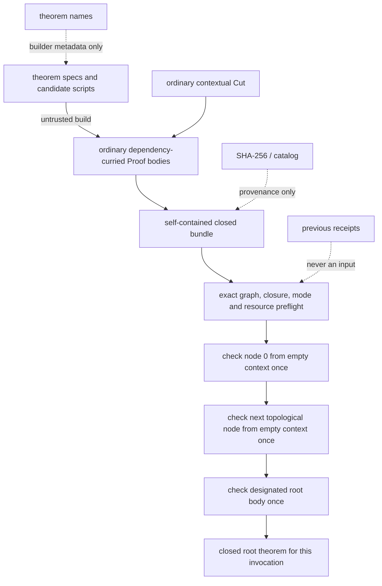

# Self-contained closed-proof DAG / `ClosedCut` design

## Status and decision

This note specifies a **fallback candidate architecture**, not a deployed
proof rule.  The preferred first experiment is now the
[layered ordinary `Cut` bundle](layered-cut-bundle.md), which removes recursive
dependency duplication while producing one existing `Proof` accepted by the
unchanged kernel.  A new trusted closed-DAG judgment should be considered only
if that layered certificate fails measured object, formula, memory, depth, or
Pyodide gates.

The production proof grammar, kernel checker, contextual `Cut`, tactics, and
theorem registry are unchanged.  A small executable prototype lives at
`peano-lab/py/peano_lab/experimental/closed_proof_dag.py`; its receipts have no
production theorem authority.

The recommended design is a finite, self-contained bundle of ordinary
dependency-curried proof bodies.  Every body is submitted exactly once to the
existing Peano Lab kernel from the empty context.  Bundle-local integer edges
may then reuse an already established *closed* conclusion.  No external
theorem table, theorem name, content hash, Python object identity, or previous
checker invocation is an admissible premise.

This is the next architecture to evaluate only if the final layered
quadratic-reciprocity certificate exceeds the current reviewed limits.  It is
not a reason to skip the current body, layered closure, mutation, and capacity
gates.

## Why another representation may be needed

The trusted contextual sharing node is currently

$$
\frac{\Gamma\vdash p:A\qquad A,\Gamma\vdash q:B}
     {\Gamma\vdash\operatorname{Cut}(A,B,p,q):B}.
$$

It prevents substitution of a lemma proof into every hypothesis occurrence
inside one body.  It does not provide global sharing: if the same closed
dependency appears in several nested `Cut` branches, the current checker
follows and rechecks every incoming edge.  Python object identity can reduce
allocation, but it grants no logical authority and does not reduce the
structural work performed by the kernel.

Quadratic reciprocity composes long Wilson/Fermat, Euler, Gauss, finite-sum,
and Eisenstein routes.  Their dependency-curried bodies are individually
small enough to check, while repeated recursive closure may be much larger.
The correct optimization boundary is therefore the already modular closed
theorem graph, not a larger unchecked cache.

## Bundle representation

A bundle has one logic mode, a finite collection of nodes, and one root:

```text
ClosedBundle(
  classical : Bool,
  nodes     : [ClosedNode],
  root      : LocalId
)

ClosedNode(
  id           : LocalId,
  target       : closed PA formula,
  dependencies : [LocalId],       # ordered, distinct
  body         : ordinary Proof   # no ClosedRef proof constructor
)
```

If node $i$ lists dependencies $d_1,\ldots,d_k$, with targets
$A_{d_1},\ldots,A_{d_k}$, its ordinary body must prove

$$
C_i = A_{d_1}\to\cdots\to A_{d_k}\to A_i
$$

from the empty context.  Dependency order is part of the checked statement;
reordering edges without changing the proof normally makes the kernel reject
the node.

`LocalId` is a non-negative integer meaningful only inside this bundle.  It
is not a theorem name, database key, proof digest, capability, or persistent
declaration identifier.  Arbitrary record order is permitted; the checker
derives a deterministic topological order and rejects duplicate IDs,
duplicate edges, dangling references, and cycles.

The root is accepted only when its stored target is structurally identical to
the target supplied by the caller.  All node targets and the caller target
must be exact, syntactically closed PA formulas.  A bare de Bruijn variable
outside a matching `Forall` or `Exists` is rejected before proof checking.

## The `ClosedCut` judgment

It is useful to name the bundle-level composition step `ClosedCut`, but v1
does **not** add a `ClosedCut` constructor to ordinary `Proof` values.  Let
$\Delta$ be the table of nodes established earlier in the same bundle call.
The rule is

$$
\frac{
  \operatorname{check}_m(\varnothing,\pi,
    A_1\to\cdots\to A_k\to B)
  \qquad
  \Delta[r_j]=A_j\ \text{and}\ \Delta\vdash_m r_j:A_j\ (1\le j\le k)
}{
  \Delta\vdash_m
    \operatorname{ClosedCut}(r_1,\ldots,r_k;\pi):B
}.
$$

Here $m$ is the single intuitionistic or classical mode stored in the bundle.
The implementation performs exactly one top-level existing-kernel call

```python
check((), body, dependency_1 -> ... -> dependency_k -> target)
```

per node.  It never calls the existing checker with dependency formulas in
the context.

An ordinary contextual `Cut` may still occur *inside* `body`; its grammar and
checking rule are unchanged.  `ClosedCut` is restricted to conclusions already
proved from the empty context.  Generalizing it to contextual nodes would
require context identity, weakening, shifting, and de Bruijn-environment
checks and is explicitly outside this design.

## Soundness argument

Assume the existing kernel judgment is sound.  Order the finite acyclic graph
topologically.  We prove by induction over that order that every accepted node
target is derivable from the empty context in the selected logic mode.

- For a leaf $i$, the kernel checks $\pi_i:A_i$ from the empty context, so
  $\vdash A_i$ directly.
- For a non-leaf $i$, the kernel checks
  $\pi_i:A_{d_1}\to\cdots\to A_{d_k}\to A_i$ from the empty context.  By the
  induction hypothesis, every $A_{d_j}$ is derivable from the empty context.
  Repeated ordinary implication elimination yields $\vdash A_i$.
- The checked root annotation equals the caller's target, so the requested
  target is derivable.

This adds proof sharing, not a mathematical axiom.  It is conservatively
erasable in principle: recursively replace every edge by the dependency's
derivation and apply `ImpElim` $k$ times.  That erasure may be exponentially
larger and need not be operationally practical in the current bidirectional
checker, so erasure is an audit argument, not the implementation.

Contraction is harmless here.  Ten incoming edges may use one established
closed theorem ten times, while its body was checked once.  Natural deduction
does not consume a theorem when it is used.

The architecture still enlarges the trusted checking boundary if promoted.
The graph validator, topological scheduler, currying order, resource
preflight, and one-call-per-node loop would all require kernel-level review.
The experimental Python module is not trusted merely because the argument is
sound on paper.

## Authority and content addressing

The complete proof data travel in the same bundle invocation.  In particular:

- a reference is resolved only in the finite node table supplied in that
  bundle;
- a referenced node becomes usable only after its body passed the kernel in
  this invocation;
- a successful receipt is diagnostics, not a certificate that another
  invocation may trust;
- no node is accepted because a name appears in the public library;
- no node is accepted because its SHA-256 appears in a catalog;
- no node is accepted because the same Python object was seen earlier;
- no process-global checked-theorem cache participates in the judgment.

A canonical artifact may have a SHA-256 for WMI transfer verification,
reproducible builds, browser caching, and provenance.  The digest remains
outside the logical rule.  Possessing a known digest without the bytes proves
nothing; possessing bytes with a matching digest still requires complete
bundle checking.  An implementation must not introduce a shortcut such as
`if digest in approved_hashes: accept`.

Within one successful call, the checker records established *local IDs* so it
does not recheck a node reached by another edge.  This table is safe because
its entries arise only after the corresponding empty-context kernel call.
It is destroyed with the invocation and cannot be populated by an external
receipt.

## Fail-closed graph and mutation policy

Graph validation finishes before any body is submitted to the recursive
kernel.  The public boundary returns failure rather than a partial table.

| Mutation or malformed input | Required result |
|---|---|
| change a body | kernel rechecks the changed body; reject unless it genuinely proves the annotated curried target |
| change a node target | changes that node's checked target and every dependent premise; reject on a mismatch |
| change, reorder, add, or remove an edge | changes the exact curried target; reject on a mismatch |
| point an edge at a missing ID | reject as a dangling reference before kernel work |
| introduce a self-edge or longer cycle | reject when topological sorting leaves nodes unprocessed |
| duplicate an ID | reject before graph construction |
| duplicate an edge | reject as non-canonical rather than silently contract it |
| change the root | recheck exact root-ID and caller-target agreement |
| put a free de Bruijn variable in a target | reject as a non-closed formula |
| use a formula/proof subclass or malformed dataclass | exact grammar checks or the existing kernel reject it |
| place `DNE` in an intuitionistic bundle | the existing intuitionistic checker rejects it |
| flip the whole bundle to classical mode | may accept `DNE`, but the result is explicitly PA+DNE and must never be labeled constructive PA |
| alter or remove a provenance digest | may affect artifact integrity reporting, never logical acceptance |

Mutation testing must cover every direct node body, target, dependency edge,
root, and logic-mode boundary in the final QR bundle.  Sampled mutation is not
sufficient for release admission when the graph is small enough to enumerate.

## Exact prototype resource policy

The isolated prototype enforces the following defaults before checking any
body:

| Resource | Prototype bound |
|---|---:|
| bundle nodes | 4,096 |
| dependencies of one node | 256 |
| dependency edges in the bundle | 65,536 |
| local node ID | integer in $[0,2^{31})$ |
| formula/term occurrences in one target | 100,000 |
| formula/term occurrences across node targets plus requested root target | 500,000 |
| target formula/term depth | 256 |
| structural proof occurrences in one body | 500,000 |
| distinct proof objects in one body | 100,000 |
| proof depth in one body | 256 |
| sum of structural proof occurrences across bodies | 5,000,000 |
| sum of per-body distinct proof-object counts | 500,000 |

Every incoming proof edge is charged by the structural count.  Object counts
are also charged separately for each node body even if an in-memory prototype
aliases one immutable Python object across two records.  This matches the
intended serialized model in which a body is decoded, checked, and released.
Python identity is never a discount across logical nodes.

The 500,000/100,000/256 per-body limits intentionally preserve the current
live-certificate ceilings.  The DAG earns additional *aggregate* headroom by
checking modular bodies one at a time; it does not admit a single larger
recursive proof tree.  The cumulative 5,000,000/500,000 work limits bound a
bundle containing many individually legal bodies.

The prototype currently receives all Python objects in memory, so the total
500,000 per-body-object sum is also its coarse allocation guard.  A production
codec must preflight declared lengths before allocation and enforce, in
addition:

| Serialized/browser boundary | Proposed v1 bound |
|---|---:|
| compressed transport body | 32 MiB |
| canonical decompressed bundle | 64 MiB |
| encoded body record | 16 MiB |
| proof bodies simultaneously decoded | 1 |
| retained successful proof bodies | 0 |
| retained state after each node | target table, graph metadata, established bit only |

The decompressed-size counter must run during decoding; `Content-Length` and a
compressed-size check do not prevent a decompression bomb.  Length-prefixed
records must be rejected before allocating their declared body.  The wire
digest, if present, is checked for transfer integrity and then ignored by the
logical checker.

These are admission limits, not claims about current QR measurements.  If the
canonical QR bundle does not fit, changing a bound requires a new CPython,
WMI, and Pyodide memory profile plus exact-boundary and one-past-boundary
tests.  Silently selecting a larger profile at runtime is forbidden.

The logical checker should not depend on a wall clock.  The browser worker's
existing Stop/restart boundary remains the availability escape hatch.  CI may
impose an external timeout, but a timeout produces no theorem receipt.

## Browser and Pyodide implications

The current browser mounts Python sources into a disposable Pyodide worker.
A naive DAG implementation that first materializes every proof body, keeps
all bodies after checking, or crosses the JS/Python boundary with one enormous
JSON object can use several copies of the artifact and lose the memory benefit.

The production path should instead be two-pass and record-oriented:

1. Read a bounded manifest containing version, mode, root, node IDs, targets,
   ordered edges, body offsets, and declared lengths.
2. Validate exact formula closure, IDs, references, graph acyclicity, root
   target, cumulative lengths, and all resource declarations.
3. Seek or stream bodies in deterministic topological order.
4. Decode one ordinary `Proof`, recompute its metrics rather than trusting the
   manifest, and call the existing kernel once from `()`.
5. Drop that proof body and retain only the node target and an established bit.
6. Post a receipt only after the root and every reachable record succeed.

Unreachable records are rejected.  Otherwise an attacker could hide material
unrelated to the claimed root in a signed or hashed artifact and different
consumers might disagree about its meaning.  Every retained node must lie in
the root's transitive dependency closure.

The Worker remains important: synchronous proof checking must not run on the
UI thread.  Stop/termination discards the decoder, established table, and any
partial receipt.  A cold Pyodide test must use the exact vendored runtime and
worker payload, not a CPython-only proxy.  The release report should record
canonical bytes, peak WASM pages or another reproducible heap proxy, elapsed
time, node/edge/body metrics, and worker responsiveness.

## Migration path

### 1. Preserve modular authoring

Current `TheoremSpec` and QR candidate factories already prove
dependency-curried targets.  Keep those scripts unchanged.  An untrusted
builder maps their human-readable dependency names to deterministic local
integer IDs and emits the complete transitive graph.  Names are discarded
before the trusted bundle boundary.

### 2. Reconstruct existing library nodes modularly

For maximum sharing, do not embed an already recursively closed `Cut`
certificate as every public dependency leaf.  Replay each library script
against its curried target and retain that ordinary modular body.  The bundle
must include the complete transitive closure down to dependency-free bodies.
During transition, a previously closed certificate may be a dependency-free
leaf, but this retains its internal repeated closure and gives less benefit.

### 3. Add a canonical codec outside production admission

Specify exact constructor tags, integer encoding, formula/proof field order,
version, logic mode, and length rules.  Reject unknown fields, duplicate map
keys, non-minimal integers, trailing data, cycles, dangling offsets, and
decompression overflow.  Fuzz decoder and checker boundaries.  The Python
prototype's in-memory dataclasses are not the artifact format.

### 4. Build and test the QR bundle on WMI

Do not run the heavy recursive QR experiment on the laptop.  Build one
content-addressed *provenance* artifact on WMI, then perform cold checks in two
fresh processes.  Record all modular metrics, graph metrics, canonical size,
time, and peak memory.  Perform complete direct mutation over nodes and edges.

### 5. Independent checker review

Implement the finite-graph loop in a small new trusted module importing only
the kernel grammar/checker.  Review it independently of the builder and
codec.  Cross-check small bundles by expanding them to repeated `ImpElim` or
current `Cut` certificates and submitting the expansions to the ordinary
kernel.  Prove or mechanically test deterministic topological order and exact
one-call-per-node behavior.

### 6. Integrate admission explicitly

If approved, the self-contained bundle itself becomes the final certificate
format for DAG-backed entries.  Never store and later trust a Python receipt.
Library `use` must add a dependency to a modular live root; QED packages that
root with the complete reachable closed bundle and performs one fresh bundle
check.  The ordinary `check(ctx, proof, target)` API and contextual `Cut`
continue to work exactly as before for tree certificates.

The UI must label the certificate format and logic mode.  Catalog hashes name
the reproducible artifact but do not authorize it.  A failed, interrupted, or
resource-exhausted bundle check leaves the theorem unregistered.

## Admission gates

Promotion is allowed only after all of the following are green:

1. the paper rule and topological-induction soundness argument receive
   independent review;
2. no production kernel/proof/tactic behavior changes accidentally;
3. exact constructor, formula-closure, mode, root-target, cycle, dangling,
   duplicate-ID, duplicate-edge, and malformed-object tests pass;
4. every direct final-bundle body, target, and dependency edge receives a
   rejecting mutation test unless the mutation genuinely proves the new
   annotation;
5. each node causes exactly one empty-context kernel invocation, including
   nodes with many incoming edges;
6. exact-boundary and one-past-boundary tests cover every numeric resource
   dimension transactionally;
7. a canonical codec passes truncation, trailing-data, integer, length,
   decompression-bomb, and fuzz tests;
8. two cold CPython checks and the WMI high-memory check agree on the root,
   graph, mode, and deterministic metrics;
9. a cold, exact-version Pyodide Worker check stays within the reviewed byte
   and memory policy and Stop reliably discards partial state;
10. small-bundle conservative expansions check in the ordinary kernel;
11. the exact code-free quadratic-reciprocity surface, not merely a
    dependency-curried body, is the designated root;
12. Book, vault, memory, journal, catalog, and artifact documentation clearly
    distinguish body validation, bundle validation, admission, and provenance.

If any gate fails, retain the current modular candidate evidence and either
reduce the dependency graph or stop at the existing certificate architecture.
Neither a larger unchecked cache nor theorem-name/hash trust is an acceptable
fallback.

## Prototype evidence

The focused test is

```console
cd peano-lab/py
python3 -m pytest -q tests/test_closed_proof_dag_experiment.py
```

It covers empty-context call counting, record reordering, body/edge/target
mutation, root mismatch, cycles, dangling references, duplicate IDs and edges,
free variables, formula subclasses, intuitionistic/classical separation,
exact resource boundaries, preflight-before-check behavior, and the fact that
the diagnostic receipt is rejected by the production kernel.

Passing that test establishes only that the prototype implements this small
design on the fixtures.  It does not admit QR, register a theorem, validate a
serialized artifact, or complete a browser/WMI gate.

## Relationship map



Related notes: [proof-sharing design](proof-sharing-design.md),
[QR capacity](quadratic-reciprocity-capacity.md), and
[WMI QR replay](wmi-qr-replay.md).
