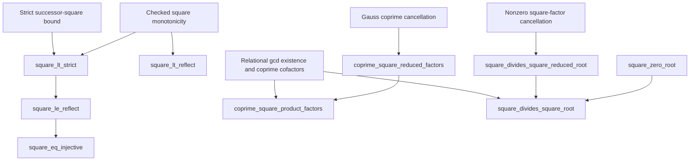

# Constructive natural square factors

This candidate adds nine ordinary Heyting-arithmetic proofs over the sealed
Alpha v25 dependency library. It changes no kernel rule, axiom, existing
definition, or historical release evidence. Dependency-curried body replay is
an authoring check; promotion additionally requires closing and independently
checking the complete dependency bundle.

## Statements and definition structure

The existing conservative definitions are reused:

```text
Div(d,n)       := exists q. n = d*q
Coprime(a,b)  := forall d. Div(d,a) -> Div(d,b) -> d=1
IsGCD(g,a,b)  := Div(g,a) /\ Div(g,b) /\
                 forall d. Div(d,a) -> Div(d,b) -> Div(d,g)
```

Every readable occurrence expands to first-order arithmetic before the
original kernel sees a statement. The candidate introduces no new predicate
or notation whose definition could hide a premise. In particular the public
factor-extraction endpoint is exactly:

```text
coprime_square_product_factors:
  forall a b z. Coprime(a,b) -> a*b=z*z ->
    exists u v. a=u*u /\ b=v*v

square_divides_square_root:
  forall a b. Div(a*a,b*b) -> Div(a,b)

square_eq_injective:
  forall a b. a*a=b*b -> a=b
```

All three include zero without a side condition. The other rows expose strict
monotonicity, weak/strict order reflection, the zero-square boundary, and the
two reduced-cofactor implications actually used by the main proofs.

Definition expansion edges (`Div` into `Coprime` and `IsGCD`) are distinct from
proof dependency edges. The proof DAG is:



## Constructive square-product algorithm

When `z=0`, zero-product elimination and coprimality give exactly the boundary
pairs `(a,b)=(0,1)` or `(1,0)`, with root witnesses `(0,1)` or `(1,0)`.

When `z` is nonzero, construct `g=gcd(a,z)`, and obtain exact cofactors
`a=g*A`, `z=g*Z`, with `Coprime(A,Z)`. Cancellation in `a*b=z*z` yields
`A*b=g*Z²`. Gauss cancellation using `Coprime(Z²,A)` produces a witness `k`
with `b=Z²*k`. Cancelling the nonzero square `Z²` gives `g=A*k`, hence
`a=k*A²` and `b=k*Z²`. Original coprimality forces the actual common divisor
`k` to be one. The constructed root pair is therefore `(A,Z)`.

This proof uses no prime-factorization traversal and no unbounded search for
a square root. It reuses the certified Euclidean algorithm through its
relational specification.

## Constructive square divisibility

For `a=0`, the premise gives `b²=0`, hence `b=0`, and the quotient zero is a
witness. Otherwise choose `g=gcd(a,b)`, `a=g*A`, `b=g*B`, and cancel `g²` from
`b²=a²*q`. The result is `B²=A²*q`. Coprimality of `A,B²` forces `A=1` because
`A` divides both of those values. Thus `a=g` and `b=a*B`, with the original
gcd cofactor as quotient witness. Specializing `a=d*d` immediately yields
the `d⁴ | z² -> d² | z` normalization step needed for Fermat descent.

## Verification boundary

The focused suite checks all nine bodies in the original kernel, all exact
statement fingerprints, all 48 direct dependencies by independently removing
each edge, rejection of forged false conclusions and truncated bodies, the
absence of hidden nonzero assumptions, and small constructive witness
examples including zero. Numerical examples are regression tests, not proof
evidence. The complete candidate uses 408 tactic commands and 931 structural
body-proof nodes, with maximum body depth 45.

Core statement fingerprints:

- `coprime_square_product_factors`:
  `f23a9cdd943c2643d3c3c3b208b34d731715b3e316add8b4a430ec06f8361dca`
- `square_divides_square_root`:
  `b6a82134f1758f33b30be0b733f4910c784805f0ee871400b9e4e0cc4e982b0f`
- `square_eq_injective`:
  `0c01cdf647c9957d5522adf164644cab008de48ff22e5c18478d49c012ceaa60`
