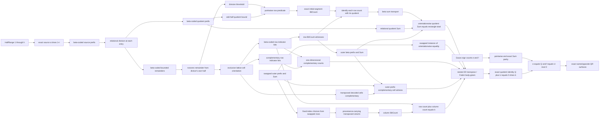

# Native quotient/remainder prefixes for Eisenstein sums

Status: isolated candidate bodies pass the dependency-curried kernel preflight.
They are not recursively closed, WMI-reviewed, registered, or admitted.

Eisenstein's proof needs finite sequences of quotients such as the natural
number represented informally by $\lfloor ai/p\rfloor$. Peano Lab's native
language has neither a division function nor lists, so the candidate source
[`finite_division_prefix_candidate.py`](../../peano-lab/py/peano_lab/library/finite_division_prefix_candidate.py)
uses the existing relational division theorem and Gödel-beta prefixes.

## Relation

For a source prefix `BetaAt(b,c,i,x)`, `DivisionPrefix` asserts that every
`i<l` has aligned quotient and remainder entries
`BetaAt(qb,qc,i,q)` and `BetaAt(rb,rc,i,r)` satisfying

\[
x=pq+r, \qquad r<p.
\]

The public-looking helper is only a hygienic formula producer. Before kernel
checking it expands to `0`, `S`, `+`, `*`, equality, intuitionistic logic and
ordinary first-order quantifiers. It adds no `/`, `%`, floor, sequence, or
choice primitive.

## Candidate ladder

| Candidate | Role | Dependencies | Commands | Nodes/depth |
|---|---|---|---:|---:|
| `beta_division_prefix_extend` | append one relational quotient/remainder pair while preserving all earlier decoded positions | `beta_prefix_extend`, `finite_lt_succ_eq_or_lt` | 94 | `132/41` |
| `beta_division_prefix_exists` | encode quotients and bounded remainders for every entry of any finite beta source when `p != 0` | `add_eq_zero_right`, `succ_ne_zero`, `beta_at_exists`, `division_remainder_exists`, preceding extension | 62 | `71/30` |

The follow-on source
[`eisenstein_scaled_division_candidate.py`](../../peano-lab/py/peano_lab/library/eisenstein_scaled_division_candidate.py)
now specializes the generic trace without pretending modular representatives
are exact products:

| Candidate | Role | Nodes/depth |
|---|---|---:|
| `beta_scaled_successor_prefix_from_pointwise` | combine `Repeat(a)`, the canonical half range and pointwise multiplication to decode exactly `a*(1+i)` | `34/24` |
| `prime_scaled_half_division_prefix_exists` | construct the exact scaled source and its aligned quotient/remainder prefixes for `p=2h+1` | `71/40` |
| `prime_scaled_half_quotient_sum_exists` | attach a native relational `Sum` witness to the quotient prefix | `52/28` |

Their focused capped audit passes `4/4` in 0.68 seconds. The exact-value bridge
is important: the existing Fermat scaling layer proves modular congruence, but
Eisenstein floors require literal natural-number equations.

The first quotient-to-row arithmetic bridge is body-green in
[`eisenstein_division_threshold_candidate.py`](../../peano-lab/py/peano_lab/library/eisenstein_division_threshold_candidate.py).
In readable notation it proves constructively

\[
n=pq+r\;\land\;r\ne0\;\land\;r<p
\quad\Longrightarrow\quad
\bigl(p(j+1)<n\;\Longleftrightarrow\;j+1\le q\bigr).
\]

The actual contract expands both order relations to additive witnesses. The
single body has `92` nodes, depth `30`, and `67` tactic commands. Its exact
focused audit passes `4/4` in 0.30 seconds under the 60-second CPU cap and
contains no `DNE`. This is dependency-curried body evidence only: the theorem
is not recursively closed, registered, admitted, or yet attached to a decoded
division-prefix entry.

The required nonzero-remainder bridge is now body-green in
[`eisenstein_remainder_nonzero_candidate.py`](../../peano-lab/py/peano_lab/library/eisenstein_remainder_nonzero_candidate.py):

| Candidate | Exact role | Nodes/depth |
|---|---|---:|
| `prime_nondivisor_bounded_scaled_remainder_nonzero` | from `Prime(p)`, `p` not dividing `q`, `S i<p`, and `q*S i=p*d+r`, derive `r!=0` | `47/21` |
| `distinct_primes_bounded_scaled_remainder_nonzero` | derive the nondivisibility premise from distinct primality | `45/24` |
| `distinct_primes_own_odd_half_scaled_remainder_nonzero` | derive `S i<p` from `p=2*k+1` and `i<k` | `45/28` |

No remainder bound such as `r<p` is used by any of these three results. The
focused exact-contract audit passes `4/4` in 0.40 seconds, checks registry
isolation, and finds no `DNE`. These are still dependency-curried body-only
candidates: they are not recursively closed, registered, or admitted.

The half bound must belong to the divisor. The superficially tempting
cross-half claim with `p=2*k+1`, `q=2*h+1`, and only `i<h` is false. Take
`p=3`, `k=1`, `q=7`, `h=3`, and `i=2`; then

\[
q(Si)=7\cdot3=3\cdot7+0,
\]

so the remainder is zero despite distinct primality. The corrected wrapper
uses `i<k`, hence bounds `S i` by the half belonging to `p`.

The companion quotient bound is also body-green in
[`eisenstein_quotient_bound_candidate.py`](../../peano-lab/py/peano_lab/library/eisenstein_quotient_bound_candidate.py):

| Candidate | Exact role | Nodes/depth | Commands |
|---|---|---:|---:|
| `odd_half_cross_product_gap` | prove $(2k+1)h<(2h+1)(k+1)$ with an explicit natural-number gap | `160/45` | `13` |
| `odd_half_division_quotient_bounded` | from `p=2*h+1`, `q=2*k+1`, `i<h`, and `q*S i=p*d+r`, derive `d<=k` | `67/29` | `62` |

Neither primality nor any remainder condition is needed for this quotient
bound. Together with the corrected remainder-nonzero suite, the focused
audit passes `8/8` in 0.54 seconds. The
[`focused quotient-bound test`](../../peano-lab/py/tests/test_eisenstein_quotient_bound_candidate.py)
checks the expanded contracts, exact receipts, registry isolation, and
absence of `DNE`; these two theorems remain dependency-curried,
unregistered, and unadmitted.

The formerly missing generic count evaluation is now body-green in
[`eisenstein_initial_segment_count_candidate.py`](../../peano-lab/py/peano_lab/library/eisenstein_initial_segment_count_candidate.py).
For a threshold `q`, it constructs a beta-coded bit prefix whose entry at
zero-based index `j` is `1` exactly when `S j<=q` and `0` when `q<S j`.
When `q<=k`, its native relational `BitCount` is exactly `q`.

| Candidate | Role | Nodes/depth | Commands |
|---|---|---:|---:|
| `eisenstein_initial_segment_indicator_choice` | choose the exact threshold bit constructively | `23/12` | `15` |
| `eisenstein_initial_segment_prefix_extend` | append one threshold bit | `63/25` | `46` |
| `eisenstein_initial_segment_prefix_exists` | construct every finite threshold prefix | `40/19` | `33` |
| `eisenstein_initial_segment_prefix_all_bits` | project the semantic prefix to `AllBits` | `25/14` | `23` |
| `eisenstein_initial_segment_decoded_choice` | recover exact threshold semantics from a decoded bit | `41/21` | `27` |
| `beta_all_one_bit_count_exact` | count an all-one beta prefix exactly | `91/28` | `62` |
| `eisenstein_initial_segment_bit_count_functional` | prove any count of a bounded threshold prefix equals its threshold | `160/37` | `129` |
| `eisenstein_initial_segment_bit_count_exact` | package `BitCount(b,c,k,q)` from the prefix and `q<=k` | `49/21` | `33` |

The [`focused initial-segment test`](../../peano-lab/py/tests/test_eisenstein_initial_segment_count_candidate.py)
passes `11/11` in 2.09 seconds and pins all eight statements and receipts.
Every body is constructive, dependency-curried, isolated from the public
registry, and neither recursively closed nor admitted.

The Eisenstein-specific pointwise identification is now body-green in
[`eisenstein_row_quotient_candidate.py`](../../peano-lab/py/peano_lab/library/eisenstein_row_quotient_candidate.py):

| Candidate | Exact bridge | Dependencies | Nodes/depth | Commands |
|---|---|---:|---:|---:|
| `eisenstein_row_indicator_prefix_to_initial_segment` | turn the nonzero-remainder threshold semantics into the exact initial-segment relation | `2` | `78/36` | `55` |
| `distinct_odd_prime_row_bit_count_equals_division_quotient` | combine own-half nonvanishing, the quotient bound and exact initial-segment count | `5` | `95/45` | `79` |
| `distinct_odd_prime_row_bit_count_equals_decoded_quotient` | identify the row count with the quotient decoded by the aligned division prefix | `4` | `111/55` | `96` |
| `distinct_odd_prime_semantic_row_equals_decoded_quotient` | specialize the equality to an existing outer semantic row witness | `1` | `119/72` | `53` |

The [`focused test`](../../peano-lab/py/tests/test_eisenstein_row_quotient_candidate.py)
passes `4/4` in 3.40 seconds; the candidate plus its explicit prerequisite
stack passes `27/27` in 5.86 seconds. The bodies contain no `DNE`, `auto`, or
`ring`, and remain unregistered and unadmitted. This closes pointwise
row-count identification, not equality of the two outer sums.

The reusable outer-fold bridge is body-green too. In
[`finite_sum_transport_candidate.py`](../../peano-lab/py/peano_lab/library/finite_sum_transport_candidate.py),
`beta_sum_transport_prefix` proves that pointwise-equal decoded beta prefixes
have the same exact relational `Sum` by reusing the original partial-sum
trace. It has no theorem dependencies, `59` nodes at depth `29`, `59` proof
objects, `58` edges, no reuse, and `44` commands. Its
[`focused test`](../../peano-lab/py/tests/test_finite_sum_transport_candidate.py)
passes `3/3`; combined with the initial-segment suite, the audit passes
`14/14` in 2.20 seconds. It contains no `DNE`, never equates raw beta codes,
and remains unregistered and unadmitted.

The concrete outer transport is now body-green in
[`eisenstein_outer_sum_bridge_candidate.py`](../../peano-lab/py/peano_lab/library/eisenstein_outer_sum_bridge_candidate.py):

| Candidate | Role | Dependencies | Nodes/depth | Commands |
|---|---|---:|---:|---:|
| `distinct_odd_prime_quotient_entry_matches_rectangle` | match each decoded quotient entry to the corresponding semantic outer row count | `1` | `104/52` | `58` |
| `distinct_odd_prime_quotient_sum_transports_to_rectangle` | instantiate exact beta-sum transport from the quotient prefix to the outer row-count prefix | `2` | `73/54` | `61` |
| `distinct_odd_prime_quotient_sum_equals_rectangle_total` | use `Sum` functionality to identify the two exposed endpoints | `2` | `67/51` | `56` |

The [`focused test`](../../peano-lab/py/tests/test_eisenstein_outer_sum_bridge_candidate.py)
passes `4/4` in 4.92 seconds, and the bridge with its related prerequisite
stack passes `19/19` in 10.71 seconds. No body uses `DNE`, `auto`, or `ring`;
all three remain unregistered and unadmitted. This closes quotient
`Sum` = semantic rectangle total for the first orientation. Because the
contracts quantify uniformly over `p,q,h,k`, the same bridge applies after
swapping `p,q` and `h,k`.

The generic one-dimensional partition count is now body-green in
[`finite_bitcount_complement_candidate.py`](../../peano-lab/py/peano_lab/library/finite_bitcount_complement_candidate.py).
`complementary_bit_counts_add_length` says that two length-`l` bit prefixes
whose decoded entries are pointwise exactly `(0,1)` or `(1,0)` have counts
`n,m` satisfying `n+m=l`. Its dependencies are `bit_count_zero`,
`bit_count_succ_decompose`, `le_succ`, `le_refl`, and `add_succ_left`. The
112-command body has `220` nodes at depth `46`, `211` objects, `219` edges,
and `9` reused objects. The
[`focused test`](../../peano-lab/py/tests/test_finite_bitcount_complement_candidate.py)
passes `3/3` in 1.47 seconds with no `DNE`; the candidate remains unregistered
and unadmitted.

This theorem closes the arithmetic of one matched row of complementary bits.
It does not itself align a row-major outer prefix with the column-major
transposed prefix, exchange nested `Sum` folds, or prove the rectangle-level
Fubini identity required by Eisenstein's argument.

Two transposed-cell exposure candidates are body-green:

| Candidate | Role | Dependencies | Nodes/depth | Commands |
|---|---|---:|---:|---:|
| `eisenstein_transposed_decoded_cell_bits_complementary` | show that decoded `(i,j)` and swapped `(j,i)` row bits are exactly `(0,1)` or `(1,0)` | `1` | `95/33` | `71` |
| `eisenstein_transposed_outer_prefix_cell_witness` | open the existential inner rows from two outer prefixes and package complementary decoded cell bits | `3` | `116/58` | `101` |

Their combined focused audit passes `6/6` in 2.08 seconds. The sources are
[`eisenstein_transposed_cell_candidate.py`](../../peano-lab/py/peano_lab/library/eisenstein_transposed_cell_candidate.py)
and
[`eisenstein_transposed_outer_cell_candidate.py`](../../peano-lab/py/peano_lab/library/eisenstein_transposed_outer_cell_candidate.py),
with focused tests
[`test_eisenstein_transposed_cell_candidate.py`](../../peano-lab/py/tests/test_eisenstein_transposed_cell_candidate.py)
and
[`test_eisenstein_transposed_outer_cell_candidate.py`](../../peano-lab/py/tests/test_eisenstein_transposed_outer_cell_candidate.py).
Both proofs are constructive, contain no `DNE`, and remain unregistered and
unadmitted.

The next six bodies construct whole provenance-carrying transposed columns:

| Candidate | Exact role | Dependencies | Commands | Nodes/depth | Objects/edges/reused |
|---|---|---:|---:|---:|---:|
| `eisenstein_transposed_outer_column_choices` | choose one fixed-index cell from every swapped row | `2` | `37` | `42/26` | `42/41/0` |
| `eisenstein_transposed_column_prefix_extend` | append one semantic column entry | `2` | `55` | `80/31` | `80/79/0` |
| `eisenstein_transposed_column_prefix_exists` | encode all `k` entries | `5` | `56` | `64/29` | `64/63/0` |
| `eisenstein_transposed_column_prefix_all_bits` | derive `AllBits` for the column | `1` | `48` | `56/33` | `56/55/0` |
| `eisenstein_transposed_column_pointwise_complement` | align original row and constructed column bits | `2` | `64` | `87/47` | `87/86/0` |
| `eisenstein_row_transposed_column_count_partition` | produce a column count `m` and prove `n+m=k` | `6` | `105` | `117/56` | `117/116/0` |

For every `j<k`, the constructed column entry owns four layers of evidence:
the decoded entry of the swapped outer count prefix; an existential inner row
code and scale satisfying the swapped row semantics; that row's `BitCount`
witness; and the decoded inner cell at the fixed `i<h`. This provenance is
preserved by extension and is part of the final column relation. It prevents
a bare beta prefix, unrelated to the rectangle, from satisfying the client
contract.

The endpoint begins with uniformly quantified
`p,q,h,k,i,rb,rc,bb,bc,n`. Given the original semantic row and its
`BitCount n`, the swapped semantic outer prefix, and `i<h`, it constructs
`z,e,m` such that the provenance-carrying column prefix holds through length
`k`, `BitCount(z,e,k,m)` holds, and

\[
n+m=k.
\]

The
[`source`](../../peano-lab/py/peano_lab/library/eisenstein_transposed_column_candidate.py)
and
[`focused test`](../../peano-lab/py/tests/test_eisenstein_transposed_column_candidate.py)
pass `5/5` in 5.05 seconds under the strict 60-second cap. The audit pins
names, dependencies, statement hashes and all receipts; checks hygienic,
fully expanded native PA; and rejects `auto`, `ring`, `DNE`, `by_contra`,
`classical`, and `sorry`. All six are dependency-curried body evidence only:
they are unregistered, unadmitted, and not recursively WMI-closed.

The arithmetic cell boundary is also body-green in
[`eisenstein_lattice_orientation_candidate.py`](../../peano-lab/py/peano_lab/library/eisenstein_lattice_orientation_candidate.py):

| Candidate | Role | Nodes/depth |
|---|---|---:|
| `distinct_odd_prime_half_products_ne` | rule out `q*(1+i)=p*(1+j)` by Euclid's lemma, prime rigidity and half bounds | `72/30` |
| `distinct_odd_prime_half_cell_oriented` | constructively choose exactly one strict orientation | `77/34` |
| `distinct_odd_prime_half_rectangle_oriented` | package the result for every cell of the `h` by `k` rectangle | `53/34` |

Its focused capped audit passes `4/4` in 0.54 seconds. No rational slope or
classical trichotomy is added: the conclusion is expanded witness-defined
natural order.

The concrete one-row representation is now implemented in
[`eisenstein_row_indicator_candidate.py`](../../peano-lab/py/peano_lab/library/eisenstein_row_indicator_candidate.py).
For fixed `i`, one beta prefix runs over `j<k`; bit `1` means exactly
`p*(S j) < q*(S i)`, while bit `0` carries the exclusive opposite orientation.
This avoids a primitive pair encoder or flattened matrix.

| Candidate | Role | Nodes/depth |
|---|---|---:|
| `distinct_odd_prime_half_cell_indicator_choice` | turn the exclusive cell orientation into a semantic zero/one choice | `46/29` |
| `eisenstein_row_indicator_prefix_extend` | append a bit while preserving all prior cell semantics | `71/27` |
| `eisenstein_row_indicator_prefix_exists` | construct a row prefix by ordinary induction | `58/23` |
| `distinct_odd_prime_half_row_indicator_choices` | provide choices for every `j<k` at fixed `i<h` | `53/34` |
| `eisenstein_row_indicator_prefix_all_bits` | project the semantic row to `AllBits` | `27/16` |
| `eisenstein_row_indicator_decoded_choice` | recover exact orientation semantics for any decoded bit | `43/23` |
| `distinct_odd_prime_half_row_count_exists` | attach the native relational `BitCount` witness | `63/29` |

The focused audit passes `4/4` in 1.11 seconds.

The outer rectangle-count representation is now implemented in
[`eisenstein_rectangle_count_candidate.py`](../../peano-lab/py/peano_lab/library/eisenstein_rectangle_count_candidate.py).
It uses a second beta prefix over `i<h`. Each decoded outer entry is a natural
row count together with an existential inner row code, the exact semantic row
indicator, and its `BitCount` witness. Raw equality of inner or outer beta
codes is never treated as semantic equality.

| Candidate | Role | Nodes/depth |
|---|---|---:|
| `distinct_odd_prime_half_row_count_choice` | reorganize the fixed-row package as one semantic row-count choice | `39/25` |
| `eisenstein_rectangle_row_count_prefix_extend` | append one row count while preserving earlier semantic entries | `71/27` |
| `eisenstein_rectangle_row_count_prefix_exists` | construct an outer prefix by ordinary induction | `58/23` |
| `distinct_odd_prime_half_row_count_choices_bounded` | obtain choices for every `i<l` when `l<=h` | `40/27` |
| `distinct_odd_prime_half_row_count_prefix_exists_bounded` | encode every bounded initial set of rows | `37/26` |
| `distinct_odd_prime_half_row_count_prefix_exists` | specialize the construction to all `h` rows | `30/23` |
| `eisenstein_rectangle_decoded_row_count` | recover the inner row and `BitCount` semantics of any decoded outer entry | `43/23` |
| `distinct_odd_prime_half_rectangle_total_exists` | attach `beta_sum_exists` and package the native total of all row counts | `40/22` |

The exact-contract audit for these eight bodies passes `4/4` in 2.22 seconds
under the 60-second CPU cap. This proves existence of a native nested
rectangle total only at the dependency-curried candidate level. It proves no
equality with either quotient sum or floor sum, closes no dependency
recursively, and admits or registers no theorem.

The focused regression test checks exact contracts and dependencies,
deterministic construction, registry isolation, alpha-hygiene, fully expanded
native syntax and absence of `DNE`. The two original generic
`DivisionPrefix` bodies replay under a strict 60-second process CPU cap
(`4 passed` in 0.80 seconds on the recorded laptop run); the separate timings
above apply to the later row and rectangle suites.

## Exact remaining boundary

The generic theorem alone does not fix a source, but the scaled follow-on now
constructs exact entries `a*(1+i)` and a quotient `Sum`. Cell orientation,
semantic row indicators, nested row counts, their outer `Sum`, and the generic
division threshold, the corrected own-half nonzero-remainder bridge, the
odd-half quotient bound, exact initial-segment `BitCount` evaluation,
pointwise semantic-row/decoded-quotient identification, generic beta-sum
transport, orientationwise quotient-sum/rectangle-total equality,
one-dimensional complement counting, transposed decoded-cell complementarity,
outer-prefix cell exposure, provenance-carrying transposed-column
construction, and the exact `row_count+column_count=k` endpoint are also
body-green.

Any later instantiation must preserve the corrected orientation: the index in
`q*(S i)` must be bounded by the half of the divisor `p`. Merely bounding it
by the half of `q` cannot discharge nonvanishing, as the concrete
`p=3,q=7,i=2` counterexample shows.

The Eisenstein-specific pointwise identification, exact outer beta-sum
transport, and endpoint equality are now complete at the body-green candidate
level. Uniform quantification makes the same quotient-sum/rectangle-total
bridge available for the swapped orientation. The transposed-cell and outer
cell-witness candidates additionally expose, for every bounded `(i,j)`, the
two decoded bits at `(i,j)` and `(j,i)` and prove that they are complementary.

The six transposed-column bodies now package all swapped cells at one fixed
`i<h`, preserve their complete nested provenance, attach a native column
`BitCount m`, and prove the exact local partition `n+m=k` against the
original row count `n`.

That formerly open boundary is now body-green. The nine-body Fubini follow-on
constructs the outer prefix of column counts, transports its provenance as the
induction width changes, sums the local `row_count_i+column_count_i=k`
equations, and identifies the column sum extensionally with the swapped outer
total. Its universal body is `264/65` nodes/depth; the semantic endpoint
`eisenstein_rectangle_floor_sum_identity` is `65/37`.

`distinct_odd_prime_eisenstein_quotient_sum_identity` then applies the
orientationwise quotient/rectangle bridges in both directions and eliminates
the two semantic totals, preserving every source, division, row-count and
`Sum` parameter while proving

\[
  Q+U=h k.
\]

Its direct receipt is 3 dependencies, 123 commands, 145 nodes and depth 68.
No equality of raw beta codes replaces decoded-entry functionality.

The parity client is body-green too. Exact finite-sum permutation transports
the Gauss magnitude prefix to the canonical half sum; the pointwise theorem
`gauss_eisenstein_prefix_pointwise_mod_two` (`250/61`, statement hash prefix
`84b039`) folds into `gauss_eisenstein_sign_count_mod_quotient_sum`, which
retains all beta-code parameters and proves `Q congruent e (mod 2)`. The
pointwise and terminal-sum suites pass `12/12` in 17.47 seconds.

Finally, the one-orientation package has receipt `5/102/139/67`, and the
two-prime package exposing `e,f,Q,U`, both Gauss classifications, both parity
congruences, and `Q+U=h*k` has `4/150/222/77`, in
dependencies/commands/nodes/depth order. The exact same/opposite/combined QR
bodies are `2/46/73/33`, `2/46/73/33`, and `3/65/113/35`; downstream
integration passes `20/20` in 27.25 seconds. The combined body constructs the
two-prime data once and calls both conditional clients directly.

The mathematical dependency spine is therefore body-green. Recursive WMI
closure, profiling, mutation tests and a distinct receipt-pinned admission
replay remain; every candidate named here is unregistered and unadmitted.
