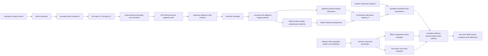

# Euler scaled-inverse entrance ladder

Status: **pointwise, full-prefix, terminal PairOrder iteration, both bounded
endpoints, the complete bounded Euler equivalence, and its arbitrary-
representative transport candidate scripts are complete; WMI validation
pending; not admitted**.

This note fixes the first constructive entrance to Euler's criterion.  It is
deliberately smaller than a finite-prefix pairing theorem.  The domain is the
canonical nonzero residues

\[
  U_p(x) :\Longleftrightarrow x\ne 0 \land x<p,
\]

and the relation is

\[
  I_{p,a}(x,y) :\Longleftrightarrow
  U_p(x)\land U_p(y)\land xy\equiv a\pmod p.
\]

Thus the intended function is \(x\mapsto a x^{-1}\).  All three displayed
relations are authoring notation only.  The candidate source expands them to
equality, `0`, `S`, `+`, `*`, quantifiers, and logical connectives before the
unchanged kernel sees them.

## Implemented pointwise ladder

The isolated source is
[`euler_scaled_inverse_candidate.py`](../../peano-lab/py/peano_lab/library/euler_scaled_inverse_candidate.py).
Its ten dependency-ordered candidates are:

1. `scaled_inverse_from_unit_inverse`: from \(xz\equiv1\), obtain
   \(x(az)\equiv a\).
2. `scaled_inverse_transport_right`: replace the right factor by a congruent
   residue.
3. `prime_scaled_inverse_target_nonzero`: a representative of a nonzero
   bounded target cannot be zero.
4. `prime_scaled_inverse_exists`: take the checked bounded inverse of `x`,
   multiply it by `a`, divide by `p`, and use the canonical remainder.
5. `prime_scaled_inverse_unique`: cancel `x` with checked `prime_mod_cancel`,
   then use bounded-congruence uniqueness.
6. `scaled_inverse_symmetric`: commute the product.
7. `prime_scaled_inverse_involutive`: symmetry plus uniqueness gives
   \(I(x,y)\land I(y,z)\Rightarrow z=x\).
8. `scaled_inverse_fixed_point_iff`: on the bounded unit domain,
   \(I(x,x)\) iff \(x^2\equiv a\pmod p\).
9. `scaled_inverse_no_fixed_of_not_qres`: an explicit `~QRes(p,a)` hypothesis
   rules out every fixed point.
10. `scaled_inverse_qres_or_fixed_free`: checked constructive QRes
    decidability yields either a square witness or a fixed-point-free scaled
    relation.

The scripts use neither DNE nor `ring`.  They do not enter the public theorem
registry and cannot be cited as checked results.

## WMI-only validation boundary

The dedicated five-gate audit is
[`test_euler_scaled_inverse_candidate.py`](../../peano-lab/py/tests/test_euler_scaled_inverse_candidate.py).
It performs, in order:

1. exact deterministic closed expanded-PA contract checks;
2. hygiene, alpha-equivalence, fail-closed helper checks, and a finite semantic
   audit;
3. exact acyclic dependency and registry-isolation checks;
4. `replay_candidate_bodies` under a hard 60-second alarm, followed by two
   independent recursive Cut-closed discovery replays and resource metrics;
5. false-contract rejection and mutation of every direct dependency Cut.

Body metrics are emitted separately from recursively closed discovery metrics.
Neither is an admission receipt.  The suite is wired into the content-addressed
WMI harness as `euler-scaled-inverse`:

```bash
scripts/submit_wmi_qr_replay.sh --test-only --suite euler-scaled-inverse
scripts/submit_wmi_qr_replay.sh --submit \
  --confirm PEANO-QR-WMI-REPLAY --suite euler-scaled-inverse
```

Focused job `173015`, from exact snapshot
`8c9c4ae067b0dc202684e410bee563cd592a67080cb7c9939440ae8b44d4bccd`,
is pending with zero CPU. It has produced no recursive-replay result. A
successful discovery run still requires a separate receipt-pinned admission
decision.

## Finite prefix layer

The isolated follow-on
[`euler_scaled_inverse_prefix_candidate.py`](../../peano-lab/py/peano_lab/library/euler_scaled_inverse_prefix_candidate.py)
now encodes the complete predecessor interval. At zero-based source position
`i`, the decoded actual residue `y` satisfies

\[
0\le i<n,\quad p=Sn,\quad U_p(y),\quad (Si)y\equiv a\pmod p.
\]

| Candidate | Role | Commands | Nodes/depth |
|---|---|---:|---:|
| `prime_scaled_inverse_prefix_extend` | append the unique pointwise witness at source `S l` | 76 | `105/36` |
| `prime_scaled_inverse_prefix_exists_bounded` | ordinary induction for every `l<=n` | 63 | `81/33` |
| `prime_scaled_inverse_prefix_exists` | specialize to all sources `1,...,p-1` | 18 | `40/23` |

The focused audit pins exact contracts, dependencies and hashes; checks helper
hygiene and fully expanded native syntax; verifies registry isolation; and
kernel-checks all three dependency-curried bodies without DNE under a strict
60-second process CPU cap (`4 passed` in 0.76 seconds).



Decoded functionality, symmetry/involution, fixed-point freedom, adjacent
orbit iteration, terminal coverage, successor-lift/product alignment, and the
complete bounded and arbitrary-representative residue/nonresidue equivalences
are now body-green. The remaining Euler boundary is recursive WMI closure,
mutations, and admission. The new bodies are not recursively closed or
admitted.

The first extensional tranche is now implemented in
[`euler_scaled_inverse_prefix_extensional_candidate.py`](../../peano-lab/py/peano_lab/library/euler_scaled_inverse_prefix_extensional_candidate.py):

| Candidate | Role | Nodes/depth |
|---|---|---:|
| `scaled_inverse_prefix_entry_sound` | every decoded value satisfies the stored scaled relation | `58/25` |
| `scaled_inverse_prefix_extensional` | pointwise uniqueness forces every valid mate to be the decoded value | `54/26` |
| `scaled_inverse_prefix_no_fixed_of_not_qres` | a nonresidue prefix has no decoded `S i` fixed point | `36/27` |
| `scaled_inverse_prefix_mate_predecessor` | every positive actual mate is `S j` for a bounded source index `j` | `67/36` |
| `scaled_inverse_prefix_involutive` | decoding at `i` and then at the mate predecessor returns actual residue `S i` | `91/39` |
| `scaled_inverse_prefix_injective` | symmetry plus pointwise scaled-inverse uniqueness separates source indices | `77/36` |

The focused exact-contract/native-syntax/no-DNE audit passes `4/4` in 0.82
seconds. Thus soundness, extensionality and decoded involution are no longer
open. Decoded injectivity is now closed directly; surjectivity can be deferred
unless the pairing consumer needs it. At that checkpoint the remaining finite
boundary was a fixed-point-free adjacent orbit order and its product theorem;
the later sections close both at the body-green level. All receipts remain
dependency-curried.

The product theorem itself is now available generically in
[`euler_pair_product_candidate.py`](../../peano-lab/py/peano_lab/library/euler_pair_product_candidate.py).
`beta_adjacent_target_pairs_product_power` assumes that every adjacent pair in
a beta prefix has product congruent to the same target `a`; from an exact
product of the first `m+m` entries and `Pow(a,m,A)`, it derives product
congruence to `A`. Its dependency-curried body has 118 commands and checks at
`171/47`; the focused exact-contract/native/no-DNE audit passes `4/4` in 1.71
seconds. At that checkpoint the unresolved step was structural rather than
algebraic: reorder the fixed-point-free scaled-inverse prefix into adjacent
orbits while preserving the decoded factors. The iteration layer below now
closes the ordering and coverage part, and the endpoint tranche below closes
successor-lift/product alignment. Recursive closure and admission remain.

## The quadratic-residue branch is independent

The positive branch of Euler's criterion no longer waits for orbit ordering.
The isolated
[`euler_criterion_residue_candidate.py`](../../peano-lab/py/peano_lab/library/euler_criterion_residue_candidate.py)
first proves the reusable implication

\[
 p\ne0\ \land\ a\equiv0\pmod p \quad\Longrightarrow\quad p\mid a.
\]

`mod_eq_zero_to_dvd_nonzero` has a `48/18` dependency-curried body. Given a
quadratic-residue witness `r^2 == a (mod p)`, the second theorem derives
`p` does not divide `r`, constructs relational witnesses for `r^2`,
`(r^2)^h`, and `r^(2h)`, uses `pow_mul_exp`, and applies Fermat at exponent
`p-1=2h`. Modular power transport then gives

\[
 p=2h+1,\quad p\text{ prime},\quad p\nmid a,\quad QRes(p,a),
 \quad Pow(a,h,A) \Longrightarrow A\equiv1\pmod p.
\]

`quadratic_residue_half_power_mod_one` has 136 commands and checks at
`148/39`. The focused exact-contract, native-syntax, registry-isolation and
no-DNE audit passes `4/4` in 2.11 seconds. These are body-only receipts. The
endpoint tranche below now supplies the successor-lift/product bridge, Wilson
comparison, and bounded nonresidue conclusion. The final two sections package
the bounded equivalence and transport it beyond canonical reduced
representatives.

## Correct shifted PairOrder entrance

The scaled map's decoded value at source index `i` is the actual residue
`S j`. Wilson's raw `OrbitClosed` relation expects a zero-based decoded mate
`j`, so importing it unchanged would silently mix representations. The
isolated
[`euler_scaled_pair_order_entrance_candidate.py`](../../peano-lab/py/peano_lab/library/euler_scaled_pair_order_entrance_candidate.py)
instead defines a fully expanded shifted closure using edges
`At(scaled,i,S j)`.

| Candidate | Role | Nodes/depth |
|---|---|---:|
| `scaled_orbit_closed_unused_mate` | omission transfers across a shifted back edge | `34/20` |
| `beta_prefix_append_two_scaled_orbit_closed` | append two sources and preserve shifted closure | `184/40` |
| `scaled_inverse_prefix_choose_omitted_orbit` | choose an omitted, distinct involutive mate pair under `~QRes` | `107/38` |
| `scaled_inverse_pair_order_choose_append` | append that orbit and preserve closure plus order injectivity | `190/52` |

The focused exact-contract, hygiene, expanded-native and certificate-level
no-DNE audit passes `3/3` in 2.78 seconds under the local cap. No Wilson
endpoint exclusions are used: Euler must pair all `n` zero-based sources.
This closes one honest orbit-extension step; no theorem here is recursively
closed or admitted.

## Balanced terminal iteration

The isolated follow-on
[`euler_scaled_pair_order_iteration_candidate.py`](../../peano-lab/py/peano_lab/library/euler_scaled_pair_order_iteration_candidate.py)
iterates that entrance while retaining both shifted closure and an explicit
adjacent history `At(scaled,i,S j)`:

| Candidate | Role | Nodes/depth |
|---|---|---:|
| `scaled_orbit_closed_prefix_zero` | empty shifted closure | `23/19` |
| `adjacent_scaled_orbit_history_zero` | empty adjacent history | `19/15` |
| `adjacent_scaled_orbit_history_append` | preserve old history and record the new scaled edge | `114/31` |
| `scaled_pair_order_state_zero` | empty shifted, bounded, injective state | `49/18` |
| `scaled_inverse_pair_order_paired_state_step` | append one orbit and preserve iterable state/history | `125/40` |
| `euler_pair_iteration_previous_balance` | rebalance stored and remaining pairs | `80/24` |
| `euler_pair_iteration_step_short` | expose the strict-prefix witness for a remaining pair | `40/15` |
| `scaled_inverse_pair_order_paired_iteration` | iterate one adjacent orbit per stored pair | `155/39` |
| `scaled_inverse_pair_order_terminal_package` | specialize balanced iteration to `n=h+h` | `41/25` |
| `scaled_inverse_pair_order_terminal_coverage` | turn the terminal bounded injection into full source coverage | `64/26` |

The focused audit passes `4/4` in 4.72 seconds, with a separate 60-second CPU
cap on each body. It checks exact statements and dependencies, hygienic native
expansion, registry isolation, kernel certificates, and absence of `DNE`.
This is dependency-curried body evidence only: none of the ten theorems is
registered, recursively closed, or admitted. The endpoint tranche below now
closes the successor-lift/product and nonresidue mathematics; WMI closure and
admission remain separate gates.

## Bounded nonresidue endpoint

The isolated
[`euler_nonresidue_endpoint_candidate.py`](../../peano-lab/py/peano_lab/library/euler_nonresidue_endpoint_candidate.py)
connects terminal coverage to the generic adjacent-target fold, factorial,
and Wilson:

| Candidate | Role | Dependencies | Nodes/depth | Commands |
|---|---|---:|---:|---:|
| `scaled_pair_order_successor_lift_adjacent_targets` | successor-lift every adjacent scaled-orbit edge and prove its two factors multiply to target `a` modulo `p` | `3` | `132/39` | `115` |
| `scaled_pair_order_successor_lift_product_is_factorial` | identify the lifted terminal product with the predecessor factorial | `5` | `144/45` | `82` |
| `scaled_pair_order_terminal_power_mod_predecessor` | combine the adjacent-target power fold, factorial equality and Wilson to derive `A == p-1` | `9` | `136/52` | `114` |
| `scaled_inverse_nonresidue_half_power_mod_predecessor` | package terminal iteration and the product endpoint for a full nonresidue scaled prefix | `2` | `61/34` | `46` |
| `quadratic_nonresidue_half_power_mod_predecessor` | construct the full scaled prefix and expose the bounded public nonresidue endpoint | `2` | `49/30` | `37` |

The strongest readable contract is

\[
\begin{gathered}
p=S n,\quad \operatorname{Prime}(p),\quad n=h+h,\quad 0<a<p,\\
\neg QRes(p,a),\quad Pow(a,h,A)
\quad\Longrightarrow\quad A\equiv n=p-1\pmod p.
\end{gathered}
\]

The [`focused test`](../../peano-lab/py/tests/test_euler_nonresidue_endpoint_candidate.py)
passes `4/4` in 4.39 seconds; the endpoint with its related prerequisite stack
passes `16/16` in 12.19 seconds. Every contract is fully expanded to
constructive first-order PA, every certificate contains no `DNE`, and all five
candidates remain outside the registry and unadmitted.

## Complete bounded Euler criterion

The isolated
[`euler_criterion_bounded_candidate.py`](../../peano-lab/py/peano_lab/library/euler_criterion_bounded_candidate.py)
now packages both endpoints constructively:

| Candidate | Exact role | Dependencies | Nodes/depth | Commands |
|---|---|---:|---:|---:|
| `bounded_nonzero_not_divides` | derive the unit premise from `a!=0` and `a<p` | `2` | `20/13` | `16` |
| `double_predecessor_ne_one` | a doubled predecessor is not one | `3` | `65/19` | `21` |
| `odd_prime_one_not_mod_predecessor` | separate canonical residues `1` and `p-1` | `4` | `56/25` | `36` |
| `bounded_euler_criterion_dichotomy` | construct the matching residue/nonresidue endpoint | `8` | `120/39` | `72` |
| `bounded_euler_criterion_residue_iff` | prove `QRes(p,a)` iff the half-power is `1` | `4` | `92/30` | `63` |
| `bounded_euler_criterion_nonresidue_iff` | prove `~QRes(p,a)` iff the half-power is `p-1` | `5` | `91/37` | `76` |
| `bounded_euler_criterion_complete` | expose both equivalences in one package | `2` | `80/31` | `36` |

Thus for `p=S n`, prime `p`, `n=h+h`, `0<a<p`, and `Pow(a,h,A)`, native PA
now proves both

\[
QRes(p,a)\Longleftrightarrow A\equiv1\pmod p,
\qquad
\neg QRes(p,a)\Longleftrightarrow A\equiv n=p-1\pmod p.
\]

The focused audit passes `4/4` in 1.67 seconds and the combined bounded Euler
stack passes `12/12` in 7.62 seconds. No body contains `DNE`, `auto`, `ring`,
or classical reasoning; every candidate remains unregistered and unadmitted.
See the
[`focused test`](../../peano-lab/py/tests/test_euler_criterion_bounded_candidate.py).

## Arbitrary-representative Euler criterion

The isolated
[`euler_criterion_arbitrary_candidate.py`](../../peano-lab/py/peano_lab/library/euler_criterion_arbitrary_candidate.py)
removes the presentation assumptions `a!=0` and `a<p`. It does not add a
remainder function or exponentiation to the language. Instead it composes
three reusable relational bridges with the bounded theorem:

1. division with remainder turns `p!=0` and `p` not dividing `a` into a
   canonical `r` with `r!=0`, `r<p`, and `a == r (mod p)`;
2. `QRes(p,-)` is proved invariant under balanced congruence;
3. existing `pow_exists` and `pow_mod_congruent` construct `Pow(r,h,R)` with
   `A == R (mod p)` from `Pow(a,h,A)`.

The six exact dependency-curried body receipts are:

| Candidate | Exact contract or role | Dependencies | Commands | Nodes/depth | Objects/edges/reuse |
|---|---|---:|---:|---:|---:|
| `nondivisor_canonical_remainder_exists` | `p!=0`, `p` not dividing `a` imply `exists r, r!=0 /\ r<p /\ a==r (mod p)` | `3` | `39` | `49/20` | `49/48/0` |
| `quadratic_residue_mod_equiv` | `a==r (mod p)` implies `QRes(p,a) <-> QRes(p,r)` | `2` | `31` | `38/17` | `38/37/0` |
| `pow_congruent_base_witness` | congruent bases and `Pow(a,h,A)` give `exists R, Pow(r,h,R) /\ A==R (mod p)` | `2` | `25` | `29/22` | `29/28/0` |
| `arbitrary_euler_criterion_residue_iff` | transport `QRes(p,a) <-> A==1 (mod p)` | `7` | `92` | `140/36` | `140/139/0` |
| `arbitrary_euler_criterion_nonresidue_iff` | transport `~QRes(p,a) <-> A==p-1 (mod p)` | `7` | `98` | `146/37` | `146/145/0` |
| `arbitrary_euler_criterion_complete` | expose both transported equivalences together | `2` | `33` | `75/29` | `75/74/0` |

In readable notation, the final contract is

\[
\begin{gathered}
p=S n,\quad \operatorname{Prime}(p),\quad p\nmid a,\quad n=h+h,
\quad Pow(a,h,A)\\
\Longrightarrow
\bigl(QRes(p,a)\Longleftrightarrow A\equiv1\pmod p\bigr)
\land
\bigl(\neg QRes(p,a)\Longleftrightarrow A\equiv n=p-1\pmod p\bigr).
\end{gathered}
\]

The
[`focused test`](../../peano-lab/py/tests/test_euler_criterion_arbitrary_candidate.py)
pins all six expanded statement hashes, dependency lists, and body metrics;
checks closed native syntax and registry isolation; and replays every body
under a 60-second CPU limit. It passes `4/4` in 2.04 seconds. The combined
residue, nonresidue, bounded, and arbitrary Euler selection passes `16/16` in
9.96 seconds. No script uses `DNE`, classical reasoning, `sorry`, `auto`, or
`ring`. These are body receipts only: all six candidates remain unregistered,
recursively unclosed, and unadmitted.

The honest open gates are now:

1. pass recursive WMI closure, capacity/no-DNE profiling, direct-Cut
   mutations, and a separate receipt-pinned admission replay.
