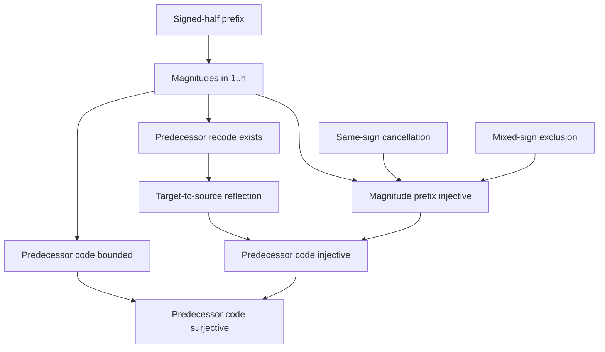

# Gauss magnitude permutation

Status: isolated authoring candidate. All eleven dependency-curried bodies are
kernel-valid; recursive closure and mutation replay remain WMI gates. Nothing
in this tranche is admitted into the public theorem registry.

## Mathematical endpoint

For an odd prime `p = 2*h+1`, a nonzero multiplier `a`, and the source prefix
`1,...,h`, the signed-half encoding stores a magnitude `m_i` satisfying

\[
  1 \le m_i \le h,
  \qquad
  a(1+i) \equiv m_i \pmod p
  \quad\text{or}\quad
  a(1+i) \equiv -m_i \pmod p.
\]

All notation in this display is documentary. The contracts expand beta
decoding, order, primality, divisibility, and congruence into first-order PA.

Equal-sign collisions cancel `a` modulo `p`. A mixed-sign collision would give

\[
  a(x+y) \equiv 0 \pmod p,
\]

and prime cancellation would force `x+y` congruent to zero. But source values
lie in `1,...,h`, so `0 < x+y < 2h+1`; bounded representative uniqueness gives
a contradiction. Hence the magnitude prefix is injective.

The checked finite-permutation API is zero-based. The tranche therefore
recodes every positive magnitude `S r` as its predecessor `r`. It proves the
predecessor code bounded and injective below `h`, then invokes
`finite_bounded_injective_surjective`. Consequently the predecessor code
covers exactly `0,...,h-1`, which is the native extensional statement that the
original magnitudes form a permutation of `1,...,h`.

## Candidate ladder

| Candidate | Role | Body nodes/depth |
|---|---|---:|
| `gauss_signed_half_magnitude_range` | Project `1 <= m <= h` from every signed entry | `39/25` |
| `prime_scaled_same_target_unique` | Cancel a nonzero prime residue and identify bounded sources | `48/24` |
| `gauss_same_sign_scaled_source_unique` | Handle lower/lower and reflected/reflected collisions | `96/34` |
| `gauss_mixed_sign_scaled_source_impossible` | Exclude lower/reflected collisions constructively | `169/50` |
| `gauss_signed_half_magnitude_injective` | Extract two beta entries and prove equal magnitudes have equal indices | `626/70` |
| `beta_magnitude_predecessor_recode_exists` | Recode every positive beta value `S r` as `r` | `157/45` |
| `gauss_signed_half_predecessor_recode_exists` | Specialize predecessor recoding to the signed-half prefix | `31/25` |
| `beta_magnitude_predecessor_recode_reflect` | Reflect target entry `r` back to source entry `S r` | `87/30` |
| `beta_magnitude_predecessor_recode_bounded` | Transport `1,...,l` bounds to `0,...,l-1` | `48/20` |
| `beta_magnitude_predecessor_recode_injective` | Transport magnitude injectivity to predecessor values | `60/31` |
| `beta_magnitude_predecessor_recode_surjective` | Cover every predecessor value below `l` | `39/21` |

The complete dependency-curried replay took about 6.8 seconds under a
60-second authoring cap on 2026-07-30. These receipts leave dependencies as
hypotheses and are not admission evidence.



## Authored product-alignment boundary

Let `(rb,rc)` be the predecessor code, `(b,c)` the canonical range code for
`1,...,h`, and `(mb,mc)` the magnitude code. Three follow-on candidates now
prove successor coverage, the fully expanded alignment

\[
  \operatorname{At}(rb,rc,i,j) \land
  \operatorname{At}(b,c,j,x)
  \Longrightarrow
  \operatorname{At}(mb,mc,i,x)
  \qquad (i<h).
\]

Reflection gives `At(mb,mc,i,S j)`, while range decoding gives `x=1+j=S j`.
The product theorem then supplies predecessor boundedness and injectivity to
`beta_product_permutation_invariant`.

| Candidate | Role | Body nodes/depth |
|---|---|---:|
| `gauss_magnitude_successor_coverage` | Lift predecessor surjectivity back to positive magnitude coverage | `51/28` |
| `gauss_predecessor_half_range_aligned` | Align canonical factor `1+j` with decoded magnitude `S j` | `127/39` |
| `gauss_magnitude_product_eq_half_range` | Reindex exact products and identify magnitude product with the canonical half range | `72/34` |

All three dependency-curried bodies are kernel-valid. They are not yet part of
a focused recursive WMI suite and are not admitted. They now feed the signed
product composition below.

## Sign recoding and the composed Gauss product

The missing recodings and algebraic composition are now authored as isolated
candidates. The sign code stores `1` for bit `0` and `r=p-1` for bit `1`; a
second generic recoding stores the pointwise products of magnitudes and sign
factors. Exact product folds then give

\[
  T=M\,S,\qquad M=P,\qquad S=R,
\]

where `P` is the canonical half-range product and `R` is the relational power
`r^e`. The pointwise signed congruences yield

\[
  A P \equiv T \equiv P R \pmod p,
\]

with `A=a^h`. Every entry of the canonical half range is positive and below
the prime, so its product is coprime to `p`. The existing balanced Bézout
cancellation theorem therefore removes `P` constructively:

\[
  \boxed{A\equiv R\pmod p}.
\]

```mermaid
flowchart LR
  B[sign bits] --> F[1 / p-1 factor code]
  M[magnitude code] --> X[pointwise product code]
  F --> X
  M --> MP[M = canonical half product P]
  F --> SP[sign product = (p-1)^e]
  X --> T[target product]
  MP --> C[A P = P R mod p]
  SP --> C
  T --> C
  H[positive half range] --> U[coprime P p]
  U --> K[cancel P]
  C --> K
  K --> G[A = R mod p]
```

The principal body-only receipts are:

| Layer | Candidates | Body nodes/depth |
|---|---|---:|
| sign-factor construction | extend, prefix existence, product/power package | `136/35`, `96/29`, `60/37` |
| sign-factor fold | drop-last, exact product/power | `35/24`, `259/46` |
| generic pointwise recoding | extend, prefix existence, product package | `121/40`, `62/28`, `52/35` |
| generic pointwise product | drop-last, exact product identity | `52/35`, `179/47` |
| signed pointwise congruence | entry scale, canonical successor, product | `165/46`, `80/53`, `70/51` |
| prime-product cancellation boundary | positive bounded product coprime | `64/31` |
| final composition | half-product coprime, product balance, cancellation | `41/28`, `148/70`, `156/87` |

The last composition candidate is the algebraic heart of Gauss's lemma. The
follow-on `gauss_lemma_power_congruence_exists` now eliminates its explicit
code/product premises constructively. From an odd prime `p=2*h+1`, `p` not
dividing `a`, and the canonical half-range code, it exposes only `e,A,R`, with
hidden signed-prefix/count evidence, `Pow(a,h,A)`, `Pow(2*h,e,R)`, and
`A congruent R (mod p)`. Its dependency-curried body has 193 commands, 258
nodes, and depth 83; the expanded statement has SHA-256
`f70e66bfbec7655df990fbfbdb0eaddd941526e33c9cddac620147533ae482ad`.

This is the witness-packaged power-congruence form of Gauss's lemma. The next
composition is now body-green as `bounded_gauss_lemma_complete`. Assuming

\[
 p=2h+1,\qquad \operatorname{Prime}(p),\qquad 0<a<p,
\]

and a canonical `HalfRange(b,c,h)`, it constructs a reflection count `e`,
retains hidden `SignedHalfPrefix` and `BitCount(e)` witnesses, and proves both

\[
 \operatorname{QRes}(p,a)\leftrightarrow\operatorname{Even}(e),
 \qquad
 \neg\operatorname{QRes}(p,a)\leftrightarrow\operatorname{Odd}(e).
\]

The constructive proof first derives `p` does not divide `a` from `0<a<p`,
then composes the power-congruence endpoint, the predecessor-power parity
bridge, and the complete bounded Euler criterion. The reverse implications
use `parity_cases` and the prime-modulus separation
`not (1 congruent 2*h mod p)`, with only congruence symmetry and transitivity.
The direct dependency-curried receipt is 11 dependencies, 204 commands, 597
nodes, depth 53, 559 objects, 596 edges, and 38 reused objects. Its expanded
statement SHA-256 is
`30f9a62162c2d1fe6e589ba3a5b5e5653bf5e527ab5b86a29ae394c448893b39`;
the focused audit passes `5/5` in 7.24 seconds under the laptop CPU cap.

This closes the actual bounded quadratic-residue/parity interface only at the
body-check level. Both endpoints remain dependency-curried, outside the
registry, and unadmitted. Recursive WMI closure, mutation checks, and a
separate receipt-pinned admission are still required. No receipt here claims
recursive closure or theorem authority. See the
[`candidate`](../../peano-lab/py/peano_lab/library/gauss_lemma_bounded_candidate.py)
and its
[`focused audit`](../../peano-lab/py/tests/test_gauss_lemma_bounded_candidate.py).

The companion `arbitrary_gauss_lemma_complete` replaces `0<a<p` by
`p` not dividing `a` and composes the same Gauss witness package with the
arbitrary-representative Euler criterion. It preserves the signed-prefix and
count provenance and proves the same two equivalences for the original `a`.
Its independently replayed body has 9 dependencies, 188 commands, 547 nodes,
depth 49, 513 objects, 546 edges, and 34 reused objects. The bounded and
arbitrary suites pass together at `9/9` in 13.64 seconds. The shared tactic
tail is extracted fail-closed from exact sentinels, but no theorem authority
is inherited from source reuse. See the arbitrary
[`candidate`](../../peano-lab/py/peano_lab/library/gauss_lemma_arbitrary_candidate.py)
and
[`focused audit`](../../peano-lab/py/tests/test_gauss_lemma_arbitrary_candidate.py).

## WMI audit package

The focused audit is
`peano-lab/py/tests/test_gauss_magnitude_permutation_candidate.py`, selected by
suite `gauss-magnitude-permutation`. Its five gates check:

1. exact deterministic contracts and body metrics;
2. helper hygiene, alpha-equivalence, native expansion, and bounded arithmetic semantics;
3. exact acyclic dependencies, core boundary, and registry isolation;
4. two cold recursive closures, independent kernel checks, resource limits,
   hashes, and exact Cut spines; and
5. rejection of a false contract and every direct dependency-Cut mutation.

Only gates 1--3 are laptop-safe. Gates 4--5 and receipt generation are WMI
work. A successful discovery run still does not admit these candidates.

Focused job `173021`, from exact snapshot
`fd129d34bf4a31a131a28d55bc6a16153984e0d37ac24dcefe7c2735cfb058d1`,
is pending with zero CPU. It has produced no recursive-replay result.
