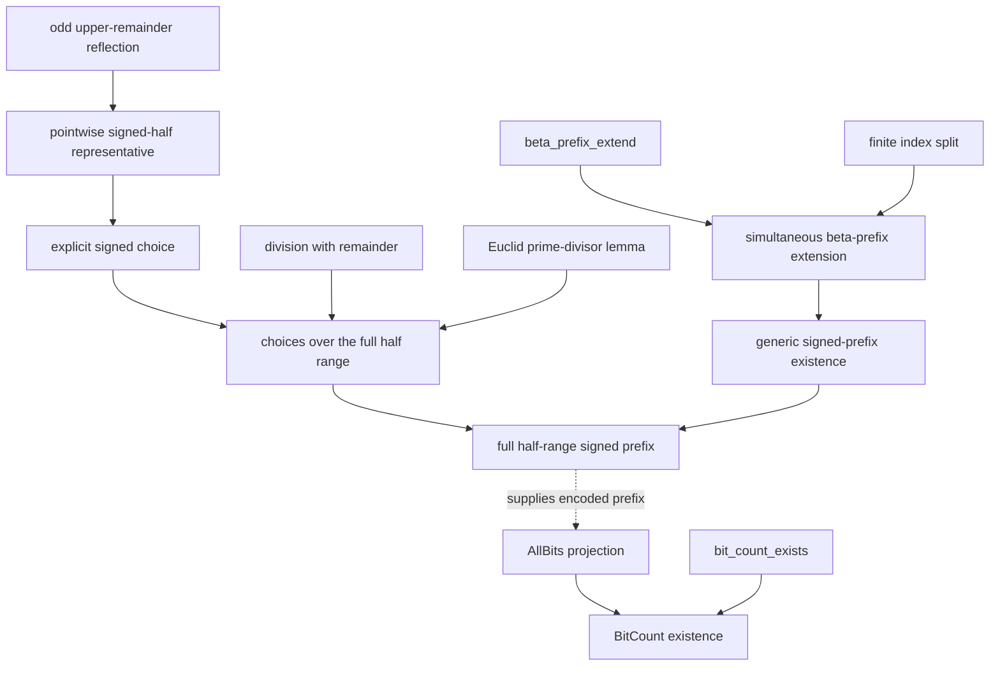

# Signed-half beta prefixes for Gauss's lemma

Status: isolated authoring candidate, body-valid, awaiting WMI recursive
closure and mutation replay. No theorem described here is admitted into the
public Peano library.

## Scope of this tranche

The source
[`gauss_signed_prefix_candidate.py`](../../peano-lab/py/peano_lab/library/gauss_signed_prefix_candidate.py)
lifts the existing pointwise signed-half representative into two aligned
beta-coded prefixes:

- a magnitude prefix, whose entries are positive and at most `h`; and
- a sign prefix, whose entries are exactly `0` or `1`.

For an odd modulus `p = 2*h+1`, multiplier `a`, source value `x`, magnitude
`m`, and sign bit `s`, each entry records one of the expanded balanced
congruences

\[
  s=0 \land ax\equiv m\pmod p,
  \qquad\text{or}\qquad
  s=1 \land ax\equiv (2h)m\pmod p.
\]

Because `2h = p-1`, the second branch is the subtraction-free PA encoding of
`ax congruent to -m (mod p)`. Congruence, primality, order, beta decoding,
signs, and finite counting are only documentation-level abbreviations. Every
candidate contract expands to first-order PA over `0`, `S`, `+`, `*`,
equality, connectives, and quantifiers before parsing.

This tranche deliberately stops before proving that the magnitude prefix is a
permutation of `1,...,h`. It therefore does not yet prove the product identity,
Gauss's lemma, Euler's criterion, or quadratic reciprocity.

## Candidate ladder

| Candidate | Direct role | Body nodes/depth |
|---|---|---:|
| `gauss_pointwise_signed_half_choice` | Add the decoded source entry and an explicit `0/1` witness to the earlier pointwise representative | `73/27` |
| `gauss_half_range_signed_choices` | Obtain one signed choice at every entry of the beta-coded half range | `133/39` |
| `gauss_signed_half_prefix_extend` | Append one magnitude and one sign bit using two independent beta-prefix extensions | `164/47` |
| `gauss_signed_half_prefix_exists` | Encode any bounded family of choices by induction on its length | `70/31` |
| `gauss_half_range_signed_prefix_exists` | Specialize generic prefix existence to `1,...,h` | `33/22` |
| `gauss_signed_half_prefix_all_bits` | Project the aligned sign code to the canonical expanded `AllBits` relation | `35/25` |
| `gauss_signed_half_bit_count_exists` | Apply the checked finite-fold API to obtain a relational count of one-bits | `31/26` |

The two earlier local prerequisites remain isolated candidates as well:

| Earlier candidate | Body nodes/depth |
|---|---:|
| `odd_upper_remainder_reflection` | `125/34` |
| `gauss_pointwise_signed_half_representative` | `116/38` |

The dependency-curried bodies of all nine candidates were replayed under a
60-second authoring cap on 2026-07-30. The independent kernel accepted every
body; the run took about 1.8 seconds. This fast replay leaves dependencies as
hypotheses. It is a defect-finding preflight, not a closed certificate and not
an admission receipt.

## Dependency structure

`gauss_signed_half_prefix_all_bits` is intentionally generic: it projects
bits from any prefix satisfying the signed-entry invariant, not only the full
half range. Likewise `gauss_signed_half_bit_count_exists` counts any such
prefix. This keeps the finite-fold bridge reusable in later Gauss and
supplementary-law proofs.

## Constructive proof architecture

### Full-range choices

At index `i<h`, the half-range code decodes `x=1+i`. Division with remainder
gives

\[
  a(1+i)=pq+r,\qquad r<p.
\]

The proof must establish `r != 0` constructively. If `r=0`, then `p` divides
`a(1+i)`. Euclid's lemma makes `p` divide `a` or `1+i`. The first alternative
contradicts the multiplier hypothesis. The second contradicts `1+i<p`, using
the nonzero-divisor bound. The earlier pointwise representative then chooses
the lower or reflected magnitude and this tranche attaches sign `0` or `1`.

### Prefix extension

One call to `beta_prefix_extend` appends the magnitude, and a second fresh call
appends the sign. For an index below the successor length, the native finite
index split yields either the new last index or an old index. The last branch
uses the pointwise choice; the old branch transports both decoded entries
through their respective beta extensions while retaining the source entry and
all arithmetic invariants.

### Prefix existence and count

Ordinary induction on the requested length constructs four witnesses: code
and scale for magnitudes, and code and scale for signs. The zero prefix is
vacuous. The successor case restricts the choice family, invokes the induction
hypothesis, and appends its last choice.

The sign projection then forgets all fields except the sign beta entry and the
proof that its value is `0` or `1`. This is exactly the canonical expanded
`AllBits` surface consumed by `bit_count_exists`.

## WMI audit package

The focused WMI audit is
[`test_gauss_signed_prefix_candidate.py`](../../peano-lab/py/tests/test_gauss_signed_prefix_candidate.py).
It is exposed as suite `gauss-signed-prefix` by
[`run_qr_wmi_replay.py`](../../scripts/run_qr_wmi_replay.py) and the submission
and Slurm allowlists.

The five gates check:

1. deterministic, closed, fully expanded contracts plus the nine body-only
   metrics;
2. helper hygiene, alpha-equivalence to canonical beta/half-range surfaces,
   critical witness commands, and a bounded semantic model;
3. exact acyclic local dependencies, core boundary, and registry isolation;
4. two cold recursive closures, independent-kernel checks, no `DNE`, resource
   metrics, source/graph hashes, and exact direct Cut spines; and
5. rejection of strengthened contracts and every direct dependency-Cut
   mutation.

All recursive closure, profiling, and mutation experiments must run on WMI.
The candidate remains isolated even if discovery passes. Admission requires a
separate receipt-pinned replay from an exact snapshot.

Focused job `173016`, from exact snapshot
`8c9c4ae067b0dc202684e410bee563cd592a67080cb7c9939440ae8b44d4bccd`,
is pending with zero CPU. It has produced no recursive-replay result and
admits no theorem.

The count endpoint depends on `bit_count_exists`, already one of the larger
finite-fold certificates. If structural occurrences cross a current limit,
first compare structural nodes with distinct proof objects and inspect the Cut
spine. A reviewed self-contained proof-DAG adjustment is preferable to blindly
raising every limit. No external theorem name or hash may become a trusted
axiom.

## Completed body-green continuation and exact next boundary

The eleven-candidate
[magnitude-permutation tranche](gauss-magnitude-permutation.md) is body-valid
and has a focused pending WMI job. The later dependency-curried layers are now
authored as well: magnitude-product alignment, sign-factor recoding and its
power fold, generic pointwise-product recoding, signed pointwise congruence,
coprimality of the canonical half product, and constructive cancellation.
Their existential composition constructs `e,A,R` and proves

\[
  A=a^h,\qquad R=(2h)^e,\qquad A\equiv R\pmod p.
\]

The bounded client endpoint `bounded_gauss_lemma_complete` then composes this
package with the predecessor-power parity bridge and the complete bounded
Euler criterion. From `p=2*h+1`, `Prime(p)`, `0<a<p`, and the canonical half
range, it retains the signed-prefix/count provenance and proves

\[
  \operatorname{QRes}(p,a)\leftrightarrow\operatorname{Even}(e),\qquad
  \neg\operatorname{QRes}(p,a)\leftrightarrow\operatorname{Odd}(e).
\]

Its direct body receipt is `597/53` nodes/depth with 204 commands and 11
dependencies. The arbitrary-representative wrapper replaces `0<a<p` by
`p` not dividing `a` and has a `547/49` receipt with 188 commands and 9
dependencies. Their focused audits pass together at `9/9` in 13.64 seconds
under the laptop cap. This is not a recursive proof result: every candidate in
this chain remains dependency-curried, registry-isolated, and unadmitted.

The exact next boundary is therefore no longer product composition or the
Euler connection. It is recursive WMI closure and mutation testing of the
whole Gauss dependency graph, followed by a distinct receipt-pinned admission
replay. Only after that trust gate should the campaign specialize the theorem
to the first supplementary law and consume it in reciprocity.
