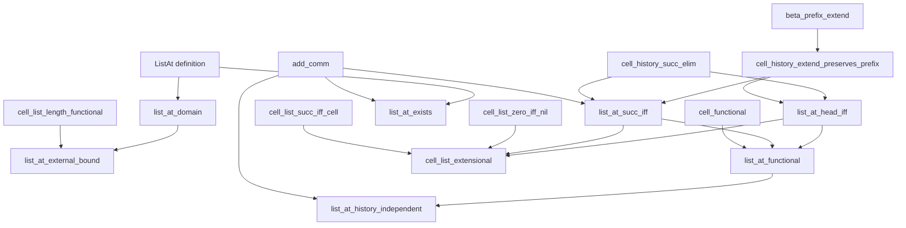

# RFC HA-K3B-LISTAT-1: extensional lookup for reverse cell histories

**Status:** private representation freeze; no theorem in this RFC is registered,
admitted, or public

**Layer:** `K3B`, after `HA-K3B-CELLHISTORY-1`; outside strict K3

**Logic and kernel:** unchanged intuitionistic first-order Peano arithmetic;
all displayed names are hygienic surface definitions that expand before kernel
checking

## 1. Purpose and boundary

`HA-K3B-CELLHISTORY-1` supplies a beta-coded reverse construction history and
an existential length relation.  This RFC adds the first canonical client
operation on that representation: lookup by an index counted from the
outermost cell.  The intended equations are the familiar ones

```text
ListAt(Cell(h,t),0,a)       exactly when a = h
ListAt(Cell(h,t),S i,a)     exactly when ListAt(t,i,a)
```

but the native theorem contracts below avoid an equality-based constructor
notation and avoid a primitive biconditional.  They use the already checked
relational `Cell`, `CellListLen`, and beta-history interfaces.

This checkpoint does **not** add a new kernel predicate, quotient beta codes by
fiat, trust a theorem name, assume a choice principle, or alter Peano Lab's
formula grammar.  It also does not admit the preceding private cell-history
rows.  Every definition in this document is syntactic sugar and must be fully
expanded before parsing the proposition checked by the kernel.

## 2. Representation orientation

A reverse history of length `l` stores values

```text
v_0 = 0, v_1, ..., v_l = z
```

with `Cell(v_{j+1},h,v_j)` at construction edge `j`.  Thus the most recently
constructed, outermost cell is edge `l-1`.  An outer-head index `i` selects
edge `j` precisely when

```text
j + S i = l.
```

For a three-cell trace whose heads were constructed inner-to-outer as
`a,b,c`, the selected edge indices for outer indices `0,1,2` are `2,1,0`, and
the returned heads are `c,b,a`.

## 3. Frozen surface definitions

### D01 `HistoryAt(l;b,c;i,a)` (authoring abbreviation)

The following abbreviation names the selected edge inside one *particular*
history witness.  It is useful in the representation-independence theorem,
but it is not a new object-language predicate.

```text
HistoryAt(l;b,c;i,a) :=
  exists j t u.
    j + S i = l /\
    (BetaAt(b,c,j,t) /\
     (BetaAt(b,c,S j,u) /\ Cell(u,a,t)))
```

### D02 `ListAt(z,i,a)` (canonical client surface)

```text
ListAt(z,i,a) :=
  exists l b c j t u.
    CellHistory(z,l;b,c) /\
    (j + S i = l /\
     (BetaAt(b,c,j,t) /\
      (BetaAt(b,c,S j,u) /\ Cell(u,a,t))))
```

The normative existential witness order is exactly

```text
l, b, c, j, t, u.
```

The conjunction is right-associated exactly as displayed.  `t` is the edge's
tail and `u` its successor cell code.  The exact D06 orientation is
`Cell(u,a,t)`, never `Cell(t,a,u)`.

The checked prototype expands D02 completely into the unchanged PA grammar.
Its frozen structural receipt is:

| surface | characters | formula constructors | total PA AST nodes | SHA-256 | free variables |
|---|---:|---:|---:|---|---|
| `ListAt(z,i,a)` | 3,331 | 54 | 210 | `b83d91b6ec8e6b83fe637e1533c72beef54c7e7a4b41f1518bce8785cc9f11ce` | `z,i,a` |

The implementation rejects compound arguments, reserved words, and generated
binder capture.  Every expanded `BetaAt` is alpha-equivalent to the existing
checked helper.  Small standard-model fixtures for nil and one-, two-, and
three-cell histories confirm the outer-to-inner orientation.

## 4. Necessary strengthening of history extension

The existing private theorem `cell_history_extend` proves that a fresh history
code exists after adding an outer cell.  Its conclusion intentionally hides
the pointwise preservation map produced by `beta_prefix_extend`.  That opaque
contract is sufficient for length existence, but insufficient for transporting
a lookup in the old tail into the new history.

The first proof lemma therefore exposes exactly the preservation needed by
lookup and no equality of raw beta codes:

```text
cell_history_extend_preserves_prefix:
forall b c l t u h.
  CellHistory(t,l;b,c) ->
  Cell(u,h,t) ->
  exists b2 c2.
    CellHistory(u,S l;b2,c2) /\
    forall k x.
      (exists d. d + k = l) ->
      BetaAt(b,c,k,x) ->
      BetaAt(b2,c2,k,x)
```

The bound `exists d. d + k = l` is native `k <= l`.  Calling
`beta_prefix_extend` at `S l` preserves positions `0,...,l`, including both
endpoints `j` and `S j` of every old lookup edge.  The proof is direct and
constructive; it requires no induction and no choice.

## 5. Frozen first-ten ladder

The table order is normative.  D02 is a definition, not a theorem row.  Every
later theorem statement expands D01/D02, `CellHistory`, `CellListLen`,
`BetaAt`, and `Cell` before kernel checking.

| order | deliverable | exact role | principal direct dependencies |
|---:|---|---|---|
| 1 | `ListAt` | definition D02 and its exact surface receipt; not a theorem | D01, `CellHistory`, `BetaAt`, exact D06 `Cell` |
| 2 | `cell_history_extend_preserves_prefix` | expose the old decoded prefix in the extended history | `beta_prefix_extend`, `finite_lt_succ_eq_or_lt`, `zero_le`, `succ_le_succ`, `le_refl` |
| 3 | `list_at_domain` | project a semantic length and the native strict index bound | `cell_list_length_functional` only if an external length is supplied; otherwise definition elimination |
| 4 | `list_at_head_iff` | characterize lookup at outer index zero | `cell_history_succ_elim`, rung 2, `beta_at_unique`, `le_refl` |
| 5 | `list_at_succ_iff` | shift lookup through one outer cell | rung 2 (`cell_history_extend_preserves_prefix`), `cell_history_succ_elim`, `add_comm` |
| 6 | `list_at_external_bound` | transport the hidden bound to a declared list length | rungs 3, `cell_list_length_functional` |
| 7 | `list_at_exists` | every in-range index has a decoded head | `CellHistory` universal edge clause, definition introduction, `add_comm` |
| 8 | `list_at_functional` | lookup at a fixed code and index has one value | `list_at_head_iff`, `list_at_succ_iff`, `cell_functional`; induction on `i` |
| 9 | `list_at_history_independent` | transport a selected edge between two history witnesses for the same list | `list_at_functional`, `add_comm` |
| 10 | `cell_list_extensional` | equal-length lists with equal entries have equal codes | `cell_list_zero_iff_nil`, `cell_list_succ_iff_cell`, `list_at_head_iff`, `list_at_succ_iff`; induction on `l` |

### T03 domain

```text
list_at_domain:
forall z i a.
  ListAt(z,i,a) ->
  exists l. CellListLen(z,l) /\ (exists k. k + S i = l)
```

### T04 head equation

There is no native `<->`; the head and successor equations are conjunctions
of implications.

```text
forall z a.
  ((ListAt(z,0,a) ->
    exists t l. Cell(z,a,t) /\ CellListLen(t,l)) /\
   ((exists t l. Cell(z,a,t) /\ CellListLen(t,l)) ->
    ListAt(z,0,a)))
```

### T05 successor equation

This equivalence is likewise represented by a conjunction of implications,
not by a new logical connective.

```text
forall z i a.
  ((ListAt(z,S i,a) ->
    exists t h. Cell(z,h,t) /\ ListAt(t,i,a)) /\
   ((exists t h. Cell(z,h,t) /\ ListAt(t,i,a)) ->
    ListAt(z,S i,a)))
```

### T06 bound at a declared length

```text
list_at_external_bound:
forall z l i a.
  CellListLen(z,l) ->
  ListAt(z,i,a) ->
  exists k. k + S i = l
```

### T07 in-range existence

```text
list_at_exists:
forall z l i.
  CellListLen(z,l) ->
  (exists k. k + S i = l) ->
  exists a. ListAt(z,i,a)
```

### T08 functionality

```text
list_at_functional:
forall z i a d.
  ListAt(z,i,a) ->
  ListAt(z,i,d) ->
  a = d
```

### T09 representation independence

D01 is expanded in the actual theorem statement.

```text
list_at_history_independent:
forall z l b c d e i a.
  CellHistory(z,l;b,c) ->
  CellHistory(z,l;d,e) ->
  HistoryAt(l;b,c;i,a) ->
  HistoryAt(l;d,e;i,a)
```

This theorem does not identify `b` with `d` or `c` with `e`.  It says only
that all valid encodings of the same reverse history decode the same selected
head at an in-range index.

### T10 extensionality

```text
cell_list_extensional:
forall z w l.
  CellListLen(z,l) ->
  CellListLen(w,l) ->
  (forall i a d.
    (exists k. k + S i = l) ->
    ListAt(z,i,a) ->
    ListAt(w,i,d) ->
    a = d) ->
  z = w
```

The pointwise hypothesis is intentionally relational.  It neither assumes a
function-valued lookup nor adds a function symbol to the term grammar.

## 6. Dependency graph



Definition nodes must be rendered with the project's distinct definition
shape and color.  Private candidate theorem nodes must remain visually
distinct from public checked theorems.

## 7. Proof architecture

### 7.1 Preservation

Run `beta_prefix_extend` at `S l` with appended value `u`.  Its left conclusion
is the new endpoint.  Its right conclusion transports every old decode whose
index is below `S l`.  Convert `k <= l` into `k < S l`, transport the old start,
terminal, and edge decodes, and prove the new final edge from the supplied
`Cell(u,h,t)`.  Reuse the same construction to return the requested
pointwise map.

### 7.2 Head and successor equations

At outer index zero, `j + S 0 = l` identifies the chosen edge as the final
edge.  Successor elimination extracts an outer cell and predecessor history.
One application of `beta_at_unique` identifies the selected successor with
the terminal list code; a second application at index `j` identifies the
selected tail with the predecessor-history terminal.  This two-decode route
avoids any dependency on `cell_tail_functional`.  In the reverse direction,
the strengthened extension preserves the old terminal at index `l` and
supplies the new terminal at `S l`, so those values and the supplied exact
cell are the six canonical lookup witnesses.

At successor index `S i`, PA4 converts the source bound
`j + S (S i) = L` into `S (j + S i) = L`. Successor elimination therefore
returns a predecessor history of length `j + S i` with the same `b,c` trace
witnesses. The original selected edge can then be repackaged directly as
`ListAt(t,i,a)` in that predecessor history. This same-history route does not
invoke the head equation and needs neither rung 4 nor PA2.

For the reverse implication, extend the tail history once and use rung 2's
preservation map at both selected endpoints. From `j + S i = l`, commutativity
gives the current-index bound `S i + j = l`; PA4 plus commutativity gives the
following-index bound `i + S j = l`. Thus `S i` and `i` are respectively the
native additive witnesses required to preserve positions `j` and `S j`.
Another PA4 application supplies `j + S (S i) = S l` for the target lookup.
Only `add_comm` is a theorem dependency for these conversions; PA4 and
congruence are primitive proof rules already available to every script.

### 7.3 External bounds and existence

For an external length, `list_at_domain` exposes the lookup's hidden history
length `m` and its bound `k + S i = m`. `cell_list_length_functional` compares
the declared and hidden representations in the orientation `l = m`; rewriting
the projected bound along this equality proves `list_at_external_bound`.

For existence, unpack `CellListLen(z,l)` as one history and an in-range bound
`j + S i = l`. The history edge clause at `j` expects an additive witness for
`S j <= l`. Choose `i`: two PA4 rewrites and `add_comm` prove
`i + S j = j + S i = l`. The edge clause constructively supplies its tail,
successor, and head, which are repackaged with the same history witnesses into
`ListAt(z,i,a)`. No choice principle, search, or earlier lookup equation is
used.

### 7.4 Functionality, history independence, and extensionality

Functionality is ordinary induction on the outer index.  The base case uses
the head equation twice and projects head equality from one application of
joint `cell_functional`. The successor case uses the successor equation twice,
projects tail equality from `cell_functional`, rewrites the two terminal-code
occurrences in the first tail lookup, and applies the generalized induction
hypothesis. Separate head and tail functionality dependencies are unnecessary.

History independence keeps the selected construction edge `j` from the first
history. Its bound `j + S i = l` is converted by PA4 and `add_comm` to the
second history's edge-clause bound `i + S j = l`. That clause supplies a head
`h` at the same outer index in the second history. Building client-level
lookups from both histories and applying `list_at_functional` proves `a=h`;
rewriting the two head occurrences in exact D06 yields the requested second
`HistoryAt`. This neither uses `list_at_exists` nor equates raw beta codes, and
it needs no direct `beta_at_unique` dependency.

Extensionality is induction on the shared length.  At zero, both codes are
nil by `cell_list_zero_iff_nil`.  At a successor length, the successor list
equation exposes outer heads and tails.  Pointwise equality at index zero
identifies the heads. For a tail index `j`, PA4 and congruence transport
`k + S j = l` to `k + S (S j) = S l`; the successor lookup equation lifts
both tail lookups, so the original pointwise hypothesis supplies the tail
pointwise premise for the induction hypothesis. Exact D06 construction then
identifies the cell codes after exactly two head rewrites and four tail
rewrites. No existence, lookup-functionality, or history-independence theorem
is needed directly.

## 8. Constructive and dependency quarantine

The transitive closure may use:

- Peano axioms PA1--PA7 and ordinary formula-specific induction;
- the reviewed K0--K2 order, equality, cancellation, and beta/CRT substrate;
- private exact-D01/D06 pair-cell functionality and descent rows;
- the eight privately closed `HA-K3B-CELLHISTORY-1` rows.

The closure must exclude:

- `DNE`, excluded middle, choice, `sorry`, admission, or a trusted solver;
- primitive lists, indexing functions, division, remainder, or raw `%` syntax;
- equality of beta codes as a substitute for extensional decoding;
- legacy `ListAt`, downstream folds/maps, M4, factorization, or quadratic
  reciprocity rows;
- cycles from lookup back into scalar CRT or beta-prefix construction.

No public theorem may depend on these rows until a separate reviewed admission
commit updates the registry, catalog, snapshots, Book, explorer, and exact
receipts.

## 9. Validation gates

### G0 — surface freeze

- D02 has exactly the witness order `l b c j t u`, association, orientation,
  receipt, and free-variable table in Section 3.
- The helper rejects capture and reserved/compound arguments.
- Nil and one-/two-/three-cell semantic fixtures match outer-head indexing.

### G1 — prefix-preserving extension

- The construction calls `beta_prefix_extend` at exactly `S l`.
- It exposes preservation for every `k <= l`, including both endpoints of an
  old edge.
- The returned history terminates at `u` and its new final edge is exactly
  `Cell(u,h,t)`.

### G2 — equations and bounds

- Both implications in the head and successor equations check.
- Index-zero, successor, reversed-edge, and out-of-range mutations fail.
- Domain and external-bound rows return the native additive witness.

### G3 — existence, functionality, and representation independence

- Every in-range lookup has a witness without choice.
- Two values at one code/index are equal.
- Two history witnesses for the same code and length agree extensionally, with
  no claim that their raw beta codes are equal.

### G4 — extensionality

- Zero and successor branches close by object-level induction.
- A mutation omitting index zero or the successor shift fails.
- Nearby false claims equating unequal lengths or raw history codes fail.

### G5 — kernel, resources, and admission boundary

- Every body first checks against dependency hypotheses through the ordinary
  intuitionistic kernel entry point.
- Empty-context certificates are then closed twice on WMI with identical
  statement, dependency-closure, certificate, DAG, and zero-DNE receipts.
- Existing live-proof and kernel resource limits are unchanged.
- The required two-pass empty-context receipts now exist in WMI job `219217`.
  Until a separate admission review exists, every theorem remains private,
  unregistered, and unadmitted; every row is nonpublic.

## 10. Current evidence and next action

D01/D02 and their lightweight structural/semantic tests are implemented. The
first theorem row, `cell_history_extend_preserves_prefix`, now has a checked
dependency-curried body with exact receipt
`(5 dependencies,99 commands,139 nodes,depth 37,139 objects,138 edges,0 reused)`.
Its expanded statement has 3,799 characters and SHA-256
`3191deb1ef7c06755622ef9f277b3d5d1e358edac5437e5e337c9f29c6e395b2`.
The audited closure contains 104 rows (103 public dependencies), and four
focused tests pin its surface, dependency quarantine, zero-DNE body,
mutation sensitivity, and the concrete `4,1` to `96,2` recoding example.

WMI job `219209` closed this row twice from the empty context with identical
receipts. Its exact closed receipt in tuple order
`(nodes,depth,objects,edges,reused,Cuts,proof DAG SHA-256)` is
`(29369,81,4668,4896,229,241,7fd7734ab34d90a869c637e76e138db692ba21d4f2bbec41af9817c38ef36498)`.
The authoritative
[`receipt`](../../artifacts/peano-library/ha-k3b-listat-prefix-closure-219209.json)
has SHA-256
`0d51baf93121da4071d0bb3ebd2b4a2818a7658fa92510fd707620bc2dba6560`.
Job `219209` completed `0:0` on `c3n1` in `00:02:14`, `MaxRSS=85664K`,
from clean commit `94cf88912bf368d43a3201abc91c69ddeb442a56` and payload
`b288d4641680f48c1b145251209bedeb5b82d7ffab40b356a1a2497fef041c74`
(564,554 bytes, 203 entries). The certificate has zero DNE and remains a
private, unregistered, unadmitted `closed_checked_candidate`.

The prefix-preservation gate is therefore sealed. `list_at_domain` also has a
dependency-free checked body. Its expanded
statement receipt is
`(5903,065291362205b70ef41fff597d1d8762bff06ce7d3a5bead5dbcd8b97ea8a240)`
in `(characters,SHA-256)` order, and its exact proof receipt is
`(0 dependencies,19 commands,39 nodes,depth 23,39 objects,38 edges,0 reused)`.
The certificate is already empty-context, Cut-free, and DNE-free because the
row has no dependencies. Three focused checks pin its witness projection,
false strengthening, privacy, and a distinct-head two-cell model. WMI job
`219217` subsequently reproduced that certificate in both cold passes.

`list_at_head_iff` now has a dependency-curried body checked by the ordinary
intuitionistic kernel. Its exact four direct dependencies are
`cell_history_succ_elim`, `cell_history_extend_preserves_prefix`,
`beta_at_unique`, and `le_refl`. The expanded statement has 12,530 characters
and SHA-256
`9f0b3e7496f79b7cc6f4833edc14431dd614081b6f02b2d384aa80c521e2f8ed`.
Its exact body receipt, in
`(dependencies,commands,nodes,depth,objects,edges,reused)` order, is
`(4,119,265,36,255,264,10)`. The forward implication uses beta uniqueness
twice—first at `S j` for the terminal code and then at `j` for the tail—so it
does not use cell-tail functionality; the reverse implication uses the
prefix-preservation map at the old terminal. This body-level receipt is
complemented by the repeated empty-context closure from WMI job `219217`;
registration, admission, and a public theorem are still not claimed. The
successor body is recorded immediately below.

`list_at_succ_iff` now also has a dependency-curried body checked by the
ordinary intuitionistic kernel. Its exact direct dependency order is
`cell_history_succ_elim`, `cell_history_extend_preserves_prefix`, then
`add_comm`; the earlier provisional rung-4/PA2 route is not used. The expanded
statement has 14,716 characters and SHA-256
`004ef041acbcfbaaeda594f5f47fbea75ac6f8df87ca8bcf49774cfcbc3a978c`.
Its exact body receipt, in
`(dependencies,commands,nodes,depth,objects,edges,reused)` order, is
`(3,124,198,38,196,197,2)`, with zero DNE. The forward implication restricts
the same beta history after successor elimination; the reverse implication
preserves both endpoint decodes using the additive witnesses `S i` and `i`.
This body-level receipt is complemented by the repeated empty-context closure
from WMI job `219217`; registration, admission, and a public theorem are still
not claimed for T05. The next proof rows are recorded below.

`list_at_external_bound` has a dependency-curried body with exact direct
dependency order `list_at_domain`, `cell_list_length_functional`. Its expanded
statement has 7,481 characters and SHA-256
`a86efefaf31c9bfce0cd146f6aab932f22962b688fdc7f6bc4dd0beeb40bc9f8`;
its exact body receipt is `(2,23,28,17,28,27,0)`. The hidden length returned by
T03 is the witness `m`; functionality proves the declared-to-hidden equality
`l = m`, whose forward rewrite transports the stored bound to `l`.

`list_at_exists` has exact direct dependency `add_comm`. Its expanded
statement has 6,883 characters and SHA-256
`aeb4f15d9a96492b096f869e9361db6a31bce9a59041b1dd9f87fe221df2278c`;
its exact body receipt is `(1,45,60,26,60,59,0)`. The proof chooses the
external bound witness as the history-edge index and derives the edge clause's
bound with PA4 and commutativity, then returns the head supplied by that edge.
Both T06 and T07 bodies contain zero DNE, and WMI job `219217` subsequently
cold-closed both rows twice. Neither row is registered, admitted, or public.
The final two body checkpoints are recorded below.

`list_at_functional` has exact direct dependency order `list_at_head_iff`,
`list_at_succ_iff`, `cell_functional`. Its expanded statement has 8,895
characters and SHA-256
`1eba38bb47901319d41e681ed77f218b437e4d2ff1d55f519fff82e7dc8f2361`;
its body receipt is `(3,95,119,40,119,118,0)`. The induction motive is
generalized over the code and both values. The zero branch projects head
equality from joint cell functionality; the successor branch projects tail
equality, aligns the tail lookups, and invokes the induction hypothesis.

`list_at_history_independent` has exact dependency order
`list_at_functional`, `add_comm`, replacing the provisional T07/beta-unique
route. Its expanded statement has 7,581 characters and SHA-256
`d0a1ac158e6e0552a8e762b69b602da0157183c832ec0cf4c270586dffcc914d`;
its body receipt is `(2,92,171,38,171,170,0)`. It selects the same edge in the
second history, constructs two client lookups, and transports only their
decoded head equality. Both T08 and T09 bodies have zero DNE, and WMI job
`219217` subsequently cold-closed both rows twice. Neither row is registered,
admitted, or public. The final extensionality checkpoint follows.

`cell_list_extensional` has exact direct dependency order
`cell_list_zero_iff_nil`, `cell_list_succ_iff_cell`, `list_at_head_iff`,
`list_at_succ_iff`. Its expanded statement has 15,451 characters and SHA-256
`7033fcdf4c96a866e9d9e0b8381efbbd7b48ab060bcc4adad695ead30ff19831`;
its PA AST receipt is `(707 total nodes,192 formula nodes)`, and its exact body
receipt is `(4,152,386,50,369,385,17)`. The generalized induction motive is
`forall l z w`. The zero branch identifies both codes with nil. The successor
branch decomposes both cells, compares their outer heads at index zero,
transports each tail bound by PA4 and congruence, lifts the tail lookups, and
applies the induction hypothesis before the two head and four tail rewrites.
The body contains zero DNE.

The ten-deliverable ladder now has checked evidence throughout: T01 is the
frozen definition surface and every theorem row T02--T10 has a checked body.
WMI job `219217` then cold-closed the complete 17-target history/lookup stack
twice from the empty context with deterministic receipts and zero DNE in every
certificate. The new T03--T10 receipts use tuple order
`(nodes,depth,objects,edges,reused,Cuts,proof DAG SHA-256)`:

| RFC row | theorem | closed receipt |
|---|---|---|
| T03 | `list_at_domain` | `(39,23,39,38,0,0,09c7d6d2bb9d7cd09597285eae31355cf76b8bc54d7c370f8c9507ca0377a701)` |
| T04 | `list_at_head_iff` | `(32025,83,4982,5225,244,248,52bb6c215c7123e58374d23935490c71eccd3a8704de193612dacb57dd33cba7)` |
| T05 | `list_at_succ_iff` | `(30885,83,4923,5157,235,247,908364a06285830d2cc6b53919b4399203b12d08c89b9bb98de3cdd4efa5b8fa)` |
| T06 | `list_at_external_bound` | `(34799,87,5767,6043,277,301,7c49ab5ac74468bf1537d510be4d0837bc97d2432727a3c25f00c80026a38663)` |
| T07 | `list_at_exists` | `(133,26,127,132,6,3,6778f7b507370cb1bcd95d2bd90b0fbaea317f5ac262565152dc5eabf759698c)` |
| T08 | `list_at_functional` | `(65579,85,5851,6140,290,296,00fc80f2b18c79f8e45a41682651c32c0fbe8b34bc39c8ca2186067c184d0a4a)` |
| T09 | `list_at_history_independent` | `(65823,86,6022,6312,291,298,8868aaef643ffe84c4b5fb885d2f16c7b4872f071ce5de92149369d60c3dc20b)` |
| T10 | `cell_list_extensional` | `(95253,87,5888,6162,275,266,8558cf1c4c39c0d0d8b363e7304a6c5732cee0593548a4137d1407de58f479ec)` |

The authoritative 10,550-byte
[`report`](../../artifacts/peano-library/ha-k3b-listat-full-closure-219217.json)
has SHA-256
`c79184bee17a7c053287b3b98dcda74cf00498137499ef62122b9c6d15ec40b8`.
Job `219217` completed `0:0` in `00:15:25` with `MaxRSS=54,496 KiB`; both
passes agree for all 17 selected theorems. The report binds clean commit
`cb6fcbcc6b51e0b9290e02ed1a16d8b034145b8e` to payload SHA-256
`78e0c3d04b98ba1788edce0cd227dae3f7fe36f391a3a80b962da632a1970835`.
This is closure evidence, not admission evidence: all 17 targets remain
private, unregistered, and unadmitted, and no public theorem, catalog,
snapshot, or campaign-accounting action is claimed.
