# RFC HA-K3C-VALIDITY-MEMBERSHIP-1: valid canonical cell lists and membership

**Status:** representation freeze and dependency-curried body evidence;
Alpha-v2 publication is in progress with all seventeen rows classified
`body_checked`; no empty-context closure receipt, checked-use authority, or
Stable admission

**Layer:** `K3C`, immediately after the closed `K3B` `CellListLen`/`ListAt`
interface

**Logic and kernel:** unchanged intuitionistic first-order Peano arithmetic
over \(\{0,S,+,\times,=\}\); every displayed relation is an authoring
abbreviation eliminated before parsing

**Date:** 9 August 2026

## 1. Purpose and release boundary

`K3B` supplies exact-D06 cell histories, a relational length, outer-head
lookup, lookup functionality, and code extensionality.  It does not yet offer
the two client predicates mathematicians normally use first:

- “this code represents some finite cell list”; and
- “this value occurs somewhere in that list.”

This RFC freezes those surfaces as `CellListValid` and `ListMember`, then
orders the first seventeen theorem candidates that make them usable.  The final
five rows add total/unique lookup, nonemptiness, equality, and unique
decomposition interfaces needed by append and restriction.

The layer is conservative syntactic sugar.  It introduces no kernel
predicate, primitive list, quotient, choice principle, theorem oracle, or
equality of raw beta-history codes.  The exact theorem factories currently
produce closed base-language formulas and dependency-curried proof bodies;
that fact is **not** an empty-context closure receipt and does not make the
rows available to `use` or the checked-use subset of Alpha v2.

The exact source split is:

- [`ha_cell_list_membership_surface_candidate.py`](../../peano-lab/py/peano_lab/library/ha_cell_list_membership_surface_candidate.py): the two hygienic surfaces;
- [`ha_cell_list_validity_candidate.py`](../../peano-lab/py/peano_lab/library/ha_cell_list_validity_candidate.py): rows 1--5;
- [`ha_cell_list_membership_candidate.py`](../../peano-lab/py/peano_lab/library/ha_cell_list_membership_candidate.py): rows 6--12; and
- [`ha_cell_list_interface_candidate.py`](../../peano-lab/py/peano_lab/library/ha_cell_list_interface_candidate.py): rows 13--17.

## 2. Inherited notation and orientation

All lists use the `K3B` outer-head orientation.  Write

```text
Cell(z,h,t) := z = S ((h+t) * S (h+t) + (t+t))
```

for the exact D06 cell whose outer head is `h` and whose tail code is `t`.
The inherited relations are:

```text
CellListLen(z,l)    z represents a list of exact length l
ListAt(z,i,a)       outer-head index i of z has value a
InRange(i,l)       := exists k. k + S i = l
```

Thus index `0` is the outermost head and index `S i` is index `i` in the
tail.  No result in this RFC changes that convention.

For the equality rows it is convenient to name the following readable
formula, which is also only an abbreviation:

```text
PointwiseEq(z,w,l) :=
  forall i a d.
    InRange(i,l) ->
    ListAt(z,i,a) ->
    ListAt(w,i,d) ->
    a = d
```

The relational form deliberately does not choose a value-valued indexing
function.  `list_at_exists_unique` supplies the constructive existence and
uniqueness package when an index is in range.

## 3. Frozen surface definitions

### D01 `CellListValid`

```text
CellListValid(z) := exists l. CellListLen(z,l)
```

The implementation helper is `cell_list_valid(z, tag=...)`.  The word
`Valid` is retained in the mathematical name to avoid confusing an
existential validity relation with a primitive list type or a constructor.

### D02 `ListMember`

```text
ListMember(z,a) := exists i. ListAt(z,i,a)
```

The implementation helper is `cell_list_member(z, a, tag=...)`.  Membership
does not expose a length or history witness; `ListAt` already carries both,
and rows 5--6 project validity when needed.

### D03 hygiene and exact canonical receipts

Both helpers accept identifiers only, generate role-bearing binders, reject
reserved names and capture, and expand immediately through the frozen `K3B`
helpers.  For the canonical RFC calls

```python
cell_list_valid("z", tag="rfc_v1")
cell_list_member("z", "a", tag="rfc_v1")
```

the current exact text receipts are:

| Surface | Characters | SHA-256 | Wrapped AST nodes / formula nodes | Free variables after wrapping |
|---|---:|---|---:|---|
| `CellListValid(z)` | 2,961 | `c0cf62f93b4942c28fa9e7069b66d5c08eeb89c69aa763e1f8e5c9b0b8c015b3` | 133 / 36 | none in `forall z` |
| `ListMember(z,a)` | 3,657 | `089985fc27f65d0da83ac082c6ff653c61062b77cfc927d6bad501d3f40ee8f2` | 213 / 57 | none in `forall z a` |

Changing a binder tag changes the expanded text but not its parsed formula
up to alpha-equivalence.  The theorem identities below are bound to their
factory calls and therefore have their own exact statement hashes.

## 4. Exact seventeen-row order

The table order is normative for a future Alpha-v2 append.  `CellListValid`,
`ListMember`, `InRange`, and `PointwiseEq` are expanded in the actual
statements.

| No. | Theorem | Readable mathematical statement | Exact direct dependencies |
|---:|---|---|---|
| 1 | `cell_list_valid_nil` | `CellListValid(0)` | `cell_history_nil` |
| 2 | `cell_list_valid_cell_intro` | `forall z h t. Cell(z,h,t) -> CellListValid(t) -> CellListValid(z)` | `cell_list_succ_iff_cell` |
| 3 | `cell_list_valid_cases` | `forall z. CellListValid(z) -> (z=0 \/ exists h t. Cell(z,h,t) /\ CellListValid(t))` | `cell_list_zero_iff_nil`, `cell_list_succ_iff_cell` |
| 4 | `cell_list_valid_cell_elim` | `forall z h t. Cell(z,h,t) -> CellListValid(z) -> CellListValid(t)` | row 3, `nil_not_cell`, `cell_functional` |
| 5 | `list_at_implies_cell_list_valid` | `forall z i a. ListAt(z,i,a) -> CellListValid(z)` | `list_at_domain` |
| 6 | `list_member_implies_cell_list_valid` | `forall z a. ListMember(z,a) -> CellListValid(z)` | row 5 |
| 7 | `list_member_nil_false` | `forall a. ListMember(0,a) -> false` | `list_at_domain`, `cell_list_zero_iff_nil`, `cell_list_length_functional`, `add_eq_zero_right`, `succ_ne_zero` |
| 8 | `list_member_cell_intro_head` | `forall z h t. Cell(z,h,t) -> CellListValid(t) -> ListMember(z,h)` | `list_at_head_iff` |
| 9 | `list_member_cell_intro_tail` | `forall z h t a. Cell(z,h,t) -> ListMember(t,a) -> ListMember(z,a)` | `list_at_succ_iff` |
| 10 | `list_member_cell_elim` | `forall z h t a. Cell(z,h,t) -> ListMember(z,a) -> (a=h \/ ListMember(t,a))` | `list_at_head_iff`, `list_at_succ_iff`, `cell_functional` |
| 11 | `list_member_cell_iff` | `forall z h t a. Cell(z,h,t) -> CellListValid(t) -> ((ListMember(z,a) -> a=h \/ ListMember(t,a)) /\ ((a=h \/ ListMember(t,a)) -> ListMember(z,a)))` | rows 10, 8, 9, in that order |
| 12 | `list_member_pointwise_transport` | `forall z w l a. CellListLen(z,l) -> CellListLen(w,l) -> PointwiseEq(z,w,l) -> ListMember(z,a) -> ListMember(w,a)` | `list_at_external_bound`, `list_at_exists` |
| 13 | `list_at_exists_unique` | `forall z l i. CellListLen(z,l) -> InRange(i,l) -> exists a. (ListAt(z,i,a) /\ forall d. ListAt(z,i,d) -> d=a)` | `list_at_exists`, `list_at_functional` |
| 14 | `cell_list_nonempty_iff_head_exists` | `forall z. (((exists l. CellListLen(z,S l)) -> exists a. ListAt(z,0,a)) /\ ((exists a. ListAt(z,0,a)) -> exists l. CellListLen(z,S l)))` | `list_at_head_iff`, `cell_list_succ_iff_cell` |
| 15 | `cell_list_code_eq_lookup_values` | `forall z w i a d. z=w -> ListAt(z,i,a) -> ListAt(w,i,d) -> a=d` | `list_at_functional` |
| 16 | `cell_list_code_eq_iff_pointwise` | `forall z w l. CellListLen(z,l) -> CellListLen(w,l) -> ((z=w -> PointwiseEq(z,w,l)) /\ (PointwiseEq(z,w,l) -> z=w))` | row 15, `cell_list_extensional` |
| 17 | `cell_list_decompose_unique` | `forall z l. CellListLen(z,S l) -> exists h t. (Cell(z,h,t) /\ (CellListLen(t,l) /\ forall h2 t2. Cell(z,h2,t2) -> (h2=h /\ t2=t)))` | `cell_list_succ_iff_cell`, `cell_functional` |

Row 11's exact dependency tuple is
`(list_member_cell_elim, list_member_cell_intro_head,
list_member_cell_intro_tail)`.  The phrase “rows 10, 8, 9” records that exact
order rather than numerical sorting.

## 5. Dependency DAG

The direct dependency graph is intentionally shallow.  Grey `K3B`/arithmetic
names below are already checked-use Alpha inputs; blue names are the new
body-only `K3C` rows.

```mermaid
flowchart TB
  HN[cell_history_nil] --> V0[cell_list_valid_nil]
  SE[cell_list_succ_iff_cell] --> VC[cell_list_valid_cell_intro]
  ZE[cell_list_zero_iff_nil] --> VX[cell_list_valid_cases]
  SE --> VX
  VX --> VE[cell_list_valid_cell_elim]
  NC[nil_not_cell] --> VE
  CF[cell_functional] --> VE
  LD[list_at_domain] --> LV[list_at_implies_cell_list_valid]
  LV --> MD[list_member_implies_cell_list_valid]

  LD --> MN[list_member_nil_false]
  ZE --> MN
  LF[cell_list_length_functional] --> MN
  AZ[add_eq_zero_right] --> MN
  SN[succ_ne_zero] --> MN

  HI[list_at_head_iff] --> MH[list_member_cell_intro_head]
  SI[list_at_succ_iff] --> MT[list_member_cell_intro_tail]
  HI --> ME[list_member_cell_elim]
  SI --> ME
  CF --> ME
  ME --> MI[list_member_cell_iff]
  MH --> MI
  MT --> MI

  EB[list_at_external_bound] --> MP[list_member_pointwise_transport]
  EX[list_at_exists] --> MP
  EX --> EU[list_at_exists_unique]
  FU[list_at_functional] --> EU

  HI --> NE[cell_list_nonempty_iff_head_exists]
  SE --> NE
  FU --> EQ[cell_list_code_eq_lookup_values]
  EQ --> EI[cell_list_code_eq_iff_pointwise]
  CE[cell_list_extensional] --> EI
  SE --> DU[cell_list_decompose_unique]
  CF --> DU

  classDef new fill:#dbeafe,stroke:#2563eb,color:#172554;
  class V0,VC,VX,VE,LV,MD,MN,MH,MT,ME,MI,MP,EU,NE,EQ,EI,DU new;
```



Every new-to-new edge points backward in the seventeen-row order.  Rows 4, 6,
11, and 16 are the four compositions through an earlier `K3C` row; every
other row depends only on the existing Alpha checked-use boundary.

## 6. Constructive proof routes

### 6.1 Validity

1. **Nil.** Package the checked zero history with length zero.
2. **Cell introduction.** Unpack the tail's existential length and use the
   reverse direction of `cell_list_succ_iff_cell`.
3. **Cases.** Induct on the hidden length.  At zero use
   `cell_list_zero_iff_nil`; at a successor use the forward cell equation and
   existentially hide the predecessor length again.
4. **Cell elimination.** Split a valid code with row 3.  The nil branch
   contradicts the supplied exact cell by `nil_not_cell`; in the cell branch,
   joint `cell_functional` identifies the represented tail with the supplied
   tail.
5. **Lookup domain.** `list_at_domain` already returns a represented length;
   discard only its range witness.

No validity proof decides an arbitrary natural as valid or invalid.  The
surface is an existential domain predicate, not a total decoder.

### 6.2 Membership

6. **Membership domain.** Unpack the membership index and apply row 5 to its
   lookup witness.
7. **Nil exclusion.** A nil lookup would provide a positive in-range index at
   a length which functionality forces to zero.  `add_eq_zero_right` and
   `succ_ne_zero` close the contradiction constructively.
8. **Head introduction.** Use the reverse head equation with the supplied
   tail validity, then choose outer index zero.
9. **Tail introduction.** Unpack the tail member's index, use the reverse
   successor lookup equation, and choose its successor index in the outer
   list.
10. **Cell elimination.** Induct on the member index.  Index zero is the head
   by `list_at_head_iff` and `cell_functional`; a successor lookup descends to
   the uniquely determined tail via `list_at_succ_iff` and
   `cell_functional`.
11. **Membership equation.** Combine elimination with the two introduction
   rows.  The tail-validity premise is required only for head introduction.
12. **Pointwise transport.** Project the source member's external bound,
    construct a target lookup at the same index, and identify the two values
    with the supplied relational pointwise premise.  No choice function and
    no raw-code equality is used.

### 6.3 Totality, equality, and unique decomposition

13. **Unique lookup.** Construct an in-range lookup with `list_at_exists`,
    then use `list_at_functional` against every competing value.
14. **Nonemptiness.** In each direction, pass between a successor length and
    an outer cell with `cell_list_succ_iff_cell`, then between that outer cell
    and a head lookup with `list_at_head_iff`.
15. **Equality soundness.** Transport the left lookup across `z=w` and invoke
    lookup functionality.  The expanded proof rewrites both occurrences of
    the terminal code carried by `ListAt`.
16. **Equality characterization.** Row 15 gives the forward pointwise map;
    `cell_list_extensional` gives the reverse implication.
17. **Unique decomposition.** Eliminate the successor length once.  Joint
    `cell_functional` identifies both components of any competing exact-D06
    outer cell.

All induction is ordinary formula-specific object-level induction.  There is
no predicate variable, list recursor, or classical least-counterexample step.

## 7. Current executable evidence boundary

The focused candidate test freezes statement text, dependency order, parsed
closure, and body metrics.  In each receipt below the tuple is

```text
(direct dependencies, commands, proof nodes, depth,
 distinct proof objects, proof-DAG edges, reused objects)
```

| No. | Theorem | Statement characters | Statement SHA-256 | AST nodes / formula nodes | Body receipt |
|---:|---|---:|---|---:|---|
| 1 | `cell_list_valid_nil` | 3,185 | `5ec6b2e7ef6f193917b42834c4b0c51cfde4af18da2975e43f574ee0379458ec` | 132 / 35 | `(1,4,5,5,5,4,0)` |
| 2 | `cell_list_valid_cell_intro` | 7,779 | `59a76ea4ba8f61e3b872d777eacac869254eef33709905018c644e658b74c649` | 284 / 76 | `(1,18,19,13,19,18,0)` |
| 3 | `cell_list_valid_cases` | 6,960 | `8945d1b66d00c6fba46c1671873f6f597e7673480550962700f94623837eb287` | 288 / 78 | `(2,35,41,22,41,40,0)` |
| 4 | `cell_list_valid_cell_elim` | 7,107 | `ee10fcc3b285e1f794211a3d4970d2fc057da18fcf5ec06c6f6270b32896c153` | 284 / 76 | `(3,33,56,23,56,55,0)` |
| 5 | `list_at_implies_cell_list_valid` | 7,834 | `71299df15dfee548ac46ba9e42ebcd01f48fb2b1f42c346d64de75215c42d1d1` | 346 / 93 | `(1,14,15,11,15,14,0)` |
| 6 | `list_member_implies_cell_list_valid` | 7,660 | `a281b55116f652714259c898542a85cd24941be57d14b45ef7c9902463dd04b9` | 346 / 93 | `(1,9,21,13,21,20,0)` |
| 7 | `list_member_nil_false` | 4,038 | `24674ce7d90e8f21eae002ce1c8edf78ef091d96c1d29f9e2c77312fd4582018` | 214 / 58 | `(5,33,41,19,41,40,0)` |
| 8 | `list_member_cell_intro_head` | 8,513 | `6a65cbdf21e84f6e4816ad3907b7d03a8c4471d02770b72f54448cec75de9ad9` | 363 / 96 | `(1,18,19,13,19,18,0)` |
| 9 | `list_member_cell_intro_tail` | 9,361 | `25b0fdd45f0b5c7b3a7d3b7c91474f22de2697c61046d749d151733bc1e2b7f5` | 443 / 117 | `(1,20,21,15,21,20,0)` |
| 10 | `list_member_cell_elim` | 8,742 | `55ebbef79b611124c4640f827011260ecc1484648456893f9a35df3896de613f` | 447 / 119 | `(3,77,100,41,100,99,0)` |
| 11 | `list_member_cell_iff` | 21,422 | `9fa08a27b5a2d3aa21411924525736961a131fe83fd96c4526adf8ab13596ad4` | 1,008 / 269 | `(3,32,79,23,79,78,0)` |
| 12 | `list_member_pointwise_transport` | 22,662 | `2cec4de0dc94ada411ad0884d093baffdb8c3fba5297629251bca2a83c57b0e2` | 1,128 / 303 | `(2,37,71,25,71,70,0)` |
| 13 | `list_at_exists_unique` | 10,925 | `59f950707e749b1e9354d352881d8653c33cc55dde26fb8c2de03648963bbb19` | 570 / 154 | `(2,25,30,19,30,29,0)` |
| 14 | `cell_list_nonempty_iff_head_exists` | 15,140 | `26d902cb638d60a8fe06fe2a15848764c21830bd021aab0314ed9277f1ae0e95` | 696 / 184 | `(2,38,46,14,46,45,0)` |
| 15 | `cell_list_code_eq_lookup_values` | 8,554 | `cafd660a805a10d988458c61a3ba4b8e6b8c35e02e89f19f625eee4557afd7eb` | 434 / 118 | `(1,17,40,24,40,39,0)` |
| 16 | `cell_list_code_eq_iff_pointwise` | 29,456 | `ff28e1e269f7309a68bec117518ae6c520b36295e40404eb8a0630e3fec8b6bb` | 1,148 / 312 | `(2,30,62,29,62,61,0)` |
| 17 | `cell_list_decompose_unique` | 6,696 | `74d498c91cdf9dac58e09c6167920d2d58f01aa7419dc28c7d388f348b991ccb` | 312 / 83 | `(2,29,36,22,36,35,0)` |

The current local gate establishes only the following:

- all seventeen expanded statements parse as closed formulas;
- every listed dependency is available in the preceding Alpha/K3C prefix;
- every dependency-curried tactic body is accepted by the ordinary
  intuitionistic kernel;
- no authored script invokes `DNE`; and
- dependency-removal, false-conclusion, reversed-cell, nil-member,
  shifted-index, and omitted-head mutations fail in the focused audit; and
- nil, singleton, repeated-value, and three-cell arithmetic fixtures agree
  with the outer-head lookup and membership orientation.

It does **not** establish a durable empty-context certificate for any of the
seventeen rows.  A scratch closure preflight succeeded for the five interface
rows, with the largest at 160,934 structural proof occurrences, but that
ephemeral run is capacity guidance, not a repository receipt.  The complete
seventeen-row tranche still requires isolated, deterministic cold closure,
proof-object inspection for zero `DNE`, resource metrics, mutation gates, and
a committed evidence artifact.

The expanded statement lengths above may exceed the 8,192-character
interactive paste limit.  Candidate factories do not pass expanded formulas
through that user-input boundary.  Human-facing documentation must display
the conservative names while the compiler expands them before kernel
checking.

## 8. Dependency quarantine

The transitive closure may use:

- Peano axioms PA1--PA6 and ordinary formula-specific induction;
- the reviewed order, equality, and cancellation foundation;
- exact D01/D06 pair-cell constructor, functionality, and descent rows;
- the seventeen `K3B` `CellHistory`/`CellListLen`/`ListAt` rows; and
- immutable checked `Cut` sharing when producing an empty-context
  certificate.

The closure must exclude:

- `DNE`, unrestricted excluded middle, choice, `sorry`, admission, or a
  trusted solver;
- a primitive list, native indexing function, host-language recursion used as
  proof, quotient list, or raw beta-code equality;
- legacy beta finite folds, `Product`, `Sum`, `Range`, `Repeat`, or a legacy
  list/membership predicate as theorem dependencies;
- the append and restriction definitions proposed below;
- M4 finite CRT, finite generalized CRT, factorization, Fermat/Wilson/Euler,
  Gauss, or quadratic-reciprocity clients; and
- any dependency path from `K3C` back into scalar CRT or beta-prefix
  construction.

The first list representation remains the exact-cell interface.  Later beta
interoperability must be proved as a theorem rather than replacing these
definitions.

## 9. Alpha-v2 body-checked publication

Channel v1 is sealed.  This tranche must not modify its 885-row Alpha ledger,
432-row Stable release, source hashes, artifacts, builder, verifier, or
runtime semantics.

The in-progress publication appends these exact seventeen names at Alpha-v2
enrollment indices 885--901, producing 902 total Alpha rows, and records:

- origin `k3c` and provenance `("k3c",)` for every row;
- membership `alpha_only` for every row;
- the unchanged 885-row v1 ledger as an exact parent prefix;
- the four source modules and focused tests by content hash;
- the exact row order, statements, dependencies, scripts, and evidence; and
- a new enrollment root and separately versioned v2 catalog, metrics, graph,
  channel pointer, generator, verifier, and mutation suite.

The publication records every new row as `body_checked`, so checked replay
must fail closed.  WMI cold closure is explicitly pending.  If a reviewed
closure receipt later covers a dependency-closed subset, those rows may become
`alpha_closed` in a new evidence map without changing their statements,
origin, provenance, or enrollment positions.  Stable remains unchanged until
a separate promotion release.

## 10. Next representation gate: append and restriction

The following surfaces are the recommended next freeze, **not** theorem rows
in the current seventeen-row tranche.

### N01 `CellListAppend`

```text
CellListAppend(x,y,z) :=
  exists l m.
    CellListLen(x,l) /\
    (CellListLen(y,m) /\
     (CellListLen(z,l+m) /\
      ((forall i a.
          ListAt(x,i,a) -> ListAt(z,i,a)) /\
       forall j a.
          ListAt(y,j,a) -> ListAt(z,l+j,a))))
```

The orientation is normative: `z` is `x` followed by `y` in outer-head
order.  Entries of `x` retain their indices; entries of `y` are shifted by
the length `l` of `x`.  The hidden witness order is exactly `l,m`, and the
conjunction is right-associated as displayed.  Hygienic term placeholders
must construct `l+m` and `l+j`; the public helper must still reject arbitrary
compound caller input.

There is deliberately no output-to-input clause in the definition.  A K2
arithmetic theorem

```text
finite_index_add_split:
  InRange(k,l+m) ->
  (InRange(k,l) \/ exists j. k = l+j /\ InRange(j,m))
```

should derive coverage.  This keeps append's representation minimal while
making the missing direction an explicit checked theorem.

The recommended theorem order is:

1. `finite_index_add_split`;
2. `cell_list_append_nil_left`;
3. `cell_list_append_cell_intro`;
4. `cell_list_append_exists`;
5. `cell_list_append_functional`;
6. `cell_list_append_nil_right`; and
7. `list_member_append_iff`.

Existence should induct on the left length, use
`cell_list_decompose_unique`, recursively append the tail, then reconstruct
one exact-D06 outer cell.  Functionality should use the length equations,
the split theorem, `list_at_exists_unique`, and
`cell_list_code_eq_iff_pointwise`.  No append theorem may depend on
restriction.

### N02 `CellListRestrict`

```text
CellListRestrict(z,k,w) :=
  CellListLen(w,k) /\
  exists r. CellListAppend(w,r,z)
```

The argument order is source `z`, requested exact prefix length `k`, result
`w`.  Thus `w` is the outer prefix of `z`, and `r` is the hidden remainder.
The relation is intentionally partial for an invalid source or for
`k` greater than the source length.

After append closes, the recommended restriction order is:

1. `cell_list_restrict_domain`;
2. `cell_list_restrict_exists`;
3. `cell_list_restrict_functional`;
4. `cell_list_restrict_lookup_iff`;
5. optionally `cell_list_restrict_zero_iff_nil`; and
6. optionally `cell_list_restrict_full_iff_self`.

## 11. Validation and promotion gates

### G0 — definitions

- D01 and D02 expand hygienically and parse with exactly their displayed free
  parameters before quantifier closure.
- Binder-tag changes are alpha-equivalent.
- Compound arguments, reserved tags, and generated-binder capture fail.

### G1 — statements and graph

- The seventeen names, order, statements, hashes, and direct dependencies match
  Sections 4 and 7 exactly.
- Every dependency is earlier in Alpha-v2 enrollment order.
- No name overlaps the v1 Alpha ledger.
- Removing any declared direct dependency breaks the authored body.

### G2 — logic and semantics

- Every body checks through the ordinary intuitionistic kernel.
- False-conclusion, reversed-cell, nil-member, shifted-index, and omitted-head
  mutations fail.
- Small nil, singleton, repeated-value, and three-cell standard-model fixtures
  agree with outer-head membership.

### G3 — empty-context closure

- Close all seventeen targets twice in isolated fresh processes.
- Require identical statement, dependency closure, proof-DAG, Cut, resource,
  and zero-DNE receipts.
- Keep the existing parser, live-proof, proof-depth, and kernel limits.

### G4 — Alpha-v2 publication

- Preserve v1 byte-for-byte and bind it as the 885-row parent.
- Publish new v2 runtime, catalog, metrics, graph, channel, builder, verifier,
  and mutation tests.
- Fail closed on `body_checked` rows; grant checked use only to rows covered by
  the reviewed closure receipt.
- Perform no Stable promotion as a side effect.

## 12. Current conclusion

The mathematical representation is now clear enough for a disciplined
finite-data campaign: validity hides length, membership hides index, lookup
remains relational and unique, exact-cell decomposition is constructive, and
code equality is characterized extensionally.  The seventeen bodies are a
substantial executable preflight, but the library claim remains exactly what
the evidence supports: **K3C body-checked candidates being published in
Alpha v2, with WMI cold closure and checked-use authority still pending**.
