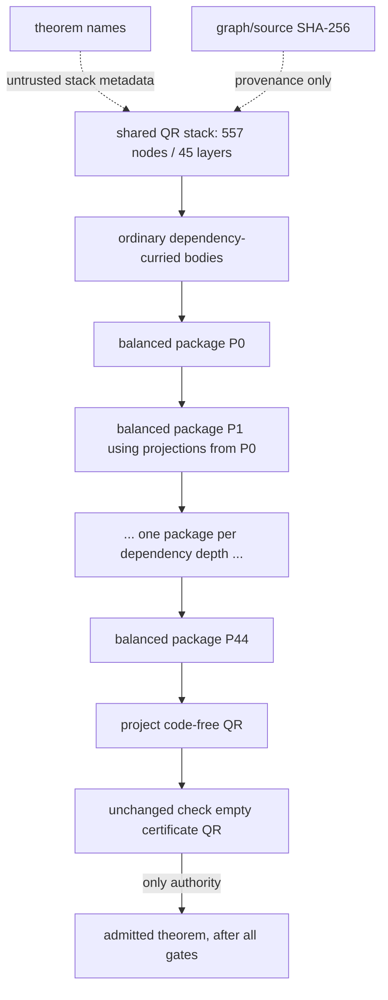

# Layered `Cut` bundles for unchanged-kernel DAG closure

## Recommendation

The **layered `Cut` bundle** strategy has now completed the genuine
quadratic-reciprocity closure. It compiles the complete modular theorem DAG
to one ordinary Peano Lab `Proof` containing only existing constructors. The
unchanged existing kernel accepted the final judgment

$$
\operatorname{check}(\varnothing,\mathit{certificate},
  \mathrm{QuadraticReciprocity}).
$$

No `ClosedRef`, theorem environment, trusted hash, cached receipt, or new
checker judgment is required.  The contextual `Cut` rule is used exactly as
it is today.

The actual accepted ordinary certificate has **54,870 structural proof nodes,
35,052 proof objects, depth 129, and 252,961 annotation occurrences** across
all 45 layers. A separate self-contained canonical proof DAG additionally
retains all 557 real bodies and 1,787 dependencies; its independent Lean
checker formally proves that acceptance implies an ordinary intuitionistic
derivation of the exact root. This reusable transport checker adds no trusted
proof rule and is not needed to justify the already accepted ordinary
certificate. Exact provenance and memory measurements are in the
[completed closure receipt](quadratic-reciprocity-closure-receipt.md).

The implementation is deliberately neutral and untrusted:

- `peano-lab/py/peano_lab/library/layered_replay.py` is the generic production
  compiler of ordinary proofs;
- `peano-lab/py/peano_lab/experimental/layered_cut_bundle.py` retains only the
  old `ClosedBundle` compatibility adapter and recursive comparison;
- `peano-lab/py/peano_lab/experimental/quadratic_reciprocity_layered.py` is a
  thin adapter over the shared production-neutral QR stack;
- the production kernel, proof grammar, tactics, and theorem registry are not
  modified;
- the compiler output has authority only after the ordinary kernel accepts it.

## Input contract

For each theorem node $i$, retain:

- its closed target $A_i$;
- its ordered direct dependencies $d_1,\ldots,d_k$;
- one ordinary modular body $\pi_i$ proving

  $$
  A_{d_1}\to\cdots\to A_{d_k}\to A_i
  $$

  from the empty context.

These are exactly the dependency-curried bodies already produced by public
`TheoremSpec` replays and candidate body validation.  Human theorem names are
used by the untrusted stack builder, then replaced by local integer IDs.
Hashes remain provenance.

The shared
`peano_lab.library.quadratic_reciprocity_stack.quadratic_reciprocity_stack()`
is the single metadata source.  At the current snapshot it reports:

| QR graph metric | Exact value |
|---|---:|
| public ancestors | 240 |
| candidate ancestors | 317 |
| total nodes | 557 |
| dependency-depth layers | 45 |
| root depth | 44 |
| maximum layer width | 63 |
| maximum direct dependencies of one node | 16 |

The complete width profile is

```text
48,39,44,34,23,21,41,63,33,16,14,13,11,12,6,4,1,21,20,13,
15,12,10,9,7,4,3,2,1,1,1,1,1,1,1,1,1,1,2,1,1,1,1,1,1
```

The experimental QR adapter consumes these shared `admission_order`,
`dependency_depth_by_name`, and `dependency_layers` values.  It does not
duplicate the 84-factory manifest and does not replay or admit a theorem.

## Construction

### 1. Assign dependency depth

For a leaf, let $\delta(i)=0$.  Otherwise let

$$
\delta(i)=1+\max_{d\in\operatorname{deps}(i)}\delta(d).
$$

Every direct dependency is therefore in a strictly earlier layer.  Sort nodes
within a layer by their deterministic local ID.

### 2. Package one layer as a balanced conjunction

If layer $\ell$ contains targets $A_1,\ldots,A_n$, build a balanced binary
conjunction $P_\ell$.  For example, eight nodes produce

$$
P_\ell=
 ((A_1\land A_2)\land(A_3\land A_4))
 \land
 ((A_5\land A_6)\land(A_7\land A_8)).
$$

The balanced tree gives every leaf a projection path of length at most
$\lceil\log_2 n\rceil$.  The QR stack's maximum width is 63, so a dependency
projection needs at most six `AndElimL`/`AndElimR` nodes.

### 3. Prove each theorem from earlier packages

Suppose the current layer is $\ell$.  Its `Cut` lemma is checked in a context
containing the earlier packages newest-first:

$$
P_{\ell-1},P_{\ell-2},\ldots,P_0.
$$

A dependency from layer $j<\ell$ is obtained from hypothesis
$\ell-1-j$ followed by its balanced projection path.  Apply the modular body
to the projections in its original declared order:

$$
\pi_i\;\operatorname{proj}(d_1)\;\cdots\;
       \operatorname{proj}(d_k):A_i.
$$

This is ordinary repeated `ImpElim`.  The dependency proof synthesizes its
closed target from a package hypothesis, so the existing bidirectional
checker has the annotation it needs even when $\pi_i$ begins with
`ImpIntro`.

Combine all theorem proofs in the layer with a balanced `AndIntro` tree to
obtain a proof of $P_\ell$.

### 4. Add one ordinary `Cut` per layer

Nest the layers from zero to the root depth:

```text
Cut(P0, QR, proof_P0,
  Cut(P1, QR, proof_P1,
    ...
      Cut(P44, QR, proof_P44,
        project_QR_from_P44))))
```

The lemma branch for $P_\ell$ sees precisely the hypotheses
$P_{\ell-1},\ldots,P_0$.  The body branch adds $P_\ell$ as the newest
hypothesis.  This is exactly the existing contextual `Cut` scope discipline;
no capture-sensitive substitution occurs.

The final projection selects the code-free combined quadratic-reciprocity
formula from the last package.  In the current graph the last layer has one
node, so this projection is just `Hyp(0)`.

## Soundness

Soundness follows directly from repeated applications of rules already in the
kernel.

Induct over the layer index.  The layer-zero package proof is closed.  Assume
the surrounding nested `Cut` bodies provide $P_0,\ldots,P_{\ell-1}$.  Each
direct theorem dependency is obtained by valid conjunction elimination from
one of these hypotheses.  The existing kernel checks the theorem's ordinary
dependency-curried body and repeated implication elimination.  Balanced
conjunction introduction proves $P_\ell$.  The existing `Cut` rule adds that
package for the remaining layers.  Finally conjunction elimination proves the
root target.

The compiler is not part of the soundness boundary.  A bug in:

- dependency depth;
- package balancing;
- de Bruijn hypothesis index;
- projection direction;
- declared dependency order;
- layer proof assembly; or
- root selection

produces an ordinary proof that the unchanged kernel rejects.  There is no
new acceptance branch in which the compiler can assert that a reference was
previously checked.

## Why layering is better than a 557-node sequential spine

One could instead introduce every theorem as its own nested `Cut`.  That
avoids recursive duplication but adds roughly 557 levels before accounting
for the theorem bodies, far beyond the current depth-256 policy and likely
beyond safe host recursion.

Layering replaces that spine with graph height: 45 Cuts for the QR stack.
Balanced packages add at most six projection levels and six `AndIntro` levels
at the widest layer.  A rough depth envelope is therefore

$$
45+6+\max_i(\operatorname{depth}(\pi_i))+16,
$$

not 557 plus body depth.  The exact compiled proof metric, rather than this
upper-bound sketch, remains the admission gate.

## Why it removes recursive duplication

Current recursive theorem replay closes every node separately.  If theorem
$X$ is used under two later branches, the final kernel traverses its closed
certificate on both incoming paths.  Preserving the same immutable Python
object reduces allocation but does not reduce structural occurrence count or
checking work.

In a layered bundle:

- every modular theorem body appears once in exactly one layer package proof;
- a reused theorem is subsequently a short projection from its package;
- every package lemma branch appears once in the final Cut spine;
- structural work is approximately the sum of modular bodies plus direct-edge
  projections and balanced conjunction glue.

This is a compile-time form of common-subproof elimination expressed entirely
through existing natural-deduction rules.

## Executable synthetic comparison

The focused fixture contains 20 theorem nodes in eight layers.  Each width-3
layer reuses every theorem in the previous layer.  Both closures are accepted
by the unchanged intuitionistic kernel:

| Certificate | Structural proof nodes | Depth | Distinct Python proof objects | Reused references |
|---|---:|---:|---:|---:|
| layered balanced-package Cuts | 274 | 16 | 274 | 0 |
| current-style recursively closed Cuts | 3,643 | 20 | 71 | 32 |

The layered structural certificate is about 13.3 times smaller on this
fixture.  The recursive version retains fewer distinct Python objects because
the diagnostic builder deliberately memoizes immutable dependency
certificates; nevertheless the kernel still follows 3,643 structural
occurrences.  This illustrates why both structural and distinct-object
metrics must remain release gates.  The real QR graph may have a different
trade-off.

Run the comparison with:

```console
cd peano-lab/py
python3 -m pytest -q tests/test_layered_cut_bundle_experiment.py
python3 -m pytest -q tests/test_layered_replay.py
```

## Full QR-graph scaffold checks

Two laptop-safe experiments exercise the exact 557-node, 1,787-edge,
45-layer topology without replaying a single real theorem body.

The first attaches a distinct one-node dummy body to every real blueprint
node. It is deliberately invalid, so the unchanged kernel rejects the final
proof. Before rejection, compilation gives exact fixed-scaffold measurements:

| Dummy-body scaffold metric | Value |
|---|---:|
| ordinary proof nodes / depth | `13,705 / 56` |
| distinct proof objects / edges | `13,705 / 13,704` |
| reused references | `0` |
| fixed glue beyond one node per body | `13,148` |
| balanced package-formula occurrences / maximum depth | `144,197 / 68` |
| proof annotation occurrences / combined envelope depth | `157,579 / 92` |

This measures package, projection, implication-application, and Cut glue. It
is not a proof-quality or QR-capacity receipt: dummy bodies are not theorem
replays, and kernel rejection is the required outcome.

The second retains every real node, edge, dependency order, layer, projection
path, and context index. Each node receives a unique shallow closed reflexive
marker formula derived from the bit pattern of its local node ID. Its
dependency-curried body concludes by `EqRefl`, but it first contains one
existing contextual `Cut` per direct dependency. For dependency position
`k`, that Cut checks the dependency's exact marker target against the matching
`Hyp(k-1)`. Thus a wrong projection ID or left/right direction produces the
wrong unique marker, while a wrong dependency order produces the wrong
hypothesis; the unchanged kernel rejects either mistake. It accepts this
strong exact-topology surrogate at 19,066 proof nodes and depth 74. Its
balanced package formulas measure 19,297 structural occurrences at maximum
depth 18; the full proof envelope contains 142,134 formula/term annotation
occurrences at combined depth 84.

This is stronger compiler-integration evidence than the small fixture because
all 1,787 real dependency applications and their declared order are exercised.
It is still explicitly **not** a quadratic-reciprocity proof: no real target
or real theorem body is present.

The focused production and WMI integration tests contain these experiments:

```console
cd peano-lab/py
python3 -m pytest -q tests/test_layered_replay.py \
  tests/test_quadratic_reciprocity_layered_wmi.py
```

## Resource and feasibility assessment

The generic compiler retains the closed-DAG input preflight policy:

- 4,096 graph nodes;
- 256 dependencies per node;
- 65,536 direct edges;
- 500,000 occurrences, 100,000 distinct objects, and depth 256 per modular
  body;
- 500,000 formula/term annotation occurrences and combined proof-envelope
  depth 256 per modular body;
- 5,000,000 cumulative modular-body occurrences and 500,000 summed per-body
  objects;
- 5,000,000 cumulative modular-body annotation occurrences;
- exact closed-formula validation and graph cycle/dangling rejection.

It now also fails closed while building package annotations beyond 500,000
formula occurrences or depth 256, and while building a final ordinary
certificate beyond the following production-neutral output limits:

| Final ordinary certificate | Existing release bound |
|---|---:|
| structural proof occurrences | 500,000 |
| distinct in-memory proof objects | 100,000 |
| proof depth | 256 |
| formula/term annotation occurrences | 5,000,000 |
| combined proof-envelope depth | 256 |

These compiler limits are availability checks, not authority. Admission must
still apply the unchanged empty-context kernel check to the returned ordinary
proof and independently pin the live-use policy at its public caller.

The likely strengths are structural count and depth.  The main uncertainty is
distinct-object count: the layered proof keeps one instance of every modular
body plus projection and package glue.  This is precisely what the WMI run
must measure.  Raising a cap before seeing those metrics is not justified.

Formula cost is another explicit gate. The compiler's exact iterative envelope
scanner covers every one of the 25 kernel proof constructors and charges each
incoming reference to a formula or term stored in `Cut`, `ForallElim`,
`ExistsIntro`, `EqRefl`, `EqSubst`, and `Ind`. It rejects `DNE`, engine holes
and metavariables, custom proof subclasses, malformed fields, invalid
hypothesis indices, and unknown arithmetic axioms before a candidate is
returned. The candidate and WMI receipt expose annotation occurrences and
combined envelope depth alongside ordinary proof and balanced-package metrics.
The unchanged kernel still performs the decisive logical check.

## Mutation and failure behavior

No compiler receipt is trusted.  The authoritative negative tests mutate the
compiled ordinary proof and ask the existing kernel again.

Required cases are:

1. mutate every modular body once;
2. mutate every node target once;
3. redirect, reorder, delete, and add every direct dependency edge where a
   type-correct mutation can be generated;
4. flip every balanced projection direction;
5. change every package formula annotation;
6. mutate each package lemma and nested body child of every `Cut`;
7. change every `Cut` conclusion annotation;
8. change the final root projection and caller target;
9. reject cycles, dangling IDs, duplicate IDs/edges, unreachable nodes, free
   formulas, proof/formula subclasses, and malformed objects before compile;
10. reject all `DNE` nodes under ordinary `check`, even if the untrusted input
    metadata claims a different mode.

A mutation that happens to produce another genuine proof is not a soundness
failure; the test generator should choose an independently false annotation
or record that the changed proof still checks for a logically valid reason.

## Browser/Pyodide implications

Unlike a new serialized proof-DAG checker, the layered route requires no new
browser artifact format.  It produces the same kind of ordinary immutable
`Proof` object used by current QED and library replay.  That substantially
reduces deployment risk.

It still requires a real Pyodide gate:

- compiling 557 modular bodies and balanced packages may allocate many Python
  objects before checking;
- the final existing checker remains recursive and follows the entire layered
  structure;
- package formula validation adds work not shown in proof-node metrics;
- the Worker must remain responsive to Stop, and interruption must discard the
  partial certificate/session;
- the exact vendored Pyodide runtime and worker source must be used cold;
- no CPython or WMI receipt substitutes for the browser check.

The browser should not receive a trusted precomputed receipt or a theorem hash.
It must construct or load the complete ordinary proof and call the existing
kernel.  A later compact serialization may improve transfer time, but decoding
cannot grant authority.

## QR integration path

1. Use the shared 557-node/45-layer stack metadata; do not maintain a second
   manifest.
2. Produce and body-check one ordinary dependency-curried certificate for
   every public and candidate ancestor.  Public nodes should be replayed
   modularly rather than imported as recursively closed leaves.
3. Attach those bodies to the experimental local-ID blueprint.  The resulting
   graph contains no theorem names or hashes.
4. Compile the balanced 45-layer `Cut` certificate on WMI.
5. Record proof structural/object/depth metrics, formula package metrics,
   elapsed time, and peak memory before the authoritative kernel call.
6. Run `check((), certificate, QUADRATIC_RECIPROCITY_COMBINED)` twice in cold
   fresh processes.
7. Perform direct mutation over the final Cut spine, packages, projections,
   bodies, and dependency metadata.
8. Run the exact certificate under cold Pyodide in the Worker.
9. Only then consider public registration and Book/catalog claims.

The laptop should run only the static stack/blueprint and small synthetic
tests.  It should not construct or check the full 557-body certificate.

## Present status

Green, laptop-safe evidence:

- the generic balanced-package compiler;
- unchanged-kernel checking of small multi-layer bundles;
- exact one-occurrence inclusion of every modular body in the synthetic
  layered certificate;
- a current-style recursive Cut comparison;
- body, graph, cycle, dangling, target, and logic-mode fixtures;
- direct static consumption of the shared 557-node, 45-layer QR stack API;
- 27 focused hardened compiler/compatibility/QR tests on the recorded laptop
  run, plus an independent 25/25 constructor-coverage review. Adversarial
  cases include hidden deep `Cut` annotations, every annotated constructor,
  target double-charging, malformed topology before body scanning, and
  DNE/hole/metavariable/custom-node rejection.

Not yet claimed:

- generation of all 557 real modular proof bodies;
- a full layered QR certificate;
- final proof/object/formula metrics;
- an authoritative full QR kernel replay;
- exhaustive mutation of the real artifact;
- WMI capacity or Pyodide/browser acceptance;
- theorem registration or admission.

## Architecture comparison

| Property | Recursive per-theorem Cut closure | Layered ordinary Cut bundle | New trusted ClosedCut DAG |
|---|---|---|---|
| Kernel changes | none | none | yes |
| Final artifact is ordinary `Proof` | yes | yes | no / new bundle judgment |
| Rechecks shared closed ancestors | yes | no; projects packages | no |
| Spine depth | recursive dependency paths | graph height (45 for QR) | graph scheduler, not proof spine |
| Hash/name authority | none | none | must remain none |
| New codec required | no | no | likely yes |
| Immediate recommendation | baseline only | **first choice** | fallback after measured failure |


