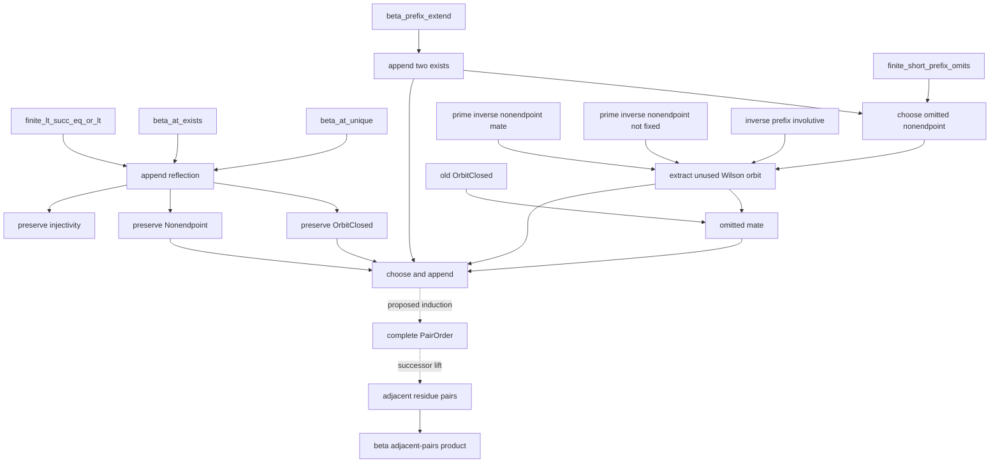
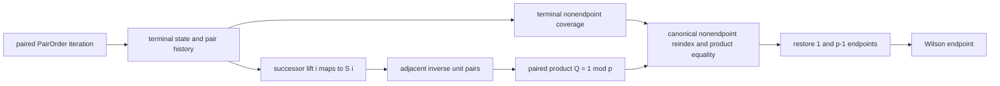

# Pair-order encoding for fixed-point-free involutions

Status: **native-PA candidate design, not a theorem-admission record**.

The source candidate is
[`wilson_pair_order_candidate.py`](../../peano-lab/py/peano_lab/library/wilson_pair_order_candidate.py).
Its nine dependency-curried bodies passed the independent kernel on
2026-07-30 under a hard 60-second local preflight; the complete pass took
3.9 seconds. Gates 1--3 of the focused audit (contracts/bodies, hygienic
helpers, and ordered graph/source isolation) pass in about 4 seconds. The
stack has **not** been recursively closed, profiled, mutation-tested on WMI,
or admitted. The finite-omission and Wilson inverse layers on
which they depend have body-replay evidence, but remain isolated candidates;
that evidence is not permission to cite them as public closed theorems.

This note separates three things deliberately:

1. generic beta-prefix combinatorics for any coded involution;
2. the Wilson instantiation using the inverse map on zero-based nonzero-residue
   indices;
3. the still-proposed induction, no-repetition, completeness, and product
   bridges needed for Wilson and Euler.

No script in this layer uses double-negation elimination, `ring`, a sequence
primitive, or equality of raw beta codes.

## Expanded relations

The notation in this note is documentation only. Every occurrence is expanded
hygienically to the unchanged first-order PA grammar before parsing.

For the checked beta convention, write

\[
\operatorname{At}(b,c,i,x) :\Longleftrightarrow
 \bigl(\exists h.\ h+Sx=S((Si)c)\bigr)\land
 \bigl(\exists q.\ b=qS((Si)c)+x\bigr).
\]

The omission predicate is extensional on the decoded prefix:

\[
\operatorname{Omit}(b,c,l,x) :\Longleftrightarrow
 \neg\exists i.\ i<l\land\operatorname{At}(b,c,i,x).
\]

`Append2(b,c,z,d,l,a,e)` says exactly:

\[
\begin{aligned}
 &\operatorname{At}(z,d,l,a)\ \land\
 \operatorname{At}(z,d,Sl,e)\ \land\\
 &\forall i,x.\ i<l\to\operatorname{At}(b,c,i,x)
                    \to\operatorname{At}(z,d,i,x).
\end{aligned}
\]

It does not equate `(b,c)` and `(z,d)`, and it makes no claim about entries
outside the stated prefix.

For an arbitrary beta-coded map `(u,v)`, orbit closure of an order prefix is

\[
\begin{aligned}
\operatorname{OrbitClosed}(u,v,b,c,l) :\Longleftrightarrow
\forall q,s,m.\;&q<l\to\operatorname{At}(b,c,q,s)
 \to\operatorname{At}(u,v,s,m)\\
&\to\exists t.\ t<l\land\operatorname{At}(b,c,t,m).
\end{aligned}
\]

The Wilson-specific order stores zero-based indices. Its range invariant is

\[
\operatorname{Nonendpoint}(b,c,l,n) :\Longleftrightarrow
 \forall q,s.\ q<l\to\operatorname{At}(b,c,q,s)
 \to s\ne0\land Ss\ne n.
\]

When `p=Sn`, index `i` denotes residue `Si`; the two excluded index endpoints
`0` and `r` with `n=Sr` denote residues `1` and `p-1`.

## Authored isolated ladder

The following are source candidates, not proved or admitted facts.

| order | candidate | exact role | direct dependencies |
|---:|---|---|---|
| 1 | `beta_prefix_append_two_exists` | append `a,e` at `l,Sl`, preserving every old entry | `beta_prefix_extend`, `le_refl`, `le_succ` |
| 2 | `beta_prefix_append_two_reflect` | every entry below `S(Sl)` is the second append, first append, or an old entry | `finite_lt_succ_eq_or_lt`, `beta_at_exists`, `beta_at_unique` |
| 3 | `finite_prefix_choose_unused_nonendpoint` | temporarily append endpoint values `0,r`, then use finite omission to choose an omitted `i<n` with `i!=0` and `Si!=n` | rungs 1, `finite_short_prefix_omits`, `le_refl`, `le_succ`, `succ_injective` |
| 4 | `prime_choose_unused_nonendpoint_orbit` | decode the mate `j` of the chosen `i` and return both directions, bounds, nonendpoint facts, and `i!=j` | rung 3, `prime_inverse_prefix_nonendpoint_mate`, `prime_inverse_prefix_nonendpoint_not_fixed`, `inverse_prefix_involutive` |
| 5 | `orbit_closed_unused_mate` | from old orbit closure, omission of `i`, and `j -> i`, prove that `j` is omitted too | none |
| 6 | `beta_prefix_append_two_orbit_closed` | appending both directions `a -> e` and `e -> a` preserves orbit closure | rung 2, `beta_at_unique`, `le_refl`, `le_succ` |
| 7 | `beta_prefix_append_two_nonendpoint` | preserve the nonendpoint range invariant | rung 2 |
| 8 | `beta_prefix_append_two_injective` | preserve decoded-prefix injectivity when both appended values were omitted and are distinct | rung 2 |
| 9 | `prime_pair_order_choose_append` | choose an unused Wilson inverse orbit, append `i,j` adjacently, and return the preserved closure and nonendpoint invariants | rungs 1 and 4--7 |

Body-only kernel receipts are:

| candidate | nodes | depth |
|---|---:|---:|
| `beta_prefix_append_two_exists` | 63 | 27 |
| `beta_prefix_append_two_reflect` | 115 | 32 |
| `finite_prefix_choose_unused_nonendpoint` | 113 | 30 |
| `prime_choose_unused_nonendpoint_orbit` | 138 | 43 |
| `orbit_closed_unused_mate` | 34 | 20 |
| `beta_prefix_append_two_orbit_closed` | 167 | 38 |
| `beta_prefix_append_two_nonendpoint` | 63 | 31 |
| `beta_prefix_append_two_injective` | 202 | 36 |
| `prime_pair_order_choose_append` | 191 | 53 |

These are dependency-curried body metrics, not recursively closed
certificate metrics.

The exact constructive size premise in rungs 3, 4, and 8 is

\[
\exists h.\ h+S(S(Sl))=n.
\]

This is not cosmetic. The proof first appends the two endpoint values to a
prefix of length `l`, then applies the stronger theorem that any prefix
strictly shorter than `n` omits a value below `n`. An omitted value cannot be
either appended endpoint, so it is an omitted nonendpoint of the original
prefix. No classical extraction from `not forall` occurs.

Orbit closure is the key second half of the chooser. If the chosen source `i`
is absent but its mate `j` were present, the decoded edge `j -> i` would force
`i` to be present. Thus both members of the two-cycle are fresh before the
append.

## Dependency graph

Solid boxes through `STEP` denote authored candidate scripts. Dashed edges
denote obligations that are not yet scripted.

## What rung 9 establishes—and what it does not

`prime_pair_order_choose_append` is the requested local extension theorem. It
returns codes `z,d` and indices `i,j` such that:

- `i` and `j` were both omitted by the old prefix;
- `i,j<n`, both are nonendpoints, and `i!=j`;
- the inverse code contains `i -> j` and `j -> i`;
- `Append2(b,c,z,d,l,i,j)` holds;
- the new prefix of length `S(Sl)` is orbit-closed and contains only
  nonendpoints.

This entrance theorem intentionally does **not** assert:

- injectivity/no repetition in its own combined result (the separate rung 8
  now proves exactly the required preservation step);
- that `l=m+m`, hence that the new positions are literally `m+m` and
  `S(m+m)`;
- existence of a full iteration through all nonendpoint values;
- coverage of every nonendpoint when the iteration stops;
- a successor-lifted factor code storing residues `Si,Sj` rather than indices;
- product equality between that factor code and the original range with the
  two fixed endpoints removed.

Those four later facts are now supplied by the bounded-state,
paired-iteration, successor-lift and terminal-product modules documented
below; they were deliberately not smuggled into the one-step contract.

The first omission pair and `i!=j` feed the now-authored rung 8:

\[
\operatorname{InjectivePrefix}(b,c,l)\land\operatorname{Append2}(...,i,j)
\land\operatorname{Omit}(b,c,l,i)\land\operatorname{Omit}(b,c,l,j)
\land i\ne j
\to\operatorname{InjectivePrefix}(z,d,S(Sl)).
\]

Its nine-case proof reflects both new entries as second/first/old. Two old
entries use old injectivity; mixed old/new cases contradict omission; the two
new positions are separated by `i!=j`. The later state-preservation theorem
composes this fact with rung 9 and returns injectivity alongside the other
invariants.

## Executed route from one step to terminal product

The implemented native ladder is:

1. compose rung 8 with rung 9 so the extension carries injectivity;
2. prove the arithmetic transport `l=m+m -> S(Sl)=S m+S m`;
3. induct on the pair count, using the combined extension at each successor;
4. prove that the terminal injective nonendpoint prefix covers every
   nonendpoint index;
5. successor-lift the index order so adjacent entries are residues `Si,Sj`;
6. transport the stored inverse congruence to
   `Si*Sj == 1 (mod p)` at positions `k+k,S(k+k)`;
7. apply `beta_adjacent_unit_pairs_product_one`;
8. reindex the lifted product to the exact canonical nonendpoint range;
9. restore the fixed residue factors `1` and `p-1`, connect to `(p-1)!`, and
   handle `p=2` separately because its two endpoint descriptions coincide.

Steps 1--8 now have dependency-curried native certificates. Step 9 is the
remaining mathematical boundary.

Steps 3 and 4 use a careful stopping contract. For an odd prime, `n=p-1`
is even and the number of nonendpoint indices is `n-2`. The local extension
premise holds while at least one two-cycle remains. At terminal length `n-2`,
cardinality—not raw code equality—must show completeness.

The adjacent-pair product consumer stores the decoded factors themselves and
proves `left*right == 1 (mod p)`. The present order stores zero-based inverse
indices, whose native inverse fact is `(S i)*(S j) == 1 (mod p)`. Therefore a
successor-lift/reindex bridge is mandatory; silently feeding the index code to
the pair-product theorem would be wrong.

## Generic reuse for Euler's criterion

Rungs 1, 2, 5, 6, and 7 are combinatorial and are generic over a beta-coded
map. The Wilson-specific assumptions occur only in rungs 3, 4, and 8, where
the endpoints and prime inverse API select a fresh orbit.

Euler's nonresidue branch needs the same engine instantiated with

\[
f_a(x)=a x^{-1}\pmod p.
\]

For `not QRes(p,a)`, a fixed point of `f_a` would give `x*x == a (mod p)`, so
the map is fixed-point-free. Each two-cycle has product congruent to `a`, not
to `1`. A complete generic PairOrder plus a parameterized adjacent-pair fold
would therefore identify the full residue product with `a^h`; Wilson then
gives `a^h == p-1`, the nonresidue half of Euler's criterion. Conversely,
`a^h == 1` rules out that branch, and the existing constructive bounded
`QRes` decision can extract the square-witness branch without DNE.

The reusable abstraction should consequently parameterize:

- a total functional beta-coded map on a bounded finite domain;
- an involution law;
- a fixed-point-free law on the selected domain;
- an optional excluded-endpoint predicate;
- a pair-product relation `PairValue(i,j,a)`.

The current `OrbitClosed`/append machinery already has that generic shape.
What remains Wilson-specific is the fresh-source chooser and its endpoint
accounting. A future generalization should replace that piece, not duplicate
the beta-prefix extension proof.

## Validation and admission gates

Before any name in this file can become a library theorem, an exact frozen
snapshot must pass, on WMI:

1. source import/factory construction and exact statement parsing;
2. dependency-order, core-boundary, and hygienic-binder checks;
3. body replay for all nine scripts in source order;
4. two cold recursive closed replays with deterministic certificate hashes,
   depth, structural-node, distinct-object, RSS, and no-DNE receipts;
5. false-contract and every direct Cut-edge mutation rejection;
6. a separate clean, receipt-pinned admission replay.

The bounded local preflight establishes only that the nine scripts check
under their stated dependency hypotheses. It does not recursively prove
those dependencies or admit the resulting names. Focused
`wilson-pair-order` job `173017`, from exact snapshot
`8c9c4ae067b0dc202684e410bee563cd592a67080cb7c9939440ae8b44d4bccd`,
is pending with zero CPU; its recursive replay, profile, deterministic second
pass, no-DNE/capacity receipts, false-target rejection, and direct Cut-edge
mutations remain pending.

The combined contract is 9,400 source characters. It is accepted by the
internal candidate parser but exceeds the 8,192-character interactive paste
ceiling. This does not justify raising the UI limit by itself: either keep the
composition internal, split its returned package, or review a separate input
limit change with boundary tests.

## Bounded induction and terminal coverage tranche

The isolated follow-on module
`wilson_pair_order_induction_candidate.py` corrects one important omission in
the earlier design.  The maintained state is now exactly

\[
\operatorname{PairOrderState}(u,v,b,c,l,n) :=
\operatorname{OrbitClosed}(u,v,b,c,l)\land
\operatorname{BoundedInto}(b,c,l,n)\land
\operatorname{NonendpointPrefix}(b,c,l,n)\land
\operatorname{InjectivePrefix}(b,c,l).
\]

The bounded component is essential.  Injectivity plus exclusion of `0` and
the last index does not prevent a beta code from storing distinct values
outside the finite domain, so those two hypotheses alone cannot establish
terminal coverage.

All fifteen dependency-curried bodies check in the unchanged PA kernel:

| candidate | nodes | depth |
|---|---:|---:|
| `prime_pair_order_choose_append_injective` | 95 | 40 |
| `pair_order_double_succ_length` | 19 | 12 |
| `beta_prefix_append_two_bounded_into` | 69 | 27 |
| `prime_pair_order_choose_append_state` | 90 | 42 |
| `orbit_closed_prefix_zero` | 23 | 19 |
| `bounded_into_zero` | 18 | 14 |
| `nonendpoint_prefix_zero` | 20 | 16 |
| `injective_prefix_zero` | 22 | 18 |
| `pair_order_state_zero` | 64 | 19 |
| `pair_order_remaining_pairs_short` | 8 | 8 |
| `pair_order_terminal_double_length` | 12 | 9 |
| `finite_bounded_nonendpoint_injective_coverage` | 266 | 44 |
| `pair_order_state_terminal_coverage` | 33 | 20 |
| `prime_pair_order_pair_count_step` | 72 | 37 |
| `prime_pair_order_remaining_pair_step` | 51 | 36 |

These are body receipts, not admission receipts.  Append boundedness is proved
by splitting an index below `S(S l)` into the second appended position, the
first appended position, or an old position.  The complete choose/append step
therefore preserves all four state components.

Terminal coverage at `n=S(S l)` reuses, without duplicating, the generic Gauss
predecessor-recoding ladder:

- `beta_magnitude_predecessor_recode_exists`;
- `beta_magnitude_predecessor_recode_reflect`;
- `beta_magnitude_predecessor_recode_bounded`;
- `beta_magnitude_predecessor_recode_injective`;
- `beta_magnitude_predecessor_recode_surjective`.

Bounded nonendpoint values lie in `1,...,l`.  Removing one successor recodes
them into an injective self-map of `0,...,l-1`; the public
`finite_bounded_injective_surjective` theorem makes that recode surjective,
and reflection lifts coverage back to the original values.  The resulting
theorem is

\[
\begin{aligned}
&\operatorname{BoundedInto}(b,c,l,S(Sl))\land
\operatorname{NonendpointPrefix}(b,c,l,S(Sl))\land
\operatorname{InjectivePrefix}(b,c,l)\\
&\quad\Longrightarrow
\forall s<S(Sl),\ s\ne0\land Ss\ne S(Sl)
\Longrightarrow \exists q<l,\ \operatorname{BetaAt}(b,c,q,s).
\end{aligned}
\]

The pair-count induction is now authored. A critical audit found that
\(\operatorname{PairOrderState}\) alone forgets *which consecutive entries
were appended as an inverse orbit*. The iteration therefore carries the
separate constructive history relation

\[
 \operatorname{PairedInverseWitness}(u,v,b,c,m),
\]

which records, for each \(t<m\), entries at positions \(t+t\) and
\(S(t+t)\) plus the decoded inverse edge between their values. The
strengthened invariant is:

\[
\begin{aligned}
\forall p,n,u,v,r,m,k.\;&p=Sn\to\operatorname{Prime}(p)\to
\operatorname{InversePrefix}(p,n,u,v,n)\to n=Sr\\
&\to (k+k)+S(S(m+m))=n\\
&\to\exists b,c.\bigl(\operatorname{PairOrderState}(u,v,b,c,m+m,n)\land
\operatorname{PairedInverseWitness}(u,v,b,c,m)\bigr).
\end{aligned}
\]

Here `m` pairs have been stored and `k` pairs remain.  The successor case
applies the existing witness
`S(k+k)+S(S(S l))=n`; the terminal specialization `k=0` gives
`n=S(S(m+m))`, so terminal coverage applies. The seven paired-history and
iteration bodies check at `34/16`, `38/17`, `19/15`, `114/31`, `122/40`,
`169/39`, and `52/26` nodes/depth.

Successor lifting is also authored. It constructs a beta code `f,g`
satisfying

\[
q<m+m\land\operatorname{BetaAt}(b,c,q,i)
\Longrightarrow\operatorname{BetaAt}(f,g,q,Si),
\]

and combines boundedness, the recorded inverse edge, inverse-prefix
functionality, and beta uniqueness to prove `AdjacentUnitPairs(p,f,g,m)`.
The generic adjacent-pair fold then packages an exact product `Q` with
\(Q\equiv1\pmod p\). The four lift/product bodies check at `17/11`,
`124/38`, `41/31`, and `65/32` nodes/depth.

The canonical transport is now authored in four isolated candidates. Terminal
coverage yields the exact positive magnitude range; a predecessor map aligns
that range with the successor-lifted PairOrder code; general finite-product
reindexing identifies the exact products; and
`prime_wilson_terminal_product_package_exists` packages the terminal history,
coverage, product congruent to one, canonical `Range2` product and their exact
equality. The bodies measure `80/30`, `152/42`, `79/39`, and `188/65`
nodes/depth, and their focused 60-second-capped test passes `3/3`.

At this terminal-product checkpoint the remaining boundary was endpoint
restoration: insert factors `1` and `p-1`, connect the result to the exact
factorial relation, and handle prime `2` separately. The following tranche now
discharges that body-level boundary. None of these receipts is recursive
closure or admission.

## Endpoint restoration and Wilson capstone

That final body-level boundary is now discharged in
[`wilson_endpoint_restoration_candidate.py`](../../peano-lab/py/peano_lab/library/wilson_endpoint_restoration_candidate.py).
The seven-candidate ladder proves:

1. `Factorial(1,1)` and the leading-unit bridge from a canonical `Range2`
   product of length `l` to `Factorial(S l,P)`;
2. restoration of the final factor when `n=S(S l)`;
3. transport of `P == 1 (mod p)` to `P*n == n (mod p)`;
4. the constructive split `p=2` or `p=S(S(S(m+m)))`;
5. extraction of the canonical product congruent to one from the terminal
   PairOrder package;
6. the exact capstone

\[
p=Sn\land\operatorname{Prime}(p)\land\operatorname{Factorial}(n,F)
\Longrightarrow F\equiv n\pmod p.
\]

Body nodes/depth, in dependency order, are `30/15`, `258/45`, `63/29`,
`21/16`, `104/30`, `94/35`, and `110/31`. The focused certificate-level
no-DNE audit passes `3/3` in 4.00 seconds. The prime-two branch uses only
`Factorial(1)=1` and reflexive congruence; it does not instantiate Range2 or
PairOrder, so coincident endpoints are handled honestly. These remain
unregistered candidate bodies pending recursive WMI review and admission.

The focused WMI suite is `wilson-pair-order-induction`. Local gates 1--3
(exact contracts/body receipts, state hygiene, and ordered dependency/source
isolation) pass. Focused job `173022`, from exact snapshot
`fd129d34bf4a31a131a28d55bc6a16153984e0d37ac24dcefe7c2735cfb058d1`,
is pending with zero CPU. Cold recursive replay/profile and direct
Cut-mutation gates 4--5 remain WMI-only and have not produced a result.
