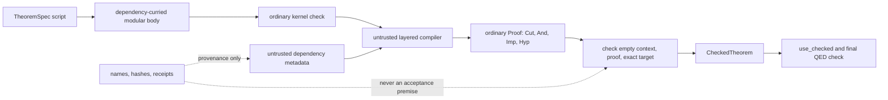
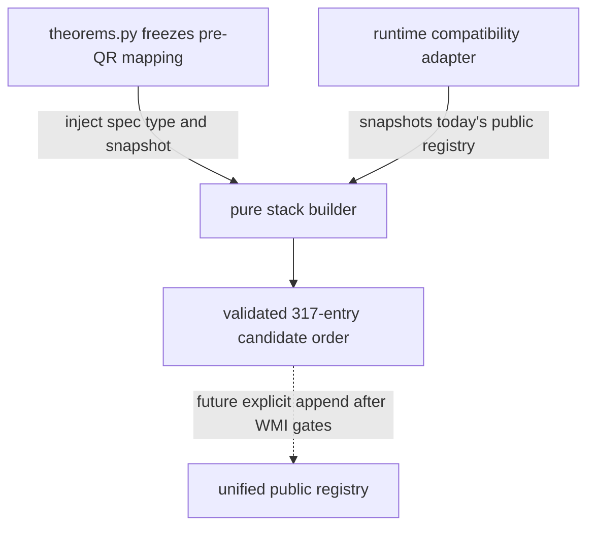
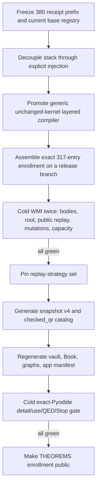

# Native quadratic reciprocity: minimum safe public-admission path

## Decision

The layered `Cut` experiment can become a public Peano Lab theorem without a
new axiom, proof constructor, theorem-reference rule, or trusted hash lookup.
The safe path is:

1. freeze the public registry that predates the QR candidates;
2. assemble the exact QR ancestor set against that frozen registry;
3. append the candidates in their already validated topological order;
4. compile only explicitly selected oversized replays to ordinary layered
   `Cut` proofs;
5. pass every resulting certificate through the unchanged kernel from the
   empty context;
6. regenerate the catalog and browser package only after cold WMI replay,
   mutation, capacity, and Pyodide gates pass.

The exact enrollment count needs one correction that should be kept visible
in code and documentation:

| Quantity | Exact current value |
|---|---:|
| outputs from the 84 candidate factories | 346 |
| entries in `candidate_order` | 317 |
| proper candidate ancestors of the root | 316 |
| QR root entries | 1 |
| factory outputs deliberately omitted as non-ancestors | 29 |
| already public ancestors used by the QR closure | 240 |
| total nodes in the root closure | 557 |

The pinned root statement SHA-256 is
`2a95f83a5a21a5e21e482d5de8a19d55ee1843f676f086438f8a9853b6a97070`.
It is a drift detector only, never proof authority.

Thus **the current 317 count already includes
`quadratic_reciprocity_combined`**.  Admission adds 317 entries, not 318.
The dirty development registry currently has 384 entries, so appending this
exact order would produce 701.  The committed public artifact has 380 entries;
its first 380 receipts are the compatibility prefix that must remain stable.

A successful cold WMI replay is necessary evidence, but it will not itself be
public admission.  No layered QR replay has yet been uploaded or run for the
current snapshot.  The QR root does not appear in `THEOREMS`, `pa lib`, or the
catalog snapshot, and the content-addressed Pyodide application manifest has
deliberately not been regenerated.  Those remain separate release gates.

## Trust boundary

The desired path keeps the proof-theoretic boundary exactly where it is now:



The compiler may use names to find specifications and local IDs to wire a
graph.  A compiler bug must merely create a proof rejected by `check`.  Neither
a name, a graph hash, a source hash, a WMI receipt, nor a cached Python object
may be consumed as proof authority.

The final certificate remains in the existing proof grammar.  In particular,
it uses the current contextual `Cut` rule and balanced `And` packages.  The
kernel checker and the PA formula language remain unchanged.

## Historical registration hazard and current boundary

The original stack implementation had two coupled hazards.  It imported
`TheoremSpec` and `_specs_by_name` from `theorems.py`, which would have created
a partial-initialization cycle if `theorems.py` imported the stack while
constructing `THEOREMS`.  Its cached no-argument builder also rebuilt against
the unified registry, so post-enrollment construction would have treated the
stack's own candidates as public-name conflicts.

That architecture hazard is now removed.  The production-neutral
`quadratic_reciprocity_stack.py` takes the exact specification type and a
caller-supplied public mapping, snapshots that mapping, and never imports the
public registry.  The separate
`quadratic_reciprocity_stack_runtime.py` compatibility adapter snapshots
today's registry for campaign tools; `theorems.py` must not import that
adapter during enrollment.  Fresh-process import-order and snapshot-mutation
tests cover this boundary.  Cache clearing is neither needed nor accepted as
part of correctness.



Candidate factories themselves are suitable for decoupling: they receive the
specification class through their factory argument and do not need to import
the public theorem registry.

## Registry refactor (implemented)

### Injection-based stack assembly

`quadratic_reciprocity_stack.py` now exposes a pure builder receiving both
inputs explicitly:

```python
def build_quadratic_reciprocity_stack(
    *,
    spec_type: type,
    public_by_name: Mapping[str, object],
) -> QuadraticReciprocityStack:
    ...
```

The exact runtime type check on factory outputs compares with the injected
`spec_type`.  The module does not import `_specs_by_name`, call the unified
registry, or perform admission.  It validates:

- exact factory ownership and duplicate-name freedom;
- public/candidate conflicts against the injected frozen base;
- dependency closure and cycle freedom;
- dependency-before-consumer order;
- the exact root statement and three direct root dependencies;
- graph and source provenance digests.

Keep `TheoremSpec` where it is for the first migration.  Moving it to another
module would increase import churn without improving the trust argument.
Typing in the pure stack module can use a small protocol or `Any`; runtime
validation is supplied by `spec_type`.

### Freeze, assemble, then append

After all current public extension tuples have been merged, `theorems.py`
should perform this order exactly:

```python
QR_BASE_THEOREMS = THEOREMS
qr_base_by_name = immutable_validated_map(QR_BASE_THEOREMS)

QR_STACK = build_quadratic_reciprocity_stack(
    spec_type=TheoremSpec,
    public_by_name=qr_base_by_name,
)
QR_THEOREMS = QR_STACK.candidate_order
THEOREMS = _merge_compatible_theorems(THEOREMS, QR_THEOREMS)
```

`QR_BASE_THEOREMS` is a frozen tuple, not a view of the later table.
`QR_THEOREMS` is exactly `candidate_order`: 316 proper ancestors followed by
the root.  Do not enroll the other 29 factory outputs.  Do not append the 240
public ancestors a second time.

The public stack accessor should return the already assembled `QR_STACK`, or
rebuild only when explicitly given the frozen base.  It must never silently
rebuild against the post-admission `_specs_by_name()` table.

Appending after the existing registry has two compatibility benefits:

- all old indices remain unchanged;
- all old theorem dependencies and replay bodies remain unchanged.

No cache-clearing choreography should be necessary during normal import.
Tests may clear replay caches to create cold runs, but cache state must not
alter the registry or graph.

## Generic layered replay API

The reviewed generic builder now lives in
`peano_lab/library/layered_replay.py`; the closed-proof DAG and recursive
comparison remain isolated under `experimental/`.  This is an untrusted proof
compiler, not a new checker.

The production-neutral module imports kernel formulas, kernel proof
constructors, and structural metric helpers only.  It does not import
`theorems.py`, `TheoremSpec`, the QR stack, the public registry, or human
theorem names.  Its relevant API is:

```python
@dataclass(frozen=True, slots=True)
class LayeredReplayNode:
    node_id: int
    target: Formula
    dependencies: tuple[int, ...]
    body: Proof

@dataclass(frozen=True, slots=True)
class LayeredReplayBundle:
    nodes: tuple[LayeredReplayNode, ...]
    root: int

@dataclass(frozen=True, slots=True)
class LayeredReplayCandidate:
    certificate: Proof
    target: Formula
    layers: tuple[tuple[int, ...], ...]
    package_formulas: tuple[Formula, ...]
    package_formula_occurrences: int
    maximum_package_formula_depth: int
    proof_nodes: int
    proof_depth: int
    proof_objects: int
    proof_edges: int
    reused_objects: int
    proof_annotation_occurrences: int
    proof_envelope_depth: int

def compile_layered_replay(
    bundle: LayeredReplayBundle,
    target: Formula,
    limits: LayeredReplayLimits,
) -> LayeredReplayCandidate:
    ...
```

The return type is deliberately named `Candidate`: possession of it does not
mean the theorem is checked.  The compiler should retain the experimental
preflight rules for exact records, closed formulas, dangling edges, cycles,
unreachable nodes, dependency limits, body limits, balanced packages, and
deterministic local-ID order.

The theorem registry supplies a separate adapter with two internal steps.

### Step 1: reconstruct a modular body

```python
def _replay_dependency_curried_body(spec: TheoremSpec) -> Proof:
    target = replay_target(spec)
    state = start(target)
    for dependency in spec.dependencies:
        state = apply_tactic(state, "intro", dependency)
    for command in spec.script:
        ...
    return checked_final(state, target)
```

This is the same authored replay that exists today, stopped before recursive
dependency closure.  `checked_final` must accept the body from the empty
context against the exact dependency-curried formula.  Caching this immutable
body is a performance optimization only; the compiled root proof is still
checked independently.

### Step 2: build an exact local-ID closure

For a selected public root, walk only its transitive dependencies.  Preserve
each specification's declared dependency order, but assign deterministic
local IDs from the public topological order.  Parse every exact statement,
attach its checked modular body, and call `compile_layered_replay`.

The public replay function then performs the decisive operation:

```python
candidate = _build_layered_candidate(spec)
formula = closed_formula(spec.statement)
if candidate.target != formula or not check((), candidate.certificate, formula):
    raise LibraryError(...)
return CheckedTheorem(spec, formula, candidate.certificate, ...)
```

The call to `check((), ..., formula)` must remain visible at the same public
boundary used by ordinary replay.

## Replay strategy and migration policy

Do not add a replay-mode field to `TheoremSpec` in the first migration.  That
dataclass is constructed throughout the library and changing it would create
unnecessary fixture and equality churn.  Use an immutable external mapping or
set, for example:

```python
LAYERED_REPLAY_NAMES = frozenset({"quadratic_reciprocity_combined", ...})
```

There should be no runtime “try recursive, catch capacity error, then layer”
fallback.  Such behavior would make the certificate representation depend on
resource state.  Pin the strategy after WMI measurement.

The minimum initial policy is:

1. `quadratic_reciprocity_combined` is always layered;
2. replay each of the other 316 promoted entries with the existing recursive
   `Cut` closure on WMI;
3. add an intermediate to `LAYERED_REPLAY_NAMES` only if its ordinary closure
   violates a current live-use limit or lacks reviewed headroom;
4. rerun the complete public replay matrix after the explicit set is frozen.

This preserves the old compact replay path for small theorems and prevents
hundreds of overlapping layered certificates from accumulating in the
unbounded `replay` cache.  If WMI shows that many intermediate closures are
oversized, switching every new QR entry to layered replay is sound, but the
memory behavior of `replay_all()` and repeated interactive use must then be
measured before choosing it.

The strategy selector affects construction only.  Both branches end at the
same unchanged empty-context kernel judgment.

## Capacity policy

Current live use rejects certificates beyond these separate limits:

| Metric | Current limit |
|---|---:|
| structural proof occurrences | 500,000 |
| distinct proof objects | 100,000 |
| proof depth | 256 |

The layered compiler adds two availability bounds that the generic proof-node
counter does not measure:

| Layered proof envelope | Compiler limit |
|---|---:|
| formula/term annotation occurrences | 5,000,000 |
| combined proof-envelope depth | 256 |

The layered root must fit all five listed bounds.  It must also fit after the
small wrapper added by `use_checked` and in the final user proof, not merely as
a standalone artifact.  The layered compiler must also scan every exact proof
constructor,
reject `DNE` and engine-only nodes, and record package-formula occurrences,
proof-annotation occurrences, and combined envelope depth because wide
balanced conjunctions can move cost from proof duplication into annotations.

Do not raise limits merely because recursive closure is too large; removing
that duplication is the purpose of layered replay.  If an accepted layered
certificate narrowly misses a limit, first inspect package balance, layer
selection, unreachable-node pruning, and body construction.  A limit increase
is an availability-policy change and requires a separate reviewed commit with:

- an exact new bound rather than an effectively unbounded value;
- cold WMI RSS and elapsed-time measurements;
- exact vendored-Pyodide peak-memory and Stop/restart tests;
- adversarial over-limit rejection tests;
- enough margin for `use_checked` and final QED composition.

Raising a resource bound does not add a mathematical axiom, but an arbitrary
increase can still make the browser unusable or turn malformed input into a
denial of service.

## Receipt stability and snapshot v4

The committed artifact is the compatibility baseline:

| Baseline item | Value |
|---|---|
| committed theorem count | `380` |
| committed ordered root | `73b31b4775d24b6bb9730f2f2df37409aa56dc771fe3e1d0f9de5134b166e89b` |
| first-380 receipt digest | `6b8ff98322caab603eba7d4e321258c117be7308db44f8dd03f336f5755187a1` |

The last digest is over the ordered fields
`index`, `name`, `statement_sha256`, `script_sha256`,
`certificate_sha256`, `proof_nodes`, `proof_depth`,
`distinct_proof_objects`, and `cut_nodes`.  Pin this definition in a test and
include the digest as `legacy_380_receipt_sha256` in the next artifact.  All
first-380 rows must remain byte-for-byte equal in those fields.  The four
post-snapshot public entries currently present in the dirty registry need new
reviewed receipts but must remain before the appended QR tranche.

The certificate representation may remain
`python-dataclass-repr-with-cut-v2`, because layered certificates use the same
ordinary proof dataclasses.  The catalog schema should become v4 because the
current prose incorrectly says every dependency is carried by its own `Cut`.
Add a non-authoritative row field such as:

```text
replay_strategy = recursive_dependency_cuts_v2
replay_strategy = balanced_layer_cut_bundle_v1
```

The v4 policy should say that every certificate is reconstructed from source,
contains no external theorem reference, and passes the independent kernel
from the empty context.  Strategy labels describe provenance; the kernel does
not consume them.

`scripts/build_peano_library_snapshot.py` must include the generic replay
module, the pure QR stack, and the exact 84 candidate sources in its source
receipt.  Derive candidate paths from the reviewed factory manifest or
`source_rows`; do not use an unconstrained filesystem glob.  Artifact
generation replays the full library and therefore belongs on WMI.

## Research catalog and generated knowledge base

Once admission passes, synchronize exactly `QR_STACK.candidate_order` into
`research/arithmetic-library/catalog.json`.  The 240 public ancestors already
have records and must not be duplicated.  Add a documented checked status
such as `checked_qr` rather than calling a new 317-theorem campaign
`checked_m20`.  Update the verifier's exact status set and count assertions at
the same time.

The synchronization script should:

- import the enrolled `QR_THEOREMS` tuple, not all factory outputs;
- preserve its topological order;
- refuse to overwrite a differing record;
- assert exactly 317 new names including the root and exactly 29 omitted
  factory outputs;
- copy statements, dependencies, summaries, and source provenance only;
- state explicitly that the JSON catalog grants no theorem authority.

A `quadratic_reciprocity` domain after `quadratic_residues` makes the atlas
easier to navigate.  Vault pages, theorem-atlas pages, dependency diagrams,
and the Jupyter Book should be regenerated from the admitted catalog on WMI;
they should not be used as evidence that admission succeeded.

## Public UI and `use`

The list-without-replay boundary is now implemented.  Bare `pa lib` parses
each stored statement, rejects free variables, and pretty-prints the resulting
closed formula without constructing any certificate.  The footer says that
certificates are independently kernel-checked *when replayed*.  Listing is
therefore an inventory operation, not a claim that the command just replayed
the full library.  This prevents a future 701-entry index from becoming a QR
certificate campaign merely to print names and statements.

The detail and theorem-use boundaries remain deliberately different.
`pa lib <name>` still calls `replay` before reporting an independent kernel
pass, and `use <name>` still calls public replay before passing the actual
formula and certificate to `use_checked`.  `pa lean <name>` also obtains the
checked theorem on demand.  The lightweight list path cannot consume a
theorem or grant proof authority.

Keep proof construction on demand:

- once admitted, `pa lib quadratic_reciprocity_combined` performs the selected
  replay and displays its successful independent check;
- once admitted, `use quadratic_reciprocity_combined` calls public replay and
  then `use_checked` with the actual formula and certificate;
- final QED checks the complete user proof again;
- `pa lean <name>` exports the exact admitted statement and proof-facing
  script on demand.

`render_theorem` must describe either recursive dependency Cuts or a balanced
layer bundle according to the pinned strategy.  It must not claim that every
dependency has its own `Cut` for a layered certificate.

`SURFACE_THEOREM_NAMES` and restricted capability datasets will grow when
`THEOREMS` grows.  Recompute and audit any capability or dataset digest.  A
name grants permission to request replay; it never bypasses certificate
construction or checking.

Focused tests now monkeypatch `replay` to fail and confirm that bare `pa lib`
still succeeds, while `pa lib <name>` reaches the replay sentinel.  The `use`
path remains covered by the live-library checks.  A mutated certificate
supplied to `use_checked` must continue to fail transactionally without
changing the current proof state.

## Pyodide admission gate

`peano-lab/worker.js` contains an explicit `PY_FILES` list.  The implemented
`scripts/update_peano_worker_sources.py` makes this inventory reproducible: it
lexicographically sorts every Python source below
`peano-lab/py/peano_lab/`, appends `peano-lab/py/driver.py`, and replaces only
the canonical `PY_FILES` block.  Its read-only gate is:

```console
python3 scripts/update_peano_worker_sources.py --check
```

Without `--check`, the same script rewrites a stale block.  The browser test
also compares the listed paths with the complete package tree, so the generic
layered replay module, pure QR stack, all candidate/support modules, and the
driver cannot be silently omitted.  Tests are outside the package inventory
and are not mounted in Pyodide.

Updating `PY_FILES` is packaging preparation, not admission or release
publication. The QR campaign's `peano-lab/APP_MANIFEST.sha256` is synchronized
for the source checkpoint at digest prefix `279f7fd6f2b9`. The corresponding
repository-local `APP_ROOT` and `PEANOAPPID` are synchronized at
`a-279f7fd6f2b9`, with human build label `2026-07-31a`. This is packaging
preparation only: no external deployment or theorem admission is claimed.

The browser gate must use the repository's exact self-hosted Pyodide build,
not CPython as a proxy.  In a cold worker, verify:

1. boot and registry import with all 701 names;
2. `pa lib` list without any theorem replay;
3. `pa lib quadratic_reciprocity_combined`;
4. a proof whose target is the QR statement, followed by `use ... as qr`,
   `exact qr`, and `qed`;
5. Stop during a heavy replay, worker termination, and clean restart;
6. peak browser/Wasm memory, elapsed time, and responsive progress reporting;
7. operation from the pinned offline vendor tree.

The current interactive source limit is separate from proof size.  The QR
statement currently fits it, but the exact browser command should remain a
regression test.

## Required test matrix

The companion
[QR test-migration audit](quadratic-reciprocity-test-migration.md) inventories
the current public-absence and unified-core assumptions and gives the exact
317-enrolled/29-omitted replacement recipe.  Apply that migration atomically
with enrollment so a candidate-body test cannot silently consume its newly
public closed replay.

### Light, deterministic tests

These can run on the laptop and ordinary CI:

- exact factory/output/enrollment counts: `346 / 317 / 29`;
- exact interpretation of 317 as `316 + root`;
- exact root name, statement hash, and three direct dependencies;
- 557-node closure, 240 public ancestors, 45 layers, root depth 44, maximum
  width 63, and maximum direct dependency count 17;
- dependency-before-consumer order and no candidate/public conflicts;
- pure-stack import without importing the public registry;
- fresh-process import permutations: registry first, stack first,
  representative candidate first, and each followed by the other modules;
- identical names and graph/source digests under every import permutation;
- synthetic layered compilation, balanced projection, and malformed-graph
  rejection;
- index rendering without replay;
- exact first-380 receipt digest fixture.

The import tests must use fresh processes.  Clearing an `lru_cache` in one
already initialized interpreter cannot detect partial-module cycles.

### Cold WMI gates

Run each release profile twice in independent cold processes and retain both
receipts:

- replay and kernel-check all 557 dependency-curried modular bodies;
- compile and empty-context-check the layered QR root;
- record graph/source hashes, exact target hash, proof occurrences, objects,
  edges, depth, Cut count, package-formula occurrences/depth, proof-annotation
  occurrences, combined proof-envelope depth, peak RSS, and elapsed time;
- verify classical DNE is absent from every modular body and final proof;
- replay all 317 promoted public entries under their pinned strategies;
- assert each certificate fits live `use` limits;
- run the complete 701-entry `replay_all()` release profile;
- replay the old prefix and compare the first-380 receipt digest;
- generate and independently verify snapshot v4 and the catalog graph.

“Twice” means two clean process runs, not two reads from the same `replay`
cache.

### Mutation gates

Use direct structural mutations, not merely changed provenance hashes.  The
unchanged kernel must reject mutations of:

- one modular theorem body;
- a declared dependency or its order;
- a local graph edge or root ID;
- one layer package formula;
- a `Cut` proposition, lemma branch, or body branch;
- a projection direction or package hypothesis index;
- the final root target;
- a false replacement root.

Also install a sentinel around recursive `replay(dependency)` calls and prove
that a layered root does not enter the old recursive closure path.  Hash and
name mutations alone are provenance tests; they are not soundness mutation
tests.

## Migration sequence



Implementation can be developed behind a release branch, but there should be
no shipped state in which QR names are listed while replay, catalog, or
Pyodide packaging is knowingly incomplete.  The final enrollment, strategy
map, snapshot, catalog, and browser manifest should land as one audited
release unit.

## Stop conditions

Do not call the theorem publicly admitted if any of these remains true:

- stack assembly depends on import order or cache clearing;
- the enrollment count is described as 317 ancestors plus another root;
- any one of the 317 names lacks a successful public replay certificate;
- root replay consumes a trusted theorem name, hash, or prior receipt;
- any final certificate exceeds the current live-use limits;
- either cold WMI run or any structural mutation gate fails;
- the first-380 receipt digest changes;
- `pa lib` listing triggers global replay;
- the exact Pyodide `use` and QED path is unmeasured or fails;
- the catalog claims checked status before runtime admission.

If the layered proof fails only an availability bound, that is evidence to
optimize or review a precise resource-policy change.  It is not a reason to
introduce name authority or to accept a WMI receipt as a proof.

## Resulting public contract

After all gates pass, the user-facing claim can be simple and exact:

> `quadratic_reciprocity_combined` and its 316 new candidate ancestors are
> public native Peano Lab theorems.  Every requested theorem is reconstructed
> from its PA tactic script and accepted by the unchanged intuitionistic
> kernel from the empty context.  Layered `Cut` packaging is an untrusted
> space-saving compilation strategy; theorem names, hashes, catalogs, and WMI
> receipts grant no proof authority.
