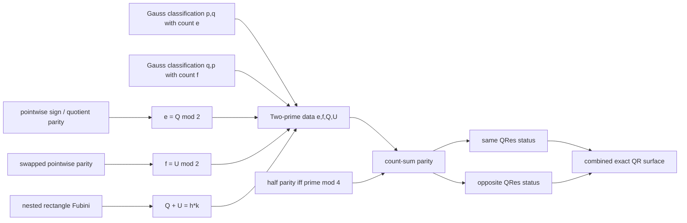

# Native quadratic reciprocity: surface and entrance gates

## Decision

Quadratic reciprocity will be stated in Peano Lab without adding a Legendre
symbol, integer subtraction, exponentiation, finite fields, or a new kernel
predicate. The authoring helpers in
`peano_lab.library.quadratic_residue_surface` produce fully expanded ordinary
PA formulas before parsing. They have no theorem authority and the checked
library does not import them.

For modulus $p$ and value $a$, use balanced natural congruence to define

$$
\operatorname{QRes}(p,a)\;:\!\Longleftrightarrow\;
\exists x,u,v.\;x^2+pu=a+pv.
$$

The canonical bounded variant is

$$
\operatorname{BQRes}(p,a)\;:\!\Longleftrightarrow\;
\exists x<p.\;\exists u,v.\;x^2+pu=a+pv.
$$

Its exact strict-bound expansion is `exists h. h + S x = p`. These relations
are subtraction-free and remain meaningful for every natural input. The
bridge from `QRes` to `BQRes` assumes $p\ne0$, as it must: modulo zero an
unbounded square witness need not have a representative below zero.

## Exact final endpoint

Write

$$
\begin{aligned}
\operatorname{Prime}(p)&:\!\Longleftrightarrow
 p\ne1\land\forall a,b.\;p=ab\to(a=1\lor b=1),\\
\operatorname{Odd}(p)&:\!\Longleftrightarrow
 \exists h.\;p=2h+1,\\
p\equiv r\pmod4&:\!\Longleftrightarrow
 \exists k.\;p=4k+r.
\end{aligned}
$$

For distinct odd primes $p,q$, the native endpoint proves both constructive
case conclusions:

$$
\begin{aligned}
(p\equiv1\pmod4\lor q\equiv1\pmod4)&\to
 \bigl((Q_{pq}\land Q_{qp})\lor(\neg Q_{pq}\land\neg Q_{qp})\bigr),\\
(p\equiv3\pmod4\land q\equiv3\pmod4)&\to
 \bigl((Q_{pq}\land\neg Q_{qp})\lor(\neg Q_{pq}\land Q_{qp})\bigr),
\end{aligned}
$$

where $Q_{pq}=\operatorname{QRes}(p,q)$. The disjunctions deliberately say
"same truth value" and "opposite truth values" rather than using a merely
classical-looking biconditional. They provide the witnesses needed by an
intuitionistic client once quadratic-residue membership is constructively
decidable.

`QUADRATIC_RECIPROCITY_COMBINED` is the exact fully expanded parser input. At
this checkpoint it occupies 1,520 characters, below one fifth of the current
8,192-character input ceiling. The separate same- and opposite-case endpoints
occupy 980 and 988 characters. Therefore target text is not a resource
blocker; certificate composition remains the resource risk.

| Expanded formula | source characters | canonical characters | formula nodes | term nodes |
|---|---:|---:|---:|---:|
| congruence decision | 185 | 94 | 16 | 22 |
| bounded/unbounded equivalence | 694 | 220 | 31 | 60 |
| bounded search | 471 | 132 | 24 | 34 |
| bounded residue decision | 401 | 131 | 23 | 36 |
| unbounded residue decision | 309 | 107 | 17 | 26 |
| same case | 980 | 388 | 65 | 116 |
| opposite case | 988 | 388 | 65 | 120 |
| combined reciprocity | 1,520 | 620 | 95 | 190 |

These are target-syntax nodes, not certificate nodes. They establish only that
the proposition itself is small. Proof-node capacity must be profiled after
each checked mathematical gate.

## Constructive bounded-witness route

The following gates should be proved in order. Every displayed predicate is
an expository abbreviation for the expanded relation above.

1. `mod_eq_decidable_nonzero`:
   $p\ne0\to(a\equiv b\pmod p\lor a\not\equiv b\pmod p)$. Divide both inputs
   by $p$, compare the canonical remainders with `eq_decidable`, and use
   `mod_eq_bounded_unique` in the negative branch.
2. `quadratic_residue_search_up_to`: for arbitrary $B,p,a$ with $p\ne0$,
   search $x\le B$ for $x^2\equiv a\pmod p$. This is a concrete induction on
   $B$, not a polymorphic bounded-search axiom.
3. `quadratic_residue_bounded_decidable_nonzero`: extract $p=S B$ and apply
   the preceding search. The equality $x\le B\leftrightarrow x<p$ is ordinary
   successor/order algebra.
4. `quadratic_residue_bounded_equiv`: divide an arbitrary root $x$ by $p$ to
   obtain $x\equiv r\pmod p$ with $r<p$; then use `mod_eq_mul` and
   `mod_eq_trans` to transfer $x^2\equiv a$ to $r^2\equiv a$. The reverse
   implication simply forgets the bound.
5. `quadratic_residue_decidable_nonzero`: transport the bounded decision
   across the equivalence. This theorem supplies the constructive case split
   required by the sign-free final statement.

The proposed dependency slice is therefore

```text
division_remainder_exists     eq_decidable
             \                 /
              mod_eq_decidable_nonzero
                         |
             quadratic_residue_search_up_to
                         |
       quadratic_residue_bounded_decidable_nonzero
                         |
mod_eq_mul + mod_eq_trans + division_remainder_exists
                         |
          quadratic_residue_bounded_equiv
                         |
          quadratic_residue_decidable_nonzero
```

No FTA theorem is needed in this slice. Keeping it out of the dependency
closure avoids importing its 73,767-node certificate into a result whose
mathematics only needs primes, division, congruence, finite products, and
finite counts.

## Body-green parity client layer

Four isolated constructive tranches now expose parity in the forms needed
by later Eisenstein and reciprocity clients:

\[
\begin{aligned}
\operatorname{Even}(m+n)&\leftrightarrow
  ((\operatorname{Even}(m)\land\operatorname{Even}(n))\lor
   (\operatorname{Odd}(m)\land\operatorname{Odd}(n))),\\
\operatorname{Odd}(m+n)&\leftrightarrow
  ((\operatorname{Even}(m)\land\operatorname{Odd}(n))\lor
   (\operatorname{Odd}(m)\land\operatorname{Even}(n))),\\
n\equiv m\pmod2&\longrightarrow
  ((\operatorname{Even}(n)\leftrightarrow\operatorname{Even}(m))\land
   (\operatorname{Odd}(n)\leftrightarrow\operatorname{Odd}(m))),\\
\operatorname{Odd}(p)\land n=pq+r&\longrightarrow
  ((\operatorname{Even}(n)\leftrightarrow\operatorname{Even}(q+r))\land
   (\operatorname{Odd}(n)\leftrightarrow\operatorname{Odd}(q+r))),\\
p=2h+1&\longrightarrow
  (\operatorname{Even}(h)\leftrightarrow p\equiv1\pmod4),\\
p=2h+1&\longrightarrow
  (\operatorname{Odd}(h)\leftrightarrow p\equiv3\pmod4).
\end{aligned}
\]

The sum-classification, modulo-two, and odd-division sources contain 4, 5,
and 6 candidate bodies respectively. The odd-half/modulo-four source adds four
more at `20/13`, `78/27`, `42/18`, and `100/30` nodes/depth. A combined capped
run passes all 16 focused pytest checks in 1.24 seconds. These are
dependency-curried body receipts, not recursively closed or admitted
theorems; all surface predicates expand to unchanged native PA before
parsing. See the
[`sum classification`](../../peano-lab/py/peano_lab/library/parity_sum_classification_candidate.py),
[`modulo-two transport`](../../peano-lab/py/peano_lab/library/parity_mod_two_candidate.py),
and
[`odd-division transport`](../../peano-lab/py/peano_lab/library/parity_odd_division_candidate.py)
sources, the
[`odd-half/modulo-four bridge`](../../peano-lab/py/peano_lab/library/parity_odd_half_mod_four_candidate.py),
and their adjacent focused tests.

## Body-green bounded and arbitrary Gauss endpoints

The dependency-curried candidate `bounded_gauss_lemma_complete` now reaches
the actual residue predicate. Given `p=2*h+1`, `Prime(p)`, `0<a<p`, and a
canonical half-range code, it constructs a signed-half reflection count `e`
with retained `SignedHalfPrefix` and `BitCount(e)` provenance and proves

\[
  \operatorname{QRes}(p,a)\leftrightarrow\operatorname{Even}(e),\qquad
  \neg\operatorname{QRes}(p,a)\leftrightarrow\operatorname{Odd}(e).
\]

The proof uses the witness-packaged Gauss power congruence, the checked
predecessor-power parity interface, the complete bounded Euler criterion, and
the constructive separation of `1` from the predecessor modulo an odd prime.
Its pinned direct-body receipt is 11 dependencies, 204 commands, 597 nodes,
depth 53, 559 objects, 596 edges, and 38 reused objects. The five focused
checks pass in 7.24 seconds, and the expanded statement hash is
`30f9a62162c2d1fe6e589ba3a5b5e5653bf5e527ab5b86a29ae394c448893b39`.

The companion `arbitrary_gauss_lemma_complete` removes the canonical
representative assumptions. It assumes `p` does not divide `a`, keeps the same
signed-half construction for the original `a`, and invokes the arbitrary-
representative Euler endpoint to prove the same two equivalences. Its pinned
direct-body receipt is 9 dependencies, 188 commands, 547 nodes, depth 49, 513
objects, 546 edges, and 34 reused objects; its statement hash is
`8520424f2215144d7374e9a7f45986f0ffeb4459a7a3f54cca5a8cd4888bbb44`.
The bounded and arbitrary audit modules pass together at `9/9` in 13.64
seconds. The arbitrary recipe is fail-closed source-shared from the bounded
classification tail, but its expanded contract and body are replayed
independently; source reuse grants no theorem authority.

This is body-green evidence only. Both candidates are unregistered and
unadmitted; recursive WMI closure, dependency mutations, and separate pinned
admission remain open. The bounded
[`source`](../../peano-lab/py/peano_lab/library/gauss_lemma_bounded_candidate.py)
and
[`test`](../../peano-lab/py/tests/test_gauss_lemma_bounded_candidate.py), and
the arbitrary
[`source`](../../peano-lab/py/peano_lab/library/gauss_lemma_arbitrary_candidate.py)
and
[`test`](../../peano-lab/py/tests/test_gauss_lemma_arbitrary_candidate.py),
pin that distinction.

## Body-green Gauss--Eisenstein alignment

The exact finite-sum permutation infrastructure is now present. Replacement
balance and last-swap invariance have `327/59` and `133/50` body nodes/depth;
fixed-last reindexing and arbitrary finite permutation invariance have
`85/33` and `631/88`. These theorems compare decoded entries and exact `Sum`
traces; they never identify raw beta codes.

For one odd division `a*(i+1)=p*q+r`, the signed branch equation implies the
pointwise parity relation

\[
  s_i\equiv q_i+m_i\pmod2,
\]

where `s_i` is the Gauss sign bit and `m_i` is its positive signed magnitude.
`gauss_eisenstein_prefix_pointwise_mod_two` lifts that relation across the
aligned beta prefixes. Its exact expanded statement has SHA-256
`84b039612f162c0c0935ebf49e1ffadf0cdf8e660914f583b7f490744175884e`
and a direct receipt of 2 dependencies, 155 commands, 250 nodes and depth 61.

The generic exact-sum layer then supplies left cancellation, middle-term
cancellation modulo two, recovery from an even zero-sum, and a three-prefix
pointwise congruence fold. Their nodes/depth are `39/24`, `42/19`, `24/15`,
and `328/66`. The Gauss-specific sum ladder first transports the magnitude
permutation to exact sums (`148/42`, `72/34`, `90/43`), then folds and cancels
the common magnitude sum (`83/54`, `107/66`, `89/65`). Its strongest endpoint
retains every beta-code parameter and proves

\[
  Q\equiv e\pmod2,
\]

for the exact quotient sum `Q` and the Gauss reflection count `e`. The
pointwise and sum audit modules pass together at `12/12` in 17.47 seconds.
See the
[`pointwise source`](../../peano-lab/py/peano_lab/library/gauss_eisenstein_pointwise_candidate.py),
[`pointwise test`](../../peano-lab/py/tests/test_gauss_eisenstein_pointwise_candidate.py),
[`sum source`](../../peano-lab/py/peano_lab/library/gauss_eisenstein_sum_candidate.py),
and [`sum test`](../../peano-lab/py/tests/test_gauss_eisenstein_sum_candidate.py).

## Closed body-green Eisenstein and reciprocity spine

The nested rectangle exchange is no longer an open mathematical gate. The
universal constructed-column theorem identifies the sum of column counts with
the swapped row total; `eisenstein_rectangle_floor_sum_identity` then gives
the semantic rectangle identity. The exact quotient wrapper eliminates those
semantic totals:

\[
  Q+U=h k.
\]

`distinct_odd_prime_eisenstein_quotient_sum_identity` has a direct receipt of
3 dependencies, 123 commands, 145 nodes and depth 68. It preserves both
scaled prefixes, division prefixes, row-count prefixes and exact sum traces,
so the equality is linked to its decoded provenance rather than asserted for
bare numbers.
See the
[`Fubini source`](../../peano-lab/py/peano_lab/library/eisenstein_fubini_total_candidate.py),
[`Fubini test`](../../peano-lab/py/tests/test_eisenstein_fubini_total_candidate.py),
[`quotient-identity source`](../../peano-lab/py/peano_lab/library/eisenstein_quotient_sum_identity_candidate.py),
and
[`quotient-identity test`](../../peano-lab/py/tests/test_eisenstein_quotient_sum_identity_candidate.py).

The final existential packaging proceeds in two steps:

- `odd_prime_gauss_eisenstein_orientation_data_exists` constructs one
  orientation's division codes, reflection count `e`, quotient sum `Q`, both
  actual-`QRes` classifications, and `e congruent Q (mod 2)`. Its receipt is
  5 dependencies, 102 commands, 139 nodes and depth 67.
- `distinct_odd_primes_gauss_eisenstein_data_exists` constructs both
  orientations and exposes only `e,f,Q,U`, their two classifications, the two
  modulo-two congruences, and `Q+U=h*k`. Its receipt is 4 dependencies, 150
  commands, 222 nodes and depth 77.



The constructive parity truth-table layer has six bodies: it turns parity of
`e+f`, transported through `e+f congruent h*k (mod 2)`, into same or opposite
cross-residue status, and then replaces parity of the odd-prime halves by the
appropriate modulo-four hypotheses. The two explicitly conditional wrappers
measure `49/31` nodes/depth each.

Finally, the theorem bodies are exactly the public expanded formulas frozen
above:

| Endpoint | Direct receipt `(deps, commands, nodes, depth)` |
|---|---:|
| `quadratic_reciprocity_same_case` | `(2, 46, 73, 33)` |
| `quadratic_reciprocity_opposite_case` | `(2, 46, 73, 33)` |
| `quadratic_reciprocity_combined` | `(3, 65, 113, 35)` |

The downstream data/parity/conditional/final integration passes `20/20` in
27.25 seconds. The combined body constructs the two-prime data package once
and calls both conditional clients directly; its statement and hash remain
unchanged. The exact graph has 557 unique specifications, 1,787 edges, 45
layers, root depth 44, and 191,648 theorem occurrences under recursive
expansion—roughly half the superseded wrapper's 382,882 occurrences. The
[hotspot audit](quadratic-reciprocity-closure-hotspots.md) proves that this
recursive tree has at least 731,423 proof nodes before most body constructors
are counted, so it cannot satisfy the 500,000-node policy.

This is a complete body-green mathematical route, not an
admitted quadratic-reciprocity theorem. Every new item is dependency-curried,
unregistered and unadmitted. The preferred next experiment is the
[layered ordinary-`Cut` compiler](layered-cut-bundle.md): one balanced
conjunction package per dependency layer, every theorem body once, and one
existing contextual `Cut` per layer, with the unchanged kernel asked to check
the resulting certificate from the empty context. Full WMI construction,
mutation checking, capacity/browser profiling, and a distinct receipt-pinned
admission replay remain.
See the
[`data package`](../../peano-lab/py/peano_lab/library/gauss_eisenstein_data_candidate.py),
[`parity truth tables`](../../peano-lab/py/peano_lab/library/quadratic_reciprocity_parity_candidate.py),
and
[`exact endpoints`](../../peano-lab/py/peano_lab/library/quadratic_reciprocity_candidate.py).

## External formalization cross-check

The native dependency plan was compared with two independently formalized
routes:

- [Isabelle/HOL `Quadratic_Reciprocity`](https://isabelle.in.tum.de/library/HOL/HOL-Number_Theory/Quadratic_Reciprocity.html)
  imports a Gauss-lemma development and follows Gauss's fifth proof.
- The earlier
  [Mathlib `number_theory.quadratic_reciprocity`](https://cs.brown.edu/courses/cs1951x/docs/number_theory/quadratic_reciprocity.html)
  explicitly factors the argument through Euler's criterion, Gauss's lemma
  and Eisenstein's lemma.
- The current
  [Mathlib Legendre-symbol API](https://leanprover-community.github.io/mathlib4_docs/Mathlib/NumberTheory/LegendreSymbol/Basic.html)
  confirms the interface between actual square witnesses and Euler's
  criterion that the QR-2 gate must reconstruct natively.

These sources guide decomposition and theorem naming only. Their higher-order
finite sets, quotient rings, integers, symbols and proof terms are not imported
into the native PA language or trust boundary.

## Surface audit

`test_quadratic_residue_surface.py` enforces four properties:

- every planned formula parses as a closed formula and survives pretty-print
  round-trip;
- no expository predicate token such as `QRes` or `Prime` reaches the parser;
- string interpolation accepts identifiers only and rejects binder capture;
- the combined target retains more than half of the current input budget.

This prototype intentionally does not install parser syntax. A reusable
general-purpose macro must later construct formula syntax hygienically and
expand before kernel checking; arbitrary string interpolation is not an
acceptable implementation.
