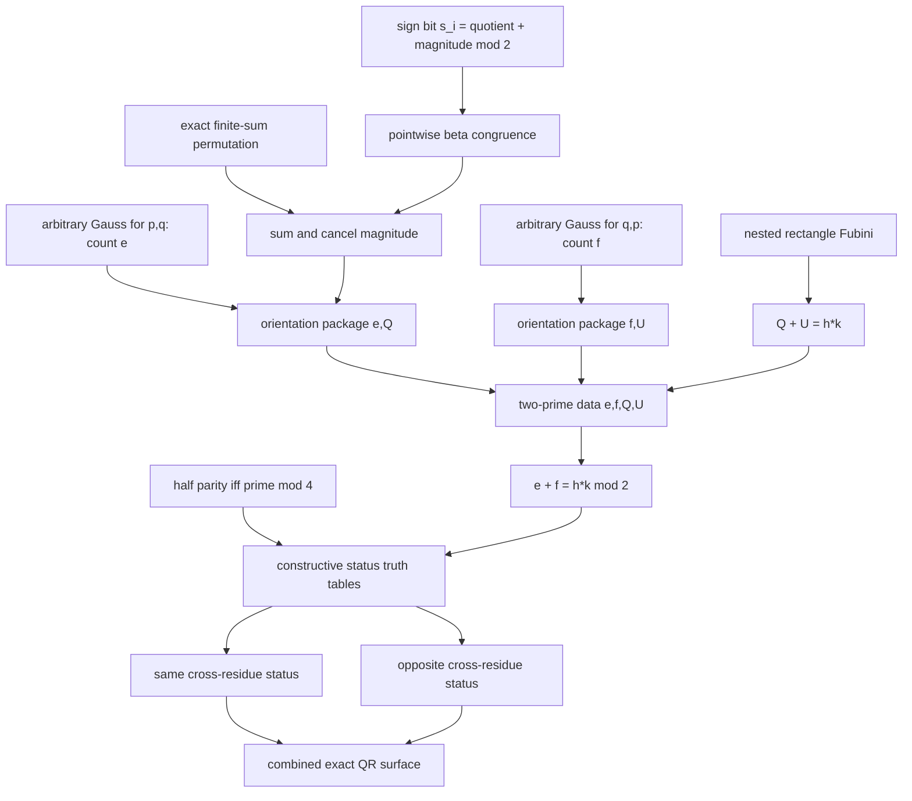

# Gauss–Eisenstein reciprocity spine

The native [[quadratic-reciprocity-moc|quadratic-reciprocity campaign]] now
has a complete dependency-curried route from Gauss reflection counts to the
exact sign-free reciprocity formulas. “Complete” here means every candidate
body kernel-checks with its declared dependencies as hypotheses. It does not
mean a complete layered WMI certificate or admission.

## Exact data flow

## Pointwise and exact-sum alignment

For one decoded division `a*(i+1)=p*q_i+r_i`, the signed Gauss branch yields

\[
  s_i\equiv q_i+m_i\pmod2.
\]

`gauss_eisenstein_prefix_pointwise_mod_two` preserves all aligned beta-code
parameters and proves this at every bounded index. Its body is `250/61`
nodes/depth, and its statement SHA-256 begins `84b039`.

The finite-sum permutation ladder is exact:

| Candidate | Role | Nodes/depth |
|---|---|---:|
| `beta_sum_replace_balance` | cancellation-free replacement balance | `327/59` |
| `beta_sum_swap_last_invariant` | preserve a sum under the final swap | `133/50` |
| `beta_sum_reindex_fixed_last` | strip a fixed last aligned entry | `85/33` |
| `beta_sum_permutation_invariant` | arbitrary bounded injective reindex | `631/88` |

The generic modular-sum clients are `mod_eq_add_cancel_left` (`39/24`),
`mod_two_cancel_middle` (`42/19`), `mod_two_zero_sum_to_congruent` (`24/15`),
and `beta_sum_pointwise_mod_three_add` (`328/66`). The Gauss-specific sum
ladder aligns the magnitude sum with the canonical half sum, folds the
pointwise relation, cancels the common magnitude, and ends at

\[
  Q\equiv e\pmod2.
\]

The six final bodies have nodes/depth `148/42`, `72/34`, `90/43`, `83/54`,
`107/66`, and `89/65`. The pointwise plus sum suites pass `12/12` in 17.47
seconds.

## Exact rectangle identity and existential data

The nested transpose/Fubini layer is body-green. It constructs a prefix of
column counts, proves its `Sum` equals the swapped row total, and combines it
with the row/column partition. The semantic endpoint is
`eisenstein_rectangle_floor_sum_identity`; the exact quotient wrapper
`distinct_odd_prime_eisenstein_quotient_sum_identity` retains the two scaled
division prefixes, row-count prefixes and sum traces and proves

\[
  Q+U=h k.
\]

The wrapper receipt is `(3 dependencies, 123 commands, 145 nodes, depth 68)`.

`odd_prime_gauss_eisenstein_orientation_data_exists` packages one direction:
division codes, a Gauss count `e`, quotient sum `Q`, both actual-`QRes`
classifications, and `e congruent Q (mod 2)`. Its receipt is
`(5, 102, 139, 67)` for dependencies, commands, nodes and depth.

`distinct_odd_primes_gauss_eisenstein_data_exists` applies this twice and
exposes only `e,f,Q,U`, both classifications, both modulo-two congruences, and
`Q+U=h*k`. Its corresponding receipt is `(4, 150, 222, 77)`.

## Exact native endpoints

Parity of `h*k` is converted to the modulo-four cases using
[[parity-transport]]. Six constructive truth-table bodies derive same or
opposite cross-residue status, and two conditional wrappers measure `49/31`
nodes/depth each. The last three contracts are byte-for-byte the frozen public
surfaces:

| Candidate | Dependencies/commands/nodes/depth |
|---|---:|
| `quadratic_reciprocity_same_case` | `2/46/73/33` |
| `quadratic_reciprocity_opposite_case` | `2/46/73/33` |
| `quadratic_reciprocity_combined` | `3/65/113/35` |

The downstream data, parity, conditional, and final integration passes
`20/20` in 27.25 seconds. The combined body constructs the pair data once and
calls both conditional clients directly; the exact statement and its hash are
unchanged. The exact closure graph contains 557 unique specifications, 1,792
edges, 45 layers, root depth 44, and 191,672 theorem occurrences under
recursive expansion. The static hotspot audit gives that tree a rigorous
731,488-node lower bound, already beyond policy.

All these candidates are constructive,
dependency-curried, unregistered, and unadmitted. The selected next route is
the [[layered-cut-bundle]]: every body once, 45 balanced packages, existing
conjunction projections, and 45 ordinary Cuts, all checked by the unchanged
kernel. Full WMI construction, mutations, capacity/browser profiling, and a
separate receipt-pinned admission are still required.

## Links

- [[gauss-product-composition]]
- [[parity-transport]]
- [[eisenstein-division-prefix]]
- [[layered-cut-bundle]] · [[closed-proof-dag]]
- [Recursive-closure hotspot audit](../../research/arithmetic-library/quadratic-reciprocity-closure-hotspots.md)
- [Research surface](../../research/arithmetic-library/quadratic-reciprocity-surface.md)
- [Exact Sum permutation](../../peano-lab/py/peano_lab/library/finite_sum_permutation_candidate.py) · [reindex](../../peano-lab/py/peano_lab/library/finite_sum_reindex_candidate.py)
- [Pointwise source](../../peano-lab/py/peano_lab/library/gauss_eisenstein_pointwise_candidate.py) · [test](../../peano-lab/py/tests/test_gauss_eisenstein_pointwise_candidate.py)
- [Sum source](../../peano-lab/py/peano_lab/library/gauss_eisenstein_sum_candidate.py) · [test](../../peano-lab/py/tests/test_gauss_eisenstein_sum_candidate.py)
- [Fubini source](../../peano-lab/py/peano_lab/library/eisenstein_fubini_total_candidate.py) · [exact quotient identity](../../peano-lab/py/peano_lab/library/eisenstein_quotient_sum_identity_candidate.py)
- [Data source](../../peano-lab/py/peano_lab/library/gauss_eisenstein_data_candidate.py) · [test](../../peano-lab/py/tests/test_gauss_eisenstein_data_candidate.py)
- [Final QR source](../../peano-lab/py/peano_lab/library/quadratic_reciprocity_candidate.py) · [test](../../peano-lab/py/tests/test_quadratic_reciprocity_candidate.py)
- [Jupyter Book chapter](../../book/arithmetic-library/quadratic-reciprocity.md)
