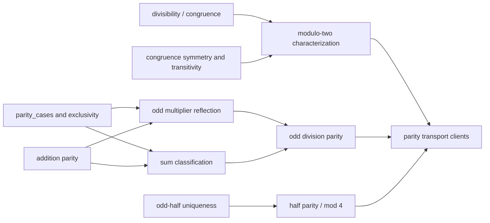

# Constructive parity transport

The native campaign has three reusable, isolated parity tranches. They turn
existential `Even` and `Odd` witnesses into structured client interfaces
without adding a parity predicate to the kernel language.

## Dependency ladder

The readable endpoints are

\[
\begin{aligned}
\operatorname{Even}(m+n)&\leftrightarrow
  (\operatorname{Even}(m)\land\operatorname{Even}(n))\lor
  (\operatorname{Odd}(m)\land\operatorname{Odd}(n)),\\
\operatorname{Odd}(m+n)&\leftrightarrow
  (\operatorname{Even}(m)\land\operatorname{Odd}(n))\lor
  (\operatorname{Odd}(m)\land\operatorname{Even}(n)),\\
n\equiv m\pmod2&\longrightarrow
  ((\operatorname{Even}(n)\leftrightarrow\operatorname{Even}(m))\land
   (\operatorname{Odd}(n)\leftrightarrow\operatorname{Odd}(m))),\\
\operatorname{Odd}(p)\land n=pq+r&\longrightarrow
  ((\operatorname{Even}(n)\leftrightarrow\operatorname{Even}(q+r))\land
   (\operatorname{Odd}(n)\leftrightarrow\operatorname{Odd}(q+r))),\\
p=2h+1&\longrightarrow
 \bigl(\operatorname{Even}(h)\leftrightarrow p\equiv1\pmod4\bigr),\\
p=2h+1&\longrightarrow
 \bigl(\operatorname{Odd}(h)\leftrightarrow p\equiv3\pmod4\bigr).
\end{aligned}
\]

## Body receipts

| Tranche | Candidate bodies | Pinned nodes/depth |
|---|---|---|
| sum classification | `even_sum_parity_cases`, `odd_sum_parity_cases`, `even_sum_iff_same_parity`, `odd_sum_iff_opposite_parity` | `61/18`, `61/18`, `63/19`, `63/19` |
| modulo two | `even_to_mod_two_zero`, `mod_two_zero_to_even`, `odd_to_mod_two_one`, `mod_two_one_to_odd`, `mod_two_preserves_parity` | `14/9`, `20/13`, `42/18`, `50/16`, `86/20` |
| odd multiplication/division | `odd_multiplier_even_product_iff`, `odd_multiplier_odd_product_iff`, `odd_multiplier_parity_iff`, `odd_division_even_iff`, `odd_division_odd_iff`, `odd_division_parity_iff` | `36/18`, `36/17`, `28/12`, `93/22`, `93/22`, `51/20` |
| odd half versus modulo four | `odd_half_of_mod4_one_exact`, `odd_half_of_mod4_three_exact`, `odd_half_even_iff_mod4_one`, `odd_half_odd_iff_mod4_three` | `20/13`, `78/27`, `42/18`, `100/30` |

A combined 60-second-capped run of all four focused modules passes `16/16`
pytest checks in 1.24 seconds. The audits pin deterministic expanded
contracts, direct dependencies, body metrics, registry isolation, and the
absence of `DNE`, classical reasoning, `sorry`, `auto`, and `ring`.

These are dependency-curried body checks. They are not closed recursive
replays and do not admit the candidates into the public theorem registry.

## Clients

- The sum equivalences expose the exact same/opposite parity case split used
  when a finite sum is decomposed.
- `mod_two_preserves_parity` lets later proofs replace a difficult integer by
  any balanced-congruent representative modulo two.
- `odd_division_parity_iff` is the floor-sum bridge: from `n=p*q+r` with odd
  `p`, it reduces the parity of `n` to that of `q+r`.
- The odd-half/modulo-four equivalences translate parity of `h` in
  `p=2*h+1` directly into the two supplementary residue classes used by the
  final reciprocity truth table.
- [[gauss-product-composition]] consumes a different parity endpoint—the
  reflection count in bounded Gauss's lemma—but exposes the same constructive
  `Even`/`Odd` interface to [[quadratic-reciprocity-moc]].

## Source views

- [Sum-classification candidate](../../peano-lab/py/peano_lab/library/parity_sum_classification_candidate.py) · [test](../../peano-lab/py/tests/test_parity_sum_classification_candidate.py)
- [Modulo-two candidate](../../peano-lab/py/peano_lab/library/parity_mod_two_candidate.py) · [test](../../peano-lab/py/tests/test_parity_mod_two_candidate.py)
- [Odd-division candidate](../../peano-lab/py/peano_lab/library/parity_odd_division_candidate.py) · [test](../../peano-lab/py/tests/test_parity_odd_division_candidate.py)
- [Odd-half/modulo-four candidate](../../peano-lab/py/peano_lab/library/parity_odd_half_mod_four_candidate.py) · [test](../../peano-lab/py/tests/test_parity_odd_half_mod_four_candidate.py)
- [Jupyter Book chapter](../../book/arithmetic-library/quadratic-reciprocity.md)
