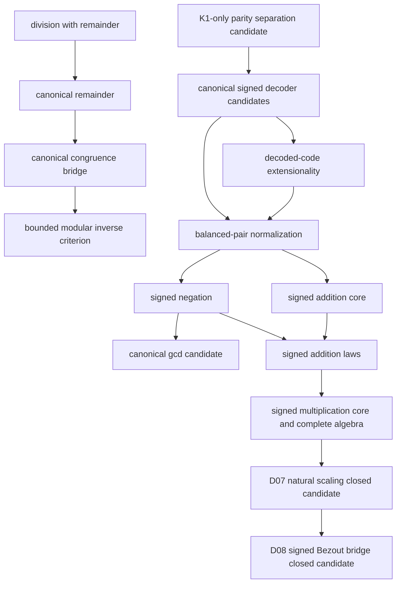

# Strict HA number-theory campaign

The campaign builds canonical, reusable interfaces in first-order
intuitionistic arithmetic without extending Peano Lab's object language.

## Evidence boundary

- `public_checked`: an empty-context certificate checks and the theorem was
  deliberately enrolled in the public registry.
- `closed_checked_candidate`: an empty-context certificate checks, but the
  theorem remains isolated.
- a checked dependency-curried body is weaker than either status.

The current registry has 393 theorems. Nine strict-HA tranche-01 interfaces are
public; three canonical-gcd and 74 signed representation, normalization,
negation, addition, multiplication, natural-scale, and Bezout-bridge theorems
remain closed candidates. Thus the isolated corpus has 77 total candidates
and the campaign records 86 theorem receipts. The K3 evidence spans 16
candidate modules and 18 focused tests. The definition freeze remains 45 API
rows over 44 distinct
public theorems, there are 56 public references, and the catalog remains 394
entries; the latest D08 work grants no admission.

## Dependency spine

The signed representation is parity-interleaved:

$$
p\mapsto 2p,\qquad -(k+1)\mapsto 2k+1.
$$

It has a unique zero and does not depend on division, CRT, Gödel-β coding,
or the future pair/list representation.

The K3 seed closes the elementary even/odd separation, the seven decoder
theorems, literal-code/cross-sum extensionality in both directions, and total,
extensional, functional `SignedBalance` normalization with an exact zero
criterion. Negation is now total, functional, symmetric, fixes zero, and is
involutive. `SignedAdd` now has exact decoded-equation introduction and
elimination, totality, and literal-output functionality. The largest signed
certificate is currently `signed_add_functional` at 1,754 structural nodes,
depth 38, and 34 Cuts. Addition is now commutative, has two-sided zero, and
sums with canonical negation to zero in both orientations. A generic cross-sum
composition helper now also closes graph associativity. None is public yet.
The five-row `SignedMul` core now has decoder bridges, totality, and literal
output functionality. Its largest certificate is `signed_mul_functional` at
1,808 nodes, depth 40, and 34 Cuts. Five further candidates prove graph
commutativity, two-sided zero annihilation, and the two-sided identity law for
signed positive-one code `2`. The largest new certificate is
`signed_mul_one_right` at 745 nodes, depth 43, and 18 Cuts. The four-row
[`SignedMul` associativity tranche](../../peano-lab/py/peano_lab/library/ha_signed_mul_associative_candidate.py)
and its
[`focused audit`](../../peano-lab/py/tests/test_ha_signed_mul_associative_candidate.py)
now close the pair-transport, component-association, decoded-equation, and
graph laws. The seven-row
[`distributivity tranche`](../../peano-lab/py/peano_lab/library/ha_signed_mul_distributive_candidate.py)
and its
[`focused audit`](../../peano-lab/py/tests/test_ha_signed_mul_distributive_candidate.py)
close left and right distributivity through reusable balanced-sum helpers.
The right-distributive endpoint is the largest new certificate at 3,717
nodes, depth 60, and 53 Cuts. Two cold closures agree on the complete 60-row
signed-stack digest
`7befb7ae830b866a606e47f674730959e76599ded863aadd9868b850bcb190cd`.
The complete D06 elementary signed algebra is therefore closed at candidate
status. The five-row
[`SignedNatScale` core](../../peano-lab/py/peano_lab/library/ha_signed_nat_scale_candidate.py)
and its
[`focused audit`](../../peano-lab/py/tests/test_ha_signed_nat_scale_candidate.py)
identify the graph with the decoded equation
`scale*ip+on = scale*inn+op`, prove both directions, and close totality and
literal-output functionality. Their 65-row signed-stack digest is
`511aa0ba4a6dac1a22f52db740f539c675307b5b77b6b1a7d9ef2e00dd8a5331`.
The five-row
[`natural-scale law tranche`](../../peano-lab/py/peano_lab/library/ha_signed_nat_scale_laws_candidate.py)
and its
[`focused audit`](../../peano-lab/py/tests/test_ha_signed_nat_scale_laws_candidate.py)
then prove generic left-scaling transport, decoded-equation composition,
`SignedNatScale(0,input,0)`, `SignedNatScale(1,input,input)`, and the exact
inner-then-outer graph law
`SignedNatScale(inner,input,middle) -> SignedNatScale(outer,middle,output) ->
SignedNatScale(outer*inner,input,output)`. The direct composition helper was
chosen over treating D07 as `SignedMul(2*scale,input,output)`: that D06 alias
would add an unnecessary signed-coercion dependency to the D08 Bezout path.
The complete 70-row signed-stack digest is
`81a18daf55e564c11dee83ce7465bc91876109a5e6bc092f75e0f31f46e27d8d`.
D07 is closed at candidate status. The four-row
[`SignedBezout` bridge](../../peano-lab/py/peano_lab/library/ha_signed_bezout_candidate.py)
and its
[`focused audit`](../../peano-lab/py/tests/test_ha_signed_bezout_candidate.py)
now prove that the legacy four-natural `BalancedBezout` relation holds exactly
when canonical signed coefficient codes exist. The proof normalizes `(xp,xn)`
and `(yp,yn)` independently while respecting the legacy witness order
`xp,yp,xn,yn`; it intentionally proves no uniqueness of the coefficient pair.
Two cold closures agree on the complete 74-row signed-stack digest
`b7949148236ab243830a2bfebd80ddafeb31a63c5e70ace1c032de8bd2415f15`.
D08 is closed at candidate status with 74 signed/77 total candidates, 86
receipts, 16 K3 modules, and 18 focused tests. Its strict closure reaches no
division, remainder, CRT, beta, classical, or DNE theorem. The gcd packaging
client remains separate in K4 and no D08 row is public.

The independent pair/cell design is now frozen in `HA-K3-PAIR-1` using the
doubled Cantor polynomial and a successor cell tag. This does not close the
list layer: variable-length tail iteration still needs an independently
selected computation-history representation. Pairing alone yields only a
fixed-length formula schema.

## Repository anchors

- `research/arithmetic-library/ha-number-theory-campaign.json`
- `research/arithmetic-library/ha-canonical-signed-natural-rfc-v1.md`
- `research/arithmetic-library/ha-canonical-pair-cell-rfc-v1.md`
- `PLAN/12_ha_number_theory_campaign.md`
- `book/arithmetic-library/strict-ha-campaign.md`

## Related notes

- [[arithmetic-library-moc]]
- [[peano-lab]]
- [[proof-certificate]]
- [[intuitionistic-logic]]
