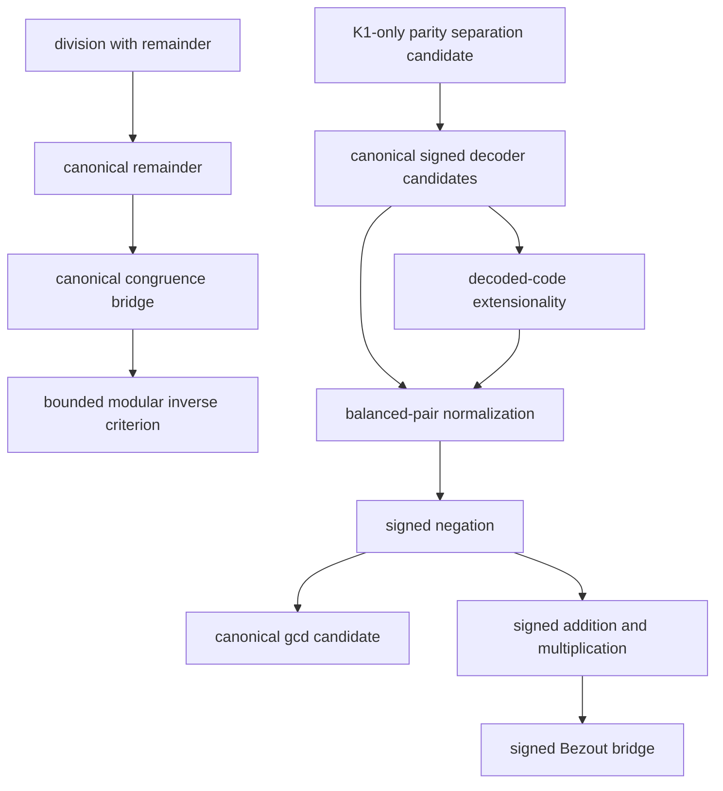

# Strict HA number-theory campaign

The campaign builds canonical, reusable interfaces in first-order
intuitionistic arithmetic without extending Peano Lab's object language.

## Evidence boundary

- `public_checked`: an empty-context certificate checks and the theorem was
  deliberately enrolled in the public registry.
- `closed_checked_candidate`: an empty-context certificate checks, but the
  theorem remains isolated.
- a checked dependency-curried body is weaker than either status.

The current registry has 393 theorems. Nine strict-HA tranche-01 interfaces are
public; three canonical-gcd and 26 signed representation, normalization, and
negation theorems remain closed candidates.

## Dependency spine

The signed representation is parity-interleaved:

$$
p\mapsto 2p,\qquad -(k+1)\mapsto 2k+1.
$$

It has a unique zero and does not depend on division, CRT, Gödel-β coding,
or the future pair/list representation.

The K3 seed closes the elementary even/odd separation, the seven decoder
theorems, literal-code/cross-sum extensionality in both directions, and total,
extensional, functional `SignedBalance` normalization with an exact zero
criterion. Negation is now total, functional, symmetric, fixes zero, and is
involutive. The largest signed certificate remains `signed_balance_zero_iff`
at 1,660 structural nodes, depth 36, and 33 Cuts; the negation endpoint is
1,199 nodes. None is public yet. The next gate is `SignedAdd` through decoded
contribution sums and canonical balance normalization.

## Repository anchors

- `research/arithmetic-library/ha-number-theory-campaign.json`
- `research/arithmetic-library/ha-canonical-signed-natural-rfc-v1.md`
- `PLAN/12_ha_number_theory_campaign.md`
- `book/arithmetic-library/strict-ha-campaign.md`

## Related notes

- [[arithmetic-library-moc]]
- [[peano-lab]]
- [[proof-certificate]]
- [[intuitionistic-logic]]
