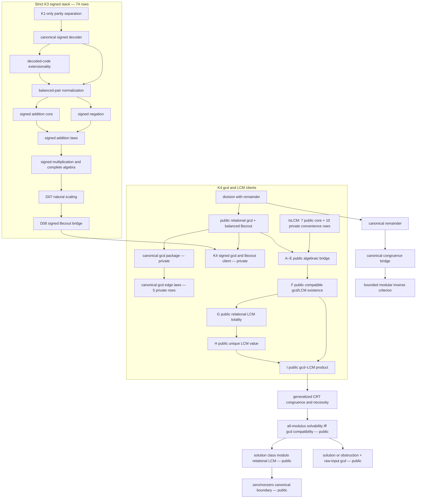

# Strict HA number-theory campaign

The campaign builds canonical, reusable interfaces in first-order
intuitionistic arithmetic without extending Peano Lab's object language.

## Evidence boundary

- `public_checked`: an empty-context certificate checks and the theorem was
  deliberately enrolled in the public registry.
- `closed_checked_candidate`: an empty-context certificate checks, but the
  theorem remains isolated.
- a checked dependency-curried body is weaker than either status.

The current registry has 432 theorems. Nine strict-HA tranche-01 interfaces,
16 K4 gcd/LCM interfaces, and 23 M5 generalized-CRT interfaces are public. The
campaign evidence records 95 public references, 99 isolated candidates, and
147 exact receipts across 22 candidate modules and 31 focused test paths. Its
strict-K3 component remains exactly 74 signed representation, normalization,
arithmetic, natural-scale, and Bezout-bridge rows across 16 modules. The K4
remainder consists of three canonical-gcd package rows, one signed-gcd client,
five canonical-gcd edge rows, and ten relational-LCM convenience rows. The
definition freeze remains 45 API rows over 44 distinct public theorems, there
are 95 public references, and the catalog has 433 entries: 23
`checked_existing`, 409 `checked_m20`, and one `blocked_by_language`.

## Dependency spine



The signed representation is parity-interleaved:

$$
p\mapsto 2p,\qquad -(k+1)\mapsto 2k+1.
$$

It has a unique zero and does not depend on division, CRT, Gödel-β coding,
or the future pair/list representation.

The K3 seed closes the elementary even/odd separation, the seven decoder
theorems, literal-code/cross-sum extensionality in both directions, and total,
extensional, functional `SignedBalance` normalization with an exact zero
criterion. Negation is now total, functional, symmetric, fixes zero, and is
involutive. `SignedAdd` now has exact decoded-equation introduction and
elimination, totality, and literal-output functionality. The largest signed
certificate is currently `signed_add_functional` at 1,754 structural nodes,
depth 38, and 34 Cuts. Addition is now commutative, has two-sided zero, and
sums with canonical negation to zero in both orientations. A generic cross-sum
composition helper now also closes graph associativity. None is public yet.
The five-row `SignedMul` core now has decoder bridges, totality, and literal
output functionality. Its largest certificate is `signed_mul_functional` at
1,808 nodes, depth 40, and 34 Cuts. Five further candidates prove graph
commutativity, two-sided zero annihilation, and the two-sided identity law for
signed positive-one code `2`. The largest new certificate is
`signed_mul_one_right` at 745 nodes, depth 43, and 18 Cuts. The four-row
[`SignedMul` associativity tranche](../../peano-lab/py/peano_lab/library/ha_signed_mul_associative_candidate.py)
and its
[`focused audit`](../../peano-lab/py/tests/test_ha_signed_mul_associative_candidate.py)
now close the pair-transport, component-association, decoded-equation, and
graph laws. The seven-row
[`distributivity tranche`](../../peano-lab/py/peano_lab/library/ha_signed_mul_distributive_candidate.py)
and its
[`focused audit`](../../peano-lab/py/tests/test_ha_signed_mul_distributive_candidate.py)
close left and right distributivity through reusable balanced-sum helpers.
The right-distributive endpoint is the largest new certificate at 3,717
nodes, depth 60, and 53 Cuts. Two cold closures agree on the complete 60-row
signed-stack digest
`7befb7ae830b866a606e47f674730959e76599ded863aadd9868b850bcb190cd`.
The complete D06 elementary signed algebra is therefore closed at candidate
status. The five-row
[`SignedNatScale` core](../../peano-lab/py/peano_lab/library/ha_signed_nat_scale_candidate.py)
and its
[`focused audit`](../../peano-lab/py/tests/test_ha_signed_nat_scale_candidate.py)
identify the graph with the decoded equation
`scale*ip+on = scale*inn+op`, prove both directions, and close totality and
literal-output functionality. Their 65-row signed-stack digest is
`511aa0ba4a6dac1a22f52db740f539c675307b5b77b6b1a7d9ef2e00dd8a5331`.
The five-row
[`natural-scale law tranche`](../../peano-lab/py/peano_lab/library/ha_signed_nat_scale_laws_candidate.py)
and its
[`focused audit`](../../peano-lab/py/tests/test_ha_signed_nat_scale_laws_candidate.py)
then prove generic left-scaling transport, decoded-equation composition,
`SignedNatScale(0,input,0)`, `SignedNatScale(1,input,input)`, and the exact
inner-then-outer graph law
`SignedNatScale(inner,input,middle) -> SignedNatScale(outer,middle,output) ->
SignedNatScale(outer*inner,input,output)`. The direct composition helper was
chosen over treating D07 as `SignedMul(2*scale,input,output)`: that D06 alias
would add an unnecessary signed-coercion dependency to the D08 Bezout path.
The complete 70-row signed-stack digest is
`81a18daf55e564c11dee83ce7465bc91876109a5e6bc092f75e0f31f46e27d8d`.
D07 is closed at candidate status. The four-row
[`SignedBezout` bridge](../../peano-lab/py/peano_lab/library/ha_signed_bezout_candidate.py)
and its
[`focused audit`](../../peano-lab/py/tests/test_ha_signed_bezout_candidate.py)
now prove that the legacy four-natural `BalancedBezout` relation holds exactly
when canonical signed coefficient codes exist. The proof normalizes `(xp,xn)`
and `(yp,yn)` independently while respecting the legacy witness order
`xp,yp,xn,yn`; it intentionally proves no uniqueness of the coefficient pair.
Two cold closures agree on the complete 74-row signed-stack digest
`b7949148236ab243830a2bfebd80ddafeb31a63c5e70ace1c032de8bd2415f15`.
D08 is closed at candidate status with 74 signed/77 total candidates, 86
receipts, 16 K3 modules, and 18 focused tests. Its strict closure reaches no
division, remainder, CRT, beta, classical, or DNE theorem. The gcd packaging
client remains separate in K4 and no D08 row is public.

The one-row
[`K4 signed-gcd client`](../../peano-lab/py/peano_lab/library/ha_signed_bezout_gcd_candidate.py)
and its
[`focused audit`](../../peano-lab/py/tests/test_ha_signed_bezout_gcd_candidate.py)
now combine the public relational-gcd/balanced-Bezout theorem with D08. The
certificate has 3,535 nodes, depth 48, and 74 Cuts, with digest
`4edeb4ffc7de0b9aa0a870d2125f7640f2447a7358ba454abba3db003f9044a3`.
Its closure intentionally reaches the Euclidean division chain; the manifest
therefore records an explicit `K3 -> K4` layer edge. It does not change the
strict 74-row K3 digest.

The canonical gcd/LCM checkpoint is now selectively admitted. The five-row
[`canonical-gcd edge tranche`](../../peano-lab/py/peano_lab/library/ha_canonical_gcd_edges_candidate.py)
pins zero, one, and swap functionality and remains private. The 17-row
[`relational-LCM tranche`](../../peano-lab/py/peano_lab/library/ha_relational_lcm_candidate.py)
implements the universal property, projections, leastness, uniqueness,
divisibility, product-bound, self/one, and forced-zero laws. Its literal-safe
expander accepts exactly identifiers and the reviewed literals `0` and `1`;
zero-left is derived from the direct zero-right theorem by symmetry. Exactly
the seven universal rows L01--L07 are public; L08 and C01--C09 remain private.

The nine-row
[`gcd--LCM bridge`](../../peano-lab/py/peano_lab/library/ha_lcm_totality_bridge_candidate.py)
then follows the checked path

```text
balanced Bezout + relational gcd
  -> coprime quotient factors
  -> product LCM + nonzero scaling
  -> compatible gcd/LCM pair
  -> LCM totality
  -> unique LCM value
  -> gcd * lcm = input product.
```

All nine bridge rows A--I are public with their original receipts. The
compatible-pair certificate has 9,038 nodes at depth 60; the final
`gcd_lcm_product` certificate has 10,441 nodes at depth 61. Both zero and
nonzero branches are mutation-audited, every bridge certificate has zero
`DNE` nodes, and public replay preserves every frozen proof-DAG digest. At the
K4 admission checkpoint the registry/catalog counts were 409/410, with 386
catalog rows at `checked_m20`.
The exact private K4 remainder is 19 rows: three canonical-gcd package rows,
five edge rows, ten LCM convenience rows, and the signed-gcd client.

The generalized-CRT campaign is now selectively public. The admitted tranche
is the exact 23-row candidate-factory closure of
`generalized_binary_crt_solvable_iff`,
`generalized_binary_crt_canonical_boundary`, and
`generalized_binary_crt_total_decision`; it occupies runtime indices 409--431.
This closure contains the constructive all-modulus compatibility criterion,
the complete solution class modulo relational LCM, exact uniqueness at zero
LCM, a unique bounded representative at nonzero LCM, compatibility decision,
the supplied-gcd solution-or-obstruction theorem, and the raw-input endpoint
that constructs an existential relational gcd. The public-admission gate pins
the isolated factories, statements, append order, two cold intuitionistic
receipts, resource limits, and false endpoint mutations.

Exactly six reviewed support or convenience rows remain private:
`mod_eq_add_cancel_left`, `mod_eq_add_cancel_right`,
`mod_eq_unscale_nonzero`, `factor_nonzero_right`,
`is_gcd_nonzero_coprime_quotients`, and
`generalized_binary_crt_solvable_iff_nonzero`. The runtime/catalog boundary is
now 432/433. The generated public snapshot has 1,982,360 structural nodes,
468,010 proof objects, 57,692 structural Cut occurrences, 373 Cut-bearing
theorems, 1,185 dependency edges, and ordered root
`4d02dc439d53533e8992a471b26ee34059fb6001f822041e42c56b2cc0a7a079`.
The synchronized vault has 432 theorem notes, 531 total notes, and 5,377
resolved links.

The integrated admission gate passes 30 structural and 220 proof/admission
tests. All 25 browser/deployment contracts pass. The 180-source local browser
app is sealed as `a-b544a04993a1` (`BUILD=2026-08-04i`); no deployment is
claimed.

The independent pair/cell design is now frozen in `HA-K3-PAIR-1` using the
doubled Cantor polynomial and a successor cell tag. This does not close the
list layer: variable-length tail iteration still needs an independently
selected computation-history representation. Pairing alone yields only a
fixed-length formula schema.

## Repository anchors

- `research/arithmetic-library/ha-number-theory-campaign.json`
- `research/arithmetic-library/ha-canonical-signed-natural-rfc-v1.md`
- `research/arithmetic-library/ha-canonical-gcd-lcm-rfc-v1.md`
- `research/arithmetic-library/ha-generalized-crt-rfc-v1.md`
- `research/arithmetic-library/ha-canonical-pair-cell-rfc-v1.md`
- `PLAN/12_ha_number_theory_campaign.md`
- `book/arithmetic-library/strict-ha-campaign.md`

## Related notes

- [[arithmetic-library-moc]]
- [[peano-lab]]
- [[proof-certificate]]
- [[intuitionistic-logic]]
