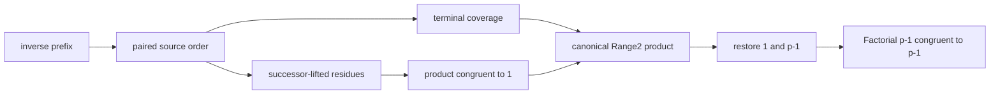

# Wilson PairOrder

Wilson's theorem is represented without a primitive permutation or factorial
function. A beta-coded inverse map on zero-based indices is reordered into
adjacent inverse pairs, successor-lifted to the actual residues, and compared
extensionally with the canonical nonendpoint range.

The final seven-body endpoint tranche has nodes/depth `30/15`, `258/45`,
`63/29`, `21/16`, `104/30`, `94/35`, and `110/31`. It proves

\[
p=Sn\land Prime(p)\land Factorial(n,F)\to F\equiv n\pmod p.
\]

Prime `2` is handled in a separate branch that does not invoke the odd
PairOrder, so coincident endpoints are not hidden. The focused audit passes
`3/3`. This is dependency-curried candidate evidence; recursive WMI closure
and admission remain mandatory.

## Links

- [PairOrder research design](../../research/arithmetic-library/pair-order-encoding.md)
- [Terminal product source](../../peano-lab/py/peano_lab/library/wilson_terminal_product_candidate.py)
- [Endpoint source](../../peano-lab/py/peano_lab/library/wilson_endpoint_restoration_candidate.py)
- [Endpoint test](../../peano-lab/py/tests/test_wilson_endpoint_restoration_candidate.py)
- [[quadratic-reciprocity-moc]]
